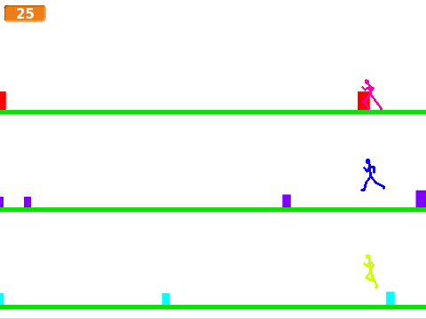

# Introduksjon {.intro}

Hoppehelt er litt inspirert av musikkspillet Guitar Hero. I Hoppehelt
skal man kontrollere flere helter samtidig mens de hopper over fargede
bokser som lager lyd.  Gjennom spillet Hoppehelt vil vi se litt
nærmere på hvordan kloner brukes når man programmerer i Scratch. Vi
vil til og med se eksempler på kloner av kloner!



# Steg 1: Streken {.activity}

*Vi begynner spillet vårt ved å lage en veldig enkel bakgrunn.*

## Sjekkliste {.check}

+ Start et nytt prosjekt, og slett kattefiguren.

+ Tegn en ny bakgrunn som består av en ensfarget rett strek ganske
  langt ned på skjermen. Bruk vektorgrafikk. Dette er bakken som vår
  helt skal løpe på.

+ For å enklere legge på en tittel senere lager vi en
  `Nytt spill`-melding på scenen:

  ```blocks
  når grønt flagg klikkes
  send melding [Nytt spill v]
  ```

# Steg 2: En hoppende helt {.activity}

*Nå skal vi introdusere hoppehelten.*

## Sjekkliste {.check}

+ Tegn en enkel liten strekfigur som ser ut som om han løper mot
  venstre. Gi figuren navnet `Helt 1`.

  Du kan senere lage flere drakter slik at spillet ser bedre ut, men
  vi vil ikke bruke tid på det nå.

+ Lag en ny variabel som du kaller `sprett`{.blockdata}. Det er viktig
  at denne gjelder kun for denne figuren.

  Vi vil bruke `sprett`{.blockdata}-variabelen til å beskrive
  heltens bevegelse når han hopper.

+ I heltens hovedløkke lar vi gravitasjonen virke ved at vi stadig
  prøver å gjøre `sprett`{.blockdata} mindre, samtidig som vi sier
  at dersom helten berører bakken skal han ikke falle.

  ```blocks
  når jeg mottar [Nytt spill v]
  gå til x: (210) y: (-120)
  for alltid
      endre [sprett v] med (-1)
      hvis <berører fargen [#00cc00] ?>
          neste drakt
          sett [sprett v] til [0]
      slutt
      endre y med (sprett)
  slutt
  ```

  Sett fargen i `berører fargen`{.blocksensing}-klossen til samme
  farge som streken du tegnet på bakgrunnen i Steg 1.

+ Prøv å endre startposisjonen til helten, spesielt y-koordinaten. Får
  du helten til å falle mot bakken?

+ Legg til en ny `hvis`{.blockcontrol}-test inne i
  `hvis`{.blockcontrol}-testen du allerede har. Hvis tasten `m` trykkes
  setter du `sprett`{.blockdata} til et positivt tall. Prøv deg fram
  slik at du finner en verdi som gjør at helten gjør passe store hopp.

## Test prosjektet {.flag}

__Klikk på det grønne flagget.__

+ Står eller løper helten på bakken? Figuren skal ikke bevege seg
  sidelengs.

+ Hopper helten når du trykker på `m`-tasten?

# Steg 3: Bokser med lyd {.activity}

*Vi skal nå lage noen bokser som helten kan hoppe over.*

## Sjekkliste {.check}

+ Lag en ny figur ved å tegne en liten fargelagt boks som helten kan
  hoppe over. Kall figuren `Boks`. Bruk
   til å sette
  senterpunktet nederst til venstre på boksen.

+ Når boksen mottar meldingen `Nytt spill` vil vi at den plasserer seg
  på bakken helt til venstre på skjermen. Bruk en
  `gå til`{.blockmotion}-kloss og lag dette skriptet selv. Pass på at boksen
  ikke berører kanten av skjermen.

+ Etter at du har funnet en bra plassering på boksen kan du utvide
  skriptet ved å `skjule`{.blocklooks} figuren, samt lage en løkke
  hvor boksen lager en klone av seg selv hvert andre sekund.

+ Gå til scenen og lag en variabel du kaller
  `hastighet`{.blockdata}. Lag et skript på scenen som setter denne
  variabelen til `3` når meldingen `Nytt spill` mottas.

+ Gå tilbake til boksfiguren. Vi vil nå at boksklonene flytter seg mot
  helten. Lag et nytt skript som begynner når boksen starter som
  klon. I dette skriptet må du `vise`{.blocklooks} boksen. Deretter
  kan du starte en løkke som gjentas til boksen berører kanten. Inne i
  løkken vil du endre x med `hastighet`{.blockdata}. Etter løkken
  kan du slette denne klonen.

## Test prosjektet {.flag}

__Klikk på det grønne flagget.__

+ Kommer det en jevn strøm av bokser mot helten?

+ Kan du bruke `m` til å hoppe over boksene?

+ Hva skjer om helten springer inn i en boks?

## Sjekkliste {.check}

+ Vi vil la spillet stoppe når helten springer inn i en boks. Gå til
  `Helt 1`. Bytt nå ut `for alltid`{.blockcontrol}-løkken med en
  `gjenta til`{.blockcontrol}-løkke som du lar gjenta til helten
  berører `Boks`.

+ Etter den nye `gjenta til`{.blockcontrol}-løkken kan du sende ut en
  ny melding `Spill slutt`.

+ Klikk på boks-figuren. Legg til et skript som stopper andre skript i
  figuren, og deretter sletter denne klonen etter at `Spill slutt`
  mottas.

  Prøv spillet ditt igjen. Hva skjer nå om helten springer inn i en
  boks?

+ Vi kan spille en liten lyd hver gang vi har hoppet over en boks.
  Legg til en

  ```blocks
  spill tone (60) i (0.5) takter
  ```

  kloss etter løkken som flytter boksen, men før klonen
  slettes. Bruk gjerne `velg instrument`{.blocksound}-klossen til å
  velge et passende instrument før spillet starter.

+ Om du tester dette vil du se at boksene blir hengende litt mens
  lyden spilles. En enkel måte å unngå dette på er å legge til en
  `skjul`{.blocklooks}-kloss rett før
  `spill tone`{.blocksound}-klossen.

## Prøv selv {.try}

Før vi går videre skal vi se på et par måter vi kan gjøre hver enkelt
boks litt spesiell og forskjellig fra de andre på. Prøv å
eksperimentere med disse og de andre innstillingene i spillet ditt.

Helt først i skriptet hvor boksen starter som klon, før den vises, kan
du prøve noe av det følgende. Du kan endre størrelsen på boksen
tilfeldig, for eksempel med klossen

```blocks
sett størrelse til (tilfeldig tall fra (30) til (100)) %
```

På samme måte kan du bruke

```blocks
sett [farge v] effekt til (tilfeldig tall fra (-100) til (100))
```

til å endre fargen på boksene tilfeldig. Finn også på andre effekter,
kanskje ved å bruke flere drakter?

Vi kan også gjøre lydene som kommer når vi har hoppet over boksene
inviduelle. Prøv for eksempel å la lengden av tonen være avhengig av
størrelsen på boksen.

Prøv tilslutt å endre på hvor ofte det dukker opp nye bokser. Bruk
gjerne en

```blocks
tilfeldig tall fra (1.2) til (3.2)
```

kloss. Eksperimenter med verdiene i klossen.

# Steg 4: Flere streker og bokser {.activity}

*Nå skal vi gjøre spillet ganske mye vanskeligere ved å lage tre rader
 med bokser.*

## Sjekkliste {.check}

+ Se på skriptene til `Boks`. Ser du at du har en *generator-løkke*
  som lager nye bokser omtrent hvert annet sekund (du har kanskje lagt
  på en `tilfeldig`{.blockoperators}-kloss i denne løkken). Videre
  har du en *flytte-løkke* som flytter boksene mot høyre, med
  eventuelle tilfeldige innstillinger på boksene.

  Riv løs begge disse to løkkene og legg dem til side. Vi skal bruke
  dem igjen straks, så ikke slett noe.

+ Lag en ny variabel som du kaller `er generator`{.blockdata}. Denne
  må gjelde kun for denne figuren. Vi vil bruke denne variabelen til å
  identifisere generator-løkken.

+ Vi legger nå nemlig på en ny løkke som lager tre uavhengige
  generator-løkker. Endre skriptet som kjøres for `Nytt spill` til
  dette:

  ```blocks
  når jeg mottar [Nytt spill v]
  gå til x: (-239) y: (-161)
  sett [er generator v] til [ja]
  skjul
  gjenta (3) ganger
      lag klon av [meg v]
      endre y med (110)
  slutt
  ```

  Bruk den samme utgangsposisjonen som tidligere. Dette vil lage tre
  *generator-kloner* med forskjellige y-verdier.

+ Vi vil nå bygge opp igjen skriptet som kjører når en boks starter
  som klon. Lag først det følgende

  ```blocks
  når jeg starter som klon
  hvis <(er generator) = [ja]>
      sett [er generator v] til [nei]
  ellers
  slutt
  ```

+ Flytt nå generator-løkken som du la til side tidligere inn i
  `hvis`{.blockcontrol}-testen rett under
  `sett er generator`{.blockdata}-klossen.

+ Tilsvarende legger du flytt-løkken fra tidligere inn i
  `ellers`{.blockcontrol}-testen.

Prøv spillet ditt. Du skal nå ha tre rader med bokser som flyttes over
skjermen.

+ Klikk på `Scene` helt til venstre på skjermen. Gå til
  `Bakgrunner`{.blocklightgrey}. Tegn to nye streker i samme farge som
  den første. Test spillet og flytt strekene slik at boksene flytter
  seg naturlig på toppen av dem.

## Test prosjektet {.flag}

__Klikk på det grønne flagget.__

+ Har du tre rader med bokser som kommer skliende over skjermen?

+ Det er foreløpig bare en hoppehelt på den nederste raden?

# Steg 5: Hvor er alle heltene? {.activity}

*Vi skal nå lage de siste to hoppeheltene!*

## Sjekkliste {.check}

+ Lag en kopi av `Helt 1`-figuren. Kopien blir automatisk hetende
  `Helt 2`.

+ Klikk på `Helt 2`. Det eneste vi trenger å endre på er y-posisjonen
  og tasten som brukes til å hoppe.

  Endre y-posisjonen i `gå til`{.blockmotion}-klossen med 110.

  Endre `m` til `k` i `tast trykket`{.blocksensing}-testen.

Prøv spillet ditt igjen. Har du nå to hoppehelter? Virker de som de skal?

+ Lag en ny kopi av `Helt 1`-figuren. Endre denne kopien slik at den
  har posisjon 110 høyere enn `Helt 2`, og slik at den hopper når du
  trykker på `o`.

## Test prosjektet {.flag}

__Klikk på det grønne flagget.__

+ Du skal nå ha tre hoppehelter som alle må hoppe over boksene som
  kommer! Dette har plutselig blitt et ganske vanskelig spill som
  krever konsentrasjon og koordinasjon!

## Prøv selv {.try}

Oppgaven slutter her, men det er jo fortsatt mange spennende ting du
kan gjøre med spillet ditt for å gjøre det enda bedre.

Prøv for eksempel å legge til poeng ved å lage en
`Poeng`{.blockdata}-variabel som du øker hver gang en boks har blitt
hoppet over. Du kan også øke hastigheten etterhvert som spillet går.

Prøv å gjøre tonen som spilles avhengig av y-posisjonen til
boksen. Dette er litt vanskelig, men blir veldig kult da det høres ut
hoppeheltene spiller en liten sang ved å hoppe over boksene.
