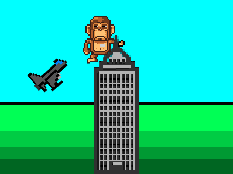

# Om oppgåva {.activity}

I denne oppgåva skal elevane lage eit spel inspirert av historia om King Kong
ved å bruke grafikk som *ikkje* allereie ligg i Scratch-biblioteket.

## Oppgåva passar til: {.check}

__Fag__: Engelsk, kunst og handverk, matematikk, programmering.

__Anbefalte trinn__: 3.-10. trinn.

__Tema__: Lage eit spel basert på engelskspråkleg kultur, biletehandsaming, koordinatsystem, brukarinteraksjon.

__Tidsbruk__: Dobbelttime eller meir.

## Kompetansemål {.challenge}

- [ ] __Engelsk, 7. trinn__: bruke digitale ressursar og ulike ordbøker i
      språklæring, tekstskaping og samhandling

- [ ] __Engelsk, 10. trinn__: lese, diskutere og vidareformidle innhald frå
      ulike typar tekstar, inkludert selvvalgte tekstar

- [ ] __Kunst og håndtverk, 7. trinn__: bruke programmering til å skape
      interaktivitet og visuelle uttrykk

- [ ] __Matematikk, 3. trinn__: eksperimentere med og forklare plasseringar i
      koordinatsystemet

- [ ] __Programmering, 10. trinn__: bruke grunnleggande prinsipp i
      programmering, slik som variablar, løkker, vilkår og funksjonar, og
      reflektere over bruken av desse

## Forslag til læringsmål {.challenge}

- [ ] Elevane kan lage eit spel basert på ei fiktiv historie.

- [ ] Elevane kan bruke enkle funksjonar i digitalt bildehandsamingsprogram for
  å lage nødvendige figurar.

- [ ] Elevane kan plassere ulike element på bestemte plassar i eit
  koordinatsystem.

- [ ] Elevane kan få figurar til å bevege seg mellom bestemte posisjonar i eit
  koordinatsystem.

- [ ] Elevane kan få figurar til å bevege seg i henhald til brukaren sine
  beskjedar.

- [ ] Elevane kan bruke kode til å få figurar til å interagere.

## Forslag til vurderingskriterium {.challenge}

- [ ] Eleven syner middels måloppnåing ved å fullføre oppgåva.

- [ ] Eleven syner høg måloppnåing ved å vidareutvikle eigen kode basert på
  oppgåva, til dømes ved å gjere ein eller fleire av variasjonane under.

## Føresetnader og utstyr {.challenge}

- [ ] __Føresetnader__: Elevane må ha god kunnskap i Scratch. Dei bør ha gjort
  fleire prosjekt på introduksjons- og nybyrjarnivå før dei startar med denne
  oppgåva.

- [ ] __Utstyr__: Datamaskiner med Scratch installert. Eventuelt kan elevane
  bruke Scratch i nettlesaren viss dei har ein brukar (eller registrerer seg) på
  [scratch.mit.edu/](https://scratch.mit.edu/). Tilgang på Internett og enkelt
  bildehandsamingsprogram for å hente inn /lage figurar som ikkje finst i
  Scratch-biblioteket. Elevane kan gjerne jobbe to og to saman.

## Framgangsmåte

Her finn du tips, erfaringar og utfordringar til dei ulike stega i oppgåva.
[Klikk her for å sjå
oppgåveteksten.](../kingkong/kingkong_nn.html){target=_blank}

_Me har diverre ikkje nokre tips, erfaringar eller utfordringar knytta til denne
oppgåva endå._

## Variasjonar {.challenge}

- [ ] Elevane kan leggje inn passande lydeffektar i spelet.

- [ ] Elevane kan lage ein variabel som tel poeng.

- [ ] Elevane kan lage ein variabel som tel liv, og som avsluttar spelet når
  spelaren er tom for liv.

- [ ] Elevane kan lage fleire rørsler for Kong, og fleire variasjonar for
  korleis flya flyr.

- [ ] Elevane kan auke vanskegraden ved å la flya kome raskare etter kvart som
  spelet varar lengre.

## Eksterne ressursar {.challenge}

- [ ] Sjå den ikoniske scena frå [King Kong (2005) på
  YouTube](https://www.youtube.com/watch?v=NoD85qZhkWY).
