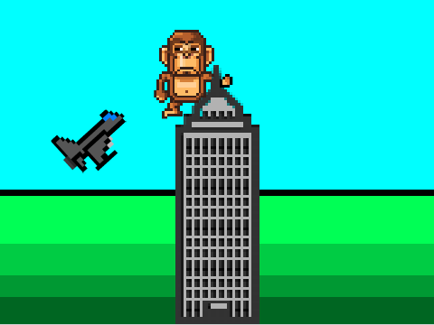
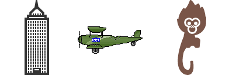
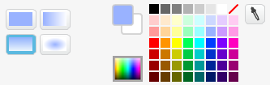
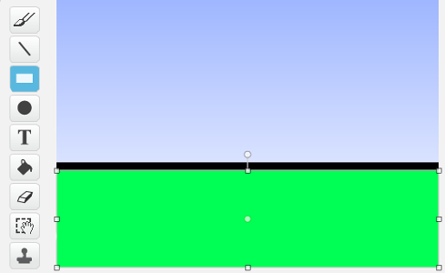
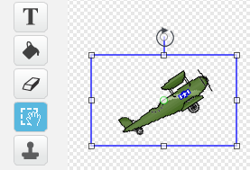

# Introduksjon {.intro}

I dette spillet inspirert av historien om King Kong, skal vi se hvor
lett det er å bruke grafikk som ikke allerede ligger i
Scratch-biblioteket. I spillet styrer vi King Kong som må passe seg
for flyene som angriper ham.



# Steg 1: Hente grafikk fra nettet {.activity}

Vi skal først se på hvordan vi kan hente bilder og figurer fra nettet
og bruke dem i våre egne spill. Til dette spillet trenger vi en
skyskraper, et fly og en gorilla.

## Sjekkliste {.check}

+ Åpne en ny fane i nettleseren din og gjør et søk, for eksempel etter
  `skyscraper icon`. Velg gjerne _Bildesøk_ eller lignende for å bare
  se søkeresultatene som er bilder.

  Finn en skyskraper som du liker. Velg deretter _Se bildet_ for å
  få bildet i full størrelse. Høyreklikk på bildet og velg _Lagre
  bildet som_ og lagre det på din datamaskin et sted du finner det
  igjen.

### Tips for søking {.protip}

+ Når du søker etter bilder er det best å søke på engelsk fordi det er
  det mest brukte språket på internett.

+ For å finne grafikk i stedet for bilder kan det være lurt å ta med
  ord som `icon`, `pixel` eller `drawing` i søket ditt.

+ De fleste søkemotorene har også muligheten for å gjøre _avansert
  bildesøk_. Da kan du som regel begrense søket til å bare lete etter
  tegninger eller tilsvarende.

## Sjekkliste {.check}

+ Søk også opp figurer for fly og King Kong.

  Her er noen eksempler, men bruk gjerne bilder du finner selv:

  

  Skyskraper fra
  [www.iconka.com](http://www.iconarchive.com/show/home-sweet-home-icons-by-iconka/Home-Skyscraper-icon.html),
  fly fra
  [hellraz3r.deviantart.com](http://hellraz3r.deviantart.com/art/Plane-Pixel-Art-193480982)
  og King Kong fra
  [www.freepik.com](http://www.flaticon.com/free-icon/small-monkey-with-long-tail_28726).

+ Etter at du har lastet ned bildene fra nettet er det på tide å ta
  dem inn som nye figurer i Scratch. Gå tilbake til Scratch. Klikk på
   ved siden av
  **Ny figur** og velg et av bildene du har lastet ned. Gjør det samme
  med de andre bildene, slik at du har tre figurer, en skyskraper, et
  fly og en King Kong-figur.

+ Figurene får navn fra bildefilene. Endre gjerne navnet på figurene i
  figurlisten til `skyskraper`, `fly` og `kong` slik at det blir
  enklere å holde oversikten.

### Hvilke bilder kan du bruke? {.protip}

Når du henter bilder fra nettet bør du sjekke at du har tillatelse til
å bruke dem. Selv om bilder ligger på Internett betyr ikke det at du
kan kopiere dem og bruke de som du selv vil!

Mange bilder har en _lisens_ som sier at andre kan bruke dem. Dette
står ofte på nettsiden i nærheten av bildet (på samme måte som det
står Lisens nederst i denne oppgaven). Vanligvis vil de som eier
bildet at du forteller at du har kopiert bildet fra dem. Dette er
veldig lett i Scratch, da man kan skrive hvor bildene kommer fra på
Prosjektsiden under _Merknader og Bidragsytere_.

# Steg 2: Tegn litt selv {.activity}

Like morsomt som å finne bilder på nettet er det å tegne litt selv.

## Sjekkliste {.check}

+ La oss først tegne en enkel bakgrunn. Klikk på
   ved **Ny bakgrunn**
  nederst til venstre.

+ Velg Malingsbøtte-verktøyet (_Fyll med farge_) for å fargelegge
  bakgrunnen. Finn et par fine himmelfarger, for eksempel en overgang
  fra blå øverst til noe lysere nederst. Klikk på bakgrunnen slik at
  den blir fargelagt.

  

+ For en litt enkel gresseffekt skal vi nå velge
  _Rektangel_-verktøyet, og en helt svart farge. Tegn et svart
  rektangel på den nederste delen av bakgrunnen.

+ Velg så en ganske lys grønn farge og tegn et grønt rektangel som
  dekker det meste av det svarte rektangelet, slik at det blir en
  svart strek mellom gresset og himmelen.

  

+ Velg deretter en litt mørkere grønn farge, og tegn et nytt grønt
  rektangel som dekker den nedre delen av det forrige
  rektangelet. Gjenta dette med stadig mørkere grønnfarger til du har
  et passende antall striper som forestiller gresset. Se
  [øverst i oppgaven](#introduksjon) for et ferdig eksempel.

+ Du kan også tegne litt på figurene du har lastet ned. For eksempel,
  om du lastet ned skyskraperen fra lenken over er den gjennomsiktig!
  Det ser litt rart ut. Det blir bedre om du velger en farge og
  fargelegger skyskraperen!

Til spillet vårt vil vi behøve to drakter til **King Kong**. En drakt
der han står på venstre side av skyskraperen og en der han står på
høyre side.

+ Klikk på `kong`-figuren og velg `Drakter`-fanen. Høyreklikk på
  `kong`-drakten og velg `Lag en kopi`.

+ Klikk på kopien og bruk knappen  i øverste høyre hjørne til å speilvende denne nye drakten.

+ Gi de to draktene navnene `Høyre` og `Venstre`.

### Utforsk tegneverktøyene {.protip}

Prøv gjerne de forskjellige tegneverktøyene på egen hånd. Vet du hva
alle gjør?

Legg merke til at nede i høyre hjørnet velger du mellom å jobbe med
_punktgrafikk_ og _vektorgrafikk_. I punktgrafikk jobber vi med nettopp
punktene (også kalt pikslene) i bildet. Typisk vil du gjøre dette med bilder du
laster ned fra nettet. Med vektorgrafikk kan vi jobbe med direkte med linjer og
former. Mange av figurene i Scratchbiblioteket bruker dette, og det er ofte
bedre når vi skal tegne selv.

# Steg 3: King Kong flytter seg {.activity}

Nå har vi tatt inn grafikken vi trenger. Det er på tide å begynne å
programmere!

## Sjekkliste {.check}

+ La oss begynne med `skyskraper`-figuren. Denne er ganske enkel. Vi
  vil bare passe på at den står i ro midt på skjermen i en passende
  størrelse. Det kan vi gjøre med et skript som ligner dette:

  ```blocks
  når grønt flagg klikkes
  sett størrelse til (200) %
  legg øverst
  gå til x: (0) y: (-50)
  ```

  Du må eksperimentere litt med tallene slik at de passer til din
  skyskrapergrafikk.

+ Neste steg er **King Kong**. Vi vil at han skal stå på skyskraperen,
  og at vi kan flytte ham fra høyre til venstre side og tilbake igjen
  med piltastene. Dette er heller ikke så veldig vanskelig. Du må
  sikkert forandre litt på tallene, men et lite skript som ser omtrent
  slik ut gjør jobben:

  ```blocks
  når grønt flagg klikkes
  gå til x: (-45) y: (30)
  bytt drakt til [venstre v]
  for alltid
      hvis <tast [pil venstre v] trykket?>
          gli (0.2) sekunder til x: (-45) y: (30)
          bytt drakt til [venstre v]
      slutt
      hvis <tast [pil høyre v] trykket?>
          gli (0.2) sekunder til x: (45) y: (30)
          bytt drakt til [høyre v]
      slutt
  slutt
  ```

## Test prosjektet {.flag}

__Klikk på det grønne flagget.__

+ Er `kong` og skyskraperen bra plassert i forhold til hverandre?

+ Flytter **King Kong** seg slik han skal når du trykker på piltastene?

Endre på figurene og skriptene slik at det ser bra ut!

# Steg 4: Flyene flyr {.activity}

Nå skal vi kopiere flyet vårt slik at vi har mange fly som flyr rundt
skyskraperen.

## Sjekkliste {.check}

+ For å kopiere det ene flyet skal vi bruke det som kalles kloning for
  å lage nye fly med ujevne mellomrom. Lag først et skript som stadig
  lager nye fly:

  ```blocks
  når grønt flagg klikkes
  skjul
  begrens rotasjon [vend sideveis v]
  for alltid
      vent (tilfeldig tall fra (0.5) til (4)) sekunder
      lag klon av [meg v]
  slutt
  ```

+ Om du kjører spillet ditt skjer det ikke noe spennende enda, fordi
  vi ikke har sagt hva alle flyklonene skal gjøre. La oss begynne med
  å la dem fly skrått over skjermen:

  ```blocks
  når jeg starter som klon
  pek i retning (45 v)
  gå til x: (-280) y: (-140)
  vis
  gjenta til <(y-posisjon) > [190]>
      gå (10) steg
  slutt
  slett denne klonen
  ```

+ Igjen må du justere tallene slik at de passer for deg. Vi vil at
  flyet skal fly slik at det kommer borti `kong` om han står på
  venstre side av skyskraperen, men vi vil ikke at flyet krasjer i
  skyskraperen selv (se bildet [øverst i oppgaven](#introduksjon)).

+ Om du vil kan du klikke på `drakter` og rotere flyet litt slik at det
  flyr i riktig retning.

  

+ Vi kan også få flyene til å komme fra begge retninger! Ved å bruke
  et tilfeldig tall kan vi bestemme om flyet kommer fra høyre eller
  venstre. Endre koden din slik at den blir som følger:

  ```blocks
  når jeg starter som klon
  hvis <(tilfeldig tall fra (1) til (2)) = [1]>
      pek i retning (45 v)
      gå til x: (-280) y: (-140)
  ellers
      pek i retning (-45 v)
      gå til x: (280) y: (-140)
  slutt
  vis
  gjenta til <(y-posisjon) > [190]>
      gå (10) steg
  slutt
  slett denne klonen
  ```

# Steg 5: King Kong må passe seg {.activity}

Oppgaven til **King Kong** er å passe seg slik at han ikke blir
truffet av flyene.

## Sjekkliste {.check}

+ For at `kong` skal merke at han blir truffet av flyene lager vi et
  nytt skript på ham. Et enkelt utgangspunkt kan være:

  ```blocks
  når grønt flagg klikkes
  for alltid
      vent til <berører [fly v] ?>
      endre [farge v] effekt med (25)
      vent (0.5) sekunder
      ta bort grafiske effekter
  slutt
  ```

  Her venter vi 0.5 sekunder både for at fargeeffekten skal synes og
  for at da har flyet passert slik at ikke King Kong blir truffet
  flere ganger av det samme flyet.

Vi har nå laget et ganske enkelt spill. Men det er flere ting du kan
prøve på egen hånd! Nedenfor er noen forslag, men du har kanskje egne
ideer til hvordan spillet kan videreutvikles?

### Prøv selv {.try}

+ Legg til lydeffekter! Kanskje litt motorlyd fra flyene, og så klart
  trenger vi en lyd når King Kong blir truffet av flyene.

+ Tell poeng! Kanskje du kan få poeng for hvert fly som passerer?

+ Tell liv! King Kong kan ikke bli truffet av flyene `for
  alltid`{.blockcontrol}. Legg til en `liv`{.blockdata}-variabel som
  teller hvor mange liv du har igjen. Kanskje `kong` ramler ned fra
  skyskraperen når han er tom for liv?

+ Kan du utvide spillet? Kanskje kommer det fly i flere retninger og
  King Kong må dukke eller hoppe for å unngå dem? Kanskje King Kong
  kan fange flyene på en eller annen måte og få poeng for det?

+ Kan du gjøre spillet vanskeligere etterhvert? For eksempel kan
  flyene komme raskere etterhvert som du får flere poeng?
