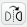

# Introduksjon {.intro}

Dette spelet er inspirert av historia om King Kong. Me skal sjå kor lett det er
å ta i bruk grafikk som ikkje allereie ligg i Scratch-biblioteket. I spelet
styrer me King Kong som må passe seg for flya som angrip han.


# Steg 1: Hente grafikk frå nettet {.activity}

Fyrst skal me sjå på korleis me kan hente bilete og figurar frå nettet og bruke
dei i våre eigne spel. Til dette spelet treng me ein skyskrapar, eit fly og ein
gorilla.

## Sjekkliste {.check}

- [ ] Åpne ei ny fane i nettlesaren din og gjer eit søk, til dømes etter
  `skyscraper icon`. Du må gjerne velje _Biletesøk_ eller noko liknande for å
  berre sjå søkeresultata som er bilete.

  Finn ein skyskrapar som du likar. Så vel du _Sjå biletet_ for å få bildet i
  full storleik. Høgreklikk på biletet og vel _Lagre som_ og lagre det på
  datamaskina di ein stad du finn det att.

### Tips for søking {.protip}

- Når du søker etter bilete er det ofte lurt å søke på engelsk, sidan det er det
  mest brukte språket på Internett.

- For å finne grafikk i staden for fotografi kan det vere lurt å ta med ord som
  `icon`, `pixel` eller `drawing` i søket ditt.

- Dei fleste søkemotorane har moglegheita for å gjere eit _avansert biletesøk_.
  Då kan du som regel avgrense søket ditt til å berre leite etter teikningar
  eller tilsvarande.

## Sjekkliste {.check}

- [ ] Søk opp figurar for fly og King Kong.

  Her er nokre døme, men du må gjerne leite sjølv og finne andre bilete.

  

  Skyskrapar frå
  [www.iconka.com](http://www.iconarchive.com/show/home-sweet-home-icons-by-iconka/Home-Skyscraper-icon.html),
  fly frå
  [hellraz3r.deviantart.com](http://hellraz3r.deviantart.com/art/Plane-Pixel-Art-193480982)
  og King Kong frå
  [www.freepik.com](http://www.flaticon.com/free-icon/small-monkey-with-long-tail_28726).

- [ ] Etter at du har lasta ned bileta frå nettet er det på tide å ta dei inn
  som nye figurar i Scratch. Gå attande til Scratch. Klikk på  ved sidan av **Ny figur** og vel eit av
  bileta du har lasta ned. Gjer det same med dei andre bileta, slik at du har
  tre figurar: ein skyskrapar, eit fly og ein King Kong-figur.

- [ ] Figurane får namn fra biletefilene. Endre gjerne namnet på figurane i
  figurlista til `skyskrapar`, `fly` og `kong` slik at det blir enklare å halde
  oversikta.

### Kva bilete kan du bruke? {.protip}

Når du hentar bilete frå nettet bør du sjekke at du har lov til å bruke dei.
Sjølv om bilete ligg på Internett tyder ikkje det at du kan kopiere dei og bruke
dei som du sjølv vil!

Mange bilete har ein _lisens_ som seier at andre kan bruke dei. Dette står ofte
på nettsida i nærleiken av biletet (på same måte som det står _lisens_ nedst i
denne oppgåva). Vanlegvis vil dei som eig biletet at du seier at du har kopiert
biletet frå dei. Det er veldig lett i Scratch, sidan du kan skrive kor bileta
kjem frå på prosjektsida under _Merknader og Bidragsytere_.


# Steg 2: Teikne sjølv {.activity}

Det er minst like ålreit å teikne sjølv som å finne bilete på nettet.

## Sjekkliste {.check}

- [ ] Fyrst skal me teikne ein enkel bakgrunn. Klikk på  ved **Ny bakgrunn** nedst til venstre.

- [ ] Vel Malingsbøtte-verktøyet (_Fyll med farge_) for å fargeleggje
  bakgrunnen. Finn eit par fine himmelfargar, til dømes en overgang frå blå
  øvst til noko lysare nedst. Klikk på bakgrunnen slik at den blir farga.

  

- [ ] For ein litt enkel graseffekt skal me velje _Rektangel_-verktøyet, og
  ei heilt svart farge. Teikne eit svart rektangel på den nedste delen av
  bakgrunnen.

- [ ] Så vel du ei ganske lys grønnfarge og teiknar eit grønt rektangel som
  dekker det meste av det svarte rektangelet, slik at det blir ein svart strek
  mellom graset og himmelen.

  

- [ ] Så vel du ei litt mørkare grønfarge og teiknar eit nytt rektangel som
  dekker den nedre delen av det førre rektangelet. Gjenta dette med stadig
  mørkare grønfarger til du har eit passande antal striper som førestiller
  graset. Sjå [øvst i oppgåva](#introduksjon) for eit ferdig døme.

- [ ] Du kan teikne litt på figurane du har lasta ned. Til dømes, om du lasta
  ned skyskraparen frå lenka over er den gjennomsiktig! Det ser litt rart ut.
  Det blir betre om du vel ei farge og fargelegg skyskraparen.

Til spelet vårt treng me to drakter til **King Kong**. Ei drakt der han står på
venstre side av skyskraparen og ei der han står på høgre side.

- [ ] Klikk på `kong`-figuren og vel `Drakter`-fana. Høgreklikk på
  `kong`-drakta og vel `Lag ein kopi`.

- [ ] Klikk på kopien og bruk knappen 
  i øvre høgre hjørne til å spegelvende den nye drakta.

- [ ] Gi dei to draktene namna `Høgre` og `Venstre`.

### Utforsk teikneverktøya {.protip}

Du må gjerne prøve dei ulike teikneverktøya på eiga hand. Veit du kva alle gjer?

Legg merke til at nede i høgre hjørne vel du mellom å jobbe med _punktgrafikk_
og _vektorgrafikk_. I punktgrafikk jobbar vi med nettopp punkta (også kalt
pikslane) i biletet. Typisk vil du gjere dette med bilete du lastar ned fra
nettet. Med vektorgrafikk kan me jobbe direkte med linjer og former. Mange av
figurane i Scratchbiblioteket brukar dette, og det er ofte betre når me skal
teikne sjølv.


# Steg 3: King Kong flyttar seg {.activity}

No har me tatt inn grafikken me treng. Det er på tide å begynne å programmere!

## Sjekkliste {.check}

- [ ] Me startar med `skyskrapar`-figuren. Denne er ganske enkel. Me vil berre
  passe på at den står i ro midt på skjermen og er passe stor. Det kan me gjere
  med eit skript som liknar dette:

  ```blocks
  når @greenFlag vert trykt på
  set storleik til (200) %
  legg [framfor alt v]
  gå til x: (0) y: (-50)
  ```

  Du må eksperimentere litt med tala slik at dei passar til skyskrapargrafikken
  din.

- [ ] Neste steg er **King Kong**. Me vil at han skal stå på skyskraparen, og at
  me kan flytte han frå høgre til venstre side og tilbake att med piltastane.
  Dette er heller ikkje så vanskeleg. Du må sikkert endre litt på tala, men eit
  lite skript som ser om lag slik ut gjer jobben:

  ```blocks
  når @greenFlag vert trykt på
  gå til x: (-45) y: (30)
  byt drakt til [venstre v]
  gjenta for alltid
      viss <tasten [pil venstre v] er trykt?>
          gli (0.2) sekund til x: (-45) y: (30)
          byt drakt til [venstre v]
      slutt
      viss <tasten [pil høyre v] er trykt?>
          gli (0.2) sekund til x: (45) y: (30)
          byt drakt til [høgre v]
      slutt
  slutt
  ```

## Test prosjektet {.flag}

__Klikk på det grøne flagget.__

- [ ] Er `kong` og skyskraparen bra plassert i forhold til kvarandre?

- [ ] Flyttar **King Kong** seg slik han skal når du trykkar på piltastane?

Endre på figurane og skripta slik at det ser bra ut!


# Steg 4: Flya flyr {.activity}

No skal me kopiere flyet vårt slik at me har mange fly som flyr kring
skyskraparen.

## Sjekkliste {.check}

- [ ] For å kopiere det eine flyet skal me bruke det som kallast kloning for å
  lage nye fly med ujamne mellomrom. Lag fyrst eit skript som stadig lagar nye
  fly:

  ```blocks
  når @greenFlag vert trykt på
  gøym
  avgrens rotering til [venstre-høgre v]
  gjenta for alltid
      vent (tilfeldig tal frå (0.5) til (4)) sekund
      lag klon av [meg v]
  slutt
  ```

- [ ] Om du køyrer spelet ditt skjer det ikkje noko spanande endå, fordi me
  ikkje har sagt kva alle flyklonene skal gjere. La oss starte med å la dei
  flyge skrått over skjermen:

  ```blocks
  når eg startar som klon
  peik i retning (45 v)
  gå til x: (-280) y: (-140)
  vis
  gjenta til <(y-posisjon) > [190]>
      gå (10) steg
  slutt
  slett denne klonen
  ```

- [ ] Igjen må du justere tala slik at dei passar for deg. Me vil at flyet skal
  flyge slik at det kjem borti `kong` om han står på venstre side av
  skyskraparen, men me vil ikkje at flyet skal krasje i skyskraparen sjølv (sjå
  biletet [øvst i oppgåva](#introduksjon)).

- [ ] Viss du vil kan du klikke på `drakter` og rotere flyet litt slik at det
  flyr i riktig retning.

  

- [ ] Me kan få flya til å kome frå begge retningar! Ved å bruke eit tilfeldig
  tal kan me bestemme om flyet kjem frå høgre eller venstre. Endre koden din
  slik at den blir som følgjer:

  ```blocks
  når eg startar som klon
  viss <(tilfeldig tal frå (1) til (2)) = [1]>
      peik i retning (45 v)
      gå til x: (-280) y: (-140)
  elles
      peik i retning (-45 v)
      gå til x: (280) y: (-140)
  slutt
  vis
  gjenta til <(y-posisjon) > [190]>
      gå (10) steg
  slutt
  slett denne klonen
  ```


# Steg 5: King Kong må passe seg {.activity}

Oppgåva til **King Kong** er å passe seg slik at han ikkje blir treft av flya.

## Sjekkliste {.check}

- [ ] For at `kong` skal merke at han blir treft av flya lagar me eit nytt
  skript på han. Eit enkelt utgangspunkt kan vere:

  ```blocks
  når @greenFlag vert trykt på
  gjenta for alltid
      vent til <rører [fly v] ?>
      endra [farge v]-effekt med (25)
      vent (0.5) sekund
      ta vekk grafiske effektar
  slutt
  ```

  Her ventar me eit halvt sekund både for at fargeeffekten skal synast og for at
  flyet då har passert slik at ikkje `kong` blir treft av det same flyet fleire
  gonger.

No har me laga eit ganske enkelt spel. Men det er fleire ting du kan prøve på
eiga hand! Under finn du nokre forslag, men kanskje du har eigne idear til
korleis du kan vidareutvikle spelet?

### Prøv sjølv {.challenge}

- [ ] Legg til lydeffektar! Kanskje litt motorlyd frå flya, og sjølvsagt treng
  me ein lyd når King Kong blir treft av flya.

- [ ] Tell poeng! Kanskje du kan få poeng for kvart fly som passerer?

- [ ] Tell liv! King Kong kan ikkje bli treft av flya `gjenta for
  alltid`{.blockcontrol}. Legg til ein `liv`{.blockdata}-variabel som tel kor
  mange liv du har att. Kanskje `kong` ramlar ned frå skyskraparen når han er
  tom for liv?

- [ ] Kan du utvide spelet? Kanskje kjem flya i fleire retningar slik at King
  Kong må dukke eller hoppe for å unngå dei? Kanskje King Kong kan fange flya på
  ein eller annan måte og få poeng for det?

- [ ] Kan du gjere spelet vanskelegare etter kvart? Til dømes kan flya kome
  raskare etter kvart som du får fleire poeng.
