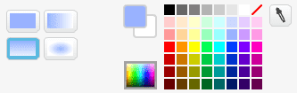

# Вступ {.intro}

У цій грі, що надихалась історією про Кінг Конга, ми побачимо, 
як легко використовувати графіку, якої немає в бібліотеці Scratch.
У грі ми керуємо Кінг Конгом, який має остерігатися літаків, що нападають на нього.


# Крок 1: Завантаження графіки з інтернету {.activity}

Спочатку ми подивимося, як можна завантажити зображення та фігури з інтернету 
і використовувати їх у своїх власних іграх. 
Для цієї гри нам потрібні хмарочос, літак та горила.

## Контрольний список {.check}

- [ ] Відкрий нову вкладку у своєму браузері та зроби пошук, наприклад, 
за запитом `skyscraper icon`. Обери _Пошук за зображеннями_ або схожий варіант, 
щоб бачити тільки результати у вигляді зображень.


Знайди хмарочос, який тобі подобається. Обери _Переглянути зображення_, 
щоб побачити зображення у повному розмірі. 
Клацни правою кнопкою миші на зображенні та обери _Зберегти зображення як_, 
щоб зберегти його на своєму комп'ютері у місці, де ти зможеш його легко знайти.

### Поради для пошуку: {.protip}

+ Коли ти шукаєш зображення, найкраще шукати англійською мовою, оскільки це найпоширеніша мова в інтернеті.

+ Щоб знайти графіку замість фотографій, варто додати до пошуку слова `icon`, `pixel` або `drawing`.

+ Більшість пошукових систем також мають можливість розширеного пошуку зображень. 
  Це дозволяє обмежити пошук тільки малюнками або подібними зображеннями.


## Контрольний список {.check}

- [ ] Знайди також фігури для літака і Кінг Конга.

  Ось кілька прикладів, але використовуй зображення, які ти знайдеш сам:

  

  Хмарочос було завантажено з:
  [www.iconka.com](http://www.iconarchive.com/show/home-sweet-home-icons-by-iconka/Home-Skyscraper-icon.html),
  Літак було завантажено з:
  [hellraz3r.deviantart.com](http://hellraz3r.deviantart.com/art/Plane-Pixel-Art-193480982)
  та Кінг Конг з:
  [www.freepik.com](http://www.flaticon.com/free-icon/small-monkey-with-long-tail_28726).

- [ ] Після того, як ти завантажив зображення з інтернету, настав час додати їх як нові фігури в Scratch. 
Повернись до Scratch. Клацни на  
 поруч з **Нова фігура** і вибери одне із завантажених зображень. 
 Зроби те ж саме з іншими зображеннями, щоб у тебе було три фігури: хмарочос, літак і фігура Кінг Конга.

- [ ] Фігури отримують назви з файлів зображень. 
Зміни назви фігур у списку фігур на `хмарочос`, `літак` і `конг`, щоб легше було орієнтуватися.

### Які зображення можна використовувати? {.protip}

Коли ти завантажуєш зображення з інтернету, варто переконатися, 
що у тебе є дозвіл на їх використання. Навіть якщо зображення є в інтернеті, 
це не означає, що ти можеш копіювати їх і використовувати на свій розсуд!

Багато зображень мають _ліцензію_, яка дозволяє іншим використовувати їх. 
Це зазвичай вказано на вебсайті поруч із зображенням (так само, як вказано "Ліцензія" 
в кінці цього завдання). Зазвичай, власники зображень хочуть, щоб ти вказував, 
що ти скопіював зображення з їхнього ресурсу. Це дуже легко зробити у Scratch, 
оскільки можна написати, звідки взяті зображення, на сторінці проекту у розділі
_Примітки та Внески_.


# Крок 2: Малюємо самостійно {.activity}

Так само цікаво, як і знаходити зображення в інтернеті, малювати їх самостійно.


## Контрольний список: {.check}

- [ ] Спочатку намалюємо простий фон. Натисни на [Tegn ny
  bakgrunn](../bilder/tegn-ny.png) поруч з **Новий фон** внизу зліва.

- [ ] Вибери інструмент "Фарба" (_Заповнити кольором_), щоб розфарбувати фон. 
Знайди кілька гарних кольорів неба, наприклад, 
перехід від синього зверху до світлішого внизу. 
Натисни на фон, щоб він був зафарбований.

  

- [ ] Для створення простої трав'яної текстури обери 
інструмент _Прямокутник_ і чорний колір. 
Намалюй чорний прямокутник у нижній частині фону.

- [ ] Потім вибери світло-зелений колір і намалюй зелений прямокутник, 
  що покриває більшу частину чорного прямокутника, 
  щоб утворилась чорна смуга між травою і небом.

  

- [ ] Потім вибери трохи темніший зелений колір і намалюй новий зелений прямокутник,
 що покриває нижню частину попереднього прямокутника. 
 Повторюй це з поступово темнішими зеленими кольорами, 
 поки не отримаєш потрібну кількість смуг, що представляють траву. 
 Подивись на [приклад у верхній частині](#Вступ) завдання для натхнення.

- [ ] Ти також можеш малювати на фігурах, які завантажив. 
Наприклад, якщо ти завантажив хмарочос за посиланням вище,
 він є прозорим! Це виглядає трохи дивно. Краще вибрати колір 
 і зафарбувати хмарочос!

Для нашої гри нам знадобляться два костюми для **Кінг Конга**. 
Один костюм, де він стоїть зліва від хмарочоса, і один, де він стоїть справа.

- [ ] Натисни на фігуру `Конга` і вибери вкладку `Костюми`. 
Клацни правою кнопкою миші на костюм `Конга` і вибери `Створити копію`.

- [ ] Натисни на копію і використай кнопку  у верхньому правому куті, 
	щоб відобразити цей новий костюм.

- [ ] Назви два костюми `Правий` і `Лівий`.

### Дослідження інструментів для малювання {.protip}

Спробуй різні інструменти для малювання самостійно. Чи знаєш ти, що кожен з них робить?

Зверни увагу, що внизу праворуч ти можеш вибирати між роботою з _піксельною графікою_ та _векторною графікою_. 
У піксельній графіці ми працюємо з пікселями (кожна точка зображення називається пікселем) у зображенні. 
Зазвичай це буде зображення, яке ти завантажуєш з інтернету. 
У векторній графіці ми працюємо безпосередньо з лініями і формами. 
Багато фігур у бібліотеці Scratch використовують векторну графіку, 
і це часто краще, коли ми малюємо самостійно.

# Крок 3: Переміщення Кінг Конга {.activity}

Тепер, коли ми завантажили необхідну графіку, час почати програмування!

## Контрольний список {.check}

- [ ] Почнемо з фігурки `хмарочоса`. Це досить просто. Ми хочемо переконатися, 
  що вона стоїть нерухомо посередині екрану в відповідному розмірі. 
  Це можна зробити за допомогою скрипта, схожого на цей:


  ```blocks
  коли @greenFlag натиснуто
  задати розмір 200
  помістити на [передній план  v]
  йти до x: (0) y: (-50)
  ```

  Тобі потрібно буде експериментувати з числами, щоб вони відповідали твоєму малюнку.


- [ ] Наступний крок - **Кінг Конг**. Ми хочемо, щоб він стояв на хмарочосі і 
щоб ми могли переміщати його з правої на ліву сторону і назад за допомогою 
стрілок на клавіатурі. Це також не дуже складно. Тобі, ймовірно, 
доведеться трохи змінити числа, але невеликий скрипт, який виглядає приблизно так, 
виконає завдання:

  ```blocks
  коли @greenFlag натиснуто
  перейти до x: (-45) y: (30)
  # змінити образ на [Лівий v]
  завжди
      якщо <клавіша [наліво v] натиснута>
          ковзати (0.2) сек до x: (-45) y: (30)
          змінити образ на [Лівий v]
      кінець
      якщо <клавіша [направо v] натиснута>
          ковзати (0.2) сек до x: (45) y: (30)
          змінити образ на [Правий v]
      кінець
  кінець
  ```

## Тестування проєкту {.flag}

__Натисни на зелений прапорець.__

- [ ] Чи добре розміщені `Кінг Конг` і хмарочос відносно один одного?

- [ ] Чи рухається **Кінг Конг так**, як повинен, коли ти натискаєш стрілки на клавіатурі?

Змінюй фігури і скрипти, щоб усе виглядало добре!

# Крок 4: Літаки летять {.activity}

Тепер ми скопіюємо наш літак, щоб у нас було багато літаків, 
які літають навколо хмарочоса.

## Контрольний список {.check}

- [ ] Щоб скопіювати один літак, ми використаємо те, що називається клонуванням, 
для створення нових літаків з нерегулярними інтервалами. 
Спочатку створимо скрипт, який постійно створює нові літаки:


  ```blocks
  коли @greenFlag натиснуто
  сховати
  стиль обертання [зліва-направо v]
  завжди
      чекати (випадкове число від 0.5 до 4) секунд
      створити клон з [мене v]
  кінець
  ```

- [ ] Коли ти запустиш свою гру, нічого цікавого ще не станеться, 
тому що ми не сказали, що робити всім клонованим літакам. 
Почнемо з того, що змусимо їх летіти по діагоналі через екран:


  ```blocks
  коли я починаю як клон
  повернути у напрямку (45 v)
  перейти до x: (-280) y: (-140)
  якщо
  повторити до <(y) > [190]>
      рухатись на (10) кроки
  кінець
  видалити цей клон
  ```

- [ ] Знову ж таки, ти повинен налаштувати числа так, щоб вони підходили для твоєї гри. 
Ми хочемо, щоб літак летів так, щоб він стикався з `Конгом`, якщо він стоїть на лівій стороні хмарочоса, 
але ми не хочемо, щоб літак врізався у сам хмарочос (дивись зображення [початку завдання](#вступ)).

- [ ] Якщо хочеш, можеш натиснути на вкладку `костюми`і трохи повернути літак, щоб він летів у правильному напрямку.

  

- [ ] Ми також можемо зробити так, щоб літаки прилітали з обох напрямків! 
Використовуючи випадкове число, ми можемо визначити, чи літак прилітатиме 
з правого чи лівого боку. Зміни свій код так, щоб він був наступним:


  ```blocks
  коли я починаю як клон
  якщо <(випадкове число від (1) до (2)) = [1]>
      повернути у напрямку (45 v)
      перейти до x: (-280) y: (-140)
  або
      повернути у напрямку (-45 v)
      перейти до x: (280) y: (-140)
  кінець
  показати
  повторити до <(y) > [190]>
      рухатись на (10) кроки
  кінець
  видалити цей клон
  ```


# Крок 5: Кінг Конг має остерігатися {.activity}

Завдання **Кінг Конга** полягає в тому, щоб уникати зіткнень з літаками.

## Контрольний список {.check}

- [ ] Щоб `Кінг Конг` помітив, що його вдаряють літаки, ми створимо новий скрипт для нього.
  Простий початок може виглядати так:


  ```blocks
  коли @greenFlag натиснуто
  завжди
      чекати <торкаэться [літак v] ?>
      змінити ефект [колір v] на (25)
      чекати (0.5) сек
      очистити графічні ефекти
  slutt
  ```

  Тут ми чекаємо 0.5 секунди, щоб ефект кольору був помітним,
  а також для того, щоб літак встиг пролетіти, 
  щоб Кінг Конг не був вражений тим самим літаком кілька разів.


Ми створили досить просту гру. Але є багато речей, 
які ти можеш спробувати зробити самостійно!
 Нижче наведені деякі пропозиції, але, можливо,
 у тебе є свої ідеї щодо того, як розвинути гру далі?


### Спробуй сам {.challenge}

- [ ] Додай звукові ефекти! Можливо, додати звук двигуна для літаків, 
а також звук, коли Кінг Конг вражений літаками.

- [ ] Рахуй очки! Можливо, ти можеш отримувати очки за кожен літак, що пролетів повз?

- [ ] Рахуй життя! Кінг Конг не може бути `постійно`{.blockcontrol} вражений літаками. 
Додай змінну `життя`{.blockdata}, яка рахує, скільки життів у тебе залишилося. 
Можливо, `Кінг Конг` впаде з хмарочоса, коли у нього закінчаться життя?

- [ ] Чи можеш ти розширити гру? Можливо, літаки будуть прилітати з різних напрямків, і
 Кінг Конгу доведеться нахилятися або стрибати, щоб уникнути їх? 
 Можливо, Кінг Конг зможе якимось чином ловити літаки та отримувати за це очки?


- [ ] Чи можеш ти зробити гру складнішою з часом? 
Наприклад, літаки можуть з'являтися швидше, коли ти набираєш більше очок?
