# Her har dere ulike kilder dere kan bruke for å lese om karbonkretsløpet, om myr og om trær! 
[https://snl.no/karbonkretsl%C3%B8pet ](https://snl.no/karbonkretsl%C3%B8pet )

[https://snl.no/myr](https://snl.no/myr)

[https://lille.snl.no/myr ](https://lille.snl.no/myr )

[https://lille.snl.no/tr%C3%A6r ](https://lille.snl.no/tr%C3%A6r )

  
# Introduksjon {.intro}
  
Alt levende inneholder karbon, også naturen rundt oss. I bakken, i trærne og i plantene lagres karbon som en del av naturens kretsløp.

Så lenge naturen får stå i fred, vil karbonet forbli uforstyrret der det er lagret i jorden og i plantene. Men når vi bygger ned skog, grøfter myr eller ødelegger naturen, blir dette karbonet sluppet fri som klimagasser.

Særlig myr inneholder store mengder karbon, fordi den er våt og full av gamle planterester som ikke har råtnet. Når myra blir ødelagt, tørker jorda opp, og karbonet slipper ut i atmosfæren som CO₂.

# Bakgrunn

### Grønt område = skog
Når du bygger på skogen, slipper det ut 100 tonn CO₂ (pr dekar).

### Oransje/brunt område = myr
Når du bygger på myr, slipper det ut 337 tonn CO₂ (pr dekar).

**Hva er et dekar?**  Dekar er en arealenhet som tilsvarer tusen kvadratmeter (1000 m²).

**Hva skal du lære?** 

1. Forstå av ulike naturtyper lagrer ulik mengde karbon
2. Regne en enkel sum = areal * utslippsfaktor 
3. Programmere en enkel simulasjon i Scratch med variabler, meldinger og penneverktøy

## Slik fungerer spillet
I spillet skal du bygge nye bygninger. Når du trykker på det grønne flagget, følger bulldoseren musepekeren din, og når du trykker på figuren vil du bygge en ny bygning. For å få plass må du fjerne natur, men da slipper det ut karbon i lufta.

Når du klikker i grønt område (skog) eller oransje område (myr), bygger du ned naturen og ser hvordan karbonutslippet øker. Til slutt får du se hvor store utslipp du har laget ved å bygge ned naturen. 

### Hvor mange tonn karbon slippes ut hvis du skal bygge 30 bygninger?
**Hvor mye karbon slippes ut hvis du kun bygger bygningene dine på skog?**

**Hvor mye karbon slippes ut hvis du kun bygger ned myr?**

## Forberedelser i Scratch
1. Gå inn på denne lenken [https://scratch.mit.edu/projects/1240223002/ ](https://scratch.mit.edu/projects/1240223002/) for å finne Scratchprosjektet du skal remikse. 

2. Slå på Utvidelser → Penn.

Vi har nå et tomt Scratchprosjekt, men som inneholder de to figurene våre (Boligblokk / bygning og en bulldoser) og bakgrunnen som symboliserer et grønt skogområde med en stor myr. 

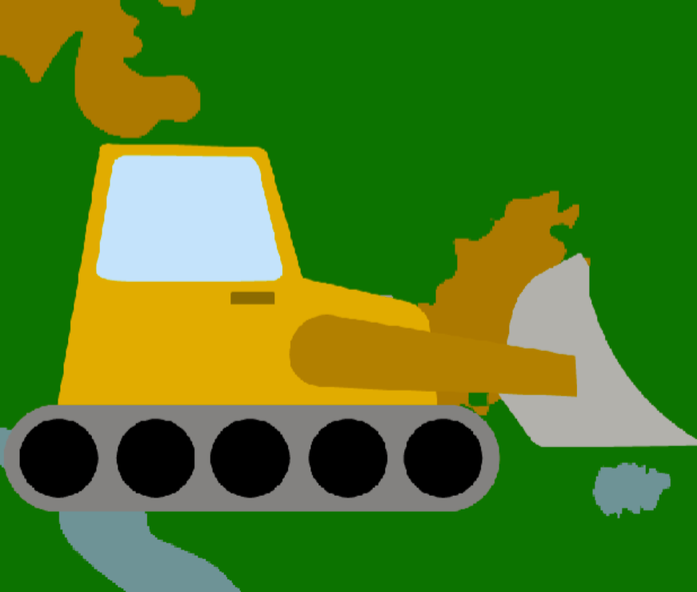

# Steg 1: Programmer bulldoseren til å følge etter musepeker {.activity}

Vi kan kode bulldoseren til å flytte på seg på flere forskjellige måter. Vi kan for eksempel programmere piltaster på tastatur, eller lage egne piler på skjermen, eller vi kan bare flytte figuren med fingeren hvis vi har touchskjerm. 

I denne oppgaven velger vi å programmere den så den følger etter musepekeren vår! 

Først finner vi frem Hendelsesklossen `Når grønt flagg klikkes`{.blockevents} for å starte koden vår. Deretter legger vi til en `Gjenta for alltid`{.blockcontrol}-kloss så koden kjører hele tiden mens vi spiller spillet. Til slutt setter vi inn en `Gå til musepeker`{.blockmotion}-kloss. 

**Koden din vil nå se slik ut:**
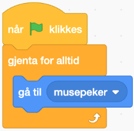

# Steg 2: Definer variabelen “Utslipp”{.activity}
I dette spillet skal vi jo regne ut hvor mye karbon vi slipper ut i atmosfæren når vi bygger ned naturen. For å “telle” hvor mye vi slipper ut i dette spillet må vi lage en variabel som teller dette for oss hver gang vi bygger ned natur. 

(En **variabel** er som en **boks som kan huske et tall eller en tekst** i spillet ditt.

Den kan endres underveis, for eksempel når du får poeng, teller tid, eller måler hvor mye CO₂ som har sluppet ut.)

Under “`Variabler`{.blockdata}” velger dere “`Lag en variabel`{.blockdata}” og kaller den “`Utslipp”`{.blockdata}. Deretter drar vi ut klossen “Sett my variable til 0” og legger den under “`Når grønt flagg klikkes`{.blockevents}” og velger “`Utslipp`{.blockdata}” fra menyen inni klossen.

**Nå vil koden din se slik ut:**
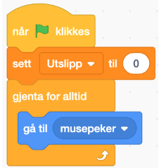

Perfekt! Nå er det klart til å programmere selve nedbyggingen av skogen/myra. 

# Steg 3: Registrer nedbygging av skog/myr via klikk{.activity}
Nå skal vi programmere bulldoseren til å bygge ned skog! Den enkleste måten å gjøre dette på, er å bruke Hendelsesklossen `når denne figuren klikkes`{.blockevents}. Denne klossen gir beskjed om at koden skal settes i gang når vi trykker på figuren. 

For at bulldoseren skal registrere hva slags natur den bygger ned må vi bruke “`hvis-så`{.blockcontrol}”-klosser og “`sansing`{.blocksensing}”-klosser. Disse klossene hjelper figurene med å legge merke til ting, som igjen brukes til å få noe til å skje basert på det de legger merke til. I dette tilfellet må bulldoseren merke forskjellen mellom skog og myr. 

Først finner vi frem to `Hvis-så`{.blockcontrol} klosser og legger de inn under vår “`når denne figuren klikkes`{.blockevents}”-klossen. 

**Koden din vil nå se slik ut:**

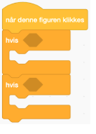

Deretter henter vi ut `sansingklossene`{.blocksensing} som legger merke til at figuren berører ulike farger: 

Her trykker vi på fargen, og velger pipetteverktøyet:

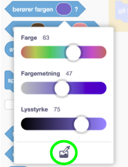

Nå får du muligheten til å “plukke opp” fargene som er på bildet av skogen til høyre. Gjenta dette steget to ganger, så du får to klosser med “`Berører fargen __`{.blocksensing}” som matcher med de to fargene på skogen og myra på bildet. 

**Koden din vil nå se slik ut:**

# Steg 4: Endre utslippsregistreringen basert på typen natur som blir nedbygget{.activity}
Det neste steget tar oss tilbake til intro-teksten om karbonutslipp ved nedbygging av natur. 
**Kan du finne tallene som refererer til hvor mange tonn som slippes ut per dekar, for skog og myr?** 

Når du har funnet tallene skal du bygge inn i koden en endring i variablen din “`Utslipp`{.blockcontrol}”. Dette gjøres inni begge “`Hvis-så`{.blockevents}”-klossene.

**Koden din vil nå se slik ut:**
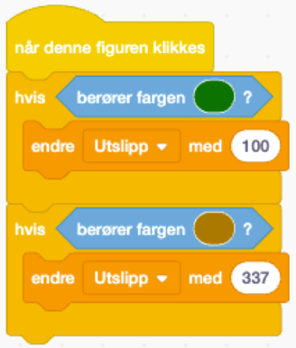

# Steg 5: Bygg ned!{.activity}
For at vi skal visualisere at naturen blir bygget ned har vi inkludert figur nr 2 som er en stor bygning. Vi ønsker at det skal settes ned en bygning hver gang vi klikker på bulldoser-figuren.

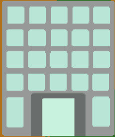

For at dette skal skje, så må vi være litt lure. Scratch har noen begrensninger, så vi må gjemme bygningen bak bulldoseren for å få den til å henge med på hvor vi klikker på skjermen. 

Her starter vi med å legge inn en hendelseskloss - `Når grønt flagg klikkes`{.blockevents}. Deretter henter vi klossen “`slett alt`{.blockpen}” fra utvidelsen “`Penn`{.blockpen}”. Dette for å slette alle figurene vi kommer til å legge igjen i spillet når vi starter spillet på nytt. 

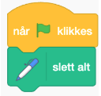

Deretter, for å sørge for at vi gjemmer figuren vår, `legger vi den bakerst`{.blocklooks}. ved hjelp av en `Utseende`{.blocklooks}-kloss.

Vi avslutter denne algoritmen ved å inkludere en “`gjenta for alltid`{.blockevents}” og “`gå til musepeker`{.blockmotion}”.

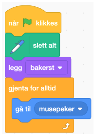

# Steg 6: Sett ned bygninger for å illustrere nedbygget skog{.activity}

Nå skal vi bruke en morsom kloss - nemlig “`send melding`{.blockevents}”! Denne klossen brukes for at én figur eller del av programmet kan **snakke til** en annen figur. I vår kode skal bulldoseren gi beskjed til bygningen at “Nå har noen trykket på meg, og da må du `stemple avtrykk`{.blockpen}”. Når vi stempler et avtrykk, betyr det at vi legger igjen en kopi av bygningen der vi bygde ned naturen. 

For å sende denne beskjeden må vi gå tilbake til bulldoser-koden og legge inn “`send melding bygg ned`{.blockevents}”. 

**Koden din vil nå se slik ut:**
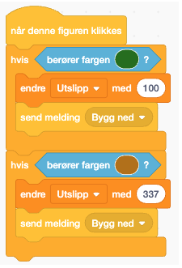

Det siste steget går ut på å få bygnings-figuren til å `stemple avtrykk.`{.blockpen} Det gjør vi ved å legge inn en “`Når jeg mottar bygg ned`{.blockevents}”-kloss, og kobler den sammen med “`Stemple avtrykk`{.blockpen}”-kloss.

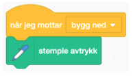

## Test spillet! {.flag}

*Nå er koden til spillet klart! Test ut spillet og se om det klarer å skille mellom hvor du sier at bulldoseren skal bygge ned naturen.* 

## Fasit  {.protip}
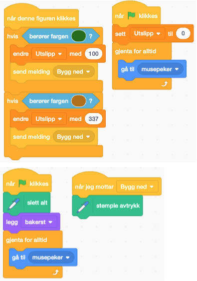

## Lagre spillet {.save}

Vi har laget...

Husk å lagre spillet/programmet ditt. Når du er ferdig kan du klikke på "Legg
ut"-knappen. Da vil det bli lagt ut på Scratch-hjemmesiden din slik at du enkelt
kan dele det med familien og vennene dine.
