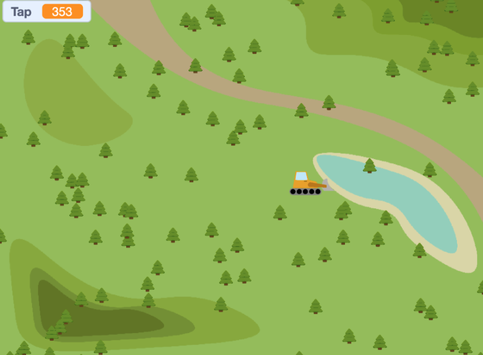
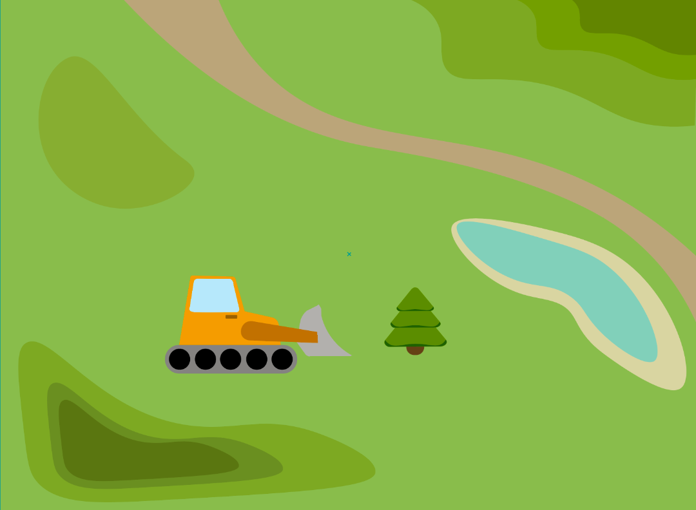
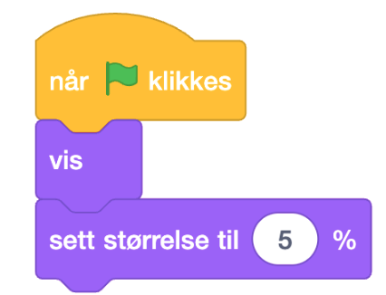
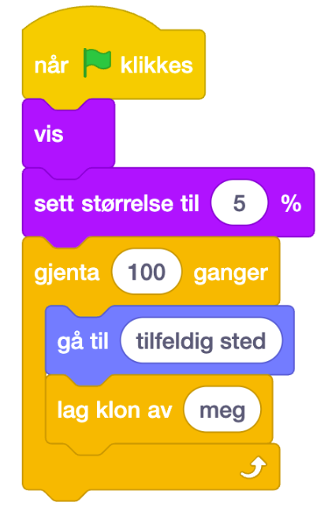
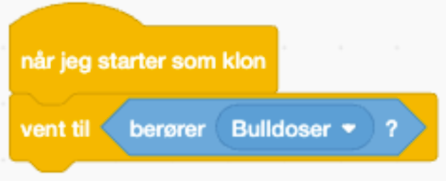
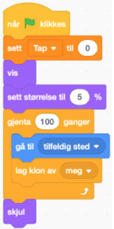
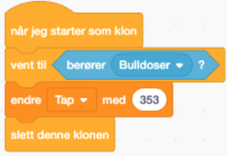
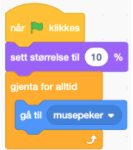
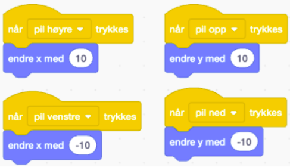

## Oppgave: Hvor mye taper vi hvis alle trærne forsvinner?

#### **Tallene i denne oppgaven kommer fra Klimaetaten, og er basert på gjennomsnittsverdier for trær i Oslo:** [Kilde](https://brage.nina.no/nina-xmlui/handle/11250/3134268?show=full&locale-attribute=no#:~:text=Kartlegging%20og%20verdisetting%20av%20bytr%C3%A6rs%20betydning%20for%20%C3%B8kosystemtjenester,Oslo.%20NINA%20Rapport%202391.%20Norsk%20institutt%20for%20naturforskning.)

# Introduksjon {.intro}

Trær er ikke bare fine å se på, de gjør faktisk en kjempeviktig jobb for oss hver dag! 
De tar opp CO₂ fra lufta, suger opp vann fra bakken, og renser lufta vi puster inn. Visste du at denne jobben de gjør har en faktisk verdi i kroner og øre? 

I denne oppgaven skal du lage et spill i Scratch som viser hvordan det totale tapet øker etter hvert som trær kuttes ned.
Når alle de 100 trærne i spillet er borte, ser du hvor stort tapet blir for naturen, og for oss.

### Bakgrunn
I Oslo er det litt over 600 000 trær. I gjennomsnitt er de 12 meter høye, 35 cm i diameter, og med kroneareal på 80 m2. Disse trærne tar opp CO2 fra lufta, suger opp vann fra bakken og dermed begrenser problemer med overflatevann og fjerner forurensning i lufta.  
Data fra Klimaetaten viser at hvert tre i Oslo bidrar med en økonomisk verdi på 353 kroner i året, gjennom jobben de gjør for oss.

**Mål med oppgaven**
-  Lære å bruke kloner i Scratch for å lage mange like objekter (trær).

- Bruke variabler for å telle og regne ut økonomisk tap.

- Knytte koding til bærekraft og naturfag, og reflektere over hvordan trær bidrar til klima og økonomi.

**Slik fungerer spillet**
- Når du trykker på det grønne flagget, lages 100 trær som plasseres tilfeldig på skjermen.

- Hver gang bulldoseren kolliderer med et tre, “kuttes” det ned.

- Når et tre fjernes, skal tap-variabelen øke med 353 kr.

- Når alle trærne er borte, vises den totale summen (altså hvor mye verdi som er gått tapt).

## Forberedelser i Scratch
1. Gå inn på denne lenken[ https://scratch.mit.edu/projects/1242274287]( https://scratch.mit.edu/projects/1242274287) for å finne Scratchprosjektet du skal remikse. 

Vi har nå et tomt Scratchprosjekt, men som inneholder de to figurene våre (et tre og en bulldoser) og bakgrunnen som symboliserer et grønt skogsområde. 

# Steg 1: Lage trærne {.activity}

Vi starter med å lage 100 trær som i løpet av spillet skal kuttes ned. For å unngå å lage 100 forskjellige trær, og å måtte lage kode for hvert eneste tre, skal vi bruke `kloner`{.blockcontrol}-kodeklosser i denne koden. Disse klone-klossene gjør nettopp dette - den lager kopier av figurene våre. 

Start med å finne frem hendelsesklossen `Når grønt flagg klikkes`{.blockevents} for å starte koden vår. Deretter vil vi at trærne skal **vise** seg og **holde seg små**, så vi klarer å få plassert ut 100 trær på den lille skjermen. Derfor drar vi frem noen `utseendeklosser`{.blocklooks} som kan hjelpe oss med dette: `vis`{.blocklooks} og `sett størrelse til 5%.`{.blocklooks} 

#### Koden din vil nå se slik ut:

Nå vil det dukke opp et tre på skjermen når vi klikker på det grønne flagget - men hvordan får vi 100 trær til å dukke opp? **Jo, vi må lage 100 kloner!**

Derfor finner vi frem en `Gjenta 100 ganger`{.blockcontrol}-kloss, og en `lag klon av meg`{.blockcontrol}-kloss. Vi ønsker også at disse klonene skal plasseres tilfeldig rundt i skogen vår, så vi plasserer en `gå til tilfeldig sted`{.blockmotion}-kloss i koden. 

Det som er viktig å huske nå før vi går videre er å fjerne den originale figuren - nå som vi har kopiert den 100 ganger. (Hvis ikke får vi opp 101 trær). Derfor legger vi til en `skjul`{.blocklooks}-kloss. 

# Steg 2:  Få trærne til å forsvinne {.activity}

For at vi skal få trærne til å forsvinne, må vi få trærne til å forstå at de komm**Tekst her**er i kontakt med bulldoseren vår. Til dette må vi bruke `sansing`{.blocksensing}-klosser. Disse klossene hjelper figurene med å legge merke til ting, som igjen brukes til å få noe til å skje basert på det de legger merke til. I dette tilfellet skal den legge merke til om bulldoseren kjører inn i dem. 

For å starte koden må vi **kode klonene**. Derfor starter vi med en `Når jeg starter som klon`{.blockevents}-kloss. Deretter må programmet `vente`{.blockevents} til den `sanser`{.blocksensing} at den kommer i kontakt med **bulldoseren** før resten av koden skal skje. 

#### Koden din vil se slik ut nå

# Steg 3: Definer variabler!{.activity}

For at vi skal kunne vise hvor mye verdi som går tapt når trærne kuttes ned, bruker vi `variabler`{.blockcontrol}. En **variabel** er som en **boks som kan huske et tall eller en tekst** i spillet ditt.

Den kan endres underveis, for eksempel når du får poeng, teller tid, eller måler hvor mye verdi som har gått tapt når trærne kuttes ned. **Vår variabel skal hete Tap.** 

Hver gang vi starter spillet skal `tap`{.blockdata} settes til 0, da alle trærne kommer tilbake. Derfor henter vi frem en sett `Tap til 0-kloss`{.blockdata} og legger den inn i koden vi allerede har laget for treet. Denne legges først i koden, under `når grønt flagg klikkes`{.blockevents}.

#### Den utvidede koden vil nå se slik ut:

For å registrere hvor mye verdi vi taper når hvert tre kuttes ned, må vi finne verdien i kroner. Denne verdien finner dere i intro-teksten til oppgaven. Denne verdien putter du inn i en “`endre Tap med ___`{.blockdata}”-kloss og legger den inn i “`Når jeg starter som klon`{.blockevents}”-koden til treet. Vi vil også at tre-klonen skal bli borte for å symbolisere at treet faktisk har blitt kuttet ned. Dette løser vi ved å `slette klonen`{.blockevents}. 

#### Koden din vil nå se slik ut:

# Steg 4:  Programmer bulldoseren {.activity}

For at bulldoseren skal kunne bevege seg, kan vi programmere dette på mange forskjellige måter. Det enkleste er å programmere at den `alltid`{.blockevents} skal `gå til musepekeren`{.blockmotion}. Vi ønsker også at bulldoseren skal være liten, og `setter størrelsen til 10%`{.blocklooks} fra start, når vi `klikker grønt flagg`{.blockevents}. 

**Alternativ:**
Vi kan også programmere bulldoseren til å kjøre ut fra `piltastene våre`{.blockevents}: 

## Test spillet! {.flag}
Nå kan du teste spillet ditt! Hvor stort blir det økonomiske tapet hvis bulldoseren kjører ned alle trærne? to

Vi har laget...

Husk å lagre spillet/programmet ditt. Når du er ferdig kan du klikke på "Legg
ut"-knappen. Da vil det bli lagt ut på Scratch-hjemmesiden din slik at du enkelt
kan dele det med familien og vennene dine.