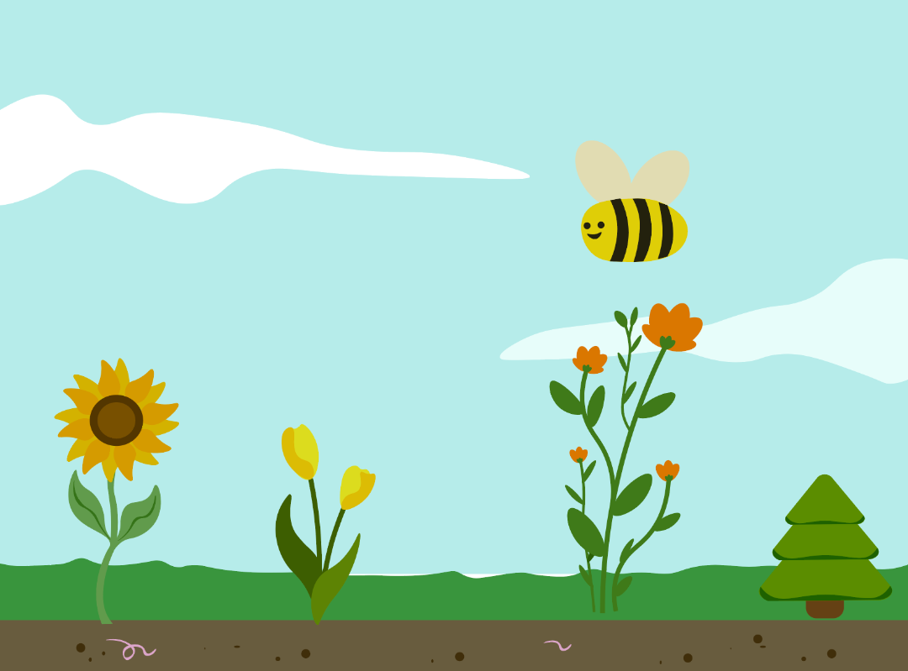
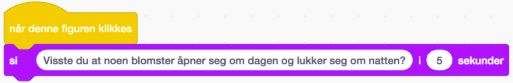

  
# Introduksjon {.intro}

  
I denne oppgaven skal dere bruke Scratch til å lage en interaktiv planteplakat! Målet med oppgaven er å lage et interaktivt bilde fylt med ulike figurer som forteller ulike kule faktaer om planter når vi trykker på dem.

Når dere er ferdige kan dere vise frem prosjektet til de andre elevene i klasserommet, og lære masse nytt om planter!
Følg denne lenken for å remikse prosjektet med figurene på bildet:

[https://scratch.mit.edu/projects/1240231430 
](https://scratch.mit.edu/projects/1240231430 )

# Steg 1: Finn fakta om planter {.activity}

Visste du at noen planter kan bli over hundre år? Eller at det finnes [en plante](https://www.uia.no/naturmuseum/lering-og-skole/naturfakta/botanikk/blomsterduft/ ) som lukter fis for å lure til seg insekter? 

Planteverdenen er SÅ KUL!

## Sjekkliste {.check}

- [ ] Finn frem så mange kule faktaer om planter du vil, enten på internett eller i naturfagsboka di.

- [ ] Skriv dem ned og ha de klare til steg 4.

# Steg 2: Sett kulissene {.activity}

Vi lager en liten hage!

## Sjekkliste {.check}

- [ ] Åpne denne lenken: [ https://www.uia.no/naturmuseum/lering-og-skole/naturfakta/botanikk/blomsterduft/ ](https://www.uia.no/naturmuseum/lering-og-skole/naturfakta/botanikk/blomsterduft/ )

- [ ] Her finner dere et Scratch-prosjekt dere kan bruke til oppgaven. Vi har laget fine figurer som dere kan velge å bruke, men dere kan også gå inn i figur-biblioteket og legge til flere figurer.

# Steg 3: Velg figurer {.activity}

Nå skal vi velge hvilke figurer som skal fortelle oss kule ting om hagen vår.

- [ ] Klikk på figuren du ønsker å programmere. Det gjør du i ruten til venstre.

- [ ] Finn Når denne figuren klikkes-klossen og dra den ut i arbeidsområdet vårt

- [ ] Du velger figuren du ønsker å legge til i hagen ved å klikke på den. Klikk og dra figuren dit du ønsker den skal stå, og juster størrelse ved å endre tallet bak "størrelse".

- [ ] Gjenta prosessen så mange ganger som du vil, og fyll opp hagen din med forskjellige blomster, planter og trær.

# Steg 4: Programmer figurene dine {.activity}
Vi skal nå programmere figurene så de forteller oss fakta om hagen sin. Disse stegene gjøres for hver figur.

- [ ] Klikk på figuren du ønsker å programmere. Det gjør du i ruten til venstre.

- [ ] Finn `Når denne figuren klikkes-`{.blockevents}klossen og dra den ut i arbeidsområdet vårt.

- [ ] Finn `Si ____ i ___ sekunder`{.blocklooks}- klossen og legg den til under den gule klossen du har lagt i arbeidsområdet.

- [ ] Fyll inn din fakta om plantene/blomstene, og hvor mange sekunder figuren din skal prate i. I vårt eksempel har vi brukt 5 sekunder.

- [ ] Gå videre til de neste figurene og gjenta stegene.

## Test prosjektet {.flag}

**Klikk på det grønne flagget.**

*Når du er ferdig med å programmere alle figurene dine vil du kunne teste prosjektet ditt. Du skal nå få opp ulike fakta hver gang du trykker på en ny figur.*

## Lagre spillet {.save}

Vi har laget...

Husk å lagre spillet/programmet ditt. Når du er ferdig kan du klikke på "Legg
ut"-knappen. Da vil det bli lagt ut på Scratch-hjemmesiden din slik at du enkelt
kan dele det med familien og vennene dine.