# En solsikkes livsløp! 

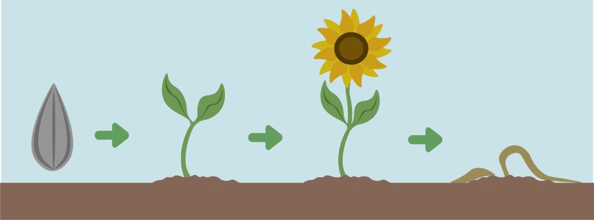
  
# Introduksjon {.intro}
  
**Visste du at..** 

En solsikke lager sin egen mat gjennom fotosyntesen?

For at dette skal skje, trenger solsikken tre ting:
- Sollys

- Vann

- CO₂ (fra lufta)

Når solsikken får alt dette, lages sukker som planten vokser av, og oksygen slippes ut i lufta. Det er derfor planter er så viktige!I denne oppgaven skal vi lage et spill som følger en solsikke gjennom hele livet. Vi starter med et lite frø som ligger i jorda. Når det får nok lys og vann begynner det å spire, og etter hvert vokser det til en stor, flott solsikke. Til slutt visner planten, akkurat slik det skjer i naturen.

I spillet skal elevene få styre blomster7figuren vår til å “fange” solstråler og vanndråper så den kan vokse! 

# Steg 1: Åpne prosjektet {.activity}

I denne oppgaven skal du åpne og remikse et prosjekt, der vi har laget figurer for å symbolisere solsikken, solen og vanndråpene: [https://scratch.mit.edu/projects/1242327021 ](https://scratch.mit.edu/projects/1242327021 )

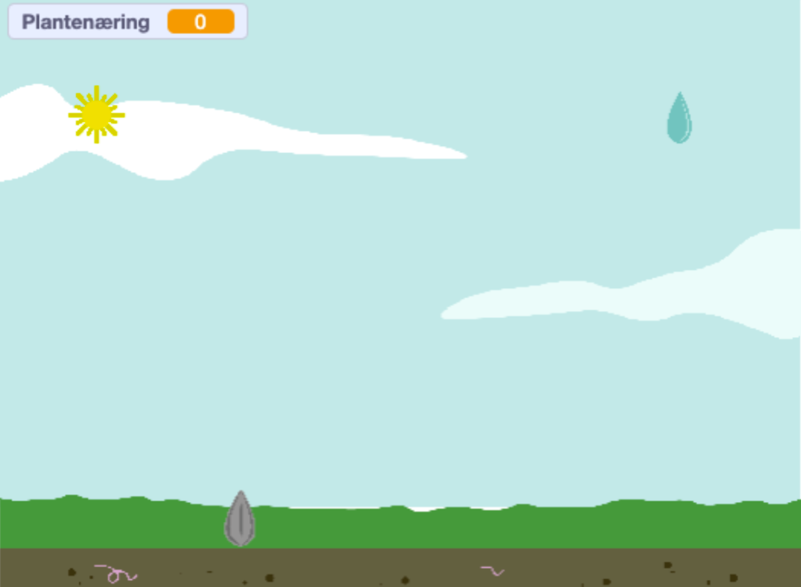

# Steg 2: Programmer solsikkefrøets bevegelser{.activity}
Vi starter med å programmere solsikken vår (koden skal ligge på solsikkefrøet)! Den må kunne bevege seg frem og tilbake over spillefeltet for å fange opp plantenæringen som skal falle fra himmelen. 

Først finner vi Hendelser-klossene `Når pil venstre trykkes og Når pil høyre trykkes`{.blockevents}. Disse klossene gjør at vi kan bruke piltastene på tastaturet til å styre figuren på skjermen. Dra dem ut i arbeidsfeltet til høyre. Deretter kobler du på en `gå ___ steg`{.blockmotion}-kloss under hver av hendelsesklossene. 
Disse klossene forteller figuren at den skal bevege seg enten til venstre eller til høyre. Derfor skriver vi **15** steg under pil høyre-klossen og **–15** steg under pil venstre-klossen.

**Koden din skal nå se slik ut:**

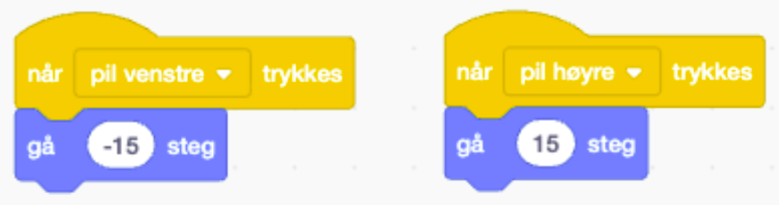

# Steg 3: Programmer vanndråpene og solen til å falle{.activity}
Vi starter med å finne frem hendelsesklossen `Når grønt flagg klikkes`{.blockevents}, da vi ønsker å starte spillet med en gang. Deretter, for at det ikke skal være så enkelt å fange dråpene, finner vi en `gå til tilfeldig sted`{.blockmotion}-kloss og en `sett y til 180`{.blockmotion} for å sørge for at dråpene havner helt øverst på skjermen hver gang vi starter spillet. 

**Koden din vil nå se slik ut:**
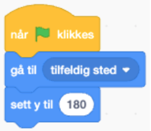

For å få dråpen til å falle, utvider vi koden med en `gjenta for alltid`{.blockevents} -kloss og en `endre y med -4`{.blockmotion}. 

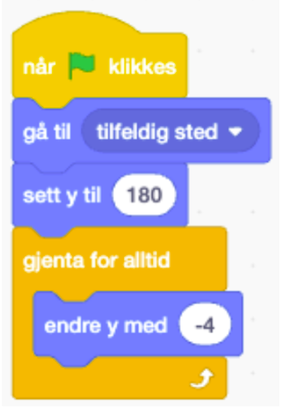

### Test koden din! Hva skjer nå? 

Det vi har kodet så langt sier: «*Når vi trykker på det grønne flagget, skal vanndråpen starte øverst på skjermen, på et tilfeldig sted, og så gli nedover*.» Og der stopper koden. Det blir jo et ganske kjedelig og dårlig spill, så nå trenger vi mer logikk.

Grunnen til at vi bruker Y i koden, er at Scratch plasserer figurer ved hjelp av **X- og Y-akser.**
- X bestemmer høyre og venstre.
- Y bestemmer opp og ned.

Nå skal vi fortelle vanndråpens kode hva som skal skje **når vanndråpen kommer helt nederst på skjermen**, nemlig at den skal hoppe opp igjen og falle på nytt.

For å få til dette, finner vi frem en `Hvis - så`{.blockevents}-kloss og legger den inni `gjenta for alltid`{.blockevents}-klossen. Deretter trenger vi litt matematikk: Vi henter en grønn `operator`{.blockoperators}-kloss med < (mindre enn) og setter inn “`y-posisjon`{.blockmotion}” på venstre side og -170 på høyre.

Det vi sier med denne koden er: «Hvis vanndråpens y-posisjon er mindre enn -170, altså helt nederst på skjermen, skal noe nytt skje.» I dette tilfellet ønsker vi at figuren skal flytte seg helt øverst igjen og begynne å falle på nytt. 

**Koden din vil nå se slik ut:**
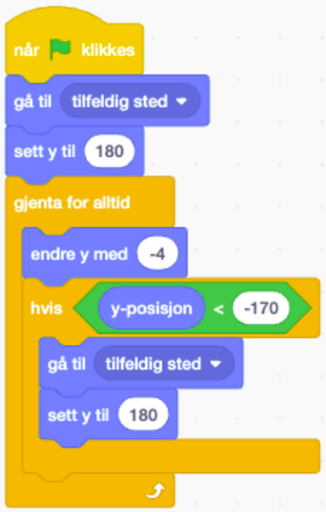

# Steg 4: Legg til variabelen plantenæring{.activity}
For at dette skal bli et faktisk spill, må vi ha noe å telle - og det gjør vi via noe som heter `variabler`{.blockdata}. Variabler er litt som en poengtavle, som hjelper oss med å telle noe vi ønsker å huske på! I dette tilfellet skal solsikken plukke opp det man kan kalle “plantenæring”. 

Gå inn på `Variabler`{.blockdata} og opprett en variabel som heter Plantenæring. 

Deretter legger dere inn en `vis variabel Plantelæring`{.blockdata} og `sett plantenæring til 0`{.blockdata} i koden til vanndråpen: 

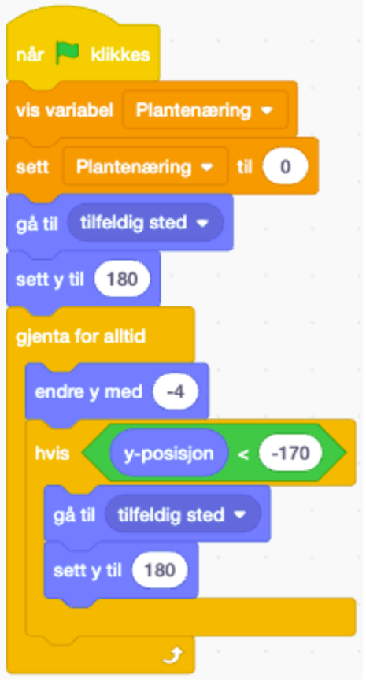

# Steg 5: Legg til berøring{.activity}
For at frøet vårt skal kunne “fange” vanndråpene og solstrålene, må vanndråpen kunne `sanse`{.blocksensing} at `hvis`{.blockcontrol} den `berører frøet`{.blocksensing} før noe videre kan skje. Derfor finner vi frem følgende kodeklosser: 
 
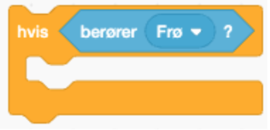

Inni denne klossen legger vi inn en `endre Plantenæring med 1`{.blockdata} så spillet vårt kan telle antall vanndråper og solstråler vi har fanget. Vi ønsker også å symbolisere at frøet har “absorbert” næringen den fanger opp - dette gjør vi ved at vanndråpen blir borte ved at den hopper opp til toppen av skjermen igjen ved å `sette y til 180`{.blockmotion} og `gå til tilfeldig sted.`{.blockmotion} Deretter vil den begynne å falle ned igjen, og gjentar koden for alltid. 

**Koden din vil nå se slik ut:**

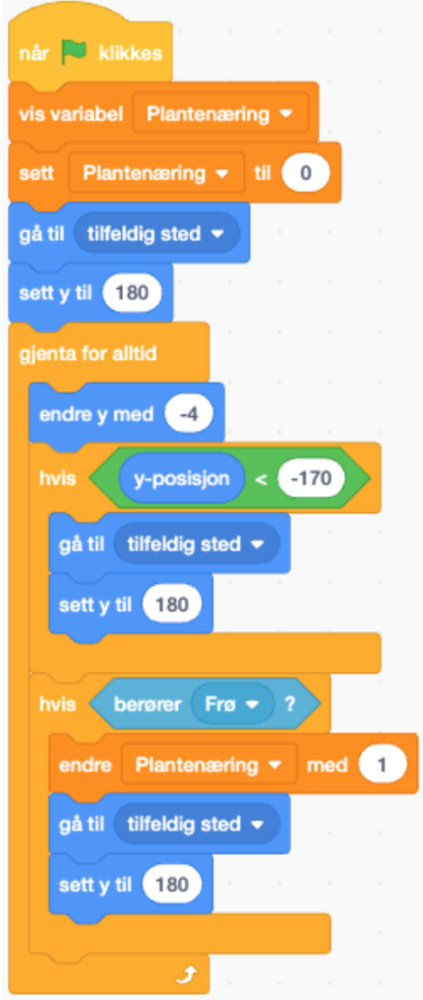

# Steg 6: Kopier koden over til solen{.activity}
Denne koden kan vi dra over / kopiere over til sol-figuren, og nå vil begge figurene kunne “falle ned fra himmelen”!

Test prosjektet ditt.
- Flytter solsikkefiguren på seg etter piltastene? 
- Faller både vanndråpene og solene ned fra himmelen?
- Teller variablen “plantenæring” oppover? 

# Steg 7: Få solsikken til å vokse!{.activity}
Nå skal vi utforske noe morsomt - nemlig drakter! I Scratch har flere figurer ulike drakter. Det betyr at den har ulike positurer eller ulike farger. Disse finner du oppe til venstre i Scratch, når du har markert en figur. 

I denne oppgaven har vi laget fire ulike drakter som symboliserer solsikkens livsløp fra frø, til spire, til solsikke til vissen blomst: 

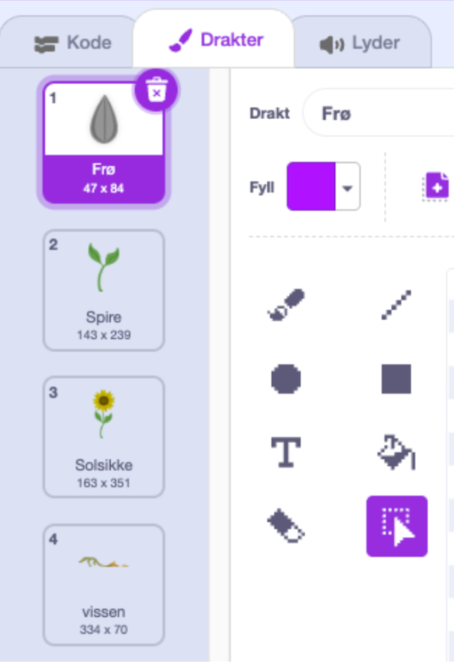

Nå skal vi få figuren til å bytte drakt avhengig av hvor mange “poeng” / plantenæring vi har fanget opp. 

I frøets arbeidsfelt drar vi ut en `når grønt flagg klikkes`{.blockevents}- og en `bytt drakt til frø-`{.blocklooks}kloss. Dette for å bestemme at hver gang vi startet spillet på nytt, skal vi starte som et frø. Deretter henter vi ut en `vent til`{.blockcontrol}-kloss, som vi kobler sammen med en `operatorkloss`{.blockoperators} som vi fyller inn med `plantenæringen`{.blockdata} er lik 10. Deretter kobler vi på en neste drakt-kloss som vil være “spire”. 

**Koden under Frøet vil nå se slik ut:**
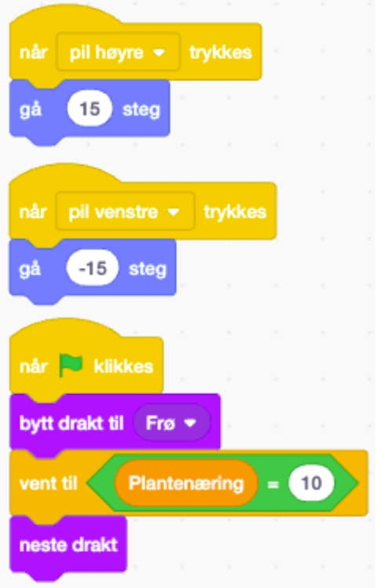

Utvid koden til å bytte til neste drakt to ganger til, når plantenæringen når 20, og 30! 

## Test Spillet ditt! {.flag}

## Fasit {.protip}

**Fasit kode frø-figur:**
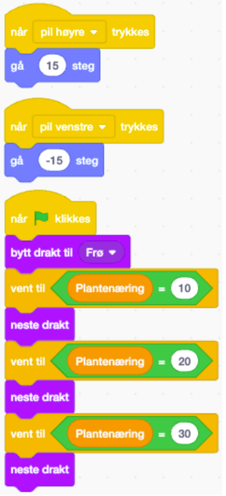

**Fasit kode sol og vanndråpe:**
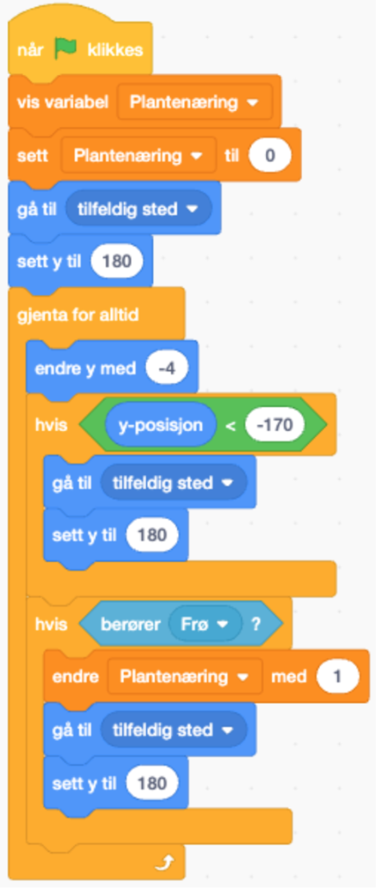

## Lagre spillet {.save}

Vi har laget...

Husk å lagre spillet/programmet ditt. Når du er ferdig kan du klikke på "Legg
ut"-knappen. Da vil det bli lagt ut på Scratch-hjemmesiden din slik at du enkelt
kan dele det med familien og vennene dine.