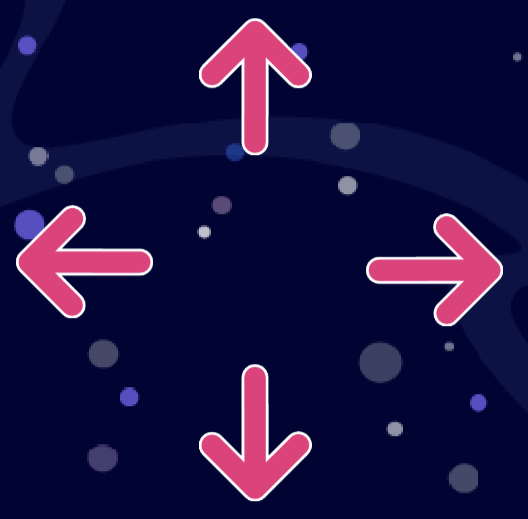

# Вступ {.intro}
  
Привіт, мене звуть Атлас, і я готуюся до дуже важливої космічної місії! Моє завдання – зібрати та утилізувати космічне сміття біля космічної станції. Те, що робить місію такою важкою, це те, що очікується метеоритний шторм, який може створити великі проблеми для місії. Тепер мені потрібна ваша допомога! Чи можете ви створити симуляцію, як я можу виконати цю задачу? 

У цьому завданні ви створите симуляцію космічної місії Атласа у Scratch. За посиланням ви знайдете фон та фігури, необхідні для створення симуляції. Ми описали, що повинні робити різні фігури, а вам потрібно скласти правильні блоки (коди) щоб виконати інструкціям. 

Це завдання для тих, хто вже багато програмував. Воно включає інструкції про те, що повинні робити різні фігури, але не містить готових блоків (кодів). Якщо вам потрібна допомога, ви можете перевірити попросити вашого вчителя перевірити блок (код).  

# Додаткове налаштування, якщо ви використовуєте iPad



*Цей пункт лише для тих, хто використовує планшет iPad.*

Якщо ви будете використовувати iPad для цього завдання, вам потрібно запрограмувати деякі "кнопки", які ви зможете використовувати, якщо у вас немає клавіатури. Ось як це зробити: Увійдіть у перегляд фігур і знайдіть символ стрілки. На символі стрілки запрограмуйте такий код:

```blocks
коли спрайт натиснуто
оповістити (праворуч v)
```

Тепер виберіть фігуру, якою стрілка повинна керувати, і додайте наступний код:

```blocks
коли я отримую  [праворуч v]
перемістити на (10) кроків
```

Повторіть ці кроки для всіх напрямкових стрілок, які вам потрібні (вправо, вліво, вгору і вниз). Тепер ви можете керувати фігурою, натискаючи на фігури-стрілки на екрані!


#  Що ви пройдете в завданні? {.activity}

Короткий огляд категорій коду та понять, які ви будете використовувати:

Рух

Події

Змінні

Керування

Оператори

Клонування фігур

Сенсори

Якщо - то


# Steg 1: Åpne prosjektet og programmer romskipet {.activity}

**Her finner du prosjektet du skal åpne:**
[https://scratch.mit.edu/projects/915491222](https://scratch.mit.edu/projects/915491222)

- [ ] Romskipet skal styres med alle de fire piltastene. 
- [ ] Vær obs på at alt som er ute i verdensrommet beveger seg sakte - dette må dere ta med i beregningen for hvordan romskipet skal bevege seg. 
- [ ] Dere skal også legge til en liv-teller. Denne skal starte på 3 liv. 

- [ ] Utfordring: Kan dere legge til noe i koden som gjør at romskipet endrer retning mens du kjører til høyre og venstre? 
## Test prosjektet {.flag}

**Klikk på det grønne flagget.** / **Start prosjektet for å teste koden så
langt.**

- [ ] Etter dette steget skal du kunne flytte på romskipet med fire piltaster.  Du skal også se en liv-teller oppe til venstre.

# Steg 2: Programmer romsøppel {.activity} 
- [ ] Romsøppelet skal dukke opp en etter en, litt etter litt, og dukker ikke opp før om noen sekunder etter spillet starter. Her skal du bruke klone-funksjonen så du slipper å lage mange kopier av romsøppelet. 
- [ ] Det skal dukke opp totalt 20 romsøppel-kloner.
- [ ] Siden romsøppelet flyter i verdensrommet skal det være tilfeldig hvor romsøppelet kommer fra og hvor de flyter til, men husk å definere at søppelet ikke skal flyte utenfor skjermen vår. 
- [ ] Hver gang romskipet kjører på romsøppel for å plukke det opp, får dere ett poeng og romsøppelet dere treffer skal bli borte. 

**Tips: Her trenger dere tre algoritmer:**

- [ ] en som skjuler den originale romsøppel-figuren, setter i gang poengteller og oppretter kloner
- [ ] en som styrer hva som skjer når klonene starter
- [ ] en som styrer hva som skjer når romskipet berører romsøppelet

## Test prosjektet {.flag}
**Klikk på det grønne flagget.** / **Start prosjektet for å teste koden så
langt.**

- [ ] Etter dette steget skal det dukke opp 20 romsøppel-kloner som dukker opp ved jevne mellomrom, fra tilfeldige steder. 
- [ ] Når romskipet berører romsøppelet skal de bli borte og poengtelleren skal telle oppover. 

# Steg 3: Programmer meteorregnet {.activity} 

- [ ] Meteorregnet skal jevnt skli fra bunnen av skjermen og opp. 
- [ ] Meteorene skal starte utenfor skjermen nede, og forsvinne når de går utenfor skjermen oppe. 
- [ ] De skal dukke opp en og en, på ulike steder. Dere skal bruke klone-funksjonen for å slippe å lage mange kopier av figuren. 
- [ ] Når en meteor treffer romskipet, mister du et av de tre livene dine.
Meteorene skal fortsette å fly, frem til du har mistet alle de tre livene dine. 
- [ ] Da skal det meldingen GAME OVER sendes. 
 Når GAME OVER-meldingen er sendt skal alle figurene stoppes. 

**Tips: Her trenger dere tre algoritmer:**
- [ ] En som skjuler den originale meteor-figuren, og lager kloner som dukker opp ved jevne mellomrom. 
- [ ] En som forteller hvilken retning meteorittene flyr til, og hvor langt de skal fly før de blir skjult.
- [ ] En som forteller hvor lenge meteorregnet skal vare: frem til romskipet har blitt truffet tre ganger og liv-telleren er lik null. 
- [ ] Den skal også slette meteoren romskipet skal krasje med, sende GAME OVER-melding og stoppe alle figurene. 
## Test prosjektet {.flag}
**Klikk på det grønne flagget.** / **Start prosjektet for å teste koden så
langt.**
- [ ] Etter dette steget skal det dukke opp uendelig mange meteoritter fra bunnen av skjermen ved jevne mellomrom. 
- [ ] Dersom romskipet krasjer med meteorregnet skal du miste ett liv. 

# Steg 4: Programmer GAME OVER-bildet {.activity} 
- [ ] Sørg for at denne figuren ikke dukker opp før etter du har mistet alle livene dine. 

**Tips: Her trenger dere to algoritmer:**
- [ ] En som skjuler figuren
- [ ] En som får figuren til å dukke opp når du mottar meldingen GAME OVER. 


## Test prosjektet {.flag}
 

**Klikk på det grønne flagget.** / **Start prosjektet for å teste koden så
langt.**

- [ ] Dersom du mister alle livene dine skal det dukke opp en GAME OVER-beskjed på skjermen. 

## Utfordring {.challenge}
Kan du programmere spillet til å vise GAME OVER hvis romskipet krasjer med romstasjonen? 

## Lagre spillet {.save}


Husk å lagre spillet/programmet ditt. Når du er ferdig kan du klikke på "Legg
ut"-knappen. Da vil det bli lagt ut på Scratch-hjemmesiden din slik at du enkelt
kan dele det med familien og vennene dine.


