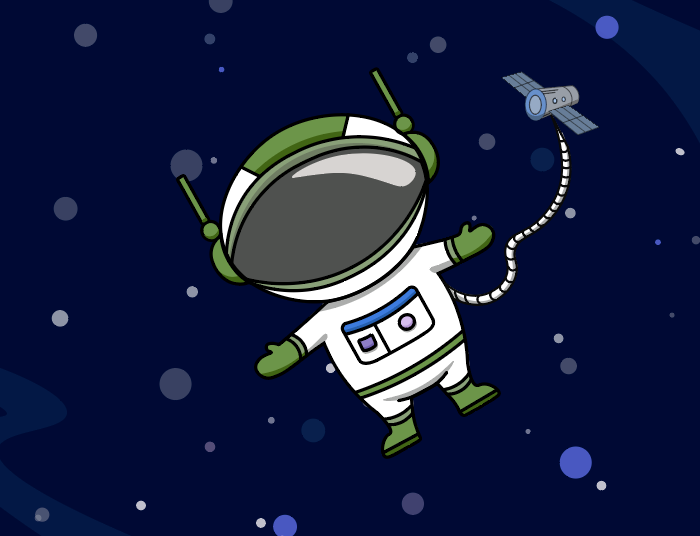

# Вступ {.intro}
  
Привіт, мене звуть Атлас, і я готуюся до дуже важливої космічної місії! Моє завдання – зібрати та утилізувати космічне сміття біля космічної станції. Те, що робить місію такою важкою, це те, що очікується метеоритний шторм, який може створити великі проблеми для місії. Тепер мені потрібна ваша допомога! Чи можете ви створити симуляцію, як я можу виконати цю задачу? 

У цьому завданні ви створите симуляцію космічної місії Атласа у Scratch. За посиланням ви знайдете фон та фігури, необхідні для створення симуляції. Ми описали, що повинні робити різні фігури, а вам потрібно скласти правильні блоки (коди) щоб виконати інструкціям. 

Це завдання для тих, хто вже багато програмував. Воно включає інструкції про те, що повинні робити різні фігури, але не містить готових блоків (кодів). Якщо вам потрібна допомога, ви можете перевірити попросити вашого вчителя перевірити блок (код).  

# Додаткове налаштування, якщо ви використовуєте iPad


*Цей пункт лише для тих, хто використовує планшет iPad.*

Якщо ви будете використовувати iPad для цього завдання, вам потрібно запрограмувати деякі "кнопки", які ви зможете використовувати, якщо у вас немає клавіатури. Ось як це зробити: Увійдіть у перегляд фігур і знайдіть символ стрілки. На символі стрілки запрограмуйте такий код:

```blocks
коли спрайт натиснуто
оповістити (праворуч v)
```

Тепер виберіть фігуру, якою стрілка повинна керувати, і додайте наступний код:

```blocks
коли я отримую  [праворуч v]
перемістити на (10) кроків
```

Повторіть ці кроки для всіх напрямкових стрілок, які вам потрібні (вправо, вліво, вгору і вниз). Тепер ви можете керувати фігурою, натискаючи на фігури-стрілки на екрані!


#  Що ви пройдете в завданні? {.activity}

Короткий огляд категорій коду та понять, які ви будете використовувати:

Рух

Події

Змінні

Керування

Оператори

Клонування фігур

Сенсори

Якщо - то


# Крок 1: Відкрийте проєкт і запрограмуйте космічний корабель {.activity}

**Тут ви знайдете проєкт, який потрібно відкрити:**
[https://scratch.mit.edu/projects/915491222](https://scratch.mit.edu/projects/915491222)

- [ ] Космічний корабель повинен керуватися всіма чотирма стрілками. 
- [ ] Враховуйте, що все, що знаходиться в космосі, рухається повільно – це треба враховувати при програмуванні руху космічного корабля. 
- [ ] Ви також повинні додати лічильник життів. Він повинен починати з 3 життів. 

- [ ] Виклик: Чи можете ви додати щось у код, щоб космічний корабель змінював напрямок, коли ви рухаєтесь вправо та вліво? 
## Перевірте проєкт {.flag}

**Натисніть на зелений прапорець.** / **Запустіть проєкт, щоб перевірити код на цьому етапі.**

- [ ] Після цього кроку ви зможете переміщувати космічний корабель за допомогою чотирьох стрілок. Ви також побачите лічильник життів у верхньому лівому куті.

# Крок 2: Запрограмуйте космічне сміття {.activity} 
- [ ] Космічне сміття повинне з’являтися одне за одним, трохи пізніше після початку гри. Тут слід використовувати функцію клонування, щоб не створювати багато копій сміття. 
- [ ] Повинно з’явитися загалом 20 клонів космічного сміття.
- [ ] Оскільки сміття дрейфує в космосі, його поява та рух повинні бути випадковими, але пам’ятайте, що сміття не повинно виходити за межі екрану. 
- [ ] Кожного разу, коли космічний корабель стикається зі сміттям, ви отримуєте один бал, а сміття зникає. 

**Порада: Вам знадобляться три алгоритми:**

- [ ] Алгоритм який приховує оригінальну фігуру сміття, запускає лічильник балів і створює клони.
- [ ] Алгоритм який керує тим, що відбувається, коли клони починають з’являтися.
- [ ] Алгоритм який керує тим, що відбувається, коли космічний корабель торкається сміття.

## Перевірте проєкт {.flag}
**Натисніть на зелений прапорець.** / **Запустіть проєкт, щоб перевірити код на цьому етапі.**

- [ ] Після цього кроку повинні з’явитися 20 клонів космічного сміття через рівні проміжки часу, з випадкових місць. 
- [ ] Коли космічний корабель торкається сміття, воно зникає, і лічильник балів підраховує ваші бали. 

# Крок 3: Запрограмуйте метеоритний дощ {.activity} 

- [ ] Метеоритний дощ повинен плавно рухатися знизу екрану і вгору. 
- [ ] Метеорити повинні стартувати поза екраном знизу і зникати, коли вони виходять за межі екрану зверху. 
- [ ] Вони повинні з’являтися один за одним, в різних місцях. Використовуйте функцію клонування, щоб не створювати багато копій фігури. 
- [ ] Коли метеорит влучає в космічний корабель, ви втрачаєте одне з трьох життів. Метеорити повинні продовжувати рухатися, поки ви не втратите всі три життя. 
- [ ] Тоді має з’явитися повідомлення "GAME OVER" (ГРУ ЗАВЕРШЕНО). Коли з’являється повідомлення "GAME OVER" (ГРУ ЗАВЕРШЕНО), всі фігури повинні зупинитися. 

**Порада: Вам знадобляться три алгоритми:**
- [ ] Алгоритм який приховує оригінальну фігуру метеорита та створює клони, які з’являються через рівні проміжки часу. 
- [ ] Алгоритм який визначає в якому напрямку летять метеорити і як далеко вони повинні летіти, перш ніж зникнути.
- [ ] Алгоритм який визначає як довго триватиме метеоритний дощ: поки космічний корабель не буде вражений тричі і лічильник життів не стане нульовим. Він також повинен видалити метеорит, з яким космічний корабель зіткнеться, надіслати повідомлення "GAME OVER" (ГРУ ЗАВЕРШЕНО) і зупинити всі фігури. 
## Перевірте проєкт {.flag}
**Натисніть на зелений прапорець.** / **Запустіть проєкт, щоб перевірити код на цьому етапі.**
- [ ] Після цього кроку знизу  екрану через рівні проміжки часу повинні з’являтися нескінченні метеорити. 
- [ ] Якщо космічний корабель зіткнеться з метеоритом, ви втратите одне життя. 

# Крок 4: Запрограмуйте зображення "GAME OVER" (ГРУ ЗАВЕРШЕНО) {.activity} 
- [ ] Переконайтеся, що ця фігура не з’являється до того, як ви втратите всі життя. 

**Порада: Вам знадобляться два алгоритми:**
- [ ] Алгоритм який приховує фігуру.
- [ ] Алгоритм який показує фігуру, коли ви отримуєте повідомлення "GAME OVER" (ГРУ ЗАВЕРШЕНО). 


## Перевірте проєкт {.flag}
 

**Натисніть на зелений прапорець.** / **Запустіть проєкт, щоб перевірити код на цьому етапі.**

- [ ] Якщо ви втратите всі життя, на екрані має з’явитися повідомлення "GAME OVER" (ГРУ ЗАВЕРШЕНО).

## Виклик {.challenge}
Чи можете ви запрограмувати гру так, щоб напис "GAME OVER" (ГРУ ЗАВЕРШЕНО) з’явився, якщо космічний корабель зіткнеться з космічною станцією?

## Збережіть гру {.save}


Не забудьте зберегти свою гру/програму. Коли закінчите, ви можете натиснути кнопку "Опублікувати". Тоді вона буде опублікована на вашій сторінці Scratch, щоб ви могли легко поділитися нею з родиною та друзями.


