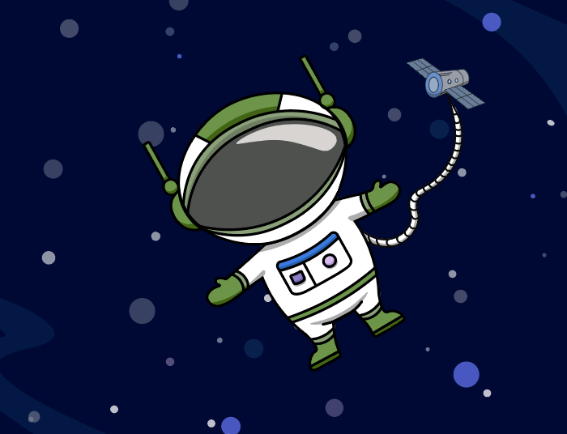
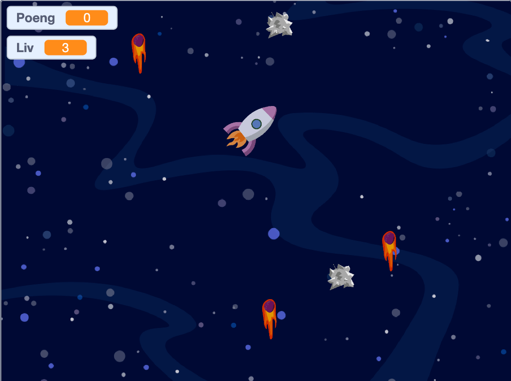

# Introduksjon {.intro}
  
Hei, jeg heter Atlas og jeg forbereder meg til et veldig viktig rom-oppdrag! 
Jeg har fått den store oppgaven om å samle sammen og rydde romsøppelet vekk fra romstasjonen. Det som gjør oppdraget så vanskelig er at det er meldt at en meteorstorm er på vei, som kan føre til store problemer med oppdraget. 
Jeg trenger nå deres hjelp! Kan dere lage en simulering på hvordan jeg kan løse oppdraget? 

I denne oppgaven skal dere lage en simulering av romoppdraget til Atlas i Scratch. Gjennom lenken får dere bakgrunnen og figurene dere trenger til å lage simuleringen. Vi har laget en beskrivelse av hva de ulike figurene skal gjøre, og dere må sette sammen de riktige kodene til å matche instruksjonene. 

Dette er en oppgave for dere som har kodet mye før. Det innebærer at oppgaven inneholder instruksjoner om hva de ulike figurene skal gjøre, men ikke fasit på hvordan kodene ser ut. Dersom du er usikker kan du sjekke fasiten under lærerveiledningen.  

#  Hva skal dere gjennom i oppgaven? {.activity}

Kort oversikt over kodekategoriene og begrepene dere skal innom:

Bevegelse

Hendelser

Variabler

Styring

Operatorer

Klone figurer

Sansing

Hvis - så 

# Steg 1: Åpne prosjektet og programmer romskipet {.activity}

**Her finner du prosjektet du skal åpne:**
[https://scratch.mit.edu/projects/915491222](https://scratch.mit.edu/projects/915491222)

- [ ] Romskipet skal styres med alle de fire piltastene. 
- [ ] Vær obs på at alt som er ute i verdensrommet beveger seg sakte - dette må dere ta med i beregningen for hvordan romskipet skal bevege seg. 
- [ ] Dere skal også legge til en liv-teller. Denne skal starte på 3 liv. 

- [ ] Utfordring: Kan dere legge til noe i koden som gjør at romskipet endrer retning mens du kjører til høyre og venstre? 
## Test prosjektet {.flag}

**Klikk på det grønne flagget.** / **Start prosjektet for å teste koden så
langt.**

- [ ] Etter dette steget skal du kunne flytte på romskipet med fire piltaster.  Du skal også se en liv-teller oppe til venstre.

# Steg 2: Programmer romsøppel {.activity} 
- [ ] Romsøppelet skal dukke opp en etter en, litt etter litt, og dukker ikke opp før om noen sekunder etter spillet starter. Her skal du bruke klone-funksjonen så du slipper å lage mange kopier av romsøppelet. 
- [ ] Det skal dukke opp totalt 20 romsøppel-kloner.
- [ ] Siden romsøppelet flyter i verdensrommet skal det være tilfeldig hvor romsøppelet kommer fra og hvor de flyter til, men husk å definere at søppelet ikke skal flyte utenfor skjermen vår. 
- [ ] Hver gang romskipet kjører på romsøppel for å plukke det opp, får dere ett poeng og romsøppelet dere treffer skal bli borte. 

**Tips: Her trenger dere tre algoritmer:**

- [ ] en som skjuler den originale romsøppel-figuren, setter i gang poengteller og oppretter kloner
- [ ] en som styrer hva som skjer når klonene starter
- [ ] en som styrer hva som skjer når romskipet berører romsøppelet

## Test prosjektet {.flag}
**Klikk på det grønne flagget.** / **Start prosjektet for å teste koden så
langt.**

- [ ] Etter dette steget skal det dukke opp 20 romsøppel-kloner som dukker opp ved jevne mellomrom, fra tilfeldige steder. 
- [ ] Når romskipet berører romsøppelet skal de bli borte og poengtelleren skal telle oppover. 

# Steg 3: Programmer meteorregnet {.activity} 

- [ ] Meteorregnet skal jevnt skli fra bunnen av skjermen og opp. 
- [ ] Meteorene skal starte utenfor skjermen nede, og forsvinne når de går utenfor skjermen oppe. 
- [ ] De skal dukke opp en og en, på ulike steder. Dere skal bruke klone-funksjonen for å slippe å lage mange kopier av figuren. 
- [ ] Når en meteor treffer romskipet, mister du et av de tre livene dine.
Meteorene skal fortsette å fly, frem til du har mistet alle de tre livene dine. 
- [ ] Da skal det meldingen GAME OVER sendes. 
 Når GAME OVER-meldingen er sendt skal alle figurene stoppes. 

**Tips: Her trenger dere tre algoritmer:**
- [ ] En som skjuler den originale meteor-figuren, og lager kloner som dukker opp ved jevne mellomrom. 
- [ ] En som forteller hvilken retning meteorittene flyr til, og hvor langt de skal fly før de blir skjult.
- [ ] En som forteller hvor lenge meteorregnet skal vare: frem til romskipet har blitt truffet tre ganger og liv-telleren er lik null. 
- [ ] Den skal også slette meteoren romskipet skal krasje med, sende GAME OVER-melding og stoppe alle figurene. 
## Test prosjektet {.flag}
**Klikk på det grønne flagget.** / **Start prosjektet for å teste koden så
langt.**
- [ ] Etter dette steget skal det dukke opp uendelig mange meteoritter fra bunnen av skjermen ved jevne mellomrom. 
- [ ] Dersom romskipet krasjer med meteorregnet skal du miste ett liv. 

# Steg 4: Programmer GAME OVER-bildet {.activity} 
- [ ] Sørg for at denne figuren ikke dukker opp før etter du har mistet alle livene dine. 

**Tips: Her trenger dere to algoritmer:**
- [ ] En som skjuler figuren
- [ ] En som får figuren til å dukke opp når du mottar meldingen GAME OVER. 

## Test prosjektet {.flag}
 

**Klikk på det grønne flagget.** / **Start prosjektet for å teste koden så
langt.**

- [ ] Dersom du mister alle livene dine skal det dukke opp en GAME OVER-beskjed på skjermen. 

## Utfordring {.challenge}
Kan du programmere spillet til å vise GAME OVER hvis romskipet krasjer med romstasjonen? 

## Lagre spillet {.save}

Husk å lagre spillet/programmet ditt. Når du er ferdig kan du klikke på "Legg
ut"-knappen. Da vil det bli lagt ut på Scratch-hjemmesiden din slik at du enkelt
kan dele det med familien og vennene dine.

