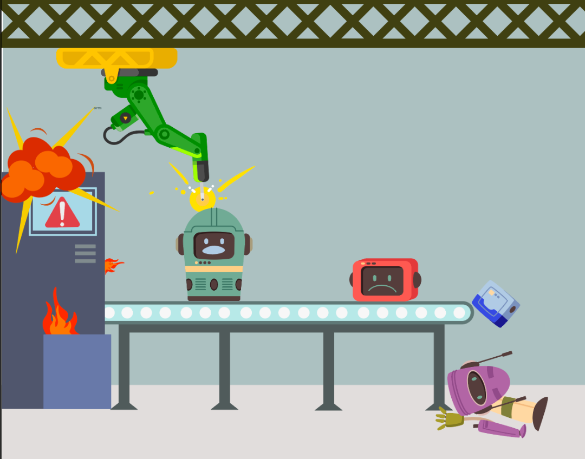

  
# Oppgave: Lag ditt eget spill – Kaos på robotfabrikken! {.intro}
  
**Scenario:**
Robotfabrikken er i trøbbel! Produksjonsrobotene har gått amok, og fabrikken er full av ødelagte maskiner som spruter gnister og flammer. 

Nå skal du få bruke fantasien og programmeringsferdighetene dine til å lage dette spillet helt fra bunnen av. 🚀 
I denne oppgaven får du instruksjoner om hva de ulike figurene skal programmeres til å gjøre for å lage spillet. Dersom du står fast, kan du sjekke ut fasiten i **lærerveiledningen**.

# Beskrivelse av spillet du skal lage{.activity}

Din oppgave er å lage et spill i Scratch der spilleren styrer en robot som skal samle inn 20 verktøy og robotdeler for å rydde opp i kaoset.

Men vær forsiktig! Dersom roboten krasjer i fabrikkens vegger, taper spilleren. Spilleren mister også poeng hvis roboten treffer flammer eller gnister. 

Målet er å samle alle delene uten å miste for mange poeng!

# Steg 2: Åpne prosjektet i scratch{.activity}
Åpne dette scratchprosjektet for å få tilgang til bakgrunn og ulike figurer som du skal programmere: 
[https://scratch.mit.edu/projects/1100091878](https://scratch.mit.edu/projects/1100091878)

# Steg 3: Programmer roboten {.activity}

- [ ] Når spillet skal starte skal roboten `gå til x og y-koordinatene`{.blockmotion} til inngangen til robotfabrikken. 
- [ ] Når spillet skal starte må `poengene`{.blockdata} settes til 0
- [ ] Husk å legg inn en `send melding (start spill)`{.blockevents}-kloss som aktiverer scriptet som trigger poengtap når figuren kommer i kontakt med flammene og gnistene.
- [ ] Roboten skal programmeres til å `kontinuerlig`{.blockcontrol} styres på `x og y aksen`{.blockmotion} ved hjelp av `pilene`{.blocksensing}; høyre, venstre, opp og ned.
- [ ] Dersom roboten kommer i kontakt med figurene **vegg1**, **vegg2** og **vegg3** skal figuren **GAME OVER** dukke opp på skjermen og spillet skal **`stoppe`{.blockcontrol}** å fungere. 
- [ ] Dersom roboten kommer i kontakt med figurene **Gnister** eller **Flammer** skal du miste **`ett poeng`{.blockdata}**. 

## Hint: {.protip}
Robotens program skal ha to rader med koder: en rad som setter poengene til 0, som styrer robotens plassering, robotens bevegelser, hva som skjer når roboten krasjer i veggene og som starter den neste raden med kode. Og en rad som trigges av "Start spill" og som styrer poengtapet når roboter kommer i kontakt med flammene og gnistene. 

# Steg 2: Programmer "GAME OVER" {.activity}

- [ ] Programmer figuren til å skjules fra start.
- [ ] Når roboten sender "Game over"-meldingen, skal figuren dukke opp igjen. 

# Steg 3: Programmer flammene og gnistene {.activity}
- [ ] Opprett kopier av figurene så du har **3 flammer** og **4 gnister**. Disse plasseres på ulike steder i fabrikken. Juster gjerne størrelsen på figurene så det blir mer realistisk og vanskeligere å komme unna. 
- [ ] Hver figur skal skjules fra start
- [ ] I en `gjenta for alltid`{.blockcontrol}-loop skal du legge inn antall sekunder det tar før figuren skal dukke opp igjen. Dette skal være ulikt for hver figur, så ikke alle dukker opp samtidig.
- [ ] Deretter skal figuren `vises`{.blocklooks} igjen, og `endre størrelse`{.blocklooks} opp og ned noen piksler så det ser ut som om figuren pulserer. Husk å legge inn noen pauseklosser i koden, så animasjonen ikke er for rask! 
- [ ] Før koden er ferdig må du også legge inn en kloss som `skjuler`{.blocklooks} figuren igjen. 

- [ ] Gjenta dette for alle figurene.

## Test programmet! {.flag}
- [ ] Dukker de ulike figurene opp på bakgrunnen til ulike tider? 

- [ ] Endrer de størrelse så de ser animert ut? 

# Steg 4: Programmer verktøy og robotdelene  {.activity}
- [ ] Figurene skal vises fra start
- [ ] Figurene skal `vente til`{.blockevents} de `berører Fixitron`{.blocksensing} før de `starter en lyd`{.blocksound} (dette kan være en metallisk lyd, eller en boing-lyd eller noe helt annet. Du bestemmer, det er ditt spill! 
- [ ] Når Fixitron har kommet i kontakt med figurene, skal figuren `skjules`{.blocklooks} og `poengene skal øke med 1`{.blockdata}. 
- [ ] For at det skal være enklere å se de ulike figurene er det fint å legge inn litt bevegelse! Legg inn et script som fra start sørger for at figuren `snur seg x antall grader`{.blockmotion} `for alltid`{.blockcontrol}, eller `snur seg frem og tilbake`{.blockmotion} `for alltid`{.blockcontrol}. 
- [ ] Disse kodene skal legges inn for hver figur! 

## Test prosjektet {.flag}

**Klikk på det grønne flagget.** / **Start prosjektet for å teste koden så
langt.**

 **Når spillet er helt ferdig skal dette være på plass:**

- [ ] Du skal kontrollere Fixitron med piltastene

- [ ] Fixitron skal kunne plukke opp verktøy og få poeng per verktøy plukket opp 
- [ ] Det skal dukke opp gnister og flammer på ulike steder til ulik tid 
- [ ] Du skal miste poeng når du kommer i kontakt med flammer og gnister

- [ ] Få opp GAME OVER når du krasjer i vegger og taper spillet. 

## Lagre spillet {.save}

Husk å lagre spillet/programmet ditt. Når du er ferdig kan du klikke på "Legg
ut"-knappen. Da vil det bli lagt ut på Scratch-hjemmesiden din slik at du enkelt
kan dele det med familien og vennene dine.