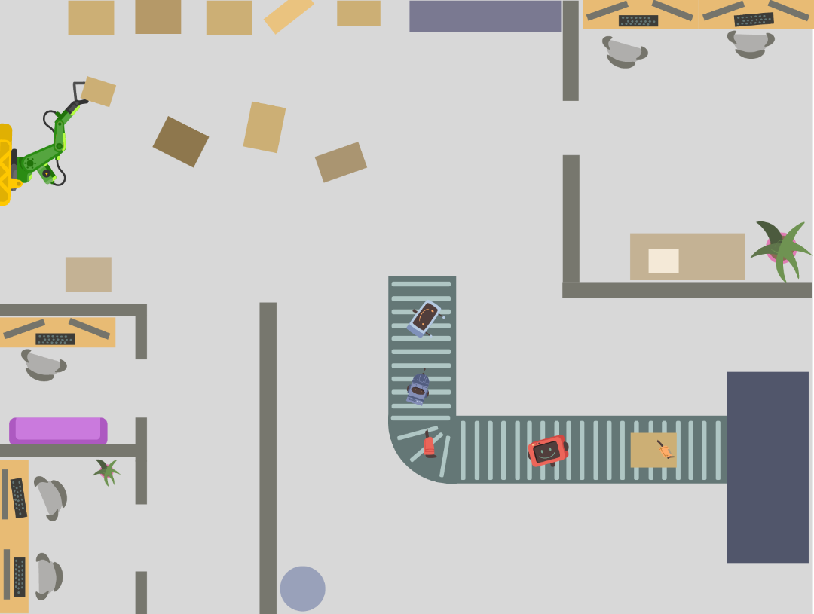
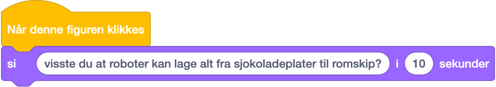

# **Lag en interaktiv robotfabrikk!** {.intro}

  
# Introduksjon {.intro}
  

**I denne oppgaven skal dere bruke Scratch til å lage en interaktiv robotfabrikk!** 

Målet med oppgaven er å lage et interaktivt bilde av en robotfabrikk fylt med ulike maskindeler som forteller kule faktaer om fabrikken deres når vi trykker på dem.

Når dere er ferdige, kan dere vise frem prosjektet til de andre elevene i klasserommet og lære masse nytt om hvordan deres robotfabrikk fungerer!

# Steg 1: Finn fakta om robotfabrikken!  {.activity}

Visste du at store industriroboter kan montere flere hundre deler på én time? Eller at det finnes maskiner som kan lime sammen små deler helt nøyaktig?

**Robotfabrikker er SÅ KULE!**

Finn frem så mange kule faktaer om robotfabrikker som du vil. 

Disse faktaene kan være ekte faktaer om robotfabrikker, eller så kan du finne på dine helt egne fakta om hva som skjer på din fabrikk! 

Kanskje robotfabrikken din lager støvsugerroboter? Eller kanskje bussjåførroboter? 

**Skriv de ned og ha de klare til steg 4.**

# Steg 2: Sett kulissene   {.activity}

Vi lager en robotfabrikk!
Åpne denne lenken: [https://scratch.mit.edu/projects/1103277808](https://scratch.mit.edu/projects/1103277808)

Her finner dere et Scratch-prosjekt dere kan bruke til oppgaven. Vi har laget fine maskindeler som dere kan velge å bruke, men dere kan også gå inn i figurbiblioteket og legge til flere roboter eller andre figurer.

# Steg 3: Velg figurer  {.activity}
Nå skal vi velge hvilke figurer som skal fortelle oss kule ting om robotfabrikken.

- [ ] Dere kan selv velge å bruke maskindelene vi har laget til dere. 
Dersom dere ikke ønsker å bruke dem, kan dere trykke på **søppelbøtte-ikonet** på hver figur. Dere kan også **høyreklikke** for å **lage flere kopier** av figurene.

- [ ] Dersom dere vil ha flere figurer, klikk på katte-ikonet nede til høyre på skjermen. Her dukker det opp mange figurer! Søk etter "robot" eller trykker på "mennesker" for å få opp alle figurene som kan høre hjemme i en robotfabrikk.

- [ ] Du velger figurene du ønsker å legge til i fabrikken ved å klikke på den. 
Klikk og dra figurene dit du ønsker at de skal stå, og juster størrelse ved å endre tallet bak "**størrelse**."

- [ ] Gjenta prosessen så mange ganger som du vil, og fyll opp robotfabrikken din med forskjellige maskiner, verktøy, mennesker og roboter.

# Steg 4: Programmer figurene dine {.activity}
 
Vi skal nå programmere maskindelene så de forteller oss fakta om fabrikken sin. Disse stegene gjøres for hver figur.

- [ ] Klikk på maskindelen du ønsker å programmere. Det gjør du i ruten til høyre.
- [ ] Finn `Når denne figuren klikkes`{.blockevents}-klossen og dra den ut i arbeidsområdet vårt.
- [ ] Finn `Si ____ i ___ sekunder`{.blocklooks}-klossen og legg den til under den gule klossen du har lagt i arbeidsområdet.
Fyll inn din fakta om fabrikken, og hvor mange sekunder maskindelen din skal "prate" i. I vårt eksempel har vi brukt **10 sekunder**.

- [ ] Gå videre til de neste maskindelene og gjenta stegene.

## Test prosjektet {.flag}

**Klikk på det grønne flagget.** / **Start prosjektet for å teste koden så
langt.**
Når du er ferdig med å programmere alle maskindelene dine vil du kunne teste prosjektet ditt. Du skal nå få opp ulike fakta hver gang du trykker på en ny figur.

- [ ] Du skal se at det dukker opp en faktasetning hver gang du trykker på en figur du har programmert! 

## Utfordring {.challenge}

Kan du få en liten robot til å kjøre gjennom fabrikken din?

- [ ] Finn en robot-figur (dette kan enten være den som lå i prosjektet da du åpnet det, eller en ny fra figurbiblioteket).
- [ ] Juster størrelsen på roboten. Roboter pleier å være litt mindre enn store industriroboter og maskiner, ikke sant?
- [ ] Lag et script for roboten. I fabrikken kan roboten bevege seg fra en maskin til en annen for å hente deler eller gjøre arbeid.
Start koden med en gul `Når flagg klikkes`{.blockevents}-kloss, som du kobler til en `gjenta for alltid`{.blockcontrol}-kloss.
Legg til en `gli 1 sekunder til tilfeldig sted`{.blockmotion}-kloss. Klossen står automatisk på 1 sekund - da beveger roboten seg ganske fort - men i fabrikken bør den bevege seg saktere for å være nøyaktig. Hvordan kan du få roboten til å flytte seg rolig gjennom fabrikken?

- [ ] Kan du legge til lyder på maskindelene som klikkes?

Nå vil roboten din kjøre rundt i fabrikken blant maskiner som kan fortelle om hvor spennende robotfabrikker er!

## Lagre spillet {.save}

Vi har laget...

Husk å lagre spillet/programmet ditt. Når du er ferdig kan du klikke på "Legg
ut"-knappen. Da vil det bli lagt ut på Scratch-hjemmesiden din slik at du enkelt
kan dele det med familien og vennene dine.