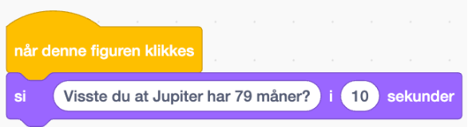

# Om oppgaven {.activity}

I denne oppgaven skal dere bruke Scratch til å lage et interaktivt verdensrom! Målet med oppgaven er å lage et interaktivt bilde av et verdensrom fylt med ulike figurer som forteller ulike kule faktaer om verdensrommet når vi trykker på dem.
Når dere er ferdige kan dere vise frem prosjektet til de andre elevene i klasserommet, og lære masse nytt om verdensrommet!

Følg denne lenken for å remikse prosjektet med figurene på bildet: [https://scratch.mit.edu/projects/928002017](https://scratch.mit.edu/projects/928002017)
## Oppgaven passer til: {.check}

 **Fag**: Naturfag, Programmering, Teknologi

**Anbefalte trinn**: 1.-4. klasse

**Tema**: Animasjon, Blokkbasert

**Tidsbruk**:

## Kompetansemål {.challenge}

**4. trinn**

- K&H: gjennomføre kunst- og designprosesser ved å søke inspirasjon, utforske muligheter, gjøre valg og lage egne produkter

- Matte:
lage algoritmer og uttrykke de ved bruk av variabler, vilkår og løkker

**5. trinn**
- Naturfag:
designe og lage et produkt basert på brukerbehov
beskrive og visualisere hvordan døgn, månefaser og årstider oppstår, og samtale om hvordan dette påvirker livet på jorda
gjøre rede for jordas forutsetninger for liv og sammenligne med andre himmellegemer i universet

- K&H:
bruke ulike strategier for idéutvikling og problemløsing
bruke digitale verktøy til å planlegge og presentere prosesser og produkter
bruke programmering til å skape interaktivitet og visuelle uttrykk

- Matte:
lage og programmere algoritmer med bruk av variabler, vilkår og løkker 

## Forslag til læringsmål {.challenge}

- [ ] Elevene skal forstå, skape og bruke teknologi, inkludert programmering og modellering, i arbeid med naturfag. 
- [ ] Digitale ferdigheter i naturfag er å kunne bruke digitale verktøy til å utforske, registrere, beregne, visualisere, programmere, modellere, dokumentere og publisere data fra forsøk, feltarbeid og andres studier. 
- [ ] Digitale ferdigheter er også å bruke søkeverktøy, beherske søkestrategier, kritisk vurdere kilder og velge ut relevant informasjon om naturfaglige emner.

## Forslag til vurderingskriterier {.challenge}

Det er mange ulike måter man kan vurdere et programmeringsprosjekt, og her må en
selv vurdere hva som er den beste måten ut ifra hvilket fag man jobber i,
hvilken aldergruppe og hviklet nivå elevene er på, hva man ønsker å teste og
hvor mye tid man har til rådighet til å jobbe med prosjektet. I vårt
[lærerdokument](https://github.com/kodeklubben/oppgaver/wiki/Hvordan-undervise-i-og-vurdere-programmering){target=_blank} har vi blant
annet beskrevet ulike måter dette kan gjøres på, tillegg til en del andre
nyttige tips til hvordan man underviser i programmering.

## Forutsetninger og utstyr {.challenge}

- [ ] **Forutsetninger**: Ingen forutsetninger. 

- [ ] **Utstyr**: Laptop / iPad med tilgang til nett. 

## Fremgangsmåte

# Steg 1: Finn fakta om verdensrommet! {.activity}

Visste du at Jupiter har 79 måner? Eller at det finnes en planet som er laget av diamanter? Verdensrommet er SÅ KULT!

- [ ] Finn frem så mange kule faktaer om verdensrommet du vil, enten på internett eller i naturfagsboka di. Skriv de ned og ha de klare til steg 4.

# Steg 2: Sett kulissene{.activity}

Vi lager et verdensrom!
- [ ] Åpne denne lenken: [https://scratch.mit.edu/projects/928002017](https://scratch.mit.edu/projects/928002017)

  Her finner dere et Scratch-prosjekt dere kan bruke til oppgaven. Vi har laget fine figurer som dere kan velge å bruke, men dere kan også gå inn i figur-biblioteket og legge til flere figurer.

# Steg 3: Velg figurer{.activity}

Nå skal vi velge hvilke figurer som skal fortelle oss kule ting om verdensrommet.
- [ ]  Dere kan selv velge å bruke figurene vi har laget til dere. Dersom dere ikke ønsker å bruke dem, kan dere trykke på søppelbøtte-ikonet på hver figur. Dere kan også høyreklikke for å lage flere kopier av figurene.
- [ ]  Dersom dere vil ha flere ikoner klikk på IKON nede til venstre på skjermen. Her dukker det opp mange figurer! Søk etter SPACE for å få opp alle figurene som hører hjemme i verdensrommet.
- [ ]  Du velger figuren du ønsker å legge til i verdensrommet ved å klikke på den. Klikk og dra figuren dit du ønsker den skal stå, og juster størrelse ved å endre tallet bak "størrelse".
- [ ]  Gjenta prosessen så mange ganger som du vil, og fyll opp verdensrommet ditt med forskjellige planeter, stjerner, romskip og romfarere.

# Steg 4: Programmer figurene dine {.activity}

Vi skal nå programmere figurene så de forteller oss fakta om verdensrommet sitt. Disse stegene gjøres for hver figur.

- [ ]   Klikk på figuren du ønsker å programmere. Det gjør du i ruten til venstre.

- [ ]   Finn `Når denne figuren klikkes`{.blockevents}-klossen og dra den ut i arbeidsområdet vårt.

- [ ]   Finn `Si ____ i ___ sekunder`{.blocklooks}- klossen og legg den til under den gule klossen du har lagt i arbeidsområdet.
- [ ]   Fyll inn din fakta om verdensrommet, og hvor mange sekunder figuren din skal prate i. I vårt eksempel har vi brukt 10 sekunder. 

- [ ]    Gå videre til de neste figurene og gjenta stegene.

## Test prosjektet {.flag}

- [ ]    Klikk på det grønne flagget.
- [ ]    Når du er ferdig med å programmere alle figurene dine vil du kunne teste prosjektet ditt. Du skal nå få opp ulike fakta hver gang du trykker på en ny figur.

## Utfordring {.challenge}

**Kan du få en astronaut til å flyte gjennom verdensrommet ditt?**
 
- [ ]   Finn en astronaut-figur (dette kan enten være den som lå i prosjektet da du åpnet det, eller en ny fra figurbiblioteket).

- [ ]    Juster størrelsen på astronauten. Mennesker pleier å være litt mindre enn store planeter og romskip, pleier de ikke?

- [ ]    Lag et script for astronauten. I verdensrommet er det ingen tyngdekraft og astronauten vil derfor flyte rundt i rommet.

- [ ]    Start koden med en gul `Når flagg klikkes`{.blockevents}-kloss, som du kobler en `gjenta for alltid`{.blockcontrol}-kloss.

- [ ]    Legg til en `gli 1 sekunder til tilfeldig sted`{.blockmotion}-kloss. Klossen står automatisk på 1 sekund - da flyr astronauten ganske fort - og i verdensrommet går ting litt saktere enn det gjør her på jorda fordi de ikke har tyngdekraft. 

- [ ]   Hvordan kan du få astronauten til å fly saktere gjennom rommet?

- [ ]    Kan du legge til lyder på figurene som klikkes?

**Nå vil astronauten din fly rundt i verdensrommet blant planeter som kan fortelle om hvor kult verdensrommet er!**

## Lagre spillet {.save}

Husk å lagre spillet/programmet ditt. Når du er ferdig kan du klikke på "Legg ut"-knappen. Da vil det bli lagt ut på Scratch-hjemmesiden din slik at du enkelt kan dele det med familien og vennene dine.