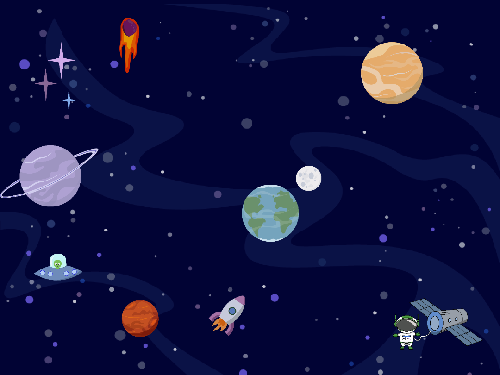

# Вступ {.intro}

У цьому завданні ви будете використовувати Scratch для створення інтерактивного космосу! 
Метою завдання є створення інтерактивного зображення космосу, заповненого різними персонажами, 
які розповідають різні цікаві факти про космос, коли ми на них натискаємо. 
Коли ви закінчите, ви можете показати свій проєкт іншим учням у класі та дізнатися багато нового про космос! 
Слідуйте за цим посиланням, щоб реміксувати проєкт з персонажами на зображенні:

[Посилання на сайт](https://scratch.mit.edu/projects/928002017)

# Крок 1: Знайдіть факти про космос! {.activity}

Чи знали ви, що у Юпітера є 79 супутників? Або що існує планета, яка зроблена з діамантів?
Космос такий ЗАХОПЛЮЮЧИЙ!

- [ ] Знайдіть кілька цікавих фактів про космос, в інтернеті, або у вашому підручнику з природознавства. 

- [ ] Запишіть їх, вони знадобляться вам для кроку 4.

# Крок 2: Створіть декорації {.activity}
## Ми створюємо космос!

Vi lager et verdensrom! 
- [ ] Відкрийте це [посилання](https://scratch.mit.edu/projects/928002017). 
- [ ] Потім натисніть кнопку `Переглянути проєкт`.

Тут ви знайдете проєкт Scratch, який ви можете використовувати для завдання. 
Ми створили гарних персонажів, яких ви можете вибрати для використання, 
але ви також можете зайти до бібліотеки персонажів та додати інших.

# Steg 3:  Velg figurer{.activity}

# Крок 3: Виберіть персонажів {.activity}


- [ ] Ви можете самі вибрати використання персонажів, яких ми створили для вас. Якщо ви не хочете їх використовувати, ви можете натиснути на іконку смітника на кожному персонажі. Ви також можете клацнути правою кнопкою миші, щоб створити більше копій персонажів.

- [ ] Якщо вам потрібні додаткові персонажі, натисніть на кнопку “Обрати персонажа” внизу праворуч на екрані. Тут з'явиться багато персонажів! Напишіть КОСМОС у рядку пошуку, щоб побачити всіх персонажів, які належать до космосу.

- [ ] Виберіть персонажа, якого ви хочете додати до космосу, натиснувши на нього. Клацніть і перетягніть персонажа туди, де ви хочете, щоб він стояв, та відрегулюйте розмір, змінивши число у полі "розмір".

- [ ] Повторюйте процес стільки разів, скільки хочете, аби заповнити свій космос різними планетами, зірками, космічними кораблями та космонавтами.


# Крок 4:  Програмуйте своїх персонажів {.activity}

Тепер ми будемо програмувати персонажів, щоб вони розповідали нам факти про космос. 
Повтори ці кроки виконуються для кожного персонажа. 

 - [ ] Натисніть на персонажа, якого ви хочете програмувати. У лівому меню виберіть код. Знайдіть блок Коли цей персонаж натиснуто  і перетягніть його в робочу область.

 - [ ] Знайдіть блок `Коли цей персонаж натиснуто`  і перетягніть його в робочу область.

 - [ ] Знайдіть блок `Сказати ____ протягом ___ секунд` і додайте його під жовтий блок, який ви додали в робочу область.

 - [ ] Тепер використайте факти про космос, які ви знайшли виконуючи Крок 1б додаючи їх у блок. Також вкажіть скільки секунд ваш персонаж повинен говорити. У нашому прикладі ми використали 10 секунд.


 - [ ]   Перейдіть до наступних персонажів і повторіть кроки.

## Перевірте проєкт{.flag}

**Натисніть на зелений прапорець.** 

- [ ] Коли ви закінчите програмувати всіх своїх персонажів, ви зможете протестувати свій проєкт. Тепер ви будете бачити різні факти про космос кожен раз, коли натискаєте на нового персонажа.
. 

## Виклик {.challenge}

**Чи зможе космонавта літати у вашому космосі?**
 - [ ]  Знайдіть фігуру космонавта (це може бути та, яка була в проекті, коли ви його відкривали, або нова з бібліотеки фігур).
 - [ ]  Змініть розмір астронавта. Люди, як правило, трохи менші за великі планети та космічні кораблі, чи не так?
 - [ ]  Створіть скрип для космонавта. У космосі немає сили тяжіння, тому астронавт буде парити в космосі.
 - [ ]  Почніть код із жовтого блоку `Коли прапорець натиснуто`{.blockevents}, до якого ви підключаєте блок `повторити завжди`{.blockcontrol}.
 - [ ]  Додайте цеглинку «слайд 1 секунда до випадкового розташування» {.blockmotion}.
 Блок автоматично залишається ввімкненим протягом 1 секунди — тоді астронавт летить досить швидко — а в космосі речі рухаються трохи повільніше, ніж тут, на землі, оскільки вони не мають сили тяжіння.
**Як зробити так, щоб космонавт літав у космосі повільніше?**
```blocks
коли натиснуто на зелений прапорець
повторювати вічно
ковзання (1) секунд до (випадкове місце v)
повернутись на краю
```

- [ ]  Чи можете ви додати звук до фігур, на які натискаєте?

**Тепер ваш космонавт буде літати в космосі серед планет, які можуть розповідати про те, який космос — це круто!**

## Зеберегти гру {.save}
Не забудьте зберегти свою гру/програму. Коли ви закінчите, ви можете натиснути «Додати
вийти". Потім його буде опубліковано на вашій домашній сторінці Scratch, щоб ви могли легко
можете поділитися ним зі своєю родиною та друзями.
