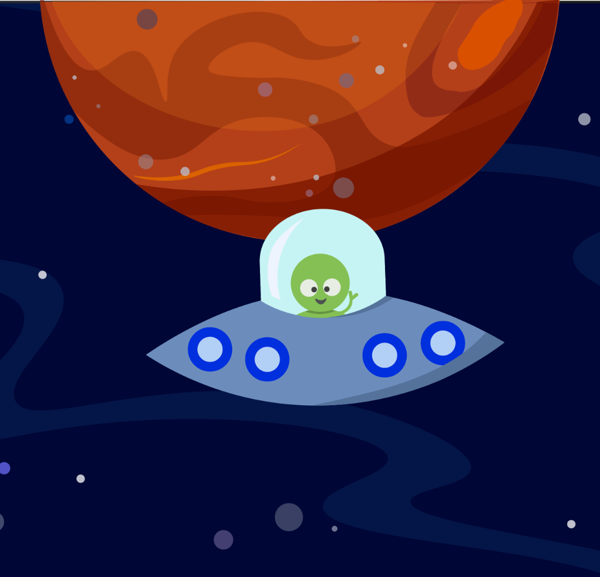
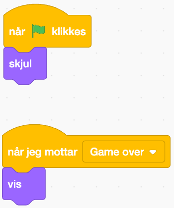

Dette er lærerveiledningen til oppgaven *Redd Timenor fra meteorregnet!*. Her finner du fasiten på hvordan kodene faktisk skal se ut etter elevene har remikset oppgaven og redigert kodene. 
 
# Om oppgaven {.activity}

Modige romfarere! Jeg trenger deres hjelp! Jeg heter Kodar, og kommer fra planeten Timenor. Jeg har fått i oppdrag om å beskytte planeten min mot et meteorregn som er på vei gjennom galaksen, men ufoen min fungerer ikke som den skal! Kan dere hjelpe meg med å fikse koden, og hjelpe meg med å knuse meteorittene før de krasjer inn i planeten min?  

Når koden er reparert kan du teste og se hvor mange meteoritter du klarer å skyte med ufoens laser! 


## Oppgaven passer til: {.check}

 **Fag**: Matematikk, Programmering, Teknologi

**Anbefalte trinn**: 5.-7. klasse

**Tema**: Animasjon, Blokkbasert, Lyd, Spill

**Tidsbruk**: 1 time 

## Kompetansemål {.challenge}

Relevante kompetansemål:


**4. trinn:**

Matte:
lage algoritmar og uttrykkje dei ved bruk av variablar, vilkår og lykkjer

**7. trinn:**


Naturfag:
utforske, lage og programmere teknologiske systemer som består av deler som virker sammen
skille mellom observasjoner og slutninger, organisere data, bruke årsak-virkning-argumenter, trekke slutninger, vurdere feilkilder og presentere funn


K&H:
bruke ulike strategier for idéutvikling og problemløsing
bruke programmering til å skape interaktivitet og visuelle uttrykk

**5. trinn**

Matte:
lage og programmere algoritmer med bruk av variabler, vilkår og løkker 


**10. trinn:**


Matte:
utforske hvordan algoritmer kan skapes, testes og forbedres ved hjelp av programmering (8. trinn)


## Forslag til læringsmål {.challenge}

Læringsmålet dekker kompetansemål innen kunst og håndverk og matematikk:

Utforske, feilsøke og gjøre nødvendige justeringer i koden for å gjøre spillet spillbart


## Forslag til vurderingskriterier {.challenge}

Det er mange ulike måter man kan vurdere et programmeringsprosjekt, og her må en
selv vurdere hva som er den beste måten ut ifra hvilket fag man jobber i,
hvilken aldergruppe og hviklet nivå elevene er på, hva man ønsker å teste og
hvor mye tid man har til rådighet til å jobbe med prosjektet. I vårt
[lærerdokument](https://github.com/kodeklubben/oppgaver/wiki/Hvordan-undervise-i-og-vurdere-programmering){target=_blank} har vi blant
annet beskrevet ulike måter dette kan gjøres på, tillegg til en del andre
nyttige tips til hvordan man underviser i programmering.

## Forutsetninger og utstyr {.challenge}

- [ ] **Forutsetninger**: Har kodet tidligere. Har noe kjennskap til feilsøking. 

- [ ] **Utstyr**: Laptop eller iPad med tilgang til Scratch

**OBS!** Denne oppgaven bruker piltaster på tastaturet for å flytte på figuren. De som har iPad kan komme rundt dette ved å programmere to firkantede figurer til å fungere som piltaster for å komme rundt dette problemet, eller bruke tastatur til iPad. 

## Fremgangsmåte og fasit

Her kommer fasiten til de reparerte kodene i den faktiske
oppgaven. 

Denne oppgaven er en remiks-oppgave. Vi har laget et spill der vi skal hjelpe Kodar med å redde planeten sin, Timenor, men som du ser på bildet er det noe som er alvorlig galt! 


Vi trenger din hjelp til å reparere koden, så Kodar kan redde planeten sin. 


# Steg 1: Åpne prosjektet og finn feil! {.activity}

- [ ] Siden dette er en remiks-oppgave er første steg å åpne prosjektet som inneholder feil: [https://scratch.mit.edu/projects/882702131](https://scratch.mit.edu/projects/882702131)

- [ ] Det første vi gjør er å gå gjennom hva koden egentlig skal gjøre. 
-  Piltastene høyre og venstre skal flytte på romskipet, og mellomrom-tasten skal skyte laseren. 
- Meteorittene skal komme fra bunnen av skjermen i et tilfeldig mønster ved jevne mellomrom.
- Når Kodar skyter en meteoritt skal det telles poeng. Hver meteoritt skutt gir ett poeng.
- Når en meteoritt når Kodar, er spillet over og GAME OVER skal vises på skjermen. 


# Steg 2: Reparer koden {.activity}

## UFOens styring

- [ ] Vi starter med å se på styringen til UFOen. Når vi går inn i koden ser vi følgende kode:


```blocks
Når grønt flagg klikkes
sett [poeng v] til (0)
sett [meteoritter skutt v] til (0)
gå til x: (10) y: (100)
gjenta til <berører (Meteor v) ?>
hvis <tast (pil høyre v) trykket?>
endre x med (150)
end
hvis <tast (pil venstre v) trykket?>
endre x med (-150)
```


- [ ] Hva kan gjøre at UFOen går kjempefort? Og hvordan kan vi justere dette så vi enklere kan kontrollere den? 

**Fasit:** Endre x og y til et lavt tall, eks 8 og -8: 
```blocks
Når grønt flagg klikkes
sett [poeng v] til (0)
sett [meteoritter skutt v] til (0)
gå til x: (10) y: (100)
gjenta til <berører (Meteor v) ?>
hvis <tast (pil høyre v) trykket?>
endre x med (8)
end
hvis <tast (pil venstre v) trykket?>
endre x med (-8)
```

## Meteorstormen
- [ ] Det neste problemet vi må takle er at det dukker opp ekstremt mange meteorer! Koden viser følgende: 


```blocks
når grønt flagg klikkes
skjul
gjenta for alltid
vent (2.8) sekunder
gjenta (80) ganger
lag klon av (meg v)
```


- [ ] Hvordan kan vi redigere koden så meteorsvermen ikke blir så kraftig? 

**Fasit:** Endre antall `gjentakelser`{.blockcontrol} til 1, og sett `vent`{.blockcontrol} til 1 sekund:
```blocks
når grønt flagg klikkes
skjul
gjenta for alltid
vent (1) sekunder
gjenta (1) ganger
lag klon av (meg v)
```


## Laseren
- [ ] Laseren skyter feil vei! Koden ser dere her: 
```blocks
når jeg starter som klon
gå til x: ([x-posisjon v] av (UFO v)) y: (50)
vis
gjenta til <berører (kant v) ?>
gå (-10) steg
end
slett denne klonen
```


Kan dere finne ut av hva som er galt og hvordan vi får den til å skyte riktig vei?

**Fasit:** Koden inneholder -10 for antall `steg`{.blockmotion} figuren skal gå, derfor går den baklengs. Fjern minustegnet for å reparere koden:
```blocks
når jeg starter som klon
gå til x: ([x-posisjon v] av (UFO v)) y: (50)
vis
gjenta til <berører (kant v) ?>
gå (10) steg
end
slett denne klonen
```
 
## Poengtelleren
- [ ] Nå fungerer laseren! Men vil vi ikke telle hvor mange meteoritter vi har klart å skyte ned? Kan du fikse denne koden så den viser hvor mange meteoritter vi har skutt?

```blocks
når jeg starter som klon
gjenta for alltid
hvis <berører (Laserskudd v)?>
slett denne klonen
```

Husk at vi skal få ett poeng per meteoritt vi skyter ned! 

**Fasit:**  I koden mangler variablen `endre Meteoritter skutt med 1`{.blockdata} - legg til denne for å reparere koden: 
```blocks
når jeg starter som klon
gjenta for alltid
hvis <berører (Laserskudd v)?>
endre [meteoritter skutt v] med (1)
slett denne klonen
```
## GAME OVER-beskjeden!

- [ ] Til slutt skal det dukke opp en GAME OVER-beskjed dersom Kodar blir truffet av en meteoritt. Denne beskjeden dukker ikke opp, selv om figuren ligger der. Kan du finne ut av hvorfor den ikke vises? 

```blocks
når grønt flagg klikkes
skjul

når jeg mottar [Game over v]
```


Fasit: Det mangler en `vis`{.blocklooks}-beskjed i koden. Legg til denne for å reparere koden: 

```blocks
når grønt flagg klikkes
skjul

når jeg mottar [Game over v]
vis
```


**Klikk på det grønne flagget.** 

Nå fungerer koden! Bra jobba! 
Hvor mange meteoritter kan dere hjelpe Kodar å skyte ned, så de ikke treffer planeten? Vår high-score er på 24 - hvor høy blir deres? Lykke til modige romfarere! 

## Utfordring {.challenge}

- [ ] Du kan selv justere kodene for å gjøre spillet lettere eller vanskeligere.
- [ ] Kan du legge til liv? Prøv å gi Kodar tre liv som må brukes opp før GAME OVER vises på skjermen. 


## Lagre spillet {.save}


Husk å lagre spillet/programmet ditt. Når du er ferdig kan du klikke på "Legg
ut"-knappen. Da vil det bli lagt ut på Scratch-hjemmesiden din slik at du enkelt
kan dele det med familien og vennene dine.

