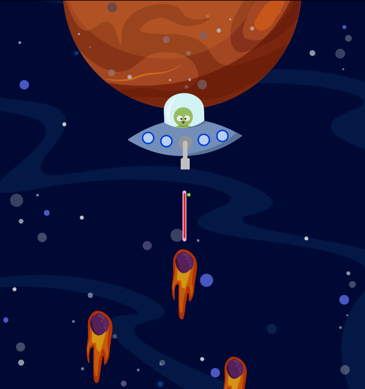
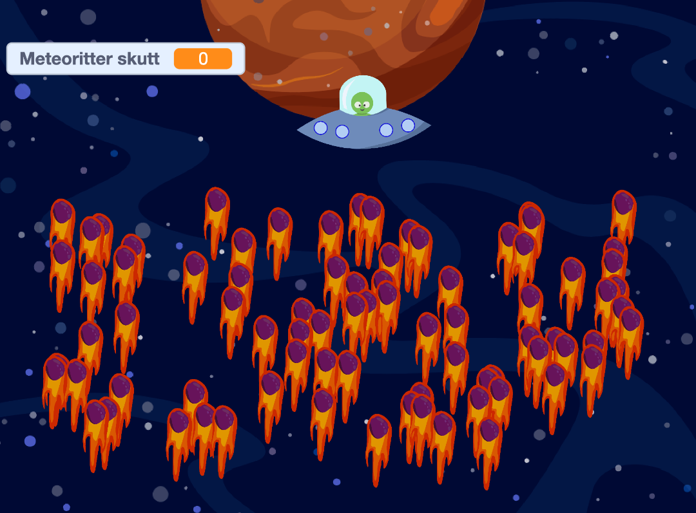
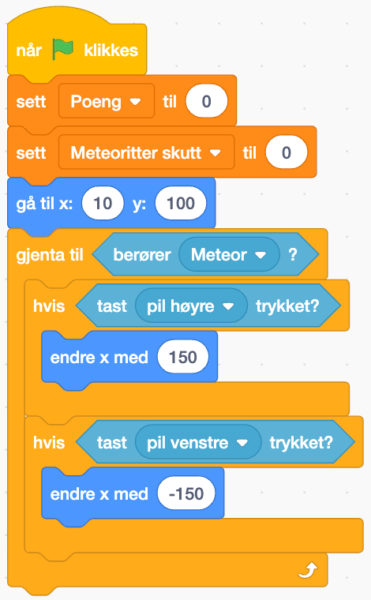
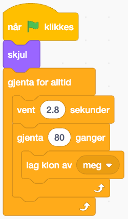
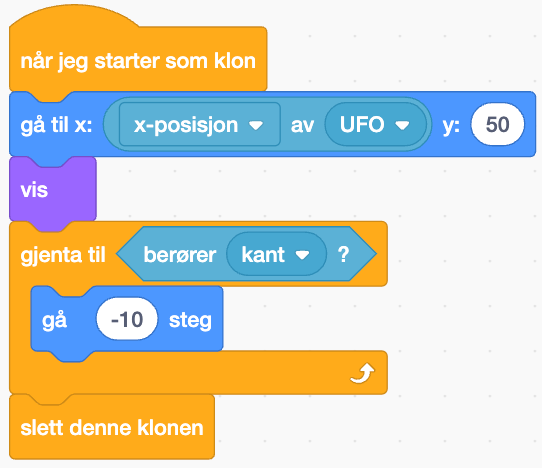
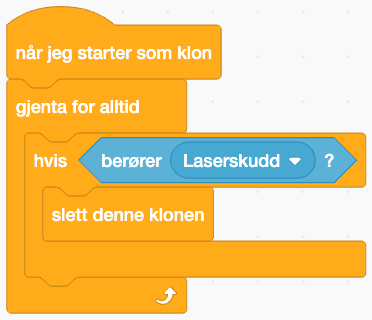
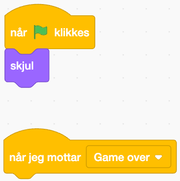

Modige romfarere! Jeg trenger deres hjelp! Jeg heter Kodar, og kommer fra planeten Timenor. Jeg har fått i oppdrag om å beskytte planeten min mot et meteorregn som er på vei gjennom galaksen, men ufoen min fungerer ikke som den skal! Kan dere hjelpe meg med å fikse koden, og hjelpe meg med å knuse meteorittene før de krasjer inn i planeten min?  

Når koden er reparert kan du teste og se hvor mange meteoritter du klarer å skyte med ufoens laser! 

  
# Introduksjon {.intro}
  
Denne oppgaven er en remiks-oppgave. Vi har laget et spill der vi skal hjelpe Kodar med å redde planeten sin, Timenor, men som du ser på bildet er det noe som er alvorlig galt! 



Vi trenger din hjelp til å reparere koden, så Kodar kan redde planeten sin. 


# Steg 1: Åpne prosjektet og finn feil! {.activity}

- [ ] Siden dette er en remiks-oppgave er første steg å åpne prosjektet som inneholder feil: [https://scratch.mit.edu/projects/882702131](https://scratch.mit.edu/projects/882702131)

- [ ] Det første vi gjør er å gå gjennom hva koden egentlig skal gjøre. 
-  Piltastene høyre og venstre skal flytte på romskipet, og mellomrom-tasten skal skyte laseren. 
- Meteorittene skal komme fra bunnen av skjermen i et tilfeldig mønster ved jevne mellomrom.
- Når Kodar skyter en meteoritt skal det telles poeng. Hver meteoritt skutt gir ett poeng.
- Når en meteoritt når Kodar, er spillet over og GAME OVER skal vises på skjermen. 


# Steg 2: Reparer koden {.activity}

## UFOens styring

- [ ] Vi starter med å se på styringen til UFOen. Når vi går inn i koden ser vi følgende kode:

 
```blocks
Når grønt flagg klikkes
sett [poeng v] til (0)
sett [meteoritter skutt v] til (0)
gå til x: (10) y: (100)
gjenta til <berører (Meteor v) ?>
hvis <tast (pil høyre v) trykket?<
```

–
- [ ] Hva kan gjøre at UFOen går kjempefort? Og hvordan kan vi justere dette så vi enklere kan kontrollere den? 


## Meteorstormen
- [ ] Det neste problemet vi må takle er at det dukker opp ekstremt mange meteorer! Koden viser følgende: 



- [ ] Hvordan kan vi redigere koden så meteorsvermen ikke blir så kraftig? 

## Laseren
- [ ] Laseren skyter feil vei! Koden ser dere her: 


Kan dere finne ut av hva som er galt og hvordan vi får den til å skyte riktig vei?
 
## Poengtelleren
- [ ] Nå fungerer laseren! Men vil vi ikke telle hvor mange meteoritter vi har klart å skyte ned? Kan du fikse denne koden så den viser hvor mange meteoritter vi har skutt?




Husk at vi skal få ett poeng per meteoritt vi skyter ned! 

## GAME OVER-beskjeden!

Til slutt skal det dukke opp en GAME OVER-beskjed dersom Kodar blir truffet av en meteoritt. Denne beskjeden dukker ikke opp, selv om figuren ligger der. Kan du finne ut av hvorfor den ikke vises? 




## Test koden! {.flag}

**Klikk på det grønne flagget.** 

Nå fungerer koden! Bra jobba! 
Hvor mange meteoritter kan dere hjelpe Kodar å skyte ned, så de ikke treffer planeten? Vår high-score er på 24 - hvor høy blir deres? Lykke til modige romfarere! 

## Utfordring {.challenge}

- [ ] Du kan selv justere kodene for å gjøre spillet lettere eller vanskeligere.
- [ ] Kan du legge til liv? Prøv å gi Kodar tre liv som må brukes opp før GAME OVER vises på skjermen. 


## Lagre spillet {.save}


Husk å lagre spillet/programmet ditt. Når du er ferdig kan du klikke på "Legg
ut"-knappen. Da vil det bli lagt ut på Scratch-hjemmesiden din slik at du enkelt
kan dele det med familien og vennene dine.