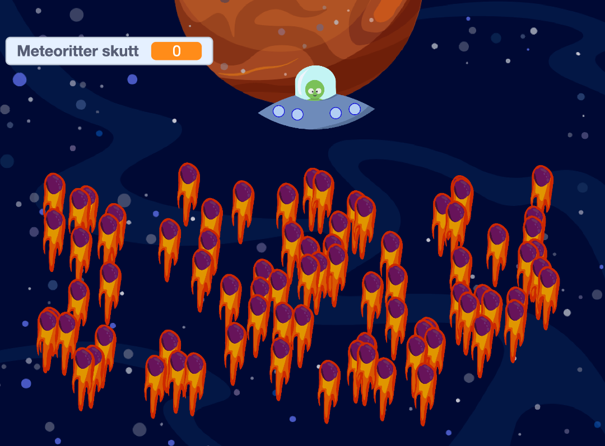
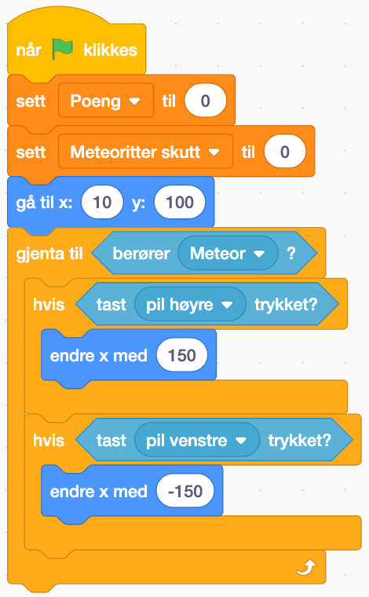
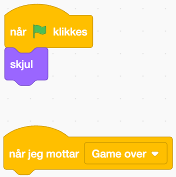

Сміливі космонавти! Мені потрібна ваша допомога! Мене звати Кодар, я з планети Тименор. Мені доручили захищати мою планету від метеоритного дощу, що рухається через галактику, але мій НЛО не працює як слід! Чи можете ви допомогти мені виправити код і допомогти знищити метеорити, перш ніж вони знищать мою планету?  

Коли код буде виправлено, ви зможете протестувати і подивитися, скільки метеоритів ви зможете збити лазером НЛО! 
  
# Вступ {.intro}
  
Це завдання - ремікс-завдання. Ми створили гру, де маємо допомогти Кодару врятувати свою планету Тименор, але, як ви бачите на зображенні, щось серйозно не так! 



Нам потрібна ваша допомога у виправленні коду, щоб Кодар зміг врятувати свою планету. 

# iPad


Якщо ви будете використовувати iPad для цього завдання, вам потрібно буде запрограмувати кілька “кнопок”, які можна використовувати, якщо у вас немає клавіатури. 
Ось як це зробити: 
Перейдіть до огляду фігур і знайдіть символ стрілки. 
На символі стрілки запрограмуйте наступний код:

```blocks
коли ця фігура натискається
надіслати повідомлення (go_right)
```

Коли натиснути 
Надіслати "Йти вправо" перейдіть до фігури, яку повинна керувати стрілка, і додайте наступний код: Коли я отримую "Йти праворуч", пройдіть x кроків (тут ви самі регулюєте швидкість, у прикладі швидкість 10)
 

```blocks
коли я отримую (go_right)
перемістити на (10) кроків
```

Повторіть ці кроки для всіх стрілок напрямків, які вам потрібні (вправо і вліво, або стрілки вправо, вліво, вгору і вниз). Тепер ви можете керувати фігурою, натискаючи на стрілки на екрані!

# Крок 1: Відкрийте проєкт і знайдіть помилки! {.activity}

- [ ] Оскільки це завдання-повторення, першим кроком буде відкрити проєкт, який містить помилки: [https://scratch.mit.edu/projects/882702131](https://scratch.mit.edu/projects/882702131)

- [ ] Спочатку ми переглянемо, що саме має робити код. 
- Клавіші зі стрілками вправо та вліво повинні переміщати космічний корабель, а клавіша пробілу має стріляти лазером. 
- Метеорити повинні з'являтися внизу екрана у випадковому порядку з регулярними інтервалами.
- Коли Кодер стріляє в метеорит, повинні підраховуватися очки. За кожен збитий метеорит дається одне очко.
- Коли метеорит досягає Кодера, гра закінчується, і на екрані має з'явитися "ГРА ПРОГРАНА". 

# Крок 2: Виправте код {.activity}

## Керування НЛО

- [ ] Почнемо з керування НЛО. Переглянувши код, ми бачимо наступний код:

 
```blocks
Når grønt flagg klikkes
sett [poeng v] til (0)
sett [meteoritter skutt v] til (0)
gå til x: (10) y: (100)
gjenta til <berører (Meteor v) ?>
hvis <tast (pil høyre v) trykket?<
```

–
- [ ] Hva kan gjøre at UFOen går kjempefort? Og hvordan kan vi justere dette så vi enklere kan kontrollere den? 


## Meteorstormen
- [ ] Det neste problemet vi må takle er at det dukker opp ekstremt mange meteorer! Koden viser følgende: 


- [ ] Hvordan kan vi redigere koden så meteorsvermen ikke blir så kraftig? 

## Laseren
- [ ] Laseren skyter feil vei! Koden ser dere her: 


Kan dere finne ut av hva som er galt og hvordan vi får den til å skyte riktig vei?
 
## Poengtelleren
- [ ] Nå fungerer laseren! Men vil vi ikke telle hvor mange meteoritter vi har klart å skyte ned? Kan du fikse denne koden så den viser hvor mange meteoritter vi har skutt?


Husk at vi skal få ett poeng per meteoritt vi skyter ned! 

## GAME OVER-beskjeden!

Til slutt skal det dukke opp en GAME OVER-beskjed dersom Kodar blir truffet av en meteoritt. Denne beskjeden dukker ikke opp, selv om figuren ligger der. Kan du finne ut av hvorfor den ikke vises? 




## Test koden! {.flag}

**Klikk på det grønne flagget.** 

Nå fungerer koden! Bra jobba! 
Hvor mange meteoritter kan dere hjelpe Kodar å skyte ned, så de ikke treffer planeten? Vår high-score er på 24 - hvor høy blir deres? Lykke til modige romfarere! 

## Utfordring {.challenge}

- [ ] Du kan selv justere kodene for å gjøre spillet lettere eller vanskeligere.
- [ ] Kan du legge til liv? Prøv å gi Kodar tre liv som må brukes opp før GAME OVER vises på skjermen. 


## Lagre spillet {.save}


Husk å lagre spillet/programmet ditt. Når du er ferdig kan du klikke på "Legg
ut"-knappen. Da vil det bli lagt ut på Scratch-hjemmesiden din slik at du enkelt
kan dele det med familien og vennene dine.
