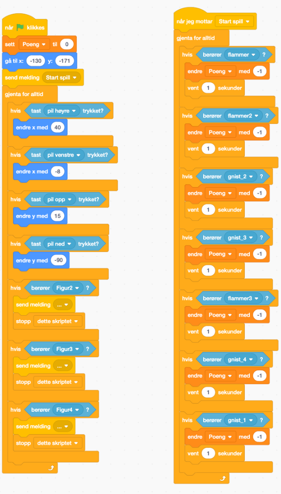
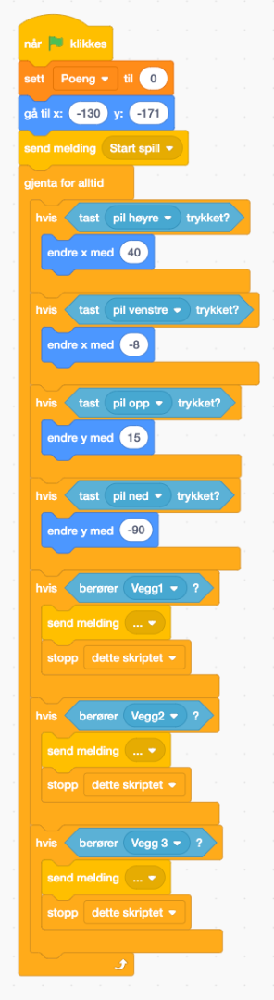
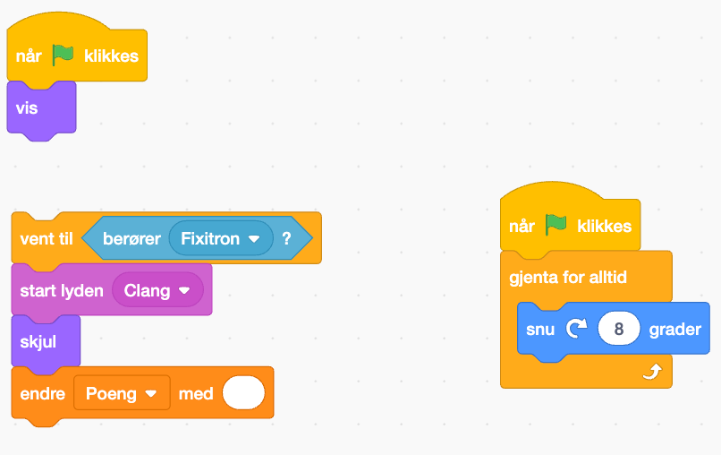
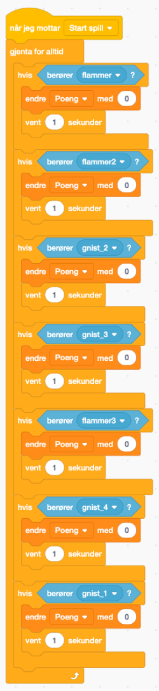

# Reparer koden i Scratch – Robotfabrikken {.intro}

Dette er spillet “**Fixitrons redningsoppdrag**” - men det er noe som ikke fungerer! Du må reparere koden for å få spillet til å fungere som det skal, så Fixitron kan redde verktøyet og robotdelene som ennå ikke er ødelagt i kaoset på robotfabrikken.

# Introduksjon: {.intro}

Robotfabrikken har mistet kontrollen over produksjonsrobotene sine, og det er fullstendig kaos! Roboten du styrer, Fixitron, har fått i oppdrag å rydde opp i fabrikken ved å samle inn 20 verktøy og robotdeler som ligger spredt rundt. 

Men pass på! Dersom roboten krasjer i fabrikkens vegger, taper du spillet og “**GAME OVER**” skal vises på skjermen. Du mister også poeng hvis roboten kommer i kontakt med flammene eller gnistene fra de ødelagte maskinene. Klarer du å få roboten til å utføre oppdraget sitt?

**Oppdrag:**

Dessverre er koden i spillet ødelagt, og ingenting fungerer som det skal! Din oppgave er å gå gjennom koden for hver figur i Scratch-prosjektet og finne ut hva som er galt. Rett opp feilene slik at spillet fungerer perfekt igjen. I denne oppgaven skal dere finne **6 alvorlige feil** i koden, men noen av feilene er like for flere figurer og må rettes opp flere ganger for å få spillet til å fungere slik det skal. 

# Steg 1: Start med å åpne Scratch-prosjektet. {.activity}

Åpne scratchprosjektet: [https://scratch.mit.edu/projects/1101733848](https://scratch.mit.edu/projects/1101733848)

Logg på med deres Scratch-konto og trykk på “Remiks”-knappen for å gå inn og lage deres en kopi av Scratch-prosjektet. 
Dersom du ikke har en Scratch-konto kan du trykke på "Se inni" og redigere. Husk å trykk på "Lagre på datamaskinen" hvis du vil jobbe videre med prosjektet en annen gang. 

**Prosjektet inneholder følgende figurer:**

- [ ] Roboten (spilleren)
- [ ] Veggene
- [ ] Flammene og gnistene
- [ ] Verktøy og robotdeler (mutter, tannhjul, skrutrekker, CPU, Skiftenøkkel) 

# Steg 2: Analyser robotens kode. {.activity}
- [ ] Hvorfor fungerer ikke robotens bevegelser som de skal?
Sørg for at roboten kan styres med **piltastene**. Er styringen kontrollert nok? 
- [ ] Sørg for at roboten **taper spillet** når den treffer veggene. Dukker “**GAME OVER**” opp når Fixitron treffer veggen? Gå inn på “**GAME OVER**”-figuren for å se om du finner noe som kan være feil i koden. 

## Tips! {.protip}
* Roboten beveger seg best hvis den beveger seg jevnt. 
* Sender koden vår riktig melding når roboten berører veggen? Sjekk koden til GAME OVER for å dobbeltsjekke dette. 

## Test prosjektet {.flag}

**Klikk på det grønne flagget.** / **Start prosjektet for å teste koden så
langt.**
# Steg 3: Se på koden for verktøyene og robotdelene. {.activity}

- [ ] Hvorfor skjer det ingenting når roboten prøver å samler dem opp?
- [ ] Kan du reparere koden slik at spilleren får poeng for **hver del** de samler? 

**Husk å endre koden på alle robotdel- og verktøyfigurene for at hele spillet skal fungere!** 
## Test prosjektet {.flag}

**Klikk på det grønne flagget.** / **Start prosjektet for å teste koden så
langt.**

## Tips! {.protip}
* Henger koden sammen slik den skal? 
* Er alle feltene fylt ut? 

# Steg 4: Sjekk koden for flammene og gnistene. {.activity}

Gå inn på Fixitrons kode og undersøk om koden som beskriver hva som skjer hvis Fixitron kommer i kontakt med flammer og gnister fungerer slik den skal. 

- [ ] Hvorfor mister ikke roboten poeng når den kommer i kontakt med disse?
- [ ] Fiks koden slik at poeng trekkes fra, og legg gjerne til en lydeffekt!

# Steg 5: Test spillet! {.activity}

Spill gjennom spillet flere ganger for å forsikre deg om at alt fungerer som det skal.

**Mål:**
Spillet skal fungere slik at roboten kan samle alle 20 verktøyene og robotdelene, unngå å krasje i veggene, og miste poeng hvis den treffer flammer eller gnister. Når alt er på plass, har du reddet utstyret fra robotfabrikken! 🎉
Lykke til, kodespesialister! 🚀

## Tips {.protip}
Se etter vanlige feil som manglende "Hvis berører"-blokker eller feil innstillinger for poengtelleren.
Bruk kommentarfeltet i Scratch for å dokumentere hva du har fikset i koden.

## Lagre spillet {.save}

Vi har laget...

Husk å lagre spillet/programmet ditt. Når du er ferdig kan du klikke på "Legg
ut"-knappen. Da vil det bli lagt ut på Scratch-hjemmesiden din slik at du enkelt
kan dele det med familien og vennene dine.