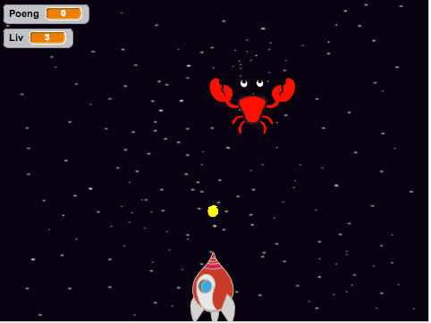
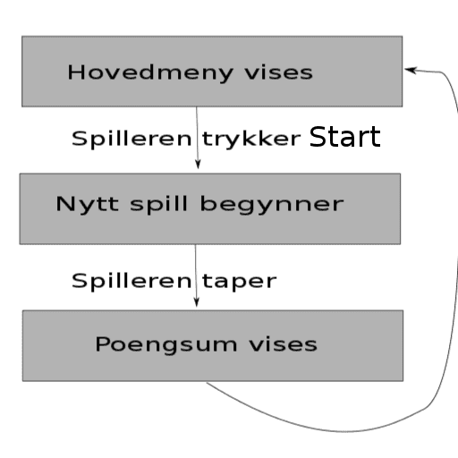

# Introduksjon {.intro}

Denne uken skal vi gjøre noe litt annerledes. I stedet for å lage et
spill fra bunnen av skal vi remikse et eksisterende spill. Vi skal
lære hvordan vi kan gjøre et spill mer komplett ved å blant annet
legge til en meny som styrer spillflyten, og som lar oss spille flere
ganger. Spillet vi skal remikse heter Krabbeangrep! og det går ut på
at spilleren styrer en kanon som skal forsvare jorden mot et
intergalaktisk krabbeangrep! Kanonen skyter kuler som tar knekken på
krabbene og får poeng når den treffer.



# Steg 1: Bli kjent med spillet {.activity}

*Før vi begynner å kode noe som helst skal vi bli litt kjent med
 spillet som det er.*

## Sjekkliste {.check}
+ Gå inn på <http://scratch.mit.edu/users/gubbisduff/> og klikk på
  prosjektet `Krabbeangrep!` Velg `Se inni`{.blocksensing}.

+ Trykk på knappen der det står `Remiks` øverst i høyre hjørne. Nå har
  du en kopi av spillet på din egen bruker som du kan gjøre hva du vil
  med uten at du endrer originalen.

+ Bruk noen minutter på å se igjennom alle skriptene i prosjektet. Les
  igjennom alle kommentarene og vær helt sikker på at du har forstått
  hvordan spillet fungerer før du går videre; spør gjerne om hjelp!

## Test prosjektet {.flag}

__Klikk på det grønne flagget.__

+ Prøv spillet en gang eller to for å bli bedre kjent med hvordan det
  fungerer.

# Steg 2: Vi lager en meny, del I {.activity}

*Nå skal vi lage en meny som dukker opp når spillet starter og når
 spillet er slutt. Menyen skal i første omgang være veldig enkel, alt
 som skal være der er en startknapp.*

Se nøye på skissen under før du går videre. Her ser du hvordan flyten
i spillet skal være. Flyten i spillet skal styres gjennom meldinger
som sendes mellom figurene. Hver gang noe nytt skal skje, som for
eksempel et nytt spill skal startes, eller at menyen skal vises etter
spillet er tapt skal det sendes en melding.



## Sjekkliste {.check}

+ Først må du lage en figur som skal fungere som startknapp. Denne kan
  du tegne selv ved å klikke på  i
  figurområdet. Et enkelt rektangel med teksten `Start` inni burde
  gjøre susen. Gi den navnet `Startknapp`.

+ Vi må også lage en bakgrunn som kan fungere som hovedmeny. Trykk på
  scenen og velg `Bakgrunner`. Lag en kopi av bakgrunnen `Rommet` ved
  å høyreklikke og trykke på `lag en kopi`. Pynt litt på den med tekst
  og hva annet du måtte ønske så man ser at det er en hovedmeny. Gi
  den navnet `Hovedmeny`.

# Steg 3: Vi lager en meny, del II {.activity}

*Som spillet er nå så startes det når man trykker på det grønne
 flagget. Nå vil vi at hovedmenyen skal dukke opp når vi trykker på
 det grønne flagget, og at spillet skal starte når man trykker på
 Startknapp figuren.*

### Se mottakere {.protip}

Du kan sjekke hvem som mottar en bestemt melding ved å høyreklikke på
en meldingskloss og klikke på `vis sendere` og `vis mottakere`. Da vil
de som sender/mottar akkurat den meldingen få en ramme rundt seg i
figurområdet.

## Sjekkliste {.check}

+ Endre på skriptene i scenen slik at du har følgende skript:

  ```blocks
  når grønt flagg klikkes
  send melding [hovedmeny v]

  Når jeg mottar [hovedmeny v]
  bytt bakgrunn til [Hovedmeny v]
  ```

+ Gi startknappen de følgende skriptene (de to første sørger for at
  knappen oppfører seg riktig i starten av spillet, og det siste
  sørger for at startknappen faktisk er en startknapp):

  ```blocks
  når grønt flagg klikkes
  skjul

  når jeg mottar [hovedmeny v]
  gå til x: (0) y: (0)
  vis

  når denne figuren klikkes
  send melding [nytt spill v]
  ```

+ Nå må vi sørge for at resten av figurene oppfører seg som vi vil
  både når flagget klikkes, når hovedmenyen skal vises og når
  startknappen klikkes! Det betyr at vi må ha mange små skript som
  lytter etter disse meldingene (skript som starter med klossene under
  `Hendelser`{.blockevents}). Vi skal ikke skrive nøyaktig opp hvordan
  disse skriptene skal se ut, det skal du klare selv, men her er det
  som må med:

+ Både romskipet, romvesenet og godbiten må gjøre følgende: figuren
  skjules når flagget klikkes og figuren går inn i *hovedløkken* sin
  når `nytt spill` mottas. Hva som er *hovedløkken* til en figur står
  tydelig skrevet i kommentarene.

+ Startknappen må skjules når `nytt spill` mottas.

+ Scenen må skifte bakgrunn til `Rommet` når `nytt spill` mottas.

## Test prosjektet {.flag}

__Klikk på det grønne flagget.__

+ Skjules alle figurene utenom startknappen når hovedmenyen vises?

+ Starter spillet som det skal når startknappen klikkes?

## Lagre prosjektet {.save}

Nå er vi ferdig med å fortelle deg hva du skal gjøre. Resten av tiden
kan du bruke på en eller flere av utfordringene nedenfor.

## Utfordring: Vis poengsummen når spillet er ferdig {.challenge}

Nå som spillet har en god start kan du prøve å gi det en god slutt
også. I denne utfordringen er målet å gjøre det siste steget i
spillflyt-tegningen ovenfor. Du legger kanskje merke til at scenen har
et skript som starter med `Når jeg mottar treff`{.blockevents}, og at
her sendes meldingen `tapte` hvis spilleren ikke har flere liv igjen?
Det er ingen som mottar denne meldingen! Gi de andre figurene skript
som reagerer på denne meldingen. En av figurene kan for eksempel si
hvor mange poeng spilleren fikk i noen sekunder og så kan spillet gå
tilbake til hovedmenyen.

## Utfordring: Lag flere typer angripere {.challenge}

Spillet heter jo Krabbeangrep!, men det kan jo hende at det finnes
andre romvesener som vil angripe jorden! Du kan gi Romvesen-figuren
flere drakter som tilsvarer andre typer angripere. Klarer du å gjøre
det slik at man får høyere poengsum om man skyter noen romvesener enn
for andre? Da må du gjøre endringer i skriptet til scenen som lytter
etter meldingen `treff!`. Du kan jo også gi Godbit-figuren flere
drakter som man får flere poeng for å samle.

## Utfordring: Flere elementer i menyen {.challenge}

Hva med å legge til flere knapper i menyen? Kanskje en knapp som heter
`Hjelp` som når du trykker på den tar deg til en bakgrunn hvor det
står hvordan man spiller spillet? Her må du huske på å ha en
`tilbake`-knapp så man kommer seg tilbake til menyen etter man har
lært seg spillet.

## Utfordring: Gjør spillet vanskeligere {.challenge}

Akkurat nå er spillet ganske enkelt. Prøv å la krabbene dale nedover
skjermen raskere og raskere når når man skyter flere av dem. Her kan
det være lurt å lage en variabel som heter `hastighet`{.blockdata} og
bruke denne i hovedløkken til Romvesen-figuren. Så kan du for eksempel
bruke en `endre hastighet med 1`{.blockdata}-kloss når et romvesen
treffes.
