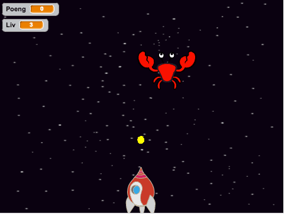
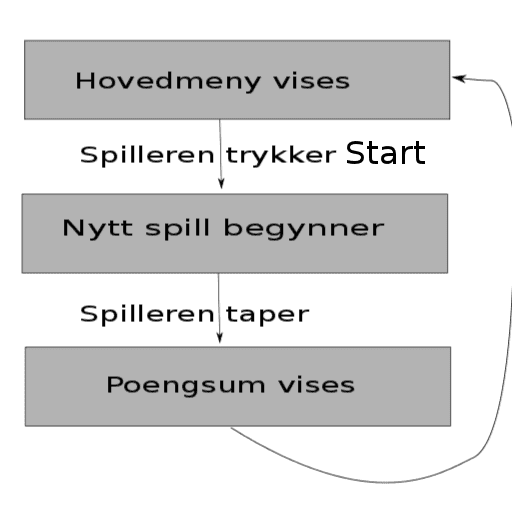

# Introduksjon {.intro}

I staden for å lage eit spel frå grunnen av går denne oppgåva ut på å remikse
eit eksisterande spel. Me skal lære korleis me kan gjere eit spel meir komplett,
mellom anna ved å leggje til ein meny som styrer spelflyten og som let oss spele
fleire gonger. Spelet me skal remikse heiter Krabbeangrep, og går ut på at
spelaren styrer ein kanon som skal forsvare jorda mot eit intergalaktisk
krabbeangrep. Kanonen skyt kuler som tek knekken på krabbene og spelaren får
poeng når den treff.



# Steg 1: Bli kjent med spelet {.activity}

*Før me startar å kode noko som helst skal me bli kjent med spelet som det er.*

## Sjekkliste {.check}

- [ ] Gå inn på <http://scratch.mit.edu/users/gubbisduff/> og klikk på
  prosjektet `Krabbeangrep!`. Vel `Sjå inni`{.blocksensing}.

- [ ] Trykk på knappen der det står `Remiks` øvst i høgre hjørne. No har du ein
  kopi av spelet på din eigen brukar som du kan gjere kva du vil med utan at du
  endrar originalen.

- [ ] Bruk nokre minutt på å sjå gjennom alle skripta i prosjektet. Les gjennom
  alle kommentarane og ver heilt sikker på at du har forstått korleis spelet
  fungerer før du går vidare; spør gjerne om hjelp!

## Test prosjektet {.flag}

__Klikk på det grøne flagget.__

- [ ] Prøv spelet ein gong eller to for å bli betre kjent med korleis det
  fungerer.


# Steg 2: Me lagar ein meny, del I {.activity}

*No skal me lage ein meny som dukkar opp når spelet startar og når spelet er
slutt. Menyen skal i fyrste omgang vere veldig enkel, den skal berre ha ein
startknapp.*

Sjå nøye på skissa under før du går vidare. Her ser du korleis flyten i spelet
skal vere. Flyten i spelet skal styrast gjennom meldingar som blir sendt mellom
figurane. Flyten i spelet skal bli styrt gjennom meldingar som sendast mellom
figurane. Kvar gong noko nytt skal skje, til dømes at eit nytt spel skal starte
eller at menyen skal visast etter at spelet er tapt, så skal det sendast ei
melding.



## Sjekkliste {.check}

- [ ] Fyrst må du lage ein figur som skal fungere som startknapp. Denne kan du
  teikne sjølv ved å klikke på  i
  figurområdet. Eit enkelt rektangel med teksten `Start` inni burde gjere susen.
  Gi den namnet `Startknapp`.

- [ ] Me må lage ein bakgrunn som kan fungere som hovudmeny. Trykk på scena og
  vel `Bakgrunnar`. Lag ein kopi av bakgrunnen `Rommet` ved å høgreklikke og
  trykkje på `lag ein kopi`. Pynt litt på den med tekst og eventuelle andre ting
  du måtte ynskje slik at ein ser at det er ein hovudmeny. Gi den namnet
  `Hovudmeny`.


# Steg 3: Me lagar ein meny, del II {.activity}

*Som spelet er no så startar det når ein trykkar på det grøne flagget. No vil
 me at hovudmenyen skal dukke opp når me trykkar på det grøne flagget, og at
 spelet skal starte når ein trykkar på Startknapp-figuren.*

### Sjå mottakarar {.protip}

Du kan sjekke kven som mottek ei bestemt melding ved å høgreklikke på ein
meldingskloss og klikke på `vis sendarar` og `vis mottakarar`. Då vil dei som
sender/mottek akkurat den meldinga få ei ramme rundt seg i figurområdet.

## Sjekkliste {.check}

- [ ] Endre på skripta i scena slik at du har følgjande skript:

  ```blocks
  når @greenFlag vert trykt på
  send meldinga [hovudmeny v]

  når eg får meldinga [hovudmeny v]
  bytt bakgrunn til [Hovudmeny v]
  ```

- [ ] Gi startknappen dei følgjande skripta (de to første syt for at knappen
  oppfører seg riktig i starten av spelet, og det siste syt for at startknappen
  faktisk er ein startknapp):

  ```blocks
  når @greenFlag vert trykt på
  gøym

  når eg får meldinga [hovudmeny v]
  gå til x: (0) y: (0)
  vis

  når denne figuren vert trykt på
  send meldinga [nytt spel v]
  ```

- [ ] No må me syte for at reisten av figurane oppfører seg som me vil både når
  flagget klikkast, når hovudmenyen skal visast og når startknappen blir klikka!
  Det tyder at me må ha mange små skript som lyttar etter desse meldingane
  (skript som startar med klossane under `Hendingar`{.blockevents}). Me skal
  ikkje skrive nøyaktig korleis desse skripta skal sjå ut, det skal du klare
  sjølv, men her er det som må med:

- [ ] Både romskipet, romvesenet og godbiten må gjere følgjande: figuren blir
  gøymt når ein trykkar flagget, og figuren går inn i *hovudløkka* si når `nytt
  spel` blir motteke. Kva som er *hovudløkka* til ein figur står tydeleg skrive
  i kommentarane.

- [ ] Startknappen må gøymast når `nytt spel` blir motteke.

- [ ] Scena må skifte bakgrunn til `Rommet` når `nytt spel` blir motteke.

## Test prosjektet {.flag}

__Klikk på det grøne flagget.__

- [ ] Gøymast alle figurane utanom startknappen når hovudmenyen blir vist?

- [ ] Startar spelet som det skal når startknappen blir trykka på?

## Lagre prosjektet {.save}

No er me ferdig med å fortelje deg kva du skal gjere. Reisten av tida kan du
bruke på ein eller fleire av utfordringane under.

## Utfordring: Vis poengsummen når spelet er ferdig {.challenge}

No som spelet har ein god start kan du prøve å gi det ein god slutt òg. I denne
utfordringa er målet å gjere det siste steget i spelflyt-teikninga over. Du legg
kanskje merke til at scena har eit skript som startar med `Når eg får meldinga
treff`{.blockevents}, og at her blir meldinga `tapte` sendt viss spelaren ikkje
har fleire liv att? Det er ingen som mottek denne meldinga! Gi dei andre
figurane skript som reagerer på denne meldinga. Ein av figurane kan til dømes
seie kor mange poeng spelaren fekk i nokre sekund og så kan spelet gå attende
til hovudmenyen.

## Utfordring: Lag fleire typer angriparar {.challenge}

Spelet heiter Krabbeangrep, men det kan jo vere andre romvesen som vil angripe
jorda! Du kan gi Romvesen-figuren fleire drakter som tilsvarar andre typer
angriparar. Klarar du å gjere det slik at ein får høgare poengsum om ein skyt
nokre romvesen enn for andre? Då må du gjere endringar i skriptet til scena som
lyttar etter meldinga `treff!`. Du kan òg gi Godbit-figuren fleire drakter som
ein får fleire poeng for å samle.

## Utfordring: Fleire element i menyen {.challenge}

Kva med å leggje til fleire knappar i menyen? Kanskje ein knapp som heiter
`Hjelp` du kan klikke for å kome til ein ny bakgrunn der det står korleis du
spelar spelet? Her må du hugse at du legg til ein `attende`-knapp slik at det
går an å kome seg attende til hovudmenyen etter at ein har lært korleis spelet
fungerer.

## Utfordring: Gjer spelet vanskelegare {.challenge}

Akkurat no er spelet ganske enkelt. Prøv å la krabbene dale nedover skjeren
raskare og raskare etter kvart som ein har treft fleire av dei. Her kan det vere
lurt å lage ein variabel som heiter `hastigheit`{.blockdata} og bruke den i
hovudløkka til Romvesen-figuren. Så kan du til dømes bruke ein `endre hastighet
med 1`{.blockdata}-kloss når eit romvesen blir treft.
