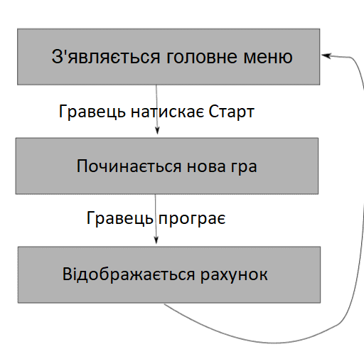

# Вступ {.intro}

Цього тижня ми зробимо дещо інше. Замість того, щоб створювати гру з нуля, ми будемо реміксувати вже існуючу гру. 
Ми дізнаємося, як зробити гру більш завершеною, зокрема, додавши меню, яке контролює хід гри і дозволяє грати кілька разів. 
Гра, яку ми будемо реміксувати, називається Crab Attack! і в ній гравець керує гарматою, 
щоб захистити Землю від міжгалактичної атаки крабів! Гармата стріляє кулями, які вбивають крабів, і заробляє очки, коли влучає.


# Крок 1: Ознайомтеся з грою {.activity}

*Перш ніж почати щось кодувати, нам потрібно ознайомитися з грою як такою.*

## Контрольний список {.check}

- [ ] Зайдіть на сайт <https://scratch.mit.edu/projects/1176519613/> 
Ви також можете подивитись на оригінальну бібліотеку ігор автора за посиланням:<http://scratch.mit.edu/users/gubbisduff/>)

- [ ] натисніть кнопку з написом `Ремікс` у верхньому правому куті. 
Тепер у вас є копія гри на власному користувацькому ресурсі, з якою ви можете робити все, що завгодно, не змінюючи оригінал. 

- [ ] Натисніть на кнопку `Переглянути код`{.blocksensing}

- [ ] Витратьте кілька хвилин, щоб переглянути всі скрипти в проєкті. Прочитайте всі коментарі і переконайтеся, 
  що ви розумієте, як працює гра, перш ніж рухатися далі; не соромтеся звертатися за допомогою!

## Тестування проєкту {.flag}

__Натисніть на зелений прапорець.__

- [ ] Спробуйте пограти раз чи два, щоб зрозуміти, як гра працює.


# Крок 2: Складаємо меню, частина перша {.activity}

*Зараз ми створимо меню, яке з'являтиметься при запуску та завершенні гри.
 Спочатку меню має бути дуже простим, все, що там має бути - це кнопка запуску.*

Уважно подивіться на схему нижче, перш ніж продовжувати. Тут ви можете побачити, яким має бути хід гри.
Перебіг гри повинен контролюватися за допомогою повідомлень, що надсилаються між персонажами. 
Щоразу, коли відбувається щось нове, наприклад, початок нової гри або відображення меню після програшу,
надсилається повідомлення.



## Контрольний список {.check}

- [ ] По-перше, вам потрібно створити фігуру, яка буде виконувати роль кнопки запуску. 
  Ви можете намалювати її самостійно, натиснувши кнопку  в області фігури. 
  Простий прямокутник з текстом `Старт` всередині має бути достатньою місця. Назвіть цю кнопку `кнопка Старт`.

- [ ] Нам також потрібно створити тло, яке буде виконувати роль головного меню. Натисніть на сцену і виберіть `Тло`.
 Зробіть копію фону `Rommet`, клацнувши правою кнопкою миші і вибравши `дублювати`. 
Прикрасьте його текстом або чимось іншим, щоб було зрозуміло, що це головне меню. Назвіть його `Головне меню`.

# Крок 3: Створюємо меню, частина друга {.activity}

*Наразі гра запускається, коли ви натискаєте на зелений прапорець. 
Тепер ми хочемо, щоб при натисканні на зелений прапорець з'являлося головне меню,
 а гра починалася при натисканні на малюнок кнопки Старт.*

### Переглянути одержувачів {.protip}

Ви можете перевірити, хто отримує певне повідомлення, клацнувши правою кнопкою миші на блоці повідомлень і вибравши опції `Показати відправників` 
і `Показати одержувачів`. Ті, хто відправив/отримав це повідомлення, будуть обведені рамкою в області малюнка.

## Контрольний список {.check}

- [ ] Змініть скрипти у сцені, щоб отримати наступний скрипт:

  ```blocks
  коил @greenFlag натиснуто
  оповістити [Головне меню v]

  коли я отримую [Головне меню v]
  змінити тло на [Головне меню v]
  ```

- [ ] Надайте кнопці Старт такі скрипти (перші два забезпечують правильну роботу кнопки на початку гри,  
  а останній гарантує, що кнопка Старт справді є кнопкою Старт):

  ```blocks
  коил @greenFlag натиснуто
  сховати
  
  коли я отримую [Головне меню v]
  перемістити в x: (0) y: (0)
  показати

  коли спрайт натиснуто
  оповістити [нова гра v]
  ```

- [ ] Тепер нам потрібно переконатися, що решта форм поводяться так, як ми хочемо,
   коли ми клацаємо прапорець, коли відображається головне меню і коли натискається кнопка «Старт»! 
   Це означає, що нам потрібно багато маленьких скриптів, які прослуховують ці повідомлення 
   (скрипти, які починаються з блоків у розділі «Події»). Ми не будемо розписувати, як саме мають виглядати ці скрипти, 
   вам доведеться зробити це самостійно, але ось що має бути в них включено:


- [ ] І космічний корабель, і інопланетянин, і частування повинні робити наступне: 
  персонаж ховається при натисканні на прапорець і входить в *основний цикл* при отриманні повідомлення `нова гра`. 
  Що таке *основний цикл* персонажа чітко вказано в коментарях.

- [ ] Кнопка Старт повинна бути прихована при отриманні `нова гра`.

- [ ] Сцена повинна змінювати фон на `Rommet` при отриманні `нова гра`.

## Тестування проєкту {.flag}

__Натисніть на зелений прапорець.__

- [ ] Чи всі фігури, крім кнопки Старт, приховані, коли відображається головне меню?

- [ ] Чи запускається гра належним чином після натискання кнопки Старт?

## Збережіть свій проєкт {.save}

На цьому ми закінчили розповідати вам, що робити.
Решту часу ви можете присвятити одному або декільком завданням, наведеним нижче.

## Виклик: Покажіть рахунок після завершення гри {.challenge}

 Тепер, коли гра має гарний початок, ви можете спробувати дати їй гарний кінець. 
 У цьому завданні метою є завершення останнього кроку на діаграмі потоку гри, наведеній вище. 
 Ви можете помітити, що сцена має сценарій, який починається з `Коли я отримую влучання`{.blockevents},
 і що тут надсилається повідомлення `втрачено`, якщо у гравця не залишилося більше життів? 
 Ніхто не отримає цього повідомлення! Дайте іншим персонажам сценарії, які реагують на це повідомлення. 
 Наприклад, один з персонажів може сказати, скільки очок набрав гравець протягом декількох секунд,
 а потім гра може повернутися до головного меню.

## Виклик: Створіть кілька типів нападників {.challenge}

Гра називається «Атака крабів», але можуть бути й інші інопланетяни, які захочуть напасти на Землю!
Ви можете дати своєму інопланетному персонажу кілька образів, які відповідають іншим типам нападників. 
Чи зможете ви зробити так, щоб стрілянина в одних інопланетян приносила вам більше очок, ніж в інших?
Тоді вам потрібно внести зміни в сценарій сцени, яка прослуховує повідомлення про `влучання!` 
Ви також можете дати персонажу Нагорода більше образів, за збір яких ви отримаєте більше балів.

## Виклик: Більше пунктів у меню {.challenge}

Як щодо того, щоб додати більше кнопок у меню? Можливо, 
кнопку `Допомога`, яка при натисканні переносить вас на заставку з інструкціями про те, 
як грати в гру? Не забудьте додати кнопку `Назад`, 
щоб ви могли повернутися до меню після того, як вивчите гру.

## Виклик: Ускладнити гру {.challenge}

Зараз гра досить проста. Спробуйте зробити так, щоб краби падали вниз по екрану все швидше і швидше,
коли ви стріляєте в них. Можливо, ви захочете створити змінну під назвою `швидкість` і використовувати
її в головному циклі інопланетного персонажа. Тоді ви зможете, наприклад, `змінювати швидкість на 1`{.blockdata},
коли інопланетянин потрапляє в нього.


