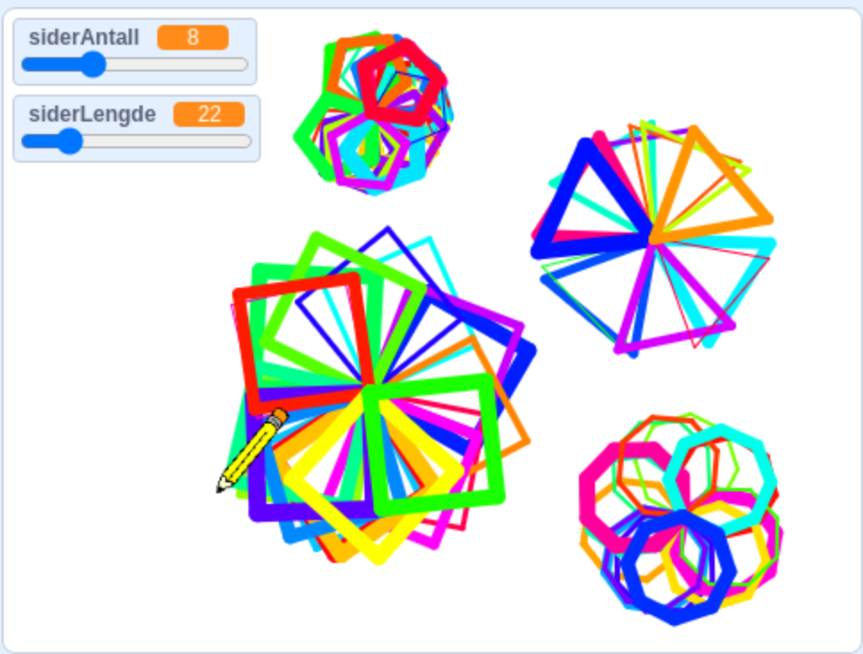

# Вступ {.intro}

У цьому завданні ми навчимося створювати стильні роботи, використовуючи геометричні фігури, випадковість та функції.



# Крок 1: Готуємо олівець {.activity}

Спочатку ми налаштовуємо "нудні" речі, щоб потім програма працювала належним чином.

## Контрольний список {.check}

- [ ] Видалити символ кота

- [ ] Вставте фігуру `Pencil`

- [ ] Перейдіть на вкладку "Образи", і перемістіть олівець так, щоб кінчик олівця вказував на центральну точку.
      
- [ ] Поверніться на вкладку "Код".

- [ ] Додайте бібліотеку олівця, натиснувши синій значок "+" у лівому нижньому кутку екрана та вибравши "Олівець"

- [ ] Отримайте блок, `коли зелений прапорець натиснуто`{.blockevents} і надішліть `оповістити [повідомлення1]`{.blockevents}, а потім об'єднайте їх разом.

- [ ] Натисніть маленьку білу стрілку поруч із "повідомлення1", , виберіть «нове повідомлення» та назвіть його "готовий":

```blocks
коли grønt flagg натиснуто
оповістит [готовий v]
```

- [ ] Тепер ми створимо нову послідовність, яка підготує нашого персонажа до малювання:

```blocks
коли я отримую [готовий v]
стиль обертання [не обертати v]
сховати
підняти олівець
очистити все
показати
оповістити [завершено v]
```

- [ ] Наприкінці цього кроку ми створюємо невелику послідовність, яка наказує персонажу слідувати за вказівником миші або нашим пальцем, коли ми рухаємо його по екрану:

```blocks
коли я отримую [завершино v]
завжди
перейти до [вказівник v]
```

## Тестування проєкту {.flag}

**Натисніть на зелений прапор.**

- [ ] Тепер ви побачите, що наш персонаж слідує за вказівником миші або пальцем, коли ви переміщуєте його по сцені.

- [ ] Ви розумієте, чому це відбувається?

# Крок 2: Створюйте мистецтво (ПК){.activity}

## ПК чи планшет?{.protip}

На цьому кроці ви знайдете інструкції як для пристроїв із зовнішньою мишею, так і для пристроїв із сенсорним екраном. Переконайтеся, що ви вибрали правильну інструкцію для пристрою, який ви використовуєте, наприклад, iPad або ПК.

Тепер давайте складемо код, який дозволить нам малювати геометричні фігури! Ми почнемо з простої версії, а потім зробимо код більш просунутим у кроці 3.

## Інструкція для ПК: {.check}

- [ ] Пропустіть цей крок, якщо ви використовуєте пристрій із сенсорним екраном, наприклад, iPad або подібний.

- [ ] Ми хочемо, щоб фігура починала малюватися, коли ми натискаємо ліву кнопку миші. Тому ми встановили таку послідовність:

```blocks
коли спрайт натиснуто
зупинити [інші скрипти цього спрайту v]
опустити олівець
повернути в напрямку (90)
повторити (4)
перемістити на (100) кроків
поворот на høyre (90) градусів
end
підняти олівець
оповістити [завершино v]
```

## Test prosjektet - for PC{.flag}

**Klikk på det grønne flagget.**

- [ ] Trykk et tilfeldig sted på scena. Ser du et kvadrat? Forsøk å trykke flere steder etter hverandre. Hva skjer?

- [ ] Nå får vi riktignok bare tegnet én type figur. Forstår du hvorfor? I neste avsnitt skal vi lære å lage flere figurer!

# Steg 2: Lag kunst! (nettbrett){.activity}

## Instruksjoner for nettbrett {.check}

Siden berøringsenheter som iPad ikke har musepeker, må vi lage en litt annen løsning.

- [ ] Dersom du har en PC/Mac med mus, kan du gå videre til Steg 3.

- [ ] Først må vi lage oss en knapp vi kan trykke på. Sett inn en ny figur fra galleriet, for eksempel `Button1`, og skriv denne koden:

```blocks
Når grønt flagg klikkes
gå til x: (180) y: (-150)

Når denne figuren klikkes
send melding [start v]
```

- [ ] Bytt tilbake til Blyant-figuren og skriv denne koden:

```blocks
Når jeg mottar [start v]
stopp [andre skript i figuren v]
penn på
pek i retning (90)
gjenta (4) ganger
gå (100) steg
vend høyre (90) grader
end
penn av
send melding [ferdig v]
```

## Test prosjektet - for nettbrett {.flag}

**Klikk på det grønne flagget.**

- [ ] Trykk et tilfeldig sted på scena

- [ ] Trykk på knappen vi satte inn

- [ ] Dukker det opp en figur der du trykket?

- [ ] Trykk flere steder på skjermen, etterfulgt av et trykk på knappen. Hva skjer?

- [ ] Nå får vi riktignok bare tegnet én type figur. Forstår du hvorfor? I neste avsnitt skal vi lære å lage flere figurer!

# Steg 3: Flere geometriske figurer {.activity}

I dette steget skal vi lære hvordan vi kan lage både trekanter, firkanter og femkanter til kunstverket vårt.

**OBS! I dette steget trenger du ikke legge til nye kodeblokker. Vi skal kun endre på verdiene til noen av blokkene vi allerede har!**

## Vi lager flere geometriske figurer {.check}

- [ ] Hemmeligheten bak å lage ulike geometriske figurer ligger i denne lille sekvensen fra Steg 2:

```blocks
gjenta (4) ganger
gå (100) steg
vend høyre (90) grader
end
```

- [ ] Nøkkelen er _forholdet_ mellom antall ganger `gjenta`{.blockcontrol}-løkken kjøres, og hvor mange grader figuren skal snu.

## Vinkelsummer{.protip}

Du vet kanskje at ulike figurer har ulike vinkelsummer. I matematikken lærer vi at en trekant har vinkelsum 180 grader, firkanter 360 grader, femkanter 540 grader, osv.

Dette er riktig dersom man måler innvendige vinkler i figuren. Men for at dette skal bli riktig på en datamaskin, må vi forholde oss til utsiden av vinklene, altså nabovinkelen til de vi vanligvis måler i matematikken.

Du vet kanskje at summen av to nabovinkler alltid er 180 grader. Det betyr at når vi sier at alle vinklene i en likesidet trekant er 60 grader, må vi bruke nabovinkelen 120 grader når vi skal be datamaskinen tegne en likesidet trekant. For en rettvinklet firkant blir nabovinkelen uansett 90 grader. For en femkant er nabovinkelen 72 grader, osv.

Når vi beregner utvendige vinkler på regulære geometriske figurer, blir vinkelsummen alltid 360 grader! Forstår du hvorfor?

- [ ] Målet er at produktet av antall repetisjoner multiplisert med antall grader, skal bli 360 grader. Da kan vi tenke oss at antall repetisjoner (`gjenta (3) ganger`{.blockcontrol}) forteller oss hvor mange kanter figuren vår får, mens antall `grader`{.blockmotion} må justeres slik at produktet blir 360 grader. `gå () steg`{.blockmotion} angir kun hvor lange sidene i figuren blir:

```blocks
gjenta (3) ganger
gå (100) steg
vend høyre (120) grader
end
```

## Hvordan finne utvendig vinkel raskt{.protip}

Trenger du å finne ut hvor stor den utvendige vinkelen må være for en gitt mangekant, finner du det ved å dele 360 på antall sider i figuren:

360 : 3 = 120

360 : 4 = 90

360 : 5 = 72

osv.

## Test prosjektet {.flag}

**Klikk på det grønne flagget.**

- [ ] Endre verdiene i koden din, slik at du kan tegne trekanter og femkanter.

- [ ] Kjør koden, og se hva som skjer nå!

- [ ] Forstår du hvorfor dette skjer?

# Steg 4: Funksjoner og variabler {.activity}

Nå som vi har fungerende kode som lar oss tegne ulike figurer, kan vi se på hvordan vi kan rydde litt i koden for å gjøre den enda litt bedre, og spare oss for jobb senere! Dette gjør vi ved å først lage en `funksjon`{.blockmoreblocks} som automatiserer en del av jobben for oss. I Scratch kalles `funksjoner`{.blockmoreblocks} "`Mine klosser`{.blockmoreblocks}", så vi finner den første klossen vi trenger der.

## Lag en funksjon {.check}

- [ ] Gå til kategorien `Mine klosser`{.blockmoreblocks}, og trykk "Lag en kloss".

- [ ] Her får du opp en meny som lar deg bestemme hva funksjonen skal hete, og hvilke _parametre_ den skal ha.
- [ ] Vi kaller klossen "mangekant" og legger til to felt for "tall eller tekst".
- [ ] Det første feltet kaller vi "kanter", det andre kaller vi "sidelengde".
- [ ] Når du er ferdig, får du en ny kloss på arbeidsflaten din, og en ny kloss under `Mine klosser`{.blockmoreblocks}:

```blocks
definer mangekant (kanter) (sidelengde)

mangekant (kanter) (sidelengde)

```

## Vi endrer koden vår {.check}

**Dette steget kan være litt vanskelig. Sørg for å ha tunga rett i munnen, og les instruksjonene nøye.**
Vi skal nå bygge om koden vår, slik at vi enkelt kan bytte mellom tre-, fire- og femkanter, hele veien opp til sirkler, uten å måtte regne ut vinkler på egenhånd!

- [ ] Først skal vi definere funksjonen vår. De rosa variablene (kanter) og (sidelengde) hentes rett ut fra defineringsblokken øverst, og settes inn i koden som vanlige variabler:

```blocks
definer mangekant (kanter) (sidelengde)
gjenta (kanter) ganger
gå (sidelengde) steg
vend høyre ((180) -  ((((kanter) - (2)) * (180)) / (kanter))) grader
end

mangekant (kanter) (sidelengde)

```

- [ ] Nå skal vi endre på sekvensen som starter `Når denne figuren klikkes`{.blockevents} om man bruker mus, eller `Når jeg mottar start`{.blockevents} om man bruker berøringsskjerm, slik at vi bruker `mangekant`{.blockmoreblocks}-funksjonen i stedet.

## Viktig info {.protip}

Koden for mus og berøringsskjerm er lik herfra og ut, den eneste forskjellen er hendelsen som starter skriptet som lager tegningen. For mus er det `Når denne figuren klikkes`{.blockevents}, for berøringsskjerm er det `Når jeg mottar [start]`{.blockevents}

- [ ] Først må vi fjerne `gjenta`{.blockcontrol}-løkken fra sekvensen, slik at vi sitter igjen med

```blocks
Når denne figuren klikkes
stopp [andre skript i figuren v]
penn på
pek i retning (90)
penn av
send melding [ferdig v]

```

- [ ] Så setter vi inn `mangekant`{.blockmoreblocks}-blokken der gjenta-løkka var:

```blocks
Når denne figuren klikkes
stopp [andre skript i figuren v]
penn på
pek i retning (90)
mangekant () ()
penn av
send melding [ferdig v]

```

#### Feil farge på klossene? {.protip}

`Mangekant`{.blockmoreblocks}-blokken vises med rød farge i koden over, men det er av tekniske årsaker i verktøyet vi skriver oppgaven med. Du kan se bort fra feil farger på klossene i denne delen av oppgaven.

Du kan nå fylle inn hvor mange kanter du vil at figuren skal ha, og hvor lange de skal være i funksjonsblokken

- [ ] Hvis vi vil tegne en sekskant med 40 piksler lange sider, fyller vi inn:

```blocks
mangekant (6) (40)
```

## Test koden din {.flag}

- [ ] Fyll inn hvor mange kanter du vil at figuren din skal ha, og hvor lange sidene skal være

- [ ] Trykk på grønt flagg

- [ ] Hvis du bruker mus, trykk et sted på scena der du vil at figuren skal tegnes.

- [ ] Hva skjer om du endrer på verdiene i `mangekant`{.blockmoreblocks}?

- [ ] Forstår du hva som skjer?

## Den magiske formelen {.challenge}

Denne formelen er det "magiske" elementet i koden vår:

```blocks
vend høyre ((180) -  ((((kanter) - (2)) * (180)) / (kanter))) grader
```

Denne utregningen finner nemlig vinkelen i en regulær mangekant, kun ved å vite hvor mange kanter figuren består av. Sett inn hvor mange kanter figuren din skal ha (3 for trekant, 4 for firkant, osv) i `kanter`{.blockdata}-variabelen, og regn ut, så finner du alltid riktig vinkel.

Klarer du å finne ut hvorfor det blir slik?

# Steg 5: Litt mer farge og liv! {.activity}

Vi har nå laget et program som lar deg lage mange forskjellige kunstverk ved hjelp av geometriske figurer, men figurene har kanskje litt kjedelige farger?

- [ ] Ved å sette inn

```blocks
sett pennbredde til ()
```

og

```blocks
sett pennens (farge v) til ()
```

etter `penn på`{.blockpen}-klossen, kan du endre på både strekens bredde og farge. Prøv deg frem!

- [ ] Du kan også eksperimentere med klossene

```blocks
endre pennens (farge v) med ()
```

og

```blocks
endre pennens bredde med ()
```

og se hva som skjer da!

- [ ] For å gjøre kunsten enda mer variert, kan du også eksperimentere med å sette inn klossen

```blocks
tilfeldig tall fra () til ()
```

fra `operatorer`{.blockoperators}-kategorien. `Tilfeldig tall`{.blockoperators}-klossen kan settes inn i `pek i retning`{.blockmotion}-klossen, i `mangekant`{.blockmoreblocks}-klossen, og i de ulike `penn`{.blockpen}-klossene for å endre farge og bredde.

## Gjør programmet enda enklere å bruke! {.protip}

For å gjøre programmet enda mer brukervennlig, kan du lage to variabler. La oss kalle dem `sideAntall`{.blockdata} og `sideLengde`{.blockdata}. Sett inn variablene i `mangekant ( ) ( )`{.blockmoreblocks}-klossen. Variablene vil også vises på scena. Trykk og hold på hver av variabel-boblene, slik at du får opp en meny. I denne menyen velger du "skyveknapp". Da kan du enkelt endre på hva slags type mangekant du vil ha, og hvor lange sidene skal være, ved å dra skyveknappen til høyre eller venstre. I menyen kan du også velge å endre verdiområdet for variabelen, sånn at sideAntall begrenses mellom 3 og 20, og sideLengde begrenses mellom 10 og 100, for eksempel.

## Lagre programmet {.save}

Husk å gi programmet ditt et navn, sånn at du lett finner det igjen senere. Når du er ferdig kan du klikke på "Legg
ut"-knappen. Da vil det bli lagt ut på Scratch-hjemmesiden din slik at du enkelt
kan dele det med familien og vennene dine.

