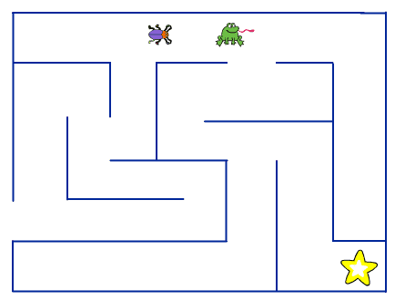

# Om oppgaven {.activity}

I denne oppgaven skal elevene lage et enkelt spill hvor man kontrollerer en
liten utforsker som leter etter skatten gjemt inne i en labyrint.

## Oppgaven passer til: {.check}

 __Fag__: Matematikk, Programmering

__Trinn__: 3.-10. trinn

__Tema__: Løkker, tester, variabler, tilfeldighet

__Tidsbruk__: Dobbelttime eller mer

## Kompetansemål {.challenge}

- [ ] __Matematikk, 5. årstrinn__: lage og programmere algoritmer med bruk av
      variabler, vilkår og løkker

- [ ] __Matematikk, 6. årstrinn__: bruke variabler, løkker, vilkår og
      funksjoner i programmering til å utforske geometriske figurer og mønster

- [ ] __Programmering, valgfag__: bruke grunnleggende prinsipper i programmering
      , slik som variabler, løkker, vilkår og funksjoner, og reflektere over
      bruken av disse

- [ ] __Programmering, valgfag__: analysere problemer, gjøre dem om til
      delproblemer og gjøre rede for hvordan noen av delproblemene kan løses med programmering

## Forslag til læringsmål {.challenge}

- [ ] Elevene kan forklare hvordan løkker, tester og variabler fungerer, og
      hvorfor de er hensiktsmessige å bruke i denne oppgaven.

- [ ] Eleven kan forklare hvordan brukeren kan styre figuren med piltastene, og
      hvordan figuren interagerer med labyrinten.

- [ ] Eleven kan forklare hvordan tilfeldighetsgeneratoren fungerer.

## Forslag til vurderingskriterier {.challenge}

- [ ] Eleven oppnår måloppnåelse ved å fullføre oppgaven slik det er beskrevet.

- [ ] Eleven oppnår høy måloppnåelse ved å legge til flere momenter, og utvikle
      en mer utfordrende labyrint.

- [ ] Dette er en oppgave hvor elevene fint kan prøve hverandres labyrinter og
      vurdere hverandre.

## Forutsetninger og utstyr {.challenge}

- [ ] __Forutsetninger__: Ingen

- [ ] __Utstyr__: Datamaskiner med Scratch installert. Eventuelt kan elevene
      bruke Scratch i nettleseren dersom de har en bruker (eller registrerer
      seg) på [scratch.mit.edu/](http://scratch.mit.edu/){target=_blank}.

## Fremgangsmåte

Her kommer tips, erfaring og utfordringer til de ulike stegene i den faktiske
oppgaven. [Klikk her for å se
oppgaveteksten.](../labyrint/labyrint.html){target=_blank}

# Steg 3: Utforskeren kan ikke gå gjennom veggen {.activity}

- [ ] Et vanlig problem her er at __utforskeren kan gå rett gjennom veggen__.
      Typisk vil dette være fordi man ikke har rett farge i `<berører fargen
      [#cc0000]>`{.b}-klossen. Eventuelt at man har brukt flere farger på
      veggene i labyrinten. Det er viktig at alle veggene er tegnet i samme
      farge.

  Man kan også oppleve at utforskeren går rett gjennom veggen om
  `(hastighet)`{.b} er for høy. Dette er fordi utforskeren _hopper_
  `(hastighet)`{.b} steg hver gang man trykker en piltast, og den kan
  da hoppe over en vegg.

- [ ] Et annet problem er at __utforskeren hopper gjennom vegger når den snur__.
      Alle figurer har et definert senterpunkt som de roterer rundt (se Steg 2 i
      prosjektet [Soloball](../soloball/soloball.html) for et bra eksempel på
      hvordan dette virker). Dersom dette senterpunktet ikke er midt på
      `Utforsker`-figuren vil det se ut som om den hopper rundt når den snur.

- [ ] For å sette senterpunktet riktig kan du klikke på
      `Drakter`-fanen, og `=` ikonet nede til høyre for tegningen for
      å se hele tegningen samtidig. Hvis du ser nøye etter vil
      senteret i tegningen ha et lite blink-ikon i seg. Du må legge
      figuren midt på denne for at figuren skal være på midten.

- [ ] Det kan også forekomme at __det er vanskelig å bevege seg i labyrinten__.
      Om gangene er for smale eller veggene for skrå blir det vanskelig for
      utforskeren og froskekongen å bevege seg. Se
      [nedenfor](#tema-tegne-bakgrunner-i-scratch) for flere tips til hvordan
      man bruker tegneverktøyet effektivt som kan hjelpe elevene.

# Steg 5: Froskekongen vokter i gangene {.activity}

- [ ] Et vanlig problem her kan være at __utforskeren eller froskekongen setter
      seg fast i veggen__. I dette prosjektet har vi fokusert på å holde koden
      så enkel som mulig. Spesielt er koden som passer på at figurene ikke går
      gjennom veggene litt _for enkel_. Noen enkle tips som vil motvirke
      problemet er presentert i tipsboksen nederst i [steg 5 i
      oppgaven](labyrint.html#tips-3).

# Stopp alle {.activity}

Vi bruker klossen `stopp alle`{.b} for å stoppe alle skript i programmet når
froskekongen tar utforskeren. Dette stopper alle skriptene som startet da vi
klikket på det grønne flagget, men det hindrer ikke nye skript å starte. Derfor
kan fortsatt utforskeren flyttes rundt med piltastene etterpå.

Siden oppgaven er et introduksjonsprosjekt er det ikke gjort noe med dette. For
elever som har lyst å prøve seg på en løsning kan du foreslå følgende:

- [ ] Lag en `game_over`-variabel som er satt til `false` eller `0` mens spillet
  pågår, som sjekkes hver gang spilleren trykker en piltast, før utforskeren
  flytter seg. Sett variabelen til `true` eller `1` når spillet er over.

- [ ] En mer vanlig (og bedre) løsning er å bruke en `for alltid`-løkke med
  `hvis ... trykket?`-klosser. Disse blir da stoppet av `stopp alle`-klossen.

## Variasjoner {.challenge}

- [ ] Dette er et introduksjonsprosjekt, og elevene ledes derfor ganske
detaljert gjennom hvordan spillet skal programmeres. Det er likevel rom for en
del kreativitet. Elevene kan gjerne oppfordres til å

  - [ ] __velge sine egne figurer__. De kan fritt velge figurene som brukes
    for `Utforsker`, `Skatt` og `Froskekonge` uten at det har noen
    effekt på programmeringen.

  - [ ] __tegne sin helt egne labyrint__. I oppgaven vises et eksempel
    (eller to om man også ser på tegningen først i oppgaven) på en
    labyrint, men elevene kan gjerne tegne denne annerledes. Be gjerne
    elevene likevel tenke på at det skal være enkelt for utforskeren og
    froskekongen å bevege seg rundt, slik at de bør ha rette vegger og
    brede nok ganger.

  - [ ] __eksperimentere med hastighet__. I
    [steg 1 i oppgaven](labyrint.html#steg-1-hvordan-styre-figurer-med-piltastene)
    vises det hvordan man lett kan endre hvor raskt en figur flytter seg
    ved å bruke en `(hastighet)`-variabel. La elevene eksperimentere med
    denne og `(hastighet)`-variabelen for froskekongen, og spør dem
    hvordan det forandrer vanskelighetsgraden i spillet.

- [ ] Om elevene allerede er komfortable med Scratch kan du benytte anledningen
til å snakke om hvordan tegneverktøyet i Scratch fungerer og gi dem noen tips
til hvordan man bruker det effektivt.

- [ ] For de mer avanserte elevene kan du også vise frem følgende kode som gjør
en bedre sjekk av kollisjon med veggen.
