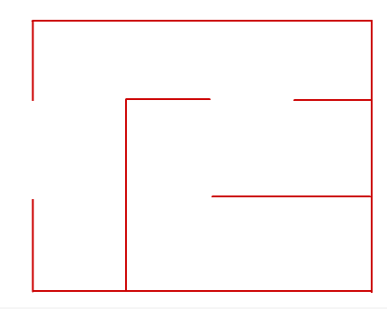

# Вступ {.intro}

У цій грі ми будемо керувати маленькою дослідницею, яка шукає скарб, захований у лабіринті. На жаль, скарб охороняє страшний жаб'ячий король. Ми навчимося керувати персонажами та програмувати їхні рухи.


# Крок 1: Як керувати фігурами за допомогою клавіш зі стрілками {.activity}

*Ми почнемо з того, як керувати фігурами за допомогою клавіш зі стрілками. Для цього ми будемо використовувати блоки
 `Події`{.blockevents}, які відмічатимуть натискання клавіш на клавіатурі.*

## Контрольний список {.check}

- [ ] Розпочати новий проєкт.

- [ ] Видаліть символ кота, клацнувши на ньому правою кнопкою миші та вибравши `вилучити`.

- [ ] Додайте нового персонажа. Натисніть кнопку і виберіть персонажа, якого хочете переміщати. Ми використали персонажа Тварини/Beetle.

- [ ] Назвіть новий символ `Дослідниця`: торкніться поля імені над символом і введіть нове ім'я.

  Почнемо з того, що дозволимо фігурі рухатися вгору по екрану, коли натискаємо клавішу `стрілка вгору`.

- [ ] Додайте наступний сценарій до вашої фігури `Дослідниці`.

  ```blocks
  коли клавішу [стрілка вгору v] натиснуто
  повернути в напрямку (0 v)
  перемістити на (5) кроків
  ```

  Спробуйте натиснути клавішу `стрілка вгору`. Ваш провідник рухається вгору по екрану? Тепер нам потрібно створити подібні скрипти для інших клавіш.

- [ ] Додайте ці сценарії, щоб `Дослідник` мав загалом чотири сценарії, по одному для кожної клавіші.

  ```blocks
  коли клавішу [стрілку вниз v] натиснуто
  повернути в напрямку (180 v)
  перемістити на  (5) кроків

  коли клавішу [стрілка праворуч v] натиснуто
  повернути в напрямку (90 v)
  перемістити на (5) кроків

  коли клавішу [стрілка ліворуч v] натиснуто
  повернути в напрямку (-90 v)
  перемістити на (5) кроків
  ```

## Перевірте проєкт {.flag}

__Натисніть на зелений прапорець.__

- [ ] Чи пересувається ваша дослідниця так, як ви очікували?

- [ ] Чи можна змінити швидкість руху дослідниці?

Цифра 5 в `перемістити на (5) кроків`{.b} визначає швидкість пересування дослідниці. Ми хотіли б трохи  поекспериментувати, щоб побачити, яка швидкість найкраще працює в нашій грі, але щоб змінити швидкість, ми повинні змінити число в чотирьох різних скриптах. Це було б занадто багато роботи!

## Контрольний список {.check}

Замість цього ми використаємо __змінну__, яка може керувати швидкістю руху символу
`Дослідниці`.

- [ ] Створіть нову змінну, перейшовши на вкладку `Змінні`{.blockdata}і натиснувши кнопку `Створити змінну`.

- [ ] Викличте змінну `швидкість ` і виберіть, щоб вона застосовувалася `Тільки для цього спрайту`.

- [ ] Нарешті, зніміть галочку поруч з
  `(швидкість)`{.b} щоб змінна не з'являлася на сцені.

- [ ] Спочатку створіть новий скрипт, який встановлює значення
`(швидкість)`{.b} рівним `10.

  ```blocks
  коли @greenFlag натиснуто
  надати [швидкість v] значення [10]
  ```

- [ ] Далі ми змінимо чотири сценарії, які ми вже створили, щоб використовувати `(швидкість)`{.b}.

  ```blocks
  коли клавішу [стрілка вгору v] натиснуто
  повернути в напрямку (0 v)
  перемістити на (швидкість) кроків

  коли клавішу [стрілка вниз v] натиснуто
  перемістити в напрямку (180 v)
  перемістити на (швидкість) кроків

  коли клавішу [стрілка праворуч v] натиснуто
  повернути в напрямку (90 v)
  перемістити на (швидкість) кроків

  коли клавішу [стрілка ліворуч v] натиснуто
  повернути в напрямку (-90 v)
  перемістити на (швидкість) кроків
  ```

## Перевірте проєкт {.flag}

__Натисніть на зелений прапорець.__

- [ ] Чи пересувається ваш експлорер так само, як і раніше?
- [ ] Чи змінюється швидкість дослідниці, якщо змінити значення параметра
  `(швидкість)`{.b}  і знову клацнути зелений прапорець?

- [ ] Виберіть швидкість, яка вам підходить.


# Крок 2: Малюємо власний лабіринт {.activity}

*Тепер, коли ми можемо переміщати нашу дослідницю по екрану, давайте кинемо їй виклик! Ми намалюємо лабіринт, яким вона має рухатися.*

## Контрольний список {.check}

- [ ] Торкніться `Обрати тло`
   Виберіть фігуру з бібліотеки в правому нижньому куті екрана, а потім торкніться пензля, який з'явиться, щоб намалювати нове тло. Переконайтеся, що ви малюєте саме нове
  __тло__, а не нового персонажа.

- [ ] Назвіть новий фон `Лабіринт`.

- [ ] Виберіть колір, який вам подобається, і намалюйте невеликий лабіринт. Важливо, щоб усі стіни лабіринту були одного кольору (скоро ми дізнаємося чому). Ви можете вибрати, як виглядатиме лабіринт, він навіть не обов'язково повинен мати прямі стіни!

  

  Це приклад невеликого і простого лабіринту. Ви можете вибрати, як ви хочете, щоб ваш лабіринт виглядав! Але не витрачайте занадто багато часу на малювання лабіринту зараз, тому що ми продовжимо його програмувати. Натомість ви можете повернутися і намалювати більш складний лабіринт після того, як закінчите гру!

## Поради та підказки {.protip}

Якщо ви хочете намалювати прямі стіни, найпростіше скористатися інструментом, . Ви також можете утримувати клавішу `Shift`, щоб зробити лінії ідеально прямими.

## Перевірте проєкт {.flag}

__Натисніть на зелений прапорець.__

- [ ] Чи можете ви переміщати фігурку дослідниці всередині лабіринту?

- [ ] Якщо фігура занадто велика, ви можете зменшити її розмір, натиснувши на фігуру, а потім зменшивши число у полі `Розмір`.

- [ ] Що станеться, якщо ваш персонаж вдариться об стіну в лабіринті?
      
# Крок 3: Дослідниця не може пройти крізь стіну {.activity}

*Навіть якщо ми спроектували гарний лабіринт, дослідниці на нього начхати. Він може просто пройти крізь стіни. Зараз ми з цим щось зробимо.*

## Контрольний список {.check}

Щоб визначити, коли наш персонаж `Дослідниця`проходить крізь стіну лабіринту, ми будемо використовувати `<торкається кольору  [#ffffff] ?>`{.b}.
Цей блок визначає, чи торкається персонаж певного кольору. Тут важливо, що ми намалювали всі стіни лабіринту одним кольором.

- [ ] Ми додаємо `<торкається кольору [#ffffff]>`{.b} у вже створений скрипт, який задає `(швидкість)`{.b}.

  ```blocks
  коли @greenFlag натиснуто
  надати [швидкість v] значення [10]
  завжди
      якщо <торкається кольору [#cc0000]?> то
          поворот @turnRight на (180) градусів
          перемістити на (швидкість) кроків
          повотор @turnRight на (180) градусів
      slutt
  slutt
  ```

- [ ] Щоб отримати правильний колір в `торкається кольору [#cc0000] ?`{.b}
  спочатку клацніть на маленький квадратик, де відображається колір. З'явиться вікно з варіантами кольорів. Під варіантами кольорів є піктограма. Клацніть на іконку, а потім перемістіть вказівник миші так, щоб він вказував на стіну в лабіринті. Це змінить колір у маленькому квадратику. Клацніть ще раз, щоб вибрати цей колір.

## Перевірте проєкт {.flag}

__Натисніть на зелений прапорець.__

- [ ] Чи зупинять дослідника, коли він спробує пройти крізь стіну?

- [ ] Ви розумієте, чому в сценарії сказано, що дослідниця не може пройти крізь стіну?

## Поради та підказки {.protip}

Один із способів обмежити рух персонажа - змусити його зробити крок назад, коли він робить щось не так. У коді

```blocks
  поворот @turnRight на (180) градусів
  перемістити на (швидкість) кроків
  поворот @turnRight на (180) градусів
```

фігура спочатку повністю обернеться (на 180 градусів), потім зробить крок і, нарешті, знову обернеться так, що буде вказувати в тому ж напрямку, що і на початку руху.


# Крок 4: У пошуках скарбу {.activity}

*Тепер ми можемо пересуватися лабіринтом. Але це швидко набридає, якщо в лабіринті немає чим зайнятися. Спробуймо знайти скарб!*

## Контрольний список {.check}

- [ ] Додавання нової фігури. Ви можете вибрати фігуру з бібліотеки, навівши вказівник миші на пункт
   і натиснувши на пензель, що з'явиться, щоб намалювати власну фігуру, або натиснувши на лупу, щоб вибрати вже готову фігуру. 

 . Ми використали символ
  `Усі/Star`.

- [ ] Дайте новій фігурці ім'я `Скарб`.

- [ ] Перетягніть скарб у своєму лабіринті та сховайте його у важкодоступному місці.

Тепер ми створимо код, який визначить, коли дослідник знайде скарб. Тут у нас є вибір:  Ми можемо створити скрипт для `Дослідниці` який перевіряє, чи торкається вона `Скарбу`, або ми можемо зробити навпаки, ми можемо створити скрипт для  `Скарбу` який перевіряє, чи торкається він `Дослідниці`.

- [ ] Переконайтеся, що вибрана фігура `Скарб`  і введіть наступний код:

  ```blocks
  коли @greenFlag натиснуто
  завжди
      якщо <торкається [Дослідниця v]?> то
          сховати
      slutt
  slutt
  ```

## Перевірте проєкт {.flag}

__Натисніть на зелений прапорець.__

- [ ] Чи зникає скарб, коли дослідниця його знаходить?

- [ ] Що станеться, коли ви спробуєте перезапустити гру після того, як знайдете скарб? Куди зник скарб?

## Контрольний список {.check}

У нашій грі виникла проблема. Після того, як дослідниця один раз знайшла скарб, він більше не з'являється.

- [ ] Нам потрібно зробити так, щоб скарб з'являвся на початку гри. Змініть скрипт  `Скарб`, додавши `показати`{.b} на самому початку.

  ```blocks
  коли @greenFlag натиснуто
  показати
  завжди
      якщо <торкається [Дослідниця v]?> то
          сховати
      slutt
  slutt
  ```

У нас ще одна проблема: Коли ми перезапускаємо гру, дослідниця все ще стоїть на тому місці, де вона знайшла скарб минулого разу. Це не дуже захоплююче.

- [ ] Клацніть на символ `Дослідниці`.

- [ ] Додайте `перемістити в x: () y: ()`{.b} відразу після `надати
  [швидкість v] значення (10)`{.b}.

- [ ] Щоб дізнатися, які числа ми хочемо використати для `x` та `y` ми можемо зробити наступне. Перетягніть провідник у потрібне місце, з якого можна почати. Подивіться на числа над списком фігур. Поряд з фігурою `Дослідниці` знаходяться `x` і `y` та два числа. Це положення фігури в даний момент. Введіть ці два числа до поля
`перемістити в x: () y: ()`{.b}-klossen.

- [ ] Тепер весь скрипт буде виглядати так (ваші числа для `x` та `y` будуть відрізнятися):

  ```blocks
  коли @greenFlag натиснуто
  надати [швидкість v] значення [10]
  перемістити в x: (-200) y: (0)
  завжди
      якщо <торкається кольору [#cc0000]?> то
          поворот @turnRight на (180) градусів
          перемістити на (швидкість) кроків
          поворот @turnRight на (180) градусів
      slutt
  slutt
  ```

## Test prosjektet {.flag}

__Klikk på det grønne flagget.__

- [ ] Forsvinner fortsatt skatten når utforskeren finner fram til den?

- [ ] Virker spillet slik det skal når du starter det på nytt etter å ha
  funnet skatten?


# Steg 5: Froskekongen vokter i gangene {.activity}

*Nå skal vi gjøre spillet vanskeligere. Froskekongen vandrer rundt i
 labyrinten og passer på skatten.*

## Sjekkliste {.check}

- [ ] Legg til en ny figur. Vi brukte `Dyr/Frog`. Gi den navnet
  `Froskekonge`.

- [ ] Plasser den nye figuren et sted i labyrinten. Gjør den mindre eller
  større om nødvendig.

Vi begynner med å la `Froskekonge` merke at den fanger utforskeren.
Dette blir veldig likt hvordan `Skatt` merket at den ble funnet.

- [ ] Legg til følgende kode:

  ```blocks
  når @greenFlag klikkes
  gjenta for alltid
      hvis <berører [Utforsker v]?>
          si [Tok deg!] i (1) sekunder
          stopp [alle v] :: control
      slutt
  slutt
  ```

Linjen `stopp [alle v] :: control`{.b} gjør at skriptet på `Skatt`
slutter å kjøre. Det betyr at vi klarer ikke å få tak i skatten etter
at vi har blitt tatt av `Froskekonge`.

## Test prosjektet {.flag}

__Klikk på det grønne flagget.__

- [ ] Hva skjer om utforskeren kommer borti froskekongen?

- [ ] Hva skjer når du finner skatten etter å ha blitt tatt av
  froskekongen?

## Sjekkliste {.check}

Til sist skal vi få froskekongen til å bevege seg rundt i labyrinten.

- [ ] Start et nytt skript på `Froskekonge`-figuren. Igjen kan du bytte ut
  tallene for `x` og `y` med noe som passer for din labyrint.

  ```blocks
  når @greenFlag klikkes
  gå til x: (50) y: (100)
  pek i retning (-90 v)
  ```

- [ ] Før vi lar `Froskekonge` begynne å bevege seg lager vi en
  `(hastighet)`{.b}-variabel også for ham. Klikk på
  `Variabler`{.blockdata}, og deretter `Lag en Variabel`. Kall variabelen
  `hastighet` og la den gjelde kun `For denne figuren`. Tilslutt,
  fjern avhukingen på variabelen.

- [ ] Vi kan nå utvide skriptet slik at froskekongen går fram og
  tilbake. Vi får ham til å snu når han treffer veggen på nesten samme
  måte som vi hindrer utforskeren i å gå gjennom veggen.

  ```blocks
  når @greenFlag klikkes
  gå til x: (50) y: (100)
  pek i retning (-90 v)
  sett [hastighet v] til [5]
  gjenta for alltid
      gå (hastighet) steg
      hvis <berører fargen [#cc0000]?>
          snu @turnRight (180) grader
          gå (hastighet) steg
      slutt
  slutt
  ```

Helt tilslutt kan vi gjøre det enda vanskeligere ved å la froskekongen
av og til endre retning.

- [ ] Legg til kode som lar `Froskekonge` snu seg tilfeldig rundt i labyrinten:

  ```blocks
  når @greenFlag klikkes
  gå til x: (50) y: (100)
  pek i retning (-90 v)
  sett [hastighet v] til [5]
  gjenta for alltid
      gå (hastighet) steg
      hvis <berører fargen [#cc0000]?>
          snu @turnRight (180) grader
          gå (hastighet) steg
      slutt
      hvis <(tilfeldig tall fra (1) til (25)) = [1]>
          snu @turnRight ((tilfeldig tall fra (-1) til (1)) * (90)) grader
      slutt
  slutt
  ```

Disse to siste klossene ser litt kompliserte ut. La oss se litt nøyere på dem.

- [ ] Klossen `hvis <(tilfeldig tall fra (1) til (25)) = [1]>`{.b} sier at
  vi skal gjøre *noe* cirka èn av 25 ganger.

- [ ] Dette *noe* er `snu @turnRight ((tilfeldig tall fra (-1) til (1)) *
  (90)) grader`{.b}. Tegnet `*` betyr gange, slik at om vi velger
  tilfeldig mellom tallene -1, 0 og 1, betyr det at froskekongen vil
  vende -90, 0 eller 90 grader. Det vil si at den svinger mot venstre,
  fortsetter rett frem eller svinger mot høyre.

## Tips {.protip}

Du kan av og til oppleve at `Froskekonge` setter seg fast i
veggen. Dette er fordi `Froskekonge` fortsatt berører labyrintveggen
etter at den har snudd seg. Et par ting du kan prøve for å forbedre
dette er å gjøre `Froskekonge`-figuren mindre, legge en `begrens
rotasjon [ikke roter v]`{.b}-kloss øverst i `Froskekonge`-skriptet,
eller velge en figur som er _rundere_ (prøv også å viske bort tunga
til `Froskekonge` om du bruker `Dyr/Frog`-figuren).

## Test prosjektet {.flag}

__Klikk på det grønne flagget.__

- [ ] Klarer du å få tak i skatten?

- [ ] Om du synes spillet er for lett eller vanskelig er det mange måter
  du kan endre dette på! Prøv å lag froskekongen større eller
  mindre. Prøv å endre hastigheten på både utforskeren og
  froskekongen. Om du endrer tallet 25 i det siste skriptet vi laget
  for `Froskekonge` vil han endre retning oftere eller sjednere.

- [ ] Du kan også prøve å lage flere skatter. Prøv å høyreklikk på
  `Skatt`-figuren og velg `Lag en kopi`.

## Lagre prosjektet {.save}

*Da var vi ferdig med labyrint-spillet!*

Nå kan du gå på skattejakt! Hvis du vil kan du dele spillet med
familie og venner ved å trykke `Legg ut`.

