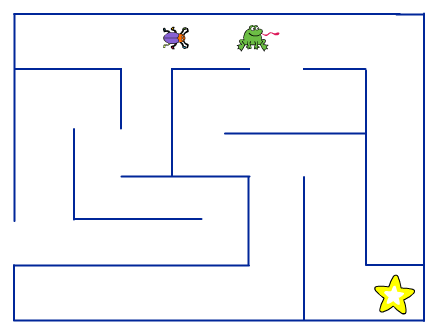

# Informasjon til veiledere {.intro}

Labyrint er et enkelt spill hvor man kontrollerer en liten utforsker
som leter etter skatten gjemt inne i en labyrint. Dette prosjektet
passer bra som en introduksjon til Scratch.

# Forberedelser {.activity}

+ __Antatt tidbruk__: 1.5 - 2 timer for hele prosjektet.

+ __Nødvendige forkunnskaper__: Ingen.

Dersom dette prosjektet brukes som en introduksjon til Scratch
anbefaler vi at du følger veiledningen
[Kom i gang med Scratch](../veiledninger/kom_i_gang_med_scratch.html).

Om elevene allerede er komfortable med Scratch kan du benytte
anledningen til å snakke om
[hvordan tegneverktøyet i Scratch fungerer](#tema-tegne-bakgrunner-i-scratch).

# Typiske utfordringer {.activity}

Nedenfor er en litste over utfordringer vi har opplevd at noen elever
kommer borti.

+ __Utforskeren kan gå rett gjennom veggen__. Typisk vil dette være
  fordi man ikke har rett farge i `<berører fargen [#cc0000]>`{.b}-klossen.
  Eventuelt at man har brukt flere farger på veggene i labyrinten. Det er
  viktig at alle veggene er tegnet i samme farge.

  Man kan også oppleve at utforskeren går rett gjennom veggen om
  `(hastighet)`{.b} er for høy. Dette er fordi utforskeren _hopper_
  `(hastighet)`{.b} steg hver gang man trykker en piltast, og den kan
  da hoppe over en vegg.

+ __Utforskeren hopper gjennom vegger når den snur__. Alle figurer har
  et definert senterpunkt som de roterer rundt (se Steg 2 i prosjektet
  [Soloball](../soloball/soloball.html) for et bra eksempel på hvordan
  dette virker). Dersom dette senterpunktet ikke er midt på
  `Utforsker`-figuren vil det se ut som om den hopper rundt når den
  snur. For å sette senterpunktet riktig kan dere klikke på
  `Drakter`-fanen og deretter på
  . Korset viser
  hvor senterpunktet er, og kan dras slik at det blir midt på figuren.

+ __Det er vanskelig å bevege seg i labyrinten__. Om gangene er for
  smale eller veggene for skrå blir det vanskelig for utforskeren og
  froskekongen å bevege seg. Se
  [nedenfor](#tema-tegne-bakgrunner-i-scratch) for flere tips til
  hvordan man bruker tegneverktøyet effektivt som kan hjelpe elevene.

+ __Utforskeren eller froskekongen setter seg fast i veggen__. I dette
  prosjektet har vi fokusert på å holde koden så enkel som
  mulig. Spesielt er koden som passer på at figurene ikke går gjennom
  veggene litt _for enkel_. Noen enkle tips som vil motvirke problemet
  er presentert i tipsboksen nederst i
  [steg 5 i oppgaven](labyrint.html#tips-3).

  For de mer avanserte elevene kan du også vise frem følgende kode som
  gjør en bedre sjekk av kollisjon med veggen.  TODO

# Variasjoner {.activity}

Dette er et introduksjonsprosjekt, og elevene ledes derfor ganske
detaljert gjennom hvordan spillet skal programmeres. Det er likevel
rom for en del kreativitet. Elevene kan gjerne oppfordres til å

+ __velge sine egne figurer__. De kan fritt velge figurene som brukes
  for `Utforsker`, `Skatt` og `Froskekonge` uten at det har noen
  effekt på programmeringen.

+ __tegne sin helt egne labyrint__. I oppgaven vises et eksempel
  (eller to om man også ser på tegningen først i oppgaven) på en
  labyrint, men elevene kan gjerne tegne denne annerledes. Be gjerne
  elevene likevel tenke på at det skal være enkelt for utforskeren og
  froskekongen å bevege seg rundt, slik at de bør ha rette vegger og
  brede nok ganger.

+ __eksperimentere med hastighet__. I
  [steg 1 i oppgaven](labyrint.html#steg-1-hvordan-styre-figurer-med-piltastene)
  vises det hvordan man lett kan endre hvor raskt en figur flytter seg
  ved å bruke en `(hastighet)`-variabel. La elevene eksperimentere med
  denne og `(hastighet)`-variabelen for froskekongen, og spør dem
  hvordan det forandrer vanskelighetsgraden i spillet.

# Tema: Tegne bakgrunner i Scratch {.activity}

Dersom elevene allerede er komfortable med Scratch er dette prosjektet
en bra anledning for å snakke om hvordan tegneverktøyet fungerer og gi
dem noen tips til hvordan man bruker det effektivt.
