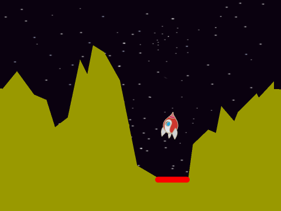
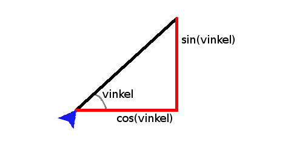
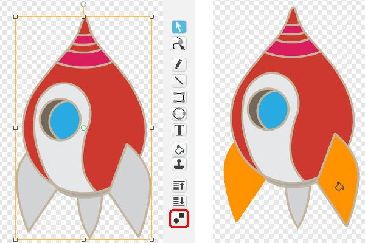

# Introduksjon {.intro}

Lunar Lander ble opprinnelig utviklet på slutten av 1970-tallet. Målet
med spillet er å lande et romskip på månen. Selve kontrollen av
romskipet ble videreført i spillet Asteroids som ble utgitt året
etter.



# Oversikt over prosjektet {.activity}

*Mesteparten av kodingen av Lunar Lander skal du gjøre selv. I Lunar
 Lander vil vi spesielt bruke litt tid på gjøre den fysiske
 modelleringen av romskipet ganske realistisk.*

## Plan {.check}

+ Et flyvende romskip

+ Vi ankommer månen

+ Klar for landing

+ Begrenset drivstoff, flere landingsplasser og andre utfordringer

# Steg 1: Et flyvende romskip {.activity}

Vi skal nå programmere et romskip som flyr rundt på skjermen. For å ha
kontroll på bevegelsen vil vi bruke to variable, `fartX`{.blockdata}
og `fartY`{.blockdata}, som beskriver hvor raskt romskipet beveger
seg henholdsvis sidelengs og opp-og-ned. Ved å bruke begge disse
samtidig vil romskipet kunne bevege seg i hvilken som helst retning.

Utfordringen i programmeringen av spillet er at romskipet kan rotere
uavhengig av hvilken retning det faktisk flyr. Når spilleren trykker
pil-opp for å bruke motoren vil vi gi romskipet ekstra fart i den
retningen det peker. Det betyr at vi må fordele farten i romskipets
retning i hvor mye sidelengs fart det får, og hvor mye av farten som
går opp eller ned.

Dette virker umiddelbart kanskje litt vanskelig, men det er akkurat
dette de matematiske funksjonene `sinus` og `cosinus` gjør. I
funksjonen nedenfor forteller for eksempel `cosinus(vinkel)` oss hvor
lang den vannrette streken er i forhold til den skrå streken.



## Sjekkliste {.check}

+ Start et nytt prosjekt. Slett kattefiguren.

+ Legg til en romskip-figur. Du kan gjerne bruke `Romfart/Spaceship`.

+ Lag romskipet ganske lite. Du kan for eksempel bruke

  ```blocks
  sett størrelse til (20) %
  ```

  rett etter at det grønne flagget er klikket.

+ Lag to nye variable, `fartX`{.blockdata} og `fartY`{.blockdata}
  som gjelder kun for denne romskip-figuren.

+ Vi lager først hovedløkken som lar romskipet falle, kun påvirket av
  tyngdekraften. Skriv denne koden:

  ```blocks
  når jeg mottar [Nytt spill v]
  gå til x: (0) y: (175)
  pek i retning (90 v)
  sett [fartX v] til [0]
  sett [fartY v] til [0]
  for alltid
      endre [fartY v] med (-0.01)
      endre x med (fartX)
      endre y med (fartY)
  slutt
  ```

  Om du prøver spillet ditt nå skal romskipet falle stadig raskere
  nedover skjermen. Prøv å endre litt i klossen

  ```blocks
  endre [fartY v] med (-0.01)
  ```

  Det er denne som modellerer tyngdekraften. Om du forandrer verdien
  her vil romskipet falle raskere eller tregere, eller det kan til
  og med falle oppover om du lar tyngdekraften være positiv.

+ Vi vil nå programmere kontrollen av romskipet. Først og fremst vil
  vi at romskipet vender seg når vi trykker på piltastene mot høyre og
  venstre.

  Legg til to `hvis`{.blockcontrol}-blokker inne i `for
  alltid`{.blockcontrol}-løkken hvor du `vender`{.blockmotion}
  romskipet for eksempel `5` grader mot høyre eller venstre avhengig
  av hvilken piltast som trykkes.

+ Når pil opp-tasten trykkes vil vi at romskipet skal få litt ekstra
  fart i den retningen romskipet peker. Som vi snakket om tidligere
  kan vi bruke de matematiske funksjonene sinus og cosinus for å få
  til dette. Legg også til denne blokken inne i
  `for alltid`{.blockcontrol}-løkken din.

  ```blocks
  hvis <tast [pil opp v] trykket?>
      endre [fartX v] med ((0) - ([cos v] av (retning)))
      endre [fartY v] med ([sin v] av (retning))
  slutt
  ```

  Du finner både sinus og cosinus-funksjonene som valg på klossen

  ```blocks
  ([kvadratrot v] av (9))
  ```

  Vi må bruke `((0) - ([cos v] av (retning)))`{.b} i stedet for
  `([cos v] av (retning))`{.b} fordi `retning`{.blockmotion} i
  Scratch måles motsatt vei av hvordan man måler vinkler i
  matematikk.

+ Prøv spillet ditt. Kan du styre romskipet rundt på skjermen? Dersom
  du synes romskipet flyr for raskt eller sakte kan du justere
  `endre fart`{.blockdata}-klossene, for eksempel slik,

  ```blocks
  endre [fartX v] med ((0.3) * ((0) - ([cos v] av (retning))))
  endre [fartY v] med ((0.3) * ([sin v] av (retning)))
  ```

  Pass på at du justerer begge klossene med det samme tallet.

# Steg 2: Vi ankommer månen {.activity}

*Nå skal vi legge til et månelandskap hvor spilleren skal prøve å lande.*

## Sjekkliste {.check}

+ Lag en ny bakgrunn, hvor du tegner et passende månelandskap. Gjør
  det så lett eller vanskelig som du selv vil. Tegn også inn en eller
  flere landingsplasser hvor romskipet skal lande. Vi vil bruke
  `berører fargen`{.blocksensing}-klosser for å sjekke landingen
  senere, så det enkleste er å bruke en farge for landskapet og en
  annen for landingsplassen.

+ For at romskipet skal slutte å fly når det treffer bakken kan du
  bytte ut `for alltid`{.blockcontrol}-løkken med en
  `gjenta til`{.blockcontrol}-løkke hvor du tester på om romskipet
  `berører fargen`{.blocksensing} du har brukt på landskapet eller
  på landingsplassen.

+ Legg også til en `send melding [Sjekk landing v]`{.b} rett etter
  `gjenta til`{.blockcontrol}-løkken.

+ Prøv spillet ditt igjen. Du skal nå kunne fly rundt helt til
  romskipet kommer nær bakken.

# Steg 3: Klar for landing {.activity}

*Vi vil til slutt sjekke hvor og hvordan romskipet landet.*

## Sjekkliste {.check}

+ Når vi sjekker landingen til romskipet vil vi skille mellom tre
  forskjellige tilfeller:

  __1__: Romskipet landet utenfor landingsplassen (kræsjet).

  __2__: Romskipet landet på landingsplassen, men landet enten på
  skrå (eller opp-ned) eller for raskt.

  __3__: Romskipet landet perfekt på landingsplassen.

  Lag et nytt skript på romskipet som starter når det mottar
  meldingen `Sjekk landing`. Under denne klossen må du bruke
  `hvis`{.blockcontrol}- og `hvis ellers`{.blockcontrol}-klosser som
  tester for de tre tilfellene. Du kan for eksempel si at landingen
  er perfekt dersom romskipet lander på landingsplassen,
  `fartY`{.blockdata} er større enn `-1.5` og
  `retning`{.blockmotion} er mellom `80` og `100`.

+ Finn en måte å fortelle spilleren hvordan romskipet landet. Det
  enkleste er kanskje å bare bruke en `si`{.blocklooks}-kloss. Men du
  kan også bruke lydeffekter, forskjellige drakter eller kanskje en
  tekstplakat som dukker opp.

# Steg 4: Videreutvikling av spillet {.activity}

*Du har nå laget en enkel variant av Lunar Lander. Men prøv å gjøre
 spillet morsommere ved å videreutvikle det. Du bestemmer selv hvordan
 du vil jobbe videre, men nedenfor er noen ideer som kanskje kan være
 til inspirasjon?*

## Ideer til videreutvikling {.check}

+ Lag flere landingsplasser. Kanskje noen kan være vanskeligere enn
  andre å lande på (enten på grunn av terrenget eller fordi selve
  landingsplassen er mindre).

+ Lag flere bakgrunner eller brett. Du kan enten la spilleren velge
  seg en bakgrunn å spille på i begynnelsen av spillet, eller gå
  videre fra brett til brett etterhvert som spilleren klarer å lande.

+ Du kan også bruke flere bakgrunner som et brett. Dersom romskipet
  flyr ut av skjermen på høyre side kan du la det dukke opp igjen på
  venstre side av en annen bakgrunn, og motsatt.

+ Prøv å animere bruken av motoren. For eksempel, kan du lage en kopi
  av den flyvende romskip-drakten, og endre den som følger. Klikk
  først på romskipet, og deretter på den nye knappen som dukker opp
  nederst i knapperekka (markert med rødt i figuren til
  venstre). Denne vil dele opp romskip-figuren i mindre deler. Velg en
  passende flammefarge, og bruk malingsspannet til å fargelegge de tre
  finnene på romskipet slik at det ser ut som flammer som kommer fra
  motoren.

  

+ En av utfordringene i det originale Lunar Lander-spillet var at
  spilleren bare hadde begrenset drivstoff tilgjengelig. Du kan legge
  til dette i ditt spill ved å lage en
  `Drivstoff`{.blockdata}-variabel som du lar bli stadig mindre
  etterhvert som spilleren trykker på piltastene. Dersom romskipet går
  tomt for drivstoff kan du ignorere tastetrykkene fra spilleren og
  bare la romskipet sveve til det til slutt kræsjer.

+ Du kan lage forskjellige bonusting som spilleren kan plukke opp. For
  å gjøre det litt utfordrende kan du la disse ligge på måneoverflaten
  slik at spilleren må manøvrere forsiktig for å få tak i
  dem. Eksempler på slike bonusting kan være ekstra drivstoff,
  bonuspoeng, større landingsplass og så videre.

+ En større endring i spillet kan være at landingsplassen er skjult
  under bakken når spillet begynner, og spilleren må grave denne frem
  ved å slippe bomber fra romskipet. Du kan implementere dette for
  eksempel ved bruk av noen av klossene under
  `Penn`{.blockpen}-kategorien.
