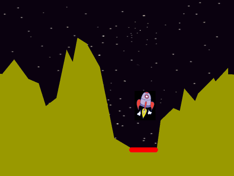

# Вступ {.intro}

"Місячний модуль" (Lunar Lander) була розроблена наприкінці 1970-х років. Метою гри є посадка космічного корабля на Місяць. Керування космічним кораблем було продовжено у грі "Астероїди", яка вийшла наступного року.




# Огляд проєкту {.activity}

*Більшу частину кодування "Місячний модуль" будете виконувати ви. Зокрема, в "Місячний модуль" ми витратимо деякий час на те, щоб зробити фізичне моделювання космічного корабля досить реалістичним.*

## План {.check}

- [ ] Літаючий космічний корабель

- [ ] Ми прибуваємо на Місяць

- [ ] Готові до посадки

- [ ] Обмежене паливо, кілька посадочних майданчиків та інші виклики


# Крок 1: Літаючий космічний корабель {.activity}

Зараз ми запрограмуємо космічний корабель, який буде літати по екрану. Для керування рухом ми будемо використовувати дві змінні: `швидкістьX`{.blockdata} та
`швидкістьY`{.blockdata},які описують швидкість руху корабля з боку в бік та вгору-вниз відповідно. Використовуючи обидві змінні одночасно, космічний корабель зможе рухатися в будь-якому напрямку.

Складність програмування гри полягає в тому, що космічний корабель може обертатися незалежно від того, в якому напрямку він насправді летить. Коли гравець натискає стрілку вгору, щоб задіяти двигун, ми хочемо надати космічному кораблю додаткову швидкість у напрямку, на який він вказує. Це означає, що нам потрібно розподілити швидкість у напрямку руху космічного корабля таким чином, щоб визначити, яку частину швидкості він отримує у бік, а яку - вгору або вниз.

На перший погляд, це може здатися трохи складним, але це саме те, що роблять 
математичні функції `синус` і `косинус`. Наприклад, у функції нижче `косинус(кут)` показує нам, наскільки довшою є горизонтальна лінія по відношенню до похилої.


## Контрольний список {.check}

- [ ] Почніть новий проект. Видаліть символ кота.

- [ ] Додайте персонажа космічного корабля. Не соромтеся використовувати `Усі/Rocketship`.

- [ ] Зробіть космічний корабель зовсім маленьким. Наприклад, ви можете використати

  ```blocks
  задати розмір (20)
  ```

  одразу після натискання зеленого прапорця.

- [ ] Створіть дві нові змінні, `швидкістьX`{.blockdata} та `швидкістьY`{.blockdata}, які застосовуються лише до цієї фігури космічного корабля.
- [ ] Спочатку створюємо основний цикл, який дозволяє космічному апарату падати під дією лише сили тяжіння. Напишіть цей код:

  ```blocks
  коли я отримую [Нова гра v]
  перемістити в x: (0) y: (175)
  повернути в напрямку (90 v)
  надати [швидкістьX v] значення [0]
  надати [швидкістьY v] значення [0]
  завжди
      змінити [швидкістьY v] на (-0.01)
      змінити x на (швидкістьX)
      змінити y на (швидкістьY)
  slutt
  ```

  Якщо ви спробуєте запустити гру зараз, космічний корабель повинен падати все швидше і швидше вниз по екрану. Спробуйте змінити щось у блоці

  ```blocks
  змінити [швидкість v] на (-0.01)
  ```

  Саме він моделює силу гравітації. Якщо ви зміните значення тут, космічний корабель буде падати швидше або повільніше, або навіть може впасти вгору, якщо залишити гравітацію з плюсом.

- [ ] Тепер ми запрограмуємо керування космічним кораблем. Перш за все, ми хочемо, щоб корабель повертався, коли ми натискаємо клавіші зі стрілками вправо та вліво.

  Додайте два блоки `якщо`{.blockcontrol} всередині циклу `завжди`{.blockcontrol} де ви `повертаєте`{.blockmotion} космічний корабель, наприклад, на `5` градусів праворуч або ліворуч, залежно від того, яку клавішу зі стрілкою натиснуто.

- [ ] Коли натиснута клавіша зі стрілкою вгору, ми хочемо, щоб космічний апарат набрав трохи більшої швидкості в напрямку, на який він вказує. Як ми вже говорили раніше, для цього ми можемо використати математичні функції синус і косинус. Також додайте цей блок всередину вашого циклу `завжди`{.blockcontrol}.

  ```blocks
  якщо <клавішу [стрілка в гору v] натиснуто?> то
      замінити [швидкістьX v] на ((0) - ([cos v] з (напрям)))
      замінити [швидкістьY v] на ([sin v] з (напрям))
  slutt
  ```

  Ви знайдете функції синуса і косинуса як варіанти на вибір у блоці

  ```blocks
  ([sqrt v] з (9))
  ```

  Нам потрібно використовувати
 `((0) - ([cos v] з (напрям)))`{.b} замість `([cos v] з
  (напрям))`{.b} тому що `напрям`{.blockmotion} у Scratch вимірюються у протилежний спосіб від того, як кути вимірюються у математиці.

- [ ] Prøv spillet ditt. Kan du styre romskipet rundt på skjermen? Dersom du
  synes romskipet flyr for raskt eller sakte kan du justere `endre
  fart`{.blockdata}-klossene, for eksempel slik,

  ```blocks
  endre [fartX v] med ((0.3) * ((0) - ([cos v] av (retning))))
  endre [fartY v] med ((0.3) * ([sin v] av (retning)))
  ```

  Pass på at du justerer begge klossene med det samme tallet.


# Steg 2: Vi ankommer månen {.activity}

*Nå skal vi legge til et månelandskap hvor spilleren skal prøve å lande.*

## Sjekkliste {.check}

- [ ] Lag en ny bakgrunn, hvor du tegner et passende månelandskap. Gjør det så
  lett eller vanskelig som du selv vil. Tegn også inn en eller flere
  landingsplasser hvor romskipet skal lande. Vi vil bruke `berører
  fargen`{.blocksensing}-klosser for å sjekke landingen senere, så det enkleste
  er å bruke en farge for landskapet og en annen for landingsplassen.

- [ ] For at romskipet skal slutte å fly når det treffer bakken kan du bytte ut
  `gjenta for alltid`{.blockcontrol}-løkken med en `gjenta til`{.blockcontrol}-løkke
  hvor du tester på om romskipet `berører fargen`{.blocksensing} du har brukt på
  landskapet eller på landingsplassen.

- [ ] Legg også til en `send melding [Sjekk landing v]`{.b} rett etter `gjenta
  til`{.blockcontrol}-løkken.

- [ ] Prøv spillet ditt igjen. Du skal nå kunne fly rundt helt til romskipet
  kommer nær bakken.


# Steg 3: Klar for landing {.activity}

*Vi vil til slutt sjekke hvor og hvordan romskipet landet.*

## Sjekkliste {.check}

- [ ] Når vi sjekker landingen til romskipet vil vi skille mellom tre
  forskjellige tilfeller:

  __1__: Romskipet landet utenfor landingsplassen (kræsjet).

  __2__: Romskipet landet på landingsplassen, men landet enten på
  skrå (eller opp-ned) eller for raskt.

  __3__: Romskipet landet perfekt på landingsplassen.

  Lag et nytt skript på romskipet som starter når det mottar meldingen `Sjekk
  landing`. Under denne klossen må du bruke `hvis`{.blockcontrol}- og `hvis
  ellers`{.blockcontrol}-klosser som tester for de tre tilfellene. Du kan for
  eksempel si at landingen er perfekt dersom romskipet lander på
  landingsplassen, `fartY`{.blockdata} er større enn `-1.5` og
  `retning`{.blockmotion} er mellom `80` og `100`.

- [ ] Finn en måte å fortelle spilleren hvordan romskipet landet. Det enkleste
  er kanskje å bare bruke en `si`{.blocklooks}-kloss. Men du kan også bruke
  lydeffekter, forskjellige drakter eller kanskje en tekstplakat som dukker opp.


# Steg 4: Videreutvikling av spillet {.activity}

*Du har nå laget en enkel variant av Lunar Lander. Men prøv å gjøre spillet
 morsommere ved å videreutvikle det. Du bestemmer selv hvordan du vil jobbe
 videre, men nedenfor er noen ideer som kanskje kan være til inspirasjon?*

## Ideer til videreutvikling {.check}

- [ ] Lag flere landingsplasser. Kanskje noen kan være vanskeligere enn andre å
  lande på (enten på grunn av terrenget eller fordi selve landingsplassen er
  mindre).

- [ ] Lag flere bakgrunner eller brett. Du kan enten la spilleren velge seg en
  bakgrunn å spille på i begynnelsen av spillet, eller gå videre fra brett til
  brett etterhvert som spilleren klarer å lande.

- [ ] Du kan også bruke flere bakgrunner som et brett. Dersom romskipet flyr ut
  av skjermen på høyre side kan du la det dukke opp igjen på venstre side av en
  annen bakgrunn, og motsatt.

- [ ] Prøv å animere bruken av motoren. For eksempel, kan du lage en kopi av den
  flyvende romskip-drakten, og endre den som følger. Klikk først på romskipet,
  og deretter på den nye knappen som dukker opp nederst i knapperekka (markert
  med rødt i figuren til venstre). Denne vil dele opp romskip-figuren i mindre
  deler. Velg en passende flammefarge, og bruk malingsspannet til å fargelegge
  de tre finnene på romskipet slik at det ser ut som flammer som kommer fra
  motoren.

  

- [ ] En av utfordringene i det originale Lunar Lander-spillet var at spilleren
  bare hadde begrenset drivstoff tilgjengelig. Du kan legge til dette i ditt
  spill ved å lage en `Drivstoff`{.blockdata}-variabel som du lar bli stadig
  mindre etterhvert som spilleren trykker på piltastene. Dersom romskipet går
  tomt for drivstoff kan du ignorere tastetrykkene fra spilleren og bare la
  romskipet sveve til det til slutt kræsjer.

- [ ] Du kan lage forskjellige bonusting som spilleren kan plukke opp. For å
  gjøre det litt utfordrende kan du la disse ligge på måneoverflaten slik at
  spilleren må manøvrere forsiktig for å få tak i dem. Eksempler på slike
  bonusting kan være ekstra drivstoff, bonuspoeng, større landingsplass og så
  videre.

- [ ] En større endring i spillet kan være at landingsplassen er skjult under
  bakken når spillet begynner, og spilleren må grave denne frem ved å slippe
  bomber fra romskipet. Du kan implementere dette for eksempel ved bruk av noen
  av klossene under `Penn`{.blockpen}-kategorien.
