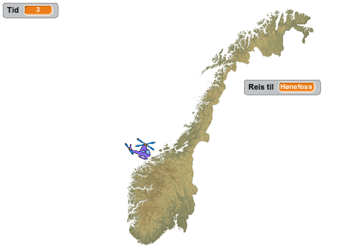

# Informasjon til veiledere

Bli med på en rundreise i Norge! Vi skal lage et spill hvor du styrer
et helikopter rundt omkring et kart over Norge, mens du prøver å
raskest mulig finne steder og byer du blir bedt om å besøke.

# Forberedelser

I tillegg til de vanlige ressursene som er inkludert i
Scratch-platformen bruker Norgestur også en spesiell bakgrunn, nemlig
et Norgeskart. En beskrivelse for hvordan dette kartet kan lastes ned
er gitt i Steg 1 av oppgaven.

Alternativt, kan du gjøre kartet tilgjengelig for deltakerne på
forhånd om dette er mulig. Kartet kan du lagre ved å høyreklikke på bildet under:

# Læringsmål

Noen av læringsmålene i Norgestur inkluderer

1. hvordan __styre figurer__ ved hjelp av __tastaturet__,
2. hvordan man kan __tegne og bruke egne bakgrunner og figurer__,
3. bruk av __meldinger__ for å styre flyten i et spill,
4. hvordan figurer kan gjøres __usynlige__, og
5. hvordan man kan __kopiere programkode__.

I tillegg vil litt enkel geografikunnskap formidles gjennom spillet.
