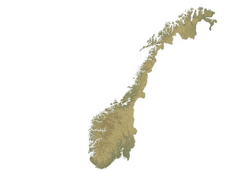

# Om oppgåva {.activity}

I denne oppgåva skal elevane lage eit reise- og geografispel i Noreg.

## Oppgåva passar til: {.check}

__Fag__: Matematikk, programmering, samfunnsfag.

__Anbefalte trinn__: 3.-10. trinn.

__Tema__: Geografi, lese kart, variablar, brukarinteraksjon.

__Tidsbruk__: Dobbelttime eller meir.

## Kompetansemål {.challenge}

- [ ] __Matematikk, 3. trinn__: eksperimentere med og forklare plasseringar i
      koordinatsystemet

- [ ] __Matematikk, 5. trinn__: lage og programmere algoritmar med bruk av
      variablar, vilkår og løkker

- [ ] __Samfunnsfag, 4. trinn__: beskrive kultur- og naturlandskap i Noreg og
      samtale om korleis historiske og geografiske kjelder, inkludert kart, kan
      gi informasjon om landskap

- [ ] __Samfunnsfag, 7. trinn__: beskrive geografiske hovudtrekk i ulike delar
      av verda og reflektere over korleis desse hovudtrekka påverkar dei som
      bur der

- [ ] __Programmering, 10. trinn__: bruke grunnleggande prinsipp i
      programmering, slik som variablar, løkker, vilkår og funksjonar, og
      reflektere over bruken av desse

## Forslag til læringsmål {.challenge}

- [ ] Elevane kan plassere ulike element på bestemte plassar i eit
  koordinatsystem.

- [ ] Elevane kan få ein figur til å bevege seg mellom bestemte posisjonar i eit
  koordinatsystem.

- [ ] Elevane kan få ein figur til å bevege seg i henhald til brukaren sine
  beskjedar.

- [ ] Elevane kan lese eit digitalt kart over Noreg.

- [ ] Elevane kan plassere nokre norske byar og stader på kartet.

- [ ] Elevane kan bruke kode til å vise og skjule figurar etter kvart som spelet
  går sin gang.

## Forslag til vurderingskriterium {.challenge}

- [ ] Eleven syner middels måloppnåing ved å fullføre oppgåva.

- [ ] Eleven syner høg måloppnåing ved å vidareutvikle eigen kode basert på
  oppgåva, til dømes ved å gjere ein eller fleire av variasjonane under.

## Føresetnader og utstyr {.challenge}

- [ ] __Føresetnader__: Elevane må ha god kunnskap i Scratch. Dei bør ha gjort
  fleire prosjekt på introduksjons- og nybyrjarnivå før dei startar med denne
  oppgåva.

- [ ] __Utstyr__: Datamaskiner med Scratch installert. Eventuelt kan elevane
  bruke Scratch i nettlesaren viss dei har ein brukar (eller registrerer seg) på
  [scratch.mit.edu/](https://scratch.mit.edu/). Elevane kan gjerne jobbe to og
  to saman. Merk at det blir brukt eit noregskart som bakgrunn i oppgåva, og
  elevane må laste det ned sjølv. Ei beskriving for det blir gitt i steg 1,
  elles kan du gjere følgjande biletefil tilgjengeleg for elevane:

  

## Framgangsmåte

Her finn du tips, erfaringar og utfordringar til dei ulike stega i oppgåva.
[Klikk her for å sjå
oppgåveteksten.](../norgestur/norgestur_nn.html){target=_blank}

_Me har diverre ikkje nokre tips, erfaringar eller utfordringar knytta til denne
oppgåva endå._

## Variasjonar {.challenge}

- [ ] Elevane kan utvide oppgåva med fleire reisemål.

- [ ] Elevane kan lage ei avslutning på spelet, som er avhengig av om spelaren
  vinn (finn alle reisemåla) eller tapar (tida går ut).

- [ ] Elevane kan lage kode som viser reisemåla i tilfeldig rekkefølgje.

- [ ] Elevane kan lage tilsvarande spel på eigne kart (heimfylke, ein verdsdel,
  solsystemet...).

## Eksterne ressursar {.challenge}

- [ ] Sjå [Kor i all
  verda?](../hvor_i_all_verden_del1/hvor_i_all_verden_del1_nn.html).
