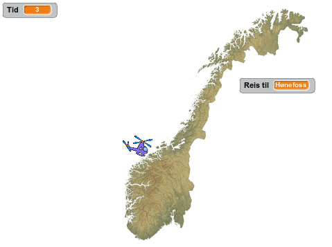
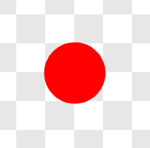
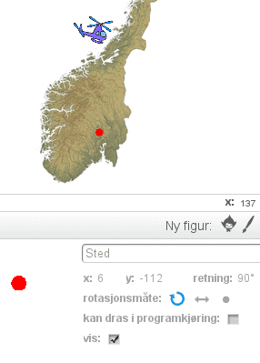

# Introduksjon {.intro}

Bli med på ei rundreise i Noreg! Me skal lage eit spel der du styrar eit
helikopter over eit kart over Noreg, medan du raskast mogleg prøver å finne
stader og byar du blir beden om å besøke.




# Steg 1: Eit kart over Noreg {.activity}

*Fyrst legg me inn eit kart over Noreg som bakgrunn. Seinare skal me bruke
 helikopteret til å besøke stader på dette.*

## Sjekkliste {.check}

- [ ] Fyrst må me laste ned fila som inneheldt kartet frå nettet. Viss du
  allereie har fått fila på datamaskina di kan du hoppe over det neste punktet.

- [ ] Høgreklikk på lenka [norgeskart.png](norgeskart.png) og vel at den skal
  åpnast i ei ny fane. Klikk på den nye fana som blir opna. Her finn du eit
  bilete av eit kart over Noreg. Høgreklikk på biletet og vel `Lagre biletet
  som` eller noko som liknar. Lagre biletet ein stad du finn det att, til dømes
  på skrivebordet.

- [ ] Start eit nytt Scratch-prosjekt. Slett kattefiguren, til dømes ved å
  høgreklikke på den og velje `slett`.

- [ ] Legg inn kartet som bakgrunn ved å velje  under `Ny bakgrunn` heilt til venstre på
  skjermen. Vel fila `norgeskart.png` du lasta ned tidlegare.

### Kart over Noreg {.protip}

Det finst mengdar av kart på Internett. Det kartet me brukar i denne oppgåva er
laga av Kartverket og delt slik at alle kan bruke det slik dei vil. Sist i denne
oppgåva finn du beskrivingar for å bruke andre kart.

# Steg 2: Styr helikopteret {.activity}

*No skal me lage eit helikopter som me kan styre rundt over kartet. Me startar
 med å programmere eit skript som let oss kontrollere helikopteret med
 piltastane.*

## Sjekkliste {.check}

- [ ] Legg til ein ny figur ved å klikke  under `Figurar`. Me har brukt
  `Transport/Helicopter`, men du kan eventuelt bruke ein annan figur du vil
  reise rundt med.

- [ ] Klikk `i`{.blockmotion} og skift namn på figuren til `Helikopter`. Set
  rotasjonsmåten til  for å
  unngå at helikopteret flyr opp ned.

- [ ] Vi startar med å gjere helikopteret mindre, samt sikre oss at det alltid
- startar på same stad. Lag dette skriptet:

  ```blocks
  når @greenFlag vert trykt på
  set storleik til (25) %
  gå til x: (0) y: (0)
  ```

- [ ] No skal me programmere at helikopteret blir kontrollert med piltastane. Me
  gjer dette ved å starte ei løkke som me gjentek for alltid. Inne i den evige
  løkka testar me om piltastane er trykka, og i så fall flyttar me helikopteret.
  Fyrst lagar me koden som flyttar helikopteret oppover:

  ```blocks
  når @greenFlag vert trykt på
  set storleik til (25) %
  gå til x: (0) y: (0)
  gjenta for alltid
      viss <tasten [pil opp v] er trykt?>
          peik i retning (0 v)
          gå (2) steg
      slutt
  slutt
  ```

## Test prosjektet {.flag}

__Klikk på det grøne flagget.__

- [ ] Startar ei lita utgåve av helikopteret omlag midt på skjermen (litt
  nordvest for Trondheim)?

- [ ] Flyttar helikopteret seg oppover når du trykkar pil opp-tasten?

- [ ] Skjer det noko når du trykkar dei andre piltastane?

## Sjekkliste {.check}

Me skal programmere dei andre piltastane òg.

- [ ] Koden for å flytte helikopteret med dei andre  piltastane er veldig lik
  koden som flyttar helikopteret oppover. Difor kan me kopiere den me allereie
  har skrive! Høgreklikk på klossen `viss `{.blockcontrol}`tasten pil opp
  er trykt?`{.blocksensing}, og vel `lag ein kopi`. Slepp desse klossane inn i
  `gjenta for alltid`{.blockcontrol}-løkka. Gjenta til du har fire
  `viss`{.blockcontrol}-klossar. Endre på skriptet ditt slik at det ser ut som
  følgjer:

  ```blocks
  når @greenFlag vert trykt på
  set storleik til (25) %
  gå til x: (0) y: (0)
  gjenta for alltid
      viss <tasten [pil opp v] er trykt?>
          peik i retning (0 v)
          gå (2) steg
      slutt
      viss <tasten [pil høyre v] er trykt?>
          peik i retning (90 v)
          gå (2) steg
      slutt
      viss <tasten [pil ned v] er trykt?>
          peik i retning (180 v)
          gå (2) steg
      slutt
      viss <tasten [pil venstre v] er trykt?>
          peik i retning (-90 v)
          gå (2) steg
      slutt
  slutt
  ```

## Test prosjektet {.flag}

__Klikk på det grøne flagget.__

- [ ] Kan du bruke alle fire piltastane til å flytte helikopteret?

- [ ] Kva er det som bestemmer kor fort helikopteret beveger seg? Prøv å
  forandre på skriptet ditt slik at helikopteret flyr raskare eller saktare.

## Utfordring: Hastigheitsvariabel {.challenge}

Viss du ser i skriptet har me repetert talet `2` heile fire gonger. Dette gjer
det vanskelegare for oss å endre kor fort helikopteret beveger seg i framtida.

Viss du vil kan du prøve å lage ein ny variabel som heiter
`hastigheit`{.blockdata}. Så kan du setje denne variabelen lik `2` etter at det
grøne flagget blir trykka på. Til slutt kan du bytte ut `gå 2
steg`{.blockmotion}-klossane med
`gå`{.blockmotion}`hastigheit`{.blockdata}`steg`{.blockmotion}-klossar.


# Steg 3: Legg til eit reisemål {.activity}

*No som helikopteret kan flyge rundt omkring i Noreg kan me gi spelaren eit mål
 med reisa.*

## Sjekkliste {.check}

- [ ] No skal me teikne vår eigen figur som me brukar til å markere ein stad på
  kartet. Klikk  under `Figurar`.

- [ ] Me treng berre ein liten disk. Vel ei passande farge, til dømes synest
  raud ganske godt på kartet. Vel sirkelverktøyet og marker den fylte sirkelen
  (disken) til venstre under teiknevindauget.

- [ ] Før me startar å teikne kan du forstørre teikninga di ved å trykkje på
  forstørrelsesglaset nedst til høgre. Til dømes passar `800 %` forstørring bra.
  Hald inne `skift`-knappen medan du dreg ut ein sirkel som er omlag fire ruter
  stor. Ved å halde inne `skift`-knappen får du ein heilt rund sirkel.

  

- [ ] Klikk på `i`{.blockmotion} og gi denne nye figuren namnet `Stad`.

- [ ] Dra den nye stad-figuren til den staden på kartet du vil at skal vere
  fyrste reisemål. Me har brukt `Hønefoss` som fyrste reisemål, men du kan velje
  ein annan stad om du vil.

- [ ] No treng meposisjonen til reisemålet vårt. Denne finn me ved sjå på
  figurinformasjonen etter tala som står bak `x` og `y`. Desse tala kallast
  koordinatar. I dømet under er koordinatane `x: 6` og `y: -112`. Desse fortel
  kor på kartet me har lagt reisemålet.

  

- [ ] Klikk på `Skript`{.blocklightgrey}-fana. No skal me lage koden som legg
  `Stad`-figuren på riktig stad, og seinare oppdagar om helikopteret reiser dit.

  ```blocks
  når @greenFlag vert trykt på
  send meldinga [Stad: Hønefoss v]

  når eg får meldinga [Stad: Hønefoss v]
  gå til x: (6) y: (-112)
  vent til <rører [Helikopter v]?>
  sei [Fann Hønefoss!] i (2) sekund
  ```

  Legg merke til at i `gå til`{.blockmotion}-klossen brukar me same koordinatar
  som dei me fann over. Det tyder at om du brukar ditt eige reisemål må du bytte
  desse tala med dei du fann ved å sjekke figuren.

## Test prosjektet {.flag}

__Klikk på det grøne flagget.__

- [ ] Er `Stad`-figuren der den skal vere på kartet?

- [ ] Seier den `Fann Hønefoss!` (eller ditt reisemål) når helikopteret flyr til
  reisemålet?


# Steg 4: Eit nytt reisemål {.activity}

*La oss leggje til eit nytt reisemål me kan reise til etter å ha besøkt det
 fyrste!*

## Sjekkliste {.check}

- [ ] Flytt `Stad`-figuren til ein ny stad på kartet. Me brukar `Tromsø`. Finn
  koordinatane til den nye staden på same måte som sist.

- [ ] Legg til ei melding nedst i `Hønefoss`-skriptet som kallar eit nytt
  reisemål. Så lagar du eit nytt skript for den nye staden. Det nye skriptet er
  veldig likt det fyrste, så du bør høgreklikke på `når eg får meldinga Stad:
  Hønefoss`{.blockevents}-klossen og velje `lag ein kopi`.

  ```blocks
  når eg får meldinga [Stad: Hønefoss v]
  gå til x: (6) y: (-112)
  vent til <rører [Helikopter v]?>
  sei [Fann Hønefoss!] i (2) sekund
  send meldinga [Stad: Tromsø v]

  når eg får meldinga [Stad: Tromsø v]
  gå til x: (103) y: (121)
  vent til <rører [Helikopter v]?>
  sei [Fann Tromsø!] i (2) sekund
  ```

  Bruk dine eigne koordinater (og namn) for det andre reisemålet òg.

## Test prosjektet {.flag}

__Klikk på det grøne flagget.__

- [ ] Flyttar reisemålet seg etter at du har funne det fyrste?

- [ ] Oppdagar det andre reisemålet at du finn det?


# Steg 5: Skjul reisemåla {.activity}

*Førebels er ikkje spelet så vanskeleg: du må berre styre helikopteret til den
 raude disken. For å lage eit skikkeleg spel vil me gøyme den raude disken, og
 heller berre fortelje spelaren til kva stad ho skal flyge!*

## Sjekkliste {.check}

Fyrst vil me fortelje spelaren kor ho skal flyge.

- [ ] Lag ein ny variabel ved å klikke på `Data`{.blockdata} og så `Lag ein
  variabel`. Kall variabelen `Reis til`{.blockdata} og vel at den skal gjelde
  `For alle figurar`.

- [ ] Legg merke til at det dukka opp ein boks på kartet,
  `Reis til`{.blocklightgrey}` 0 `{.blockdata}. Flytt denne boksen til ein
  passande stad slik at den er lett å lese.

- [ ] No kan me oppdatere koden til `Stad` slik at den set `Reis
  til`{.blockdata}-variabelen. Fyrst må du endre`Hønefoss`-skriptet som følgjer:

  ```blocks
  når eg får meldinga [Stad: Hønefoss v]
  gå til x: (6) y: (-112)
  set [Reis til v] til [Hønefoss]
  vent til <rører [Helikopter v]?>
  sei [Fann Hønefoss!] i (2) sekund
  send meldinga [Stad: Tromsø v]
  ```

- [ ] Endre det andre reisemål-skriptet på samme måte:

  ```blocks
  når eg får meldinga [Stad: Tromsø v]
  gå til x: (103) y: (121)
  set [Reis til v] til [Tromsø]
  vent til <rører [Helikopter v]?>
  sei [Fann Tromsø!] i (2) sekund
  ```

## Test prosjektet {.flag}

__Klikk på det grøne flagget.__

- [ ] Fungerer framleis spelet som før?

- [ ] Oppdaterer `Reis til`{.blockdata}-variabelen seg slik du forventa?

## Sjekkliste {.check}

No er me klare til å gøyme den raude disken. Me prøvar fyrst det enklaste og
mest opplagte:

- [ ] Legg til ein `gøym`{.blocklooks}-kloss i oppstartskriptet på
  `Stad`-figuren.

  ```blocks
  når @greenFlag vert trykt på
  gøym
  send meldinga [Stad: Hønefoss v]
  ```

## Test prosjektet {.flag}

__Klikk på det grøne flagget.__

- [ ] Blir den raude disken borte?

- [ ] Kva skjer viss du reiser til Hønefoss?

Hmm... Spelet oppdatar ikkje at me reiser til Barcelona lengre. Problemet er at
sidan me gøymer disken vil den ikkje lengre berøre `Helikopter`. Me må finne
ein annan måte å gjere disken usynleg på.

## Sjekkliste {.check}

- [ ] I staden for å gøyme disken heilt vil me gjere den gjennomsiktig. Bytt
  ut `gøym`{.blocklooks}-klossen med ein `set effekt`{.blocklooks}-kloss:

  ```blocks
  når @greenFlag vert trykt på
  vis
  set [gjennomsiktig v]-effekt til (100)
  send meldinga [Stad: Hønefoss v]
  ```

  Me har lagt til ein `vis`{.blocklooks}-kloss for å vere på den sikre siden
  (me har jo oppdaget at spelet ikkje virkar om `Stad`-figuren er gøymt).

## Test prosjektet {.flag}

__Klikk på det grøne flagget.__

- [ ] Er framleis den raude disken usynlig?

- [ ] Kva skjer no viss du reiser til Hønefoss?


# Steg 6: Vis reisemålet etter at det blir funne {.activity}

*Det er kult om du kan vise kor reisemålet faktisk er etter at spelaren har
funne det.*

## Sjekkliste {.check}

- [ ] La oss lage ei ny melding, `Fann stad`, som me kan sende kvar gong
  spelaren finn eit reisemål. Denne meldinga kan me så bruke til å køyre eit
  skript kvar gong me finn eit reisemål. Endre `Stad`-skripta som følgjer:

  ```blocks
  når eg får meldinga [Stad: Hønefoss v]
  gå til x: (6) y: (-112)
  set [Reis til v] til [Hønefoss]
  vent til <rører [Helikopter v]?>
  send meldinga [Fann stad v] og vent
  send meldinga [Stad: Tromsø v]

  når eg får meldinga [Stad: Tromsø v]
  gå til x: (103) y: (121)
  set [Reis til v] til [Tromsø]
  vent til <rører [Helikopter v]?>
  send meldinga [Fann stad v] og vent
  ```

- [ ] Når me mottek `Fann stad`-meldinga vil me vise kor reisemålet faktisk
  ligg. Sida disken snart flyttast vidare kan me ikkje berre gjere figuren
  synleg, me må òg `lag avtrykk`{.blockpen} av figuren på bakgrunnen. Legg
  til dette skriptet:

  ```blocks
  når eg får meldinga [Fann stad v]
  set [gjennomsiktig v]-effekt til (0)
  lag avtrykk
  set [gjennomsiktig v]-effekt til (100)
  ```

## Test prosjektet {.flag}

__Klikk på det grøne flagget.__

- [ ] Dukkar den raude disken opp etter kvart som du finn reisemåla?

- [ ] Kva skjer viss du startar spelet på nytt etter å ha funne alle reisemåla?

## Sjekkliste {.check}

- [ ] For å vere sikker på at avtrykka (dei raude diskane) blir borte når me
  startar spelet på nytt kan me bruke `slett`{.blockpen}-klossen. Legg til ein
  kloss på oppstart-skriptet:

  ```blocks
  når @greenFlag vert trykt på
  slett
  vis
  set [gjennomsiktig v]-effekt til (100)
  send meldinga [Stad: Hønefoss v]
  ```

- [ ] La oss leggje på ein enkel lydeffekt når spelaren finn eit reisemål.
  Sidan me har meldinga `Fann stad` er dette enkelt. Klikk fyrst på
  `Lyder`{.blocklightgrey}-fana og vel ein ny lyd frå biblioteket. Me brukar
  `Effekter/rattle`, men du kan gjerne bruke ein annan lyd.

- [ ] start lyden når ein stad blir funne. Klikk `Skript`{.blocklightgrey}-fana
  og legg til ein `start lyden`{.blocksound}-kloss.

  ```blocks
  når eg får meldinga [Fann stad v]
  start lyden [rattle v]
  set [gjennomsiktig v]-effekt til (0)
  lag avtrykk
  set [gjennomsiktig v]-effekt til (100)
  ```

## Test prosjektet {.flag}

__Klikk på det grøne flagget.__

- [ ] Blir dei raude diskane sletta når du startar spelet på nytt?

- [ ] Spelast det av ein liten lyd når du finn eit reisemål?


# Steg 7: Tida går {.activity}

*No skal me gjere spelet endå meir utfordrande ved å leggje på ei
 tidsavgrensing.*

## Sjekkliste {.check}

- [ ] Klikk på `Scene` til venstre for figurane. Skript som skal gjelde for
  heile spelet, og ikkje ein spesiell figur, kan du leggje på scena. I dette
  tilfellet vil me ha ein variabel som tel ned kor mykje tid spelaren har til å
  reise rundt. Denne er eit godt døme på noko som høyrer til heile spelet.

- [ ] Vel `Data`{.blockdata} og `Lag en variabel`{.blocklightgrey}. Kall
  variabelen `Tid`{.blockdata}. Legg merke til at sidan me lagar variabelen på
  scena må den gjelde for alle figurar.

- [ ] Når spelet startar vil me gi spelaren litt tid. Dette gjer me ved å setje
  `Tid`{.blockdata} til til dømes `30`. Du kan sjølvsagt eksperimentere med
  andre tal. Så startar me ei løkke som tel ned kvart sekund.

  ```blocks
  når @greenFlag vert trykt på
  set [Tid v] til [30]
  gjenta til <(Tid) = [0]>
      vent (1) sekund
      endra [Tid v] med (-1)
  slutt
  send meldinga [Avslutt v]
  ```

  Legg merke til at me òg sender ut ei ny melding `Avslutt` når tida er ute.
  Denne brukar me til å avslutte spelet.

- [ ] Lag eit nytt skript på scena som avsluttar spelet.

  ```blocks
  når eg får meldinga [Avslutt v]
  stopp [alle v] :: control
  ```

## Test prosjektet {.flag}

__Klikk på det grøne flagget.__

- [ ] Startar tida på 30 når spelet startar?

- [ ] Tel tida ned etter kvart?

- [ ] Avsluttast spelet (helikopteret kan ikkje fly rundt lengre) når tida går
  ut?

## Sjekkliste {.check}

Som ein bonus kan me gi spelaren litt ekstra tid kvar gong ho finn eit reisemål.

- [ ] Lag eit nytt skript på scena som reagerer på meldinga `Fann stad`.

  ```blocks
  når eg får meldinga [Fann stad v]
  endra [Tid v] med (10)
  ```

# Steg 8: Fleire stader å besøke {.activity}

*Til slutt vil me leggje til fleire stader å besøke for å gjere spelet meir
 spanande!*

## Sjekkliste {.check}

For å leggje til nye stader må me gjere det same som me gjorde tidlegare i
oppgåva (under steg 3 og 4). Det enklaste er å kopiere kodeklossane me allereie
har laga, og så endre på dei.

- [ ] Vel figuren `Stad`.

- [ ] Me har gjort `Stad`-figuren heilt gjennomsiktig. For å gjere den synleg
  att kan du klikke på klossen `ta vekk grafiske effektar`{.blocklooks} i
  `Utsjånad`{.blocklooks}-kategorien. Du treng ikkje leggje den til i noko
  skript. Det kan vere nyttig å klikke på `slett`{.blockpen}-klossen i
  `Penn`{.blockpen}-kategorien òg.

- [ ] Flytt den raude disken til ein ny stad. Merk deg koordinatane ved å sjå
  på figurinformasjonen, `i`{.blockmotion}.

- [ ] Høgreklikk på skriptet som startar `når eg får meldinga Stad:
  Hønefoss`{.blockevents} og vel `lag ein kopi`. Oppdater kopien med namnet og
  koordinatane du fann over.

- [ ] Under har me lagt til tre nye stader (og ei melding for å leggje vidare
  frå Tromsø). Skripta dine bør _likne_ på desse, men kan gjerne innehalde andre
  namn og koordinatar.

  ```blocks
  når eg får meldinga [Stad: Hønefoss v]
  gå til x: (6) y: (-112)
  set [Reis til v] til [Hønefoss]
  vent til <rører [Helikopter v]?>
  send meldinga [Fann stad v] og vent
  send meldinga [Stad: Tromsø v]

  når eg får meldinga [Stad: Tromsø v]
  gå til x: (103) y: (121)
  set [Reis til v] til [Tromsø]
  vent til <rører [Helikopter v]?>
  send meldinga [Fann stad v] og vent
  send meldinga [Stad: Lillehammer v]

  når eg får meldinga [Stad: Lillehammer v]
  gå til x: (14) y: (-94)
  set [Reis til v] til [Lillehammer]
  vent til <rører [Helikopter v]?>
  send meldinga [Fann stad v] og vent
  send meldinga [Stad: Bergen v]

  når eg får meldinga [Stad: Bergen v]
  gå til x: (-52) y: (-107)
  set [Reis til v] til [Bergen]
  vent til <rører [Helikopter v]?>
  send meldinga [Fann stad v] og vent
  send meldinga [Stad: Narvik v]

  når eg får meldinga [Stad: Narvik v]
  gå til x: (91) y: (90)
  set [Reis til v] til [Narvik]
  vent til <rører [Helikopter v]?>
  send meldinga [Fann stad v] og vent
  send meldinga [Avslutt v]
  ```

## Test prosjektet {.flag}

__Klikk på det grøne flagget.__

- [ ] Kan du reise innom alle stadene?

- [ ] Synest stadene å vere riktig plassert på kartet?

## Lagre prosjektet {.save}

*No har me laga eit Noreg rundt-spel!*

Du kan utfordre venene og familien din til å reise rundt i Noreg saman med deg!
Viss du vil dele spelet på Internett kan du trykkje `Legg ut` øvst til høgre på
skjermen.


# Fleire utfordringar {.activity}

*Det er alltid mogleg å utvide spelet. Under finn du nokre idear du kan prøve
 deg på!*

## Utfordring: Endå fleire reisemål {.challenge}

Det er ikkje noko grense for kor mange reisemål du kan leggje til i spelet. Har
du reisemål frå alle delar av landet? Kanskje du kan besøke ein stad i kvart
fylke?

## Utfordring: Ei ordentleg avslutning {.challenge}

Slik spelet er no sluttar berre helikopteret å flyge når tida er ute eller når
spelaren har funne alle reisemåla. Kan du leggje til ei ordentleg avslutning?
Den bør gi spelaren tilbakemelding på om ho vann ved å finne alle reisemåla
eller tapte fordi tida gjekk ut.

Ein måte å gjere det på er å lage to nye meldingar `Vann` og `Tapte` som blir
sendt i staden for `Avslutt`, avhengig av om spelaren vann eller tapte. Du kan
lage to nye bakgrunnar ved å kopiere kartet og skrive ein passande tekst på
bakgrunnen. Desse kan du vise når spelet er vunne eller tapt.

## Utfordring: Reisemål i tilfeldig rekkefølgje {.challenge}

Dette er ei skikkeleg utfordring! Slik det er no kjem reisemåla alltid i same
rekkefølgje. Kan du gjere det slik at rekkefølgja blir tilfeldig?

Det finst inga måte å sende ut tilfeldige meldingar i Scratch. I staden kan me
tilfeldig bestemme om me skal be spelaren reise til eit reisemål, eller berre gå
vidare til neste reisemål på lista.

- [ ] Under er det nokre hint om korleis du kan gjere det. Ver merksam på at
  nokre av skripta brukar variablar du må lage sjølv.

  ```blocks
  definer sjekk stad
  viss <<(tilfeldig tal frå (1) til (Antal stader totalt)) > [1]> eller <rører fargen [#ff0000]?>>
      set [bruk stad v] til [nei]
  elles
      set [bruk stad v] til [ja]
  slutt

  når eg får meldinga [Stad: Hønefoss v]
  gå til x: (6) y: (-112)
  sjekk stad
  viss <(bruk stad) = [ja]>
      set [Reis til v] til [Hønefoss]
      vent til <rører [Helikopter v]?>
      send meldinga [Fann stad v] og vent
  slutt
  send meldinga [Stad: Tromsø v]
  ```

  Klossen `rører fargen`{.blocksensing} brukast for å sjekke om me allereie
  har besøkt eit reisemål. I så fall vil me jo ha stempla raudfarge på kartet.

- [ ] Siden dette vil hoppe over reisemål, er det viktig at det siste reisemålet
  sender melding om at me skal besøke det fyrste reisemålet att, i staden for at
  spelet blir avslutta etter det siste reisemålet.

- [ ] Det blir vanskelegare å vite når spelaren har funne alle (eller mange nok)
  reisemål. Ein måte å finne ut det på er å bruke ein ny variabel, til dømes
  `Antal stader funne`{.blockdata}, som tel kor mange stader som er funne. Når
  mange nok stader er funne kan det sendast ut ein `Avslutt`- (eller `Vann`-)
  melding.


# Korleis lage eigne kart {.activity}

*Heilt til slutt ser me på korleis du kan reise rundt i eigne kart eller andre
 kart som du finn på Internett.*

## Sjekkliste {.check}

- [ ] Åpne nettlesaren din og finn ein søkemotor. Til dømes kan du bruke Google,
  Bing eller DuckDuckGo.

- [ ] Søk etter eit kart du er interessert i, til dømes `Europakart`. Vel å
  berre sjå bileteresultata.

- [ ] Når du finn eit kart du synest ser bra ut, klikk på det slik at du kjem
  til originalbiletet. Så kan du prøve å høgreklikke på kartet og velje `Lagre
  biletet som` eller noko liknande.

- [ ] Før du brukar kartet i eit prosjekt du deler med andre må du undersøke om
  du har rettigheiter til å bruke kartet. Nokre gonger står det på nettsida du
  fann kartet på at du kan bruke det (til dømes slik som på
  <http://no.wikipedia.org/wiki/Fil:EUR_location_NOR.PNG>). Andre gonger må du
  ta kontakt med dei som eig nettsida (til dømes ved å sende ein e-post) for å
  undersøke om du kan bruke kartet. Sjå meir informasjon om opphavsrett under.

- [ ] Bakgrunnar i Scratch skal helst ha oppløysinga `480 x 360` _biletepunkt_
  eller _pikslar_. Som regel vil ikkje karta du finn på nettet ha denne
  oppløysinga. Det gjer som regel ikkje noko, fordi Scratch gjer bileta mindre
  viss dei er for store. Viss biletet er mindre enn `480 x 360` pikslar vil
  Scratch fylle reisten av bakgrunnen automatisk. Viss du vil ha meir kontroll
  over konverteringa kan du endre oppløysinga sjølv i eit
  bileteredigeringsprogram som Paint, Gimp eller Photoshop.

- [ ] Last inn det nye kartet i Scratchprosjektet ditt på same måte som du lasta
  inn det opprinnelege kartet i steg 1.

- [ ] Lag reisemål basert på det nye kartet!

## Opphavsrett {.protip}

Nokon har laga dei karta du finn på Internett, og som regel har dei
opphavsretten til desse karta. I praksis tyder det at dei eig karta. Dersom du
vil bruke karta i eit spel du gjer tilgjengeleg for andre (brukar `Legg
ut`-knappen i Scratch) må du undersøke om det er greitt for dei som har laga
karta.

Mykje materiell på Internett, inkludert kartet me har brukt i denne oppgåva, er
lagt ut med ein _lisens_ som seier at du kan bruke det så lenge du refererer til
dei som opphavleg laga materiellet. Det er lett å gjere i Scratch. Klikk på `Se
prosjektsiden` øvst til høgre. Då kjem du til ei side der du kan beskrive
prosjektet. Ein av boksane heiter `Merknader og bidragsytere`. Her kan du nemne
dei som opphavleg har laga til dømes kartet du brukar.
