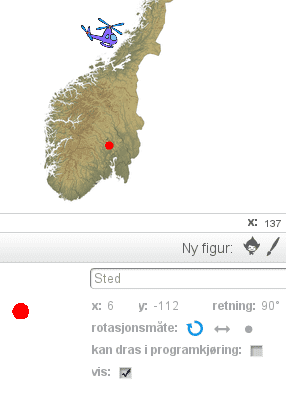

# Вступ {.intro}

Приєднуйтесь до подорожі Норвегією! Ми створимо гру, де ви керуватимете вертольотом на карті Норвегії, 
намагаючись якнайшвидше знайти місця та міста, які вам пропонують відвідати.


# Крок 1: Карта Норвегії {.activity}

*Спочатку ми додаємо карту Норвегії як фон. 
 Пізніше ми будемо використовувати її для відвідування різних місць на вертольоті.*

## Контрольний список {.check}

- [ ] Спочатку ми повинні завантажити файл, що містить карту з Інтернету. 
      Якщо цей файл вже є на вашому комп'ютері, ви можете пропустити цей крок.

- [ ] Клацніть правою кнопкою миші на посилання [norgeskart.png](norgeskart.png) і виберіть `відкрити в новій вкладці`. 
  Натисніть на нову вкладку, яка відкриється. Це покаже зображення карти Норвегії. 
  Клацніть правою кнопкою миші на зображення і виберіть `Збережіть зображення як` або щось подібне. 
  Збережіть зображення в місці, де ви зможете його знайти, наприклад, на Робочому столі.

- [ ] Почніть новий проект Scratch. Видаліть кота, наприклад, 
  клацнувши правою кнопкою миші на нього і вибравши `видалити`.

- [ ] Додайте карту Норвегії як фон, вибравши  у лівій частині екрана. Виберіть файл `norgeskart.png`, який ви завантажили раніше.
   
### Карта Норвегії {.protip}

В інтернеті є безліч карт. Карту, яку ми використовуємо в цьому завданні,
 створено Kartverket і надано для вільного використання. 
В кінці цього завдання описано, як ви можете використовувати інші карти.

# Крок 2: Керуйте вертольотом {.activity}

*Тепер ми створимо вертоліт, яким можна буде керувати на карті. 
Ми почнемо з програмування скрипта, 
який дозволить нам керувати вертольотом за допомогою стрілок на клавіатурі.*

## Контрольний список {.check}

- [ ] Завантажте нову фігуру натиснувши  `Фігури`. Ми використовуємо
  `Транспорт/Вертоліт`, але ви можете використати іншу фігуру яку оберете.

- [ ] Натисніть на `i`{.blockmotion} і підпишіть фігуру `Helikopter`. 
Встановіть обертання як показано на зображенні 
 щоб вертоліт не полетів догори-дном.

- [ ] Ми почнемо з того, що зменшимо розмір вертольота і
      забезпечимо його  старт завжди з одного й того ж місця. 
      Створіть цей скрипт:

  ```blocks
  коли @greenFlag натиснуто
  задати розмір (25) 
  перемістити в x: (0) y: (0)
  ```

- [ ] Тепер ми програмуємо керування вертольотом за допомогою стрілок на клавіатурі. 
      Ми зробимо це, запустивши цикл, який повторюється завжди. 
      Усередині цього нескінченного циклу ми перевіряємо, чи натиснуті стрілки, і якщо так, то переміщуємо вертоліт. 
      Спочатку створимо скрипт, який переміщує вертоліт вгору:

  ```blocks
  коли @greenFlag натиснуто
  задати розмір (25) 
  перемістити в x: (0) y: (0)
  завжди
      якщо <клавішу  [стрілка вгору v] натиснуто?> то
          рухатись в напрямку (0 v)
          перемістити на (2) кроки
      кінець			
  кінець
  ```

## Тестуємо проект {.flag}

__Натисніть на зелений прапорець.__

- [ ] Чи з'являється невеликий вертоліт приблизно посередині екрана (трохи на північний захід від Тронгейма)?

- [ ] Чи рухається вертоліт вгору, коли ви натискаєте стрілку вгору?

- [ ] Чи відбувається щось, коли ви натискаєте інші стрілки?

## Контрольний список {.check}

*Тепер ми програмуємо інші стрілки на клавіатурі.*

- [ ] Код для переміщення вертольота за допомогою інших стрілок дуже схожий на код, який переміщує вертоліт вгору.
  Тому ми можемо його скопіювати! Клацніть правою кнопкою миші на блок `якщо`{.blockcontrol}
  `клавішу стрілка вгору натиснуто`{.blocksensing}, і виберіть `зробіть копію`. 
  Вставте ці блоки в цикл `завжди`{.blockcontrol}. Повторіть, поки у вас не буде чотирьох блоків
  `якщо`{.blockcontrol}. Змініть свій скрипт, щоб він виглядав наступним чином:
  
  ```blocks
  коли @greenFlag натиснуто
  задати розмір (25) 
  перемістити в x: (0) y: (0)
  завжди
      якщо <клавішу  [стрілка вгору v] натиснуто?> то
          рухатись в напрямку (0 v)
          перемістити на (2) кроки
      кінець			

      якщо <клавішу  [стрілка вправо v] натиснуто?> то
          рухатись в напрямку (90 v)
          перемістити на (2) кроки
      кінець			
            якщо <клавішу  [стрілка вниз v] натиснуто?> то
          рухатись в напрямку (0 v)
          перемістити на (2) кроки
      кінець			
      якщо <клавішу  [стрілка вліво v] натиснуто?> то
          рухатись в напрямку (0 v)
          перемістити на (2) кроки
      кінець			
  slutt
  ```

## Тестуємо проект {.flag}

__Натисніть на зелений прапорець.__

- [ ] Чи можете ви використовувати всі чотири стрілки для керування вертольотом?

- [ ] Що визначає, з якою швидкістю рухається вертоліт? 
      Спробуйте змінити свій скрипт так, щоб вертоліт летів швидше або повільніше.

## Виклик: зміна швидкості {.challenge}

Якщо ви подивитися в скрипт, то побачите, що ми повторили число `2` цілих чотири рази. 
Це ускладнює зміну швидкості руху вертольота.

Якщо хочете, спробуйте створити нову змінну під назвою `швидкість`{.blockdata}. 
Потім встановіть цю змінну рівною 2 після натискання зеленого прапорця. 
Нарешті, замініть блоки `перемістити на 2 кроків`{.blockmotion} на 
блоки `перемістити`{.blockmotion} на `швидкість`{.blockdata} `кроків`{.blockmotion}.

# Крок 3: Додайте пункт призначення {.activity}

*Тепер, коли вертоліт може літати по Норвегії, 
ми можемо задати гравцеві пункт призначення для подорожі.*

## Контрольний список {.check}

- [ ] Тепер ми намалюємо свою власну фігуру, яку будемо використовувати для позначення місцезнаходження на карті. 
      Натисніть  `Фігури` у івій нижній частині екрану.

- [ ] Нам потрібне лише невелике коло. Виберіть відповідний колір, наприклад, червоний буде добре виглядати на карті.
      Потім виберіть інструмент «Коло» і позначте заповнене коло (еліпс) зліва від вікна малювання.


- [ ] Перш ніж ми почнемо малювати, ви можете збільшити малюнок, натиснувши на лупу внизу праворуч.
      Наприклад, підійде збільшення 800%.
      Утримуючи клавішу `shift`, витягніть коло розміром приблизно в чотири квадрати. 
      Клавіша `shift` допоможе вам створити повністю кругле коло.

  

- [ ] Натисніть на `i`{.blockmotion} і дайте їй ім'я `Місце`.

- [ ] Перетягніть цю нову фігуру Місце на будь-яке місце на карті, 
      яке ви хочете зробити першим пунктом призначення. 
	  Ми використали `Хьонефосс` як перший пункт призначення, 
	  але ви можете вибрати інше місце, якщо хочете.
 
- [ ] Тепер нам потрібна позиція нашого пункту призначення. 
  Її можна знайти, подивившись на інформацію про фігуру,
  на числа, що стоять за `x` і `y`. 
  Ці числа називаються координатами. У наведеному прикладі координатами є `x: 6` і `y: -112`. 
  Вони вказують, де на карті ми розмістили пункт призначення.

  

- [ ] Натисніть на вкладку `Код`{.blocklightgrey}. Тепер ми створимо код, 
який розмістить фігуру `Місце` у правильному місці та згодом визначить, 
чи вертоліт прилетів туди.

  ```blocks
  коли @greenFlag натиснуто
  оповістити [Місце: Хьонефосс v]

  коли я отримую [Місце: Хьонефосс v]
  перемістити x: (6) y: (-112)
  чекати поки <торкається [Helikopter v]?>
  говорити [Знайшов Хьонефосс!] (2) сек
  ```

  Зверніть увагу, що в блоці `перемістити в`{.blockmotion} ми використовуємо ті самі координати, 
  які знайшли раніше. Це означає, що якщо ви використовуєте свій власний пункт призначення, 
  вам потрібно замінити ці числа на ті, які ви знайшли.

## Тестуємо проект {.flag}

__Натисніть на зелений прапорець.__

- [ ] Чи знаходиться фігура `Місце`  там, де вона повинна бути на карті?

- [ ] Чи відображається повідомлення `Знайшов Хьонефосс!` (або ваш пункт призначення) коли вертоліт прилітає до пункту призначення?


# Крок 4: Новий пункт призначення {.activity}

*Давайте додамо новий пункт призначення, до якого ми можемо вирушити після відвідування першого!*

## Контрольний список {.check}

- [ ] Перемістіть фігуру `Місце` на нове місце на карті. Ми використаємо `Тромсе` . 
     Знайдіть координати цього нового місця так само, як і минулого разу.

- [ ] Додайте повідомлення внизу кода для `Хьонефосс`, яке викликає новий пункт призначення. 
  Потім створіть новий код для цього нового місця. 
  Цей новий код дуже схожий на перший, тому ви можете клацнути правою кнопкою миші на блоці `коли отримую Місце: 
  Хьонефосс`{.blockevents} і вибрати  `зроби копію`.


  ```blocks
  коли @greenFlag натиснуто
  оповістити [Місце: Хьонефосс v]

  коли я отримую [Місце: Хьонефосс v]
  перемістити x: (6) y: (-112)
  чекати поки <торкається [Helikopter v]?>
  говорити [Знайшов Хьонефосс!] (2) сек
  оповістити [Місце: Тромсе v]

  коли я отримую [Місце: Тромсе v]
  перемістити x: (103) y: (121)
  чекати поки <торкається [Helikopter v]?>
  говорити [Знайшов Тромсе!] (2) сек
  ```
  Використовуйте власні координати (та назви) і для другого пункту призначення.
  
## Тестуємо проект {.flag}

__Натисніть на зелений прапорець.__

- [ ] Чи переміщується пункт призначення після того, як ви знайшли перше?

- [ ] Чи визначає також другий пункт призначення, що ви його знайшли?

# Крок 5: Сховайте пункт призначення {.activity}

*Поки що гра не дуже складна: усе, що вам потрібно зробити, 
 це направити вертоліт до червоного кола. Щоб зробити гру по-справжньому цікавою, 
 ми приховаємо червоне коло та просто повідомимо гравцю, до якого місця він має летіти!
*

## Контрольний список {.check}

Спочатку повідомимо гравцю, куди він повинен летіти.

- [ ] Створіть нову змінну, натиснувши на  `Змінні`{.blockdata} та потім `Створити змінну`.
  Назвіть змінну  `Летіти до`{.blockdata} і виберіть, щоб вона була доступна `Для всіх спрайтів`.

- [ ] Зверніть увагу, що на карті з'явилася панель з написом `Летіти до`{.blocklightgrey} `0`{.blockdata}. 
  Перемістіть цю панель у зручне місце, щоб вона була легко читабельною.

- [ ] Тепер ми можемо оновити код для спрайта `Місце`,
щоб він встановлював значення змінної `Летіти до`{.blockdata}. 
Спочатку змініть код для `Хьонефосс` наступним чином:
  

  ```blocks
  коли я отримую [Місце: Хьонефосс v]
  перемістити x: (6) y: (-112)
  надати [Летіти до] значення [Хьонефосс] 
  чекати поки <торкається [Helikopter v]?>
  говорити [Знайшов Хьонефосс!] (2) сек
  оповістити [Місце: Тромсе v]
  ```

- [ ] Змініть також код для другого пункту призначення таким же чином:

  ```blocks
  коли я отримую [Місце: Тромсе v]
  перемістити x: (103) y: (121)
  надати [Летіти до] значення [Тромсе]
  чекати поки <торкається [Helikopter v]?>
  говорити [Знайшов Тромсе!] (2) сек
  ```

## Тестуємо проект {.flag}

__Натисніть на зелений прапорець.__

- [ ] Чи працює гра так само, як і раніше?

- [ ] Чи оновлюється змінна `Летіти до`{.blockdata}, як ви очікували?

## Контрольний список {.check}

Тепер ми готові приховати червоне коло. Спочатку спробуємо найпростіше та найочевидніше:

- [ ] Додайте блок `сховати`{.blocklooks} до початкового коду для спрайта `Місце`.

  ```blocks
  коли @greenFlag натиснуто flagg klikkes
  сховати
  оповістити [Місце: Хьонефосс v]
  ```

## Тестуємо проект {.flag}

__Натисніть на зелений прапорець.__

- [ ]  Чи зникає червоне коло?

- [ ]  Що станеться, якщо ти подорожуєш до Хьонефоса?

Хмм... гра більше не визначає, що ми подорожуємо до Хьонефоса. Проблема в тому, 
що коли ми приховуємо коло, воно більше не торкається фігури `Гелікоптер`. 
Нам потрібно знайти інший спосіб зробити коло невидимим!

## Sjekkliste {.check}

- [ ] Замість того, щоб повністю приховати коло, ми зробимо його прозорим!
     Замініть блок `сховати`{.blocklooks} на `встановити ефект`{.blocklooks}.

  ```blocks
  коли @greenFlag натиснуто flagg klikkes
  показати
  встановити ефект [привид v] в (100)
  оповістити [Місце: Хьонефосс v]
  ```

  Ми також додали блок `показати`{.blocklooks} для надійності (ми вже з’ясували, що гра не працює, якщо фігура `Місце` прихована).

## Тестування проекту {.flag}

__Натисніть на зелений прапорець.__

- [ ] Чи залишається червоне коло невидимим?

- [ ] Що відбувається зараз, коли ти подорожуєш до Хьонефоса?

# Крок 6: Показати місце після його знаходження {.activity}

*Буде круто показати гравцеві, де саме знаходиться місце, коли він його знайде!*

## Контрольний список {.check}

- [ ] Додамо нове повідомлення `Знайдено місце`, яке ми будемо надсилати щоразу, коли гравець знаходить місце призначення. 
      Це повідомлення ми використаємо для запуску скрипту щоразу, коли знайдено місце. 
      Змініть скрипти `Місце` наступним чином:


  ```blocks
  коли я отримую [Місце: Хьонефосс v]
  перемістити x: (6) y: (-112)
  чекати поки <торкається [Helikopter v]?>
  говорити [Знайшов Хьонефосс!] (2) сек
  оповістити [Знайдено місце v] і чекати
  оповістити [Місце: Тромсе v]

  коли я отримую [Місце: Тромсе v]
  перемістити x: (103) y: (121)
  чекати поки <торкається [Helikopter v]?>
  оповістити [Знайдено місце v] і чекати
 
  
  ```

- [ ] Коли ми отримуємо повідомлення `Знайдено місце`, ми хочемо показати, 
      де знаходиться місце призначення. Оскільки коло скоро переміститься далі, 
      ми не можемо просто зробити фігуру видимою, 
      ми також повинні `штампувати відбиток`{.blockpen} фігури на фоні. Додайте цей скрипт:


  ```blocks
  коли я отримую [Знайдено місце v]
  встановити ефект [привид v] в (100)
  штампувати відбиток
  встановити ефект [привид v] в (100)
  ```

## Test prosjektet {.flag}

__Натисніть на зелений прапорець.__

- [ ] Чи з’являється червоне коло, коли ви знаходите місця призначення?

- [ ] Що відбувається, якщо ви перезапустите гру після знаходження місць призначення?

## Контрольний список {.check}

- [ ] Щоб переконатися, що відбитки (червоні кола) зникають, коли ми
      запускаємо гру заново, можна використати блок `стерти`{.blockpen}.
      Додайте цей блок у скрипт запуску:

  ```blocks
  коли @greenFlag натиснуто
  сховати
  показати
  встановити ефект [привид v] в (100)
  оповістити [Місце: Хьонефосс v]
  ```

- [ ] Додамо також простий звуковий ефект, коли гравець знаходить
      пункт призначення. Оскільки у нас є повідомлення `Знайдено місце`,
      це зробити легко. Спочатку натисніть на вкладку `Звук`{.blocklightgrey}
      і виберіть новий звук із бібліотеки. Ми використовуємо
      `Ефекти/rattle`, але ви можете вибрати інший звук.

- [ ] Відтворюйте звук, коли знайдено місце. Відкрийте вкладку
      `Скрипти`{.blocklightgrey} і додайте блок `відтворити звук`{.blocksound}.

  ```blocks
  коли я отримую [Знайдено місце v]
  відтворити звук [rattle v]
  встановити ефект [привид v] в (100)
  штампувати відбиток
  встановити ефект [привид v] в (100)
  ```

## Перевірка проєкту {.flag}

__Натисніть на зелений прапорець__

- [ ] Чи видаляються червоні кола, коли ви запускаєте гру знову?

- [ ] Чи відтворюється звук, коли ви знаходите місце?


# Крок 7: Час спливає {.activity}

*Тепер ми зробимо гру ще складнішою, додавши обмеження за часом.*

## Контрольний список {.check}


- [ ] Натисніть на `Сцена` зліва від списку спрайтів. Скрипти, які мають діяти на всю гру, 
      а не на конкретний спрайт, можна додати до сцени. У цьому випадку нам потрібна змінна, яка відраховуватиме час,
      що залишився у гравця для подорожей. Це чудовий приклад змінної, яка належить всій грі.

- [ ] Виберіть `Змінні`{.blockdata} та `Створити змінну`{.blocklightgrey}. 
      Назвіть змінну `Час`{.blockdata}. Оскільки ми створюємо змінну на сцені, 
      вона буде доступною для всіх спрайтів.

- [ ]  Коли гра починається, ми дамо гравцеві певний час. Для цього встановимо `Час`{.blockdata} на, 
       наприклад, `30` секунд (ви можете експериментувати з іншими значеннями). 
       Потім запустимо цикл, який відраховуватиме час.

  ```blocks
  коли @greenFlag натиснуто
  надати [Час v] значення [30]
  чекати поки <(Час) = [0]>
      чекати (1) sekunder
      змінити [Час v] на (-1)
  кінець
  оповістити [Кінець v]
  ```
 Зверніть увагу, що ми також надсилаємо повідомлення `Кінець`, коли час спливає. Ми використаємо його для завершення гри.

- [ ] Створіть новий скрипт на сцені, який завершуватиме гру.

  ```blocks
  коли я отримую [Кінець v]
  зупинити [все v] :: control
  ```

## Тестування проекту {.flag}

__Натисніть на зелений прапорець.__

- [ ] Чи починається відлік з `30` секунд на початку гри?

- [ ] Чи зменшується час поступово?

- [ ]  Чи завершується гра (гелікоптер більше не може літати), коли час спливає?

## Контрольний список {.check}

Як бонус, ми можемо додати гравцеві трохи додаткового часу щоразу, коли він знаходить місце призначення.

- [ ] Створіть новий скрипт на сцені, який реагуватиме на повідомлення `Знайдено місце`.

  ```blocks
  коли я отримую [Знайдено місце v]
  змінити [Час v] на (10)
  ```

# Крок 8: Більше місць для відвідування {.activity}

*Нарешті, ми додамо ще кілька місць для подорожей, щоб зробити гру цікавішою!*

## Контрольний список {.check}

Щоб додати нові місця, потрібно повторити те, що ми вже робили раніше (у кроках 3 та 4). 
Найпростіший спосіб — скопіювати існуючі блоки коду та змінити їх.

- [ ] Виберіть спрайт `Місце`.

- [ ] Ми зробили спрайт `Місце` повністю прозорим. Щоб зробити його видимим знову, 
      просто натисніть блок `стерти графічні ефекти`{.blocklooks} у категорії `Вигляд`{.blocklooks} 
      (не потрібно додавати цей блок у скрипт). Також корисно натиснути блок `стерти`{.blockpen} 
      у категорії `Олівець`{.blockpen}.
 
- [ ] Перемістіть червоне коло в нове місце. Запишіть координати, переглянувши інформацію про спрайт `i`{.blockmotion}.

- [ ] Клацніть правою кнопкою миші на скрипті, який починається з `коли отримано Місце: Хьонефосс`{.blockevents}, 
      і виберіть `створити копію`. Оновіть цю копію, вказавши нову назву місця та координати.


- [ ] Нижче наведено приклад додавання трьох нових місць 
      (а також додавання повідомлення для подорожі далі з Тромсе). 
      Ваші скрипти повинні виглядати подібно до цих, 
      але ви можете використовувати інші назви та координати.


  ```blocks
  коли я отримую [Місце: Хьонефосс v]
  перемістити x: (6) y: (-112)
  надати [Летіти до] значення [Хьонефосс]
  чекати поки <торкається [Helikopter v]?>
  оповістити [Знайдено місце v] і чекати
  оповістити [Місце: Тромсе v]
  
  коли я отримую [Місце: Тромсе v]
  перемістити x: (103) y: (121)
  надати [Летіти до] значення [Тромсе]
  чекати поки <торкається [Helikopter v]?>
  оповістити [Знайдено місце v] і чекати
  оповістити [Місце: Ліллехаммер  v]

  коли я отримую [Місце: Ліллехаммер v]
  перемістити x: (14) y: (-94)
  надати [Летіти до] значення [Ліллехаммер]
  чекати поки <торкається [Helikopter v]?>
  оповістити [Знайдено місце v] і чекати
  оповістити [Місце: Берген  v]

  коли я отримую [Місце: Берген v]
  перемістити x: (-52) y: (-107)
  надати [Летіти до] значення [Берген]
  чекати поки <торкається [Helikopter v]?>
  оповістити [Знайдено місце v] і чекати
  оповістити [Місце: Нарвік  v]

  коли я отримую [Місце: Нарвік v]
  перемістити x: (91) y: (90)
  надати [Летіти до] значення [Нарвік]
  чекати поки <торкається [Helikopter v]?>
  оповістити [Знайдено місце v] і чекати
  оповістити [Кінець  v]

  ```

## Тестування проекту {.flag}

__Натисніть на зелений прапорець.__

- [ ] Чи можете ви подорожувати до всіх місць?

- [ ] Чи правильно розташовані місця на карті?

## Збережіть проект {.save}

*На цьому наша подорож до Норвегії закінчена!*

Тепер ви можете запросити друзів і родину подорожувати Норвегією разом
з тобою! Якщо ви хочете поділитися грою в Інтернеті, ви можете натиснути `Опублікувати` вгорі
праворуч від екрана.

# Більше викликів {.activity}

*Завжди є можливість розширити ігру, нижче ми навели кілька пропозицій, які ти
 можеш спробувати сам!*

## Виклик: Більше місць для подорожей {.challenge}

Det er ingen begrensning på hvor mange reisemål du kan legge til i spillet. Har
du reisemål fra alle deler av landet? Kanskje du kan besøke et sted i hvert
fylke i Norge?

Ми не обмежуємо кількості пунктів призначення, які ви можете додати до гри. 
У вас є місця з усіх куточків країни? 
Можливо, ви можете відвідати кожну частину Норвегії?

## Виклик: Завершення гри {.challenge}

Зараз гра виглядає так: вертоліт припиняє політ лише коли закінчився час або 
коли гравець знайшов усі пункти призначення. Чи можете ви додати нове закінчення? 
Це повинно дати гравцеві розуміння того, чи він виграв, знайшовши всі пункти призначення, 
або програв через вичерпання часу. 

Зробити це можна створивши два нових повідомлення `Перемога` і `Програш`, 
які надсилаються замість `Кінець` після того, 
як було знайдено останнє місце призначення або після закінчення часу. 
Потім ви можете створити два нових фони, скопіювавши карту Норвегії, 
і написати відповідний текст на нових фонах. 
Після їх можна відобразити коли гру виграно або програно.

## Виклик: Пункти призначення у випадковому порядку {.challenge}

Це справжній виклик! Зараз пункти призначення з’являються завжди в одному й тому ж порядку. 
Чи можеш ти зробити так, щоб порядок був випадковим?

У Scratch немає можливості надсилати випадкові повідомлення. 
Натомість ми можемо випадковим чином вирішувати, 
чи потрібно запитати гравця про подорож до певного пункту призначення, 
або просто перейти до наступного без запиту.

- [ ] Нижче наведено кілька підказок щодо того, як це можна реалізувати. 
Зверни увагу, що скрипти використовують деякі змінні, які потрібно створити самостійно.

  ```blocks
  визначити перевірити місце
  якщо <<(випадкове число від (1) до (Загальна кількість місць)) > [1]> або <торкається кольору [#ff0000]?>>
      встановити [використати місце v] у [ні]
  то
      встановити [використати місце v] у [так]
  кінець

  коли я отримую [Місце: Хьонефосс v]
  перемістити x: (6) y: (-112)
  перевірити місце
  якщо <(використати місце) = [так]>
      встановити [Reis til v] til [Хьонефосс]
      оповістити [Знайдено місце v] і чекати
      кінець
  оповістити [Місце: Тромсе v]
    
  ```

  Блок `торкається кольору`{.blocksensing} використовується для перевірки, чи вже ми відвідали місце призначення. 
  Якщо так, то на карті вже буде поставлено червону мітку.

- [ ] Оскільки деякі пункти призначення можуть пропускатися, важливо, 
 щоб останнє місце призначення надсилало повідомлення про повернення до першого місця, 
 замість завершення гри після останнього пункту.

- [ ] Також буде складніше зрозуміти, коли гравець знайшов усі (або достатню кількість) місць. 
 Один із способів вирішення цієї проблеми — використання нової змінної, 
 наприклад `Кількість знайдених місць`{.blockdata}, яка рахує знайдені місця. 
 Коли буде знайдено достатньо місць, можна надіслати повідомлення `Завершити` (або `Перемога`).

# Як створювати власні карти {.activity}

*Насамкінець розглянемо, як можна подорожувати власними картами або іншими картами, 
знайденими в інтернеті.*

## Контрольний список {.check}

- [ ] Відкрий браузер і знайди пошукову систему, наприклад, Google, Bing або DuckDuckGo.

- [ ] Виконай пошук карти, яка тебе цікавить, наприклад, `Карта Європи`. Вибери показ лише зображень.

- [ ] Коли знайдеш карту, яка тобі подобається, натисни на неї, щоб перейти до оригінального зображення. 
  Потім спробуй клацнути правою кнопкою миші по карті та вибрати "Зберегти зображення" або щось подібне.


- [ ] Перед використанням карти в проєкті, який ти збираєшся опублікувати, перевір, 
 чи маєш право її використовувати. Іноді на сайті, де ти знайшов карту, 
 буде зазначено, що її можна використовувати 
 (наприклад, на <http://no.wikipedia.org/wiki/Fil:EUR_location_NOR.PNG>). 
 В інших випадках тобі потрібно зв’язатися з власниками сайту (наприклад, надіслати їм електронний лист), 
 щоб дізнатися, чи можна використовувати карту. Дивись більше інформації про авторське право нижче.


- [ ] Фонові зображення в Scratch повинні мати роздільну здатність 480 × 360 пікселів. 
 Зазвичай знайдені в інтернеті карти мають іншу роздільну здатність. 
 Це не є проблемою, тому що Scratch автоматично змінює розмір великих зображень. 
 Якщо зображення менше за 480 × 360, Scratch заповнить решту фону автоматично. 
 Якщо ти хочеш більше контролю над цим процесом, можеш змінити роздільну здатність самостійно 
 за допомогою графічного редактора, такого як Paint, Gimp або Photoshop (Elements).


- [ ] Les inn det nye kartet i Scratchprosjektet ditt på samme måte som du leste
  inn det opprinnelige norgeskartet i Steg 1, ved å velge  under `Ny bakgrunn` helt til venstre på
  skjermen.
  
  
 Завантаж нову карту в проєкт Scratch так само, як ти завантажував початкову карту Норвегії в Кроці 1.
 Для цього вибери  у розділі `Новий фон` у лівій частині екрана.


- [ ]  Створи нові пункти призначення на основі своєї карти!

## Авторське право {.protip}

Noen har laget de kartene du finner på internett, og som regel vil de ha
opphavsretten til disse kartene. I praksis betyr det at de eier kartene. Det
betyr at dersom du vil bruke kartene i et spill du gjør tilgjengelig for andre
(bruker `Legg ut`-knappen i Scratch), må du undersøke om dette er greit for de
som har laget kartene.

Більшість карт, які можна знайти в інтернеті, були створені кимось, 
і зазвичай ці люди мають на них авторське право. Це означає, що вони володіють цими картами. 
Якщо ти хочеш використовувати карту у своїй грі та зробити її доступною для інших (`Опублікувати` у Scratch), 
тобі потрібно перевірити, чи дозволено це творцем карти.


Mye materiell på internett, inkludert kartet vi har brukt i denne oppgaven, er
lagt ut med en såkalt lisens som kan si at du kan bruke materiellet så lenge du
referer til dem som opprinnelig lagde materiellet. Dette er lett å gjøre i
Scratch. Klikk på `Se prosjektsiden` øverst til høyre. Du kommer da til en side
hvor du kan beskrive prosjektet. En av boksene heter `Merknader og
bidragsytere`. Her kan du nevne dem som opprinnelig har laget for eksempel
kartet du bruker.


Багато матеріалів в інтернеті, зокрема карта, яку ми використовували у цій вправі, 
доступні за спеціальними ліцензіями. Такі ліцензії можуть дозволяти використання матеріалу за умови, 
що ти вказуєш авторів. У Scratch це зробити дуже просто: натисни `Переглянути сторінку проєкту`
 у верхньому правому куті. Ти перейдеш на сторінку, де можна описати свій проєкт. 
 Один із розділів називається `Примітки та учасники`. 
 Тут ти можеш зазначити тих, хто створив, наприклад, карту, яку ти використовуєш.
