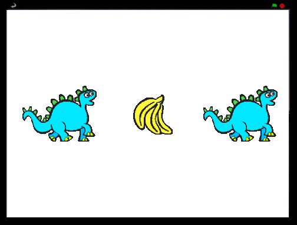

# Introduksjon {.intro}

Dette er et spill med tre figurer som endrer utseende. Din oppgave er
å stoppe figurene én etter én, slik at alle tre blir like.



# Steg 1: Lag en figur som bytter drakt {.activity}

*La oss importere de bildene vi trenger for spillet.*

## Sjekkliste {.check}

+ Start et nytt Scratch-prosjekt. __Slett katten__ ved å høyreklikke
  og velge `slett`.

+ Importer __en ny figur__,
  . Velg
  den figuren du vil.

+ Gå til `Drakter`{.blocklightgrey}, og importer to ekstra drakter fra
  biblioteket, slik at figuren har tre drakter til sammen. Det er bra
  om draktene er ganske forskjellige.

# Steg 2: Få figuren til å rullere {.activity}

*Nå som figuren har noen drakter, ønsker vi at den skal veksle mellom
 dem.*

## Sjekkliste {.check}

+ Klikk på `Skript`-fanen,

+ Legg til dette skriptet:

  ```blocks
  Når grønt flagg klikkes
  for alltid
      neste drakt
      vent (0.5) sekunder
  slutt
  ```

+ Tilpass tiden i `vent`{.blockcontrol}-klossen til figuren endrer
  drakt i et passende tempo. Hva tror du ville skjedd om vi ikke hadde
  med `vent`{.blockcontrol}-klossen?

## Test Prosjektet {.flag}

__Klikk på det grønne flagget.__

+ Endrer figuren drakt i et fornuftig tempo?

## Ting å prøve {.try}

Tilpass tiden i `vent`{.blockcontrol}-klossen. Hvilke tall gjør spillet
for vanskelig eller for lett?

# Steg 3: Frys ruletten! {.activity}

*Nå skal vi se hvordan vi kan få draktene til å stoppe når vi klikker
 på figuren.*

## Sjekkliste {.check}

Bra! Vi kan få draktene til å bytte i det uendelige, men hvordan får
vi de til å stoppe når vi klikker på de?  En måte å gjøre dette på er
ved å bruke en variabel som setter statusen til figuren. Dette vil vi
se at er praktisk også senere.

+ Klikk på `Data`{.blockdata} og `Lag en variabel`.  Kall variabelen
  `stoppet`{.blockdata} og huk av for `For denne figuren`. Fjern
  avhukingen foran variabelen slik at den ikke vises på scenen.

+ På starten av spillet vil ikke figuren ha blitt klikket så da setter
  vi variabelen til `0`.

  ```blocks
  når grønt flagg klikkes
  sett [stoppet v] til [0]
  for alltid
      neste drakt
      vent (0.5) sekunder
  slutt
  ```

+ Nå vil vi sette variabelen `stoppet`{.blockdata} til `1` når noen
  klikker på figuren.

  ```blocks
  når denne figuren klikkes
  sett [stoppet v] til [1]
  ```

+ Til slutt må vi få figuren til å slutte å forandre drakt når
  variabelen `stoppet`{.blockdata} blir `1`. Legg til en
  `hvis`{.blockcontrol}-løkke og bruk en `_ = _`{.blockoperators}
  operator-kloss for å sjekke om `stoppet`{.blockdata} fremdeles er
  `0`.

  ```blocks
  når grønt flagg klikkes
  sett [stoppet v] til [0]
  for alltid
      hvis <(stoppet) = [0]>
          neste drakt
          vent (0.5) sekunder
      slutt
  slutt
  ```

## Test prosjektet {.flag}

__Klikk på det grønne flagget.__

+ Endres drakten før du klikker på den?

+ Stopper den når du klikker på den?

__Start skriptet en gang til ved å klikke på det grønne flagget igjen.__

+ Stopper figuren når du setter musepekeren over den uten å klikke?

+ Stopper den når du klikker andre steder på scenen eller andre steder
  i Scratch?

# Steg 4: Lag de andre figurene {.activity}

*Nå trenger vi to figurer til for å gjøre spillet komplett!*

## Sjekkliste {.check}

+ __Dupliser figuren din__ ved å høyreklikke på den og velge `lag en
  kopi`.

+ Lag en kopi til slik at du har tre figurer på skjermen. Vi har kalt
  våre figurer `Figur1`, `Figur2` og `Figur3`.

+ Flytt figurene slik at de er en linje. Gjør dem mindre med
  krympeknappen, , hvis det trengs.

## Test prosjektet{.flag}

__Klikk på det grønne flagget.__

+ Alle figurene skal nå forandre seg. Prøv å stoppe dem, én etter én!

# Steg 5: Start hver figur med en tilfeldig drakt {.activity}

*La oss få figurene til å skifte til en tilfeldig drakt når det grønne
 flagget klikkes.*

Når du starter spillet vil du se at alle figurene skifter drakt
samtidig.  Spillet vil bli morsommere (og vanskeligere) dersom de
endres litt mer uforutsigbart.

## Sjekkliste {.check}

+ Hvis du ser under `Drakter`{.blocklightgrey}-fanen til en figur vil
  du se at hver drakt har et nummer.  Du kan spesifisere hvilken drakt
  figuren skal ha ved å bruke enten navnet eller nummeret.

+ For å få figuren til å starte med en tilfeldig drakt, la oss legge
  til en `bytt drakt til`{.blocklooks}-kloss med `tilfeldig tall fra 1
  til 3`{.blockoperators} for å velge draktnummer.

+ Vi kan også bruke den samme klossen i `for
  alltid`{.blockcontrol}-løkken slik at figuren skifter til en ulik
  drakt hver gang den forandres.

  ```blocks
  når grønt flagg klikkes
  sett [stoppet v] til [0]
  bytt drakt til (tilfeldig tall fra (1) til (3))
  for alltid
      hvis <(stoppet) = [0]>
          bytt drakt til (tilfeldig tall fra (1) til (3))
          vent (0.5) sekunder
      slutt
  slutt
  ```

+ Gjør det samme for hver av de andre figurene.

## Test prosjektet{.flag}

__Klikk på det grønne flagget.__

+ Alle figurene skal nå skifte drakter i tilfeldig rekkefølge.

+ Hvordan må vi forandre skriptet dersom vi legger til en annen drakt?

## Ting å prøve{.try}

 __Gjør spillet vanskeligere!__

Se om du klarer å endre vanskelighetsgraden på et eller annet vis. Å
få draktene til å rullere raskere er enkelt. Prøv å gjøre noe litt mer
oppfinnsomt. Noen muligheter du kan tenke på er:

+ Endre antall drakter hver figur har.

+ Gi noen av figurene helt forskjellige drakter.

+ Bruk forskjellige tider mellom hvert draktbytte.

__Lek og kom opp meg egne idéer!__

Hver gang du endrer noe, tenk på om det vil gjøre spillet lettere
eller vanskeligere. Er spillet for lett eller for vanskelig? Hvordan
kan du justere det slik at det blir akkurat passe?

# Steg 6: Vis en melding når spillet er over {.activity}

*La oss vise en `Spillet er slutt`-melding når spillet er over.*

## Sjekkliste {.check}

La oss først hente en ny bakgrunn som vi viser når spillet er over.

+ Klikk på scenen og deretter på `Bakgrunner`{.blocklightgrey}-fanen.
  Forandre navnet på den eksisterende bakgrunnen til `Spill`.

+ Lag en kopi av bakgrunnen og legg til en tekst som sier `Spillet er
  slutt!`. Du kan forandre størrelsen på teksten ved å klikke på den
  og dra i hjørnene. Kall bakgrunnen `Slutt`.

+ Klikk på `Skript`-fanen for scenen og pass på at du bytter til
  `Spill`-bakgrunnen når spillet starter.

+ Hvordan kan vi sjekke om alle figurene har stoppet? Husk at vi
  brukte `stoppet`{.blockdata}-variabelene for å sjekke om figurene
  hadde blitt klikket på. La oss sjekke
  `stoppet`{.blockdata}-variabelen for `Figur3` for å se om den er
  klikket. For å gjøre dette bruker vi en `x-posisjon av
  Figur3`{.blocksensing}-kloss fra `Sansning`{.blocksensing}, men hvor
  vi bytter ut `x-posisjon` med `stoppet`.

  ```blocks
  når grønt flagg klikkes
  bytt bakgrunn til [Spill v]
  vent til <([stoppet v] av [Figur3 v])  = [1]>
  bytt bakgrunn til [Slutt v]
  ```

## Test prosjektet{.flag}

__Klikk på det grønne flagget.__

+ Vises `Spillet er slutt`-meldingen når du klikker på `Figur3`?

+ Hva skjer dersom du stopper `Figur3` før du har klikket begge de
  andre figurene?

La oss forandre skriptet slik at det vil funke uansett hvilken
rekkefølge figurene stoppes i.

## Sjekkliste {.check}

+ For å sjekke om __alle tre__ figurene sine
  `stoppet`{.blockdata}-variabler er satt til `1`, kan vi bruke
  `og`{.blockoperators}-operatoren.  Dette er en komplisert kloss som
  kan være litt trøblete å lage, så forsøk å gjøre ett steg av
  gangen. Legg merke til at vi har satt sammen to
  `og`{.blockoperators}-klosser, tre `_ =
  _`{.blockoperators}-operatorer og tre `stoppet av
  Figur`{.blocksensing}-klosser.

  ```blocks
  når grønt flagg klikkes
  bytt bakgrunn til [Spill v]
  vent til < < <([stoppet v] av [Figur1 v]) = [1]> og <([stoppet v] av [Figur2 v]) = [1]> > og <([stoppet v] av [Figur3 v]) = [1]> >
  bytt bakgrunn til [Slutt v]
  ```

## Test prosjektet{.flag}

__Klikk på det grønne flagget.__

+ Vises `Spillet er slutt`-meldingen når alle tre figurene er stoppet,
  uansett hvilken rekkefølge du klikket på dem?

# Steg 7. Fortell spilleren om de vant eller tapte. {.activity}

*Målet med spillet er å klikke på figurene slik at de stopper når de
 viser samme drakten. Det ville være praktisk å vise en melding som
 forteller deg om du vant eller tapte.*

## Sjekkliste {.check}

Vi har tidligere skrevet kode som sjekker om spillet er over, så alt
vi trenger å gjøre er å sjekke om spilleren har vunnet.

+ Gå tilbake til bakgrunnene og lag en kopi av
  `Slutt`-bakgrunnen. Skift navn på `Slutt` til `Vinner`. Gi kopien
  navnet `Taper`.

+ Legg til teksten `Du vant!` på `Vinner`-bakgrunnen.

+ I `Taper`-bakgrunnen kan du skrive teksten `Du tapte!`.

Nå trenger vi kode for å velge hvilken bakgrunn vi skal vise når
spillet er over.

+ Vi kan bruke en `hvis ellers`{.blockcontrol} kloss for å se om
  brukeren har vunnet eller tapt ved å sammenligne `drakt nr.` (drakt
  nummer). Vi bruker en kloss som ligner på `x-posisjon av
  Figur`{.blocksensing}-klossen vi brukte tidligere.  Denne gangen,
  istedet for å se på `stoppet`{.blockdata}-variabelen, skal vi sjekke
  `drakt nr.` og se om `Figur1` har samme drakt som `Figur2` og om
  `Figur2` har samme drakt som `Figur3`.

  ```blocks
  når grønt flagg klikkes
  bytt bakgrunn til [Spill v]
  vent til < < <([stoppet v] av [Figur1 v]) = [1]> og <([stoppet v] av [Figur2 v]) = [1]> > og <([stoppet v] av [Figur3 v]) = [1]> >
  hvis <<([drakt nr. v]  av [Figur1 v]) = ([drakt nr. v]  av [Figur2 v])> og <([drakt nr. v]  av [Figur2 v]) = ([drakt nr. v] av [Figur3 v])>>
      bytt bakgrunn til [Vinner v]
  ellers
      bytt bakgrunn til [Taper v]
  slutt
  ```

## Test prosjektet{.flag}

__Klikk på det grønne flagget.__

+ Vises den riktige meldingen når spillet er over?

+ Hva skjer hvis draktnummerene ikke er like?

__Veldig bra!__ Du har nå fullført spillet, men det er fremdeles ting
du kan gjøre med spillet ditt. Prøv deg på disse utfordringene!

## Utfordring: Gjør spillet enklere og vanskeligere med tiden {.challenge}

Alle er ikke like flinke til spillet. Hvordan kan du la
vanskelighetsgraden __avhenge av spilleren?__

En måte å gjøre dette på er å __endre hastigheten draktene forandres
på__. Du kan bruke en variabel kalt `forsinkelse`{.blockdata} for å gi
varigheten til hver figurs ventekloss.  Hvis spilleren vinner runden
kan forsinkelsen reduseres litt (for å gjøre spillet vanskeligere).
Hvis spilleren taper runden kan man øke forsinkelsen litt for å gjøre
spillet lettere.

Du må sikkert vurdere å bruke en annen måte å starte spillet på
istedet for å bruke `når grønt flagg klikkes`{.blockgrey}.  Deretter
kan du lagre verdiene i variabler som huskes mellom rundene.

## Lagre prosjektet {.save}

__Godt gjort, du er ferdig! Nå kan du nyte spillet ditt!__

Ikke glem at du kan dele spillet med alle vennene og familien din ved
å klikke på `Legg ut` i topp-menyen!
