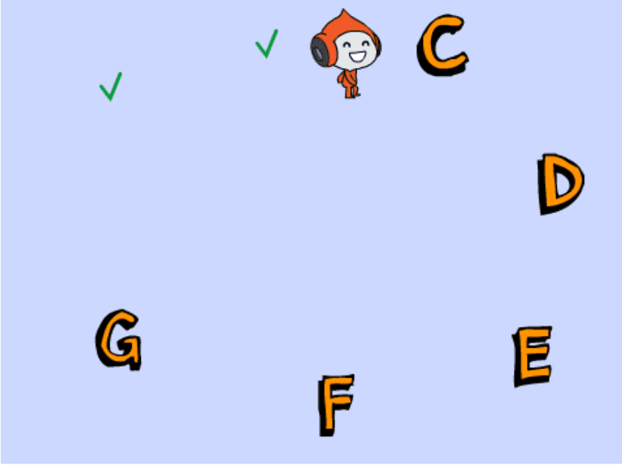

# Introduksjon {.intro}

Vi skal øve på forflytning i en scene. `Løperen` i scenen skal berøre alle
bokstav-postene. Når det er gjort `vinner` han spillet. Hvor mange måter klarer
du å løse oppgaven?

# Steg 1: Lag en remiks av Orienteringsløpet {.activity}

*Vi tar utgangspunkt i et prosjekt som allerede er laget.*

## Sjekkliste {.check}

- [ ] Gå til
  [https://scratch.mit.edu/projects/261157815](https://scratch.mit.edu/projects/261157815){target=_blank}.

- [ ] Se inni prosjektet, og trykk remiks-knappen.

Nå får du en kopi av prosjektet.

# Steg 2: Gi løpekaren en måte å berøre alle bokstavene {.activity}

*Lag kode som flytter løperen mellom bokstavene.*

Begynn å legge inn kode under klossen `Når jeg mottar start
figuren`{.blockevents}, som vist på bildet:

## Sjekkliste {.check}

- [ ] Prøv ulike måter å kode ham omkring slik at han berører hver bokstav. Når
  han har berørt alle bokstavene, skifter scenen utseende og jubler for deg.

- [ ] Du kommer nok til å trenge kommandoer fra `Hendelser`{.blockevents},
  `Styring`{.blockcontrol} og `Bevegelse`{.blockmotion}. Men alle klosser
  er lov!

- [ ] Du trenger ikke treffe bokstavene i alfabetisk rekkefølge.

- [ ] Du trenger ikke å løpe i en ring, alt du må gjøre er å berøre alle
  bokstavene på en eller annen måte.

# Steg 3: Klarte du det? {.activity}

## Test prosjektet {.flag}

__Klikk på det grønne flagget.__

- [ ] Fungerer koden?

## Utfordring {.challenge}

* Prøv å løse det på flere måter!

* Hvor mange måter klarer du å berøre alle postene?

## Lagre prosjektet {.save}

Veldig bra! Nå er du ferdig og kan kose deg med spillet du har laget!
