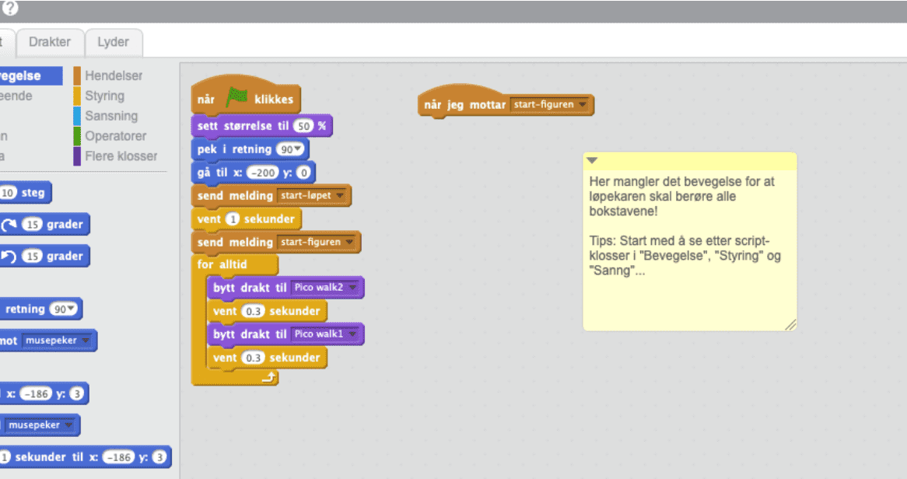

# Introduksjon {.intro}

Me skal øve på flytting på ei scene. `Springaren` på scena skal ta på alle
bokstav-postane. Når det er gjort `vinn` han spelet. Kor mange måtar kan du
løyse oppgåva på?

# Steg 1: Lag ein remiks av Orienteringsløpet {.activity}

*Me tek utgangspunkt i eit prosjekt som allereie er laga.*

## Sjekkliste {.check}

- [ ] Gå til
  [https://scratch.mit.edu/projects/261157815](https://scratch.mit.edu/projects/261157815){target=_blank}.

- [ ] Sjå inni prosjektet, og trykk remiks-knappen.

No får du ein kopi av prosjektet.

# Steg 2: Gi springaren ein måte å ta alle bokstavane på {.activity}

*Lag kode som flyttar springaren mellom bokstavane.*

Start med å leggje inn kode under klossen `Når er får meldinga start
figuren`{.blockevents}, som vist på biletet:

## Sjekkliste {.check}

- [ ] Prøv ulike måtar å kode han rundt slik at han kjem borti kvar bokstav. Når
  han har vor borti alle bokstavane skiftar scena utsjånad og jublar for deg.

- [ ] Du kjem til å trenge kommandoar frå `Hendingar`{.blockevents},
  `Styring`{.blockcontrol} og `Rørsle`{.blockmotion}. Men alle klossar er lov!

- [ ] Du treng ikkje treffe bokstavane i alfabetisk rekkefølgje.

- [ ] Du treng ikkje å springe i ring, det einaste du må gjere er å kome borti
  alle bokstavane på ein eller annan måte.

# Steg 3: Klarte du det? {.activity}

## Test prosjektet {.flag}

__Klikk på det grøne flagget.__

- [ ] Fungerer koden?

## Utfordring {.challenge}

* Prøv å løyse det på fleire måtar!

* På kor mange måtar klarar du å ta alle postane?

## Lagre prosjektet {.save}

Veldig bra! No er du ferdig og kan kose deg med spelet du har laga!
