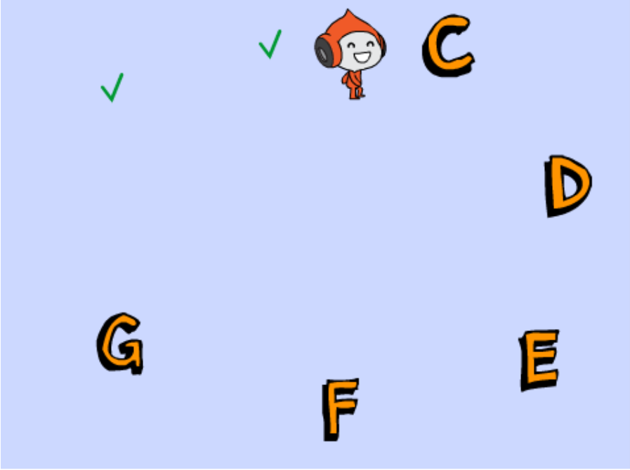
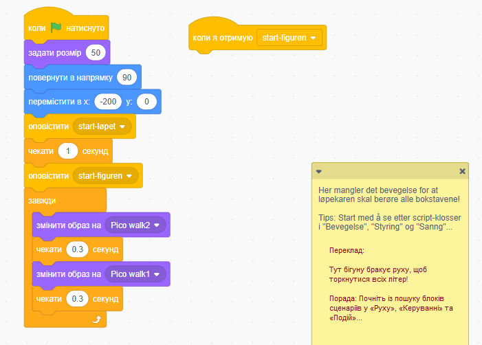

# Вступ {.intro}

У цій вправі ми будемо переміщати героя по сцені. `Бігун` повинен торкнутися всіх постів з буквами. 
Після того, як це сталося, він `виграв`. Скількома способами можна вирішити завдання?

# Крок 1: Зробіть ремікс Змагання з орієнтування {.activity}

*Ми починаємо з уже створеного проекту.*

## Контрольний перелік {.check}

- [ ] Перейдіть за посиланням:
  https://scratch.mit.edu/projects/261157815{target=_blank}.

- [ ] Перегляньте проект і натисніть кнопку Ремікс.

Ви отримаєте копію проекту.

# Крок 2: Заставте бігуна торкнутися всіх літер {.activity}

*Створіть код, який переміщує бігуна між літерами.*

Почніть вводити код під блоком `Коли я отримую start-figuren`{.blockevents},
як показано на малюнку:

## Контрольний перелік {.check}

- [ ] Спробуйте виконати завдання різними способами.
      Після того, як бігун торкнеться всіх літер, ігрове поле  зміниться і почнеться святкування.

- [ ] Вам можуть знадобитися команди з `Подій`{.blockevents},
      `Керування`{.blockcontrol} і `Руху`{.blockmotion}. Але будь-які цеглинки дозволяються!

- [ ] Не обов'язково торкатися літер в алфавітному порядку. 

- [ ] Не обов'язково бігати по колу, достатньо будь-яким чином доторкнутися всіх літер.

# Крок 3: Ви готові? {.activity}

## Протестуйте свій проект {.flag}

__Натисніть на зелений прапорець в Scratch.__

- [ ] Код працює?

## Завдання {.challenge}

* Спробуйте вирішити завдання кількома способами!

* Скільки способів змусити бігуна торкнутися всіх постів вам вдалося придумати?

## Збережіть проект {.save}

Чудово! Ви закінчили і можете насолоджуватися перемогою!
