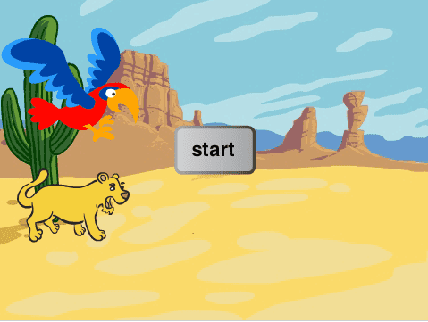

# Informasjon til Veiledere

Dette er et spill for to, der en papegøye og en løvinne kjemper om å
komme først gjennom ørkenen. Hver spiller må trykke en tast så fort og
ofte som mulig for å flytte figuren sin, og den som kommer først til
kanten av skjermen vinner.

# Forberedelser

Ørkenløp bruker bare ressurser som er inkludert i Scratch-platformen
og krever som sådann ingen spesielle forberedelser.

# Læringsmål

Ørkenløp lærer bort ferdigheter som

1. å styre figurer __med tastene__,
2. å bruke en __startknapp__ for å starte spillet,
3. å __nullstille spillet__ slik at det kan spilles igjen,
4. bruk av __egendefinerte__ klosser.
