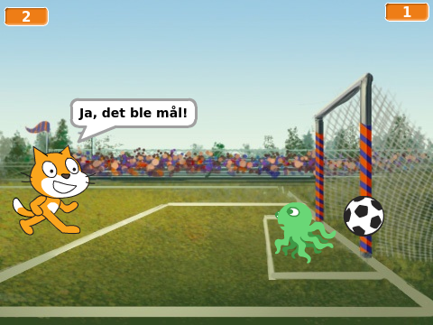
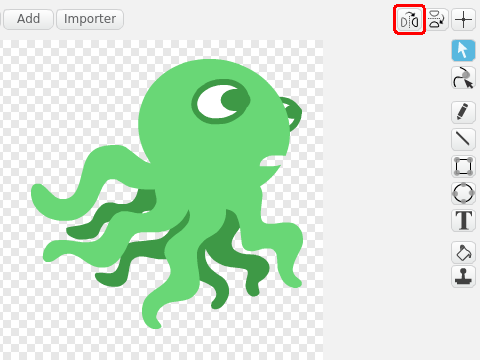
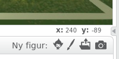

# Introduksjon {.intro}

Vi skal lage et enkelt fotballspill, hvor du skal prøve å score på så
mange straffespark som mulig.



# Steg 1: Katten og fotballbanen {.activity}

*Vi begynner med å lage en katt som kan bevege seg på en fotballbane.*

## Sjekkliste {.check}

+ Start et nytt prosjekt, for eksempel ved å klikke `Programmering` i
  menyen. Hvis du allerede har startet et prosjekt kan du begynne på
  et nytt ved å velge `Fil` og deretter `Ny`.

+ Klikk på `i`{.blockmotion} i hjørnet av kattefiguren, og gi katten
  navnet `Leo`.

+ Klikk på  nederst
  til venstre på skjermen for å hente inn en ny bakgrunn. Velg
  bakgrunnen `Utendørs/goal1` eller `Utendørs/goal2`.

+ Vi skal nå skrive et lite program som flytter katten `Leo` når vi
  klikker på ham. Merk `Leo` i figurvinduet nederst på skjermen, og
  klikk `Skript`-fanen slik at du ser de forskjellige kommandoklossene
  igjen. Pusle deretter sammen de følgende klossene i skriptvinduet
  til høyre:

  ```blocks
  når denne figuren klikkes
  gå (10) steg
  ```

## Test prosjektet {.flag}

__Klikk på det grønne flagget.__

+ Flytter `Leo` på seg når du klikker på ham?

+ Hva skjer om du klikker mange ganger på `Leo` slik at han når bort
  til kanten av scenen?

## Sjekkliste {.check}

+ Du kan flytte `Leo` tilbake på skjermen ved å trykke på ham og dra
  ham dit du vil.

+ Vi vil likevel programmere en enklere måte å få `Leo` tilbake på
  banen på. Lag et **nytt** skript, **ved siden av** det du allerede
  har laget, som ser slik ut:

  ```blocks
  når grønt flagg klikkes
  gå til x: (-180) y: (-30)
  ```

+ Nå vil `Leo` komme tilbake på banen hver gang du klikker det grønne
  flagget rett over scenen.

## Lagre prosjektet {.save}

Du har nå skrevet et lite program! Scratch lagrer alt du gjør med
jevne mellomrom. Det er likevel en god vane å lagre selv også
innimellom.

+ Over scenen er det et tekstfelt hvor du kan gi et navn til spillet
  ditt. Kall det for eksempel `Straffespark`.

+ I menyen `Fil` kan du velge `Lagre nå` for å lagre prosjektet.

# Steg 2: Vi sparker ballen {.activity}

*Det neste vi trenger i spillet vårt er en ball!*

## Sjekkliste {.check}

+ Vi skal nå legge til en ball-figur i spillet vårt. Klikk på
  
  og velg fotballen `Ting/Soccer Ball`.

+ Gi fotballen navnet `Ball`.

+ Lag ballen mindre ved først å trykke på
   øverst mot midten av vinduet.
  Deretter kan du trykke på ballen seks ganger.

+ Vi skal nå skrive et litt lengre program. I dette programmet legger
  vi først fotballen på plass foran katten. Etter at ballen berører
  `Leo` (det vil si `Leo` sparker ballen) begynner ballen å bevege
  seg. Se om du kjenner igjen hvor i programmet de forskjellige
  tingene skjer:

  ```blocks
  når grønt flagg klikkes
  gå til x: (-125) y: (-60)
  vent til <berører [Leo v]?>
  for alltid
      gå (6) steg
  slutt
  ```

## Test prosjektet {.flag}

__Klikk på det grønne flagget.__

+ Sparker `Leo` ballen når du klikker på ham?

+ Kan `Leo` sparke ballen en gang til dersom du trykker det grønne
  flagget igjen?

+ Hvis `Leo` sparker ballen før du klikker på ham (med en gang du
  trykker det grønne flagget), så må du endre litt på tallene i `gå til
  x: () y: ()`{.b}-klossen slik at ballen ligger i ro foran `Leo`.

# Steg 3: Vi trenger en keeper! {.activity}

*Vi skal nå gjøre spillet litt vanskeligere ved å programmere en keeper.*

## Sjekkliste {.check}

+ Legg til en figur til som kan være keeper. Vi har brukt
  `Dyr/Octopus`, men du kan også bruke en annen figur om du vil.

+ Flytt figuren inn i målet. Om det ser ut som figuren står med ryggen
  til ballen kan du snu den på følgende måte: Klikk på
  `Drakter`-fanen, og deretter på snu-knappen som er merket med rødt i
  figuren under.

  

+ Gi figuren navnet `Keeper`.

+ Lag det følgende programmet for keeperen:

  ```blocks
  når grønt flagg klikkes
  gå til x: (100) y: (-50)
  pek i retning (0 v)
  for alltid
      gå (15) steg
      sprett tilbake ved kanten
  slutt
  ```

  Det er et par nye klosser i dette skriptet. Les programmet nøye. Hva
  tror du de nye klossene gjør?

## Test prosjektet {.flag}

__Klikk på det grønne flagget.__

+ Starter keeperen i målet?

+ Beveger `Keeper` seg opp og ned på skjermen?

## Sjekkliste {.check}

+ En ting som ser litt rart ut er at `Keeper` ikke ser på ballen. Vi
  fikser dette ved å legge til en `begrens rotasjon [vend
  sideveis v]`{.b}-kloss helt i begynnelsen av skriptet vårt.

+ Du synes kanskje at keeperen er litt stor? Vi har tidligere sett
  hvordan vi kan bruke  for å gjøre
  figurer mindre. En annen måte å endre størrelsen på er ved å bruke
  klosser fra `Utseendet`{.blocklooks}-kategorien.

  Legg klossen `sett størrelse til (100)%`{.b} inn i `for
  alltid`{.blockcontrol}-løkka. Du kan nå eksperimentere med å endre
  `100%` til et annet tall til du finner en passende størrelse på
  keeperen. Om du har brukt blekkspruten som `Keeper` passer `50%`
  ganske bra. Prøv deg frem!

## Test prosjektet {.flag}

__Klikk på det grønne flagget.__

+ Ser keeperen i retning av `Leo` og ballen?

+ Hva skjer etter at katten skyter mot mål? Kan keeperen redde ballen?

# Steg 4: Keeperen redder! {.activity}

*Nå er det på tide at keeperen redder ballen!*

Vi skal nå lage noen tester som sier i fra når keeperen redder ballen,
eller når ballen går i mål.

## Sjekkliste {.check}

+ Vi begynner med å finne ut når keeperen redder ballen. Klikk på
  `Ball`. Legg til en `hvis ellers`{.blockcontrol}-kloss i skriptet
  slik:

  ```blocks
  når grønt flagg klikkes
  gå til x: (-125) y: (-60)
  vent til <berører [Leo v]?>
  for alltid
      gå (6) steg
      hvis <berører [Keeper v]?>
          send melding [Redning v]
      ellers
      slutt
  slutt
  ```

  I klossen `send melding [message1 v]`{.b} må du velge `Ny melding` og
  deretter skrive inn `Redning` som meldingsnavn.

Meldinger er beskjeder som figurene i spillet kan sende seg i mellom
uten at du egentlig ser det. Disse gjør det lett for flere figurer å
reagere på ting som skjer.

+ Vi vil nå at både ballen og keeperen skal slutte å bevege seg ved en
  redning. Legg til dette som et nytt skript på både `Ball` og
  `Keeper`:

  ```blocks
  når jeg mottar [Redning v]
  stopp [andre skript i figuren v] :: control
  ```

  Et triks er å først skrive denne koden for `Ball`. Deretter kan du
  kopiere den til `Keeper` ved å dra koden til `Keeper`-figuren i
  figurvinduet nederst på skjermen.

## Test prosjektet {.flag}

__Klikk på det grønne flagget.__

+ Slutter både ballen og keeperen å bevege seg om keeperen redder?

## Sjekkliste {.check}

Nå skal vi også sjekke om ballen har gått i mål. Vi gjør dette ved å
undersøke hvor langt til høyre på skjermen ballen har beveget
seg. Posisjonen til en figur i Scratch er beskrevet ved hjelp av
koordinater: `(x-posisjon)`{.b} sier hvor en figur er sidelengs på
skjermen, mens `(y-posisjon)`{.b} sier hvor langt opp eller ned på
skjermen en figur er. Rett under scenen kan du se to tall merket `x`
og `y`. Disse viser koordinatene til musepekeren.



+ Vi sier at det har blitt mål om ballen går langt nok til høyre uten
  at den blir reddet. Om du prøver å peke på målstangen med
  musepekeren ser du at den står omtrent ved `x` lik 160. Utvid
  skriptet på ballen videre slik at det blir seende slik ut:

  ```blocks
  når grønt flagg klikkes
  gå til x: (-125) y: (-60)
  vent til <berører [Leo v]?>
  for alltid
      gå (6) steg
      hvis <berører [Keeper v]?>
          send melding [Redning v]
      ellers
          hvis <(x-posisjon) > [160]>
              send melding [Mål v]
          slutt
      slutt
  slutt
  ```

+ På samme måte som for redning kan vi avslutte bevegelsen til `Ball`
  og `Keeper` ved å lage dette skriptet på begge figurene:

  ```blocks
  når jeg mottar [Mål v]
  stopp [andre skript i figuren v] :: control
  ```

+ Vi kan også la `Leo` juble litt når han scorer mål. Klikk på
  kattefiguren og gi ham følgende skript:

  ```blocks
  når jeg mottar [Mål v]
  si [Ja, det ble mål!!] i (2) sekunder
  ```

+ Lag et tilsvarende skript der `Leo` sier noe om at han er lei seg om
  det blir en `Redning`. Prøv dette på egen hånd!

## Test prosjektet {.flag}

__Klikk på det grønne flagget.__

+ Klarer du å score mål?

+ Klarer keeperen å redde noen skudd?

## Endre farten {.protip}

Du kan gjøre spillet enklere eller vanskeligere ved å endre farten på
ballen og hvor fort keeperen beveger seg. Begge disse er bestemt av
tallet som står i `gå () steg`{.b}-klossene til henholdsvis `Ball` og
`Keeper`.

Prøv forskjellige tall for både fotballen og keeperen til du finner
den kombinasjonen du liker best. Pass på at det blir litt vanskelig,
men ikke umulig.

# Steg 5: Førstemann til 10! {.activity}

*Vi skal tilslutt se på hvordan vi kan telle hvor mange mål som
 scores.*

## Sjekkliste {.check}

For å telle hvor mange mål du har scoret, og hvor mange redninger
`Keeper` har gjort, skal vi bruke *variabler*.

+ Klikk på scenen til venstre for figurlisten.

+ Klikk på `Data`{.blockdata}-kategorien og lag en ny variabel. Gi
  den nye variabelen navnet `Mål`. Legg merke til at det
  dukket opp en ny boks på scenen som er merket `Mål`, og som viser
  tallet `0`{.blockdata}.

+ Vi vil nå telle målene. Lag et nytt skript som endrer `(Mål)`{.b}
  hver gang meldingen `Mål` sendes, ved å lage dette skriptet på
  Scenen:

  ```blocks
  når jeg mottar [Mål v]
  endre [Mål v] med (1)
  ```

+ Vi kan gjøre tilsvarende for å telle antall redninger. Lag en ny
  variabel som heter `(Redninger)`{.b}.

+ Lag deretter et nytt skript for å telle redningene:

  ```blocks
  når jeg mottar [Redning v]
  endre [Redninger v] med (1)
  ```


## Test prosjektet {.flag}

__Klikk på det grønne flagget.__

+ Teller spillet hver gang du scorer mål?

+ Telles også hvor mange redninger keeperen gjør?

## Sjekkliste {.check}

Avslutningsvis vil vi legge inn en test på om `Leo` klarer å score 10
mål eller `Keeper` klarer å redde 10 ganger. Dette er litt omfattende.

+ Først vil vi lage to nye bakgrunner, en vi kan bruke om spilleren
  vinner (katten scorer 10 ganger) og en vi bruker om spilleren taper
  (keeperen redder 10 ganger). Klikk på `Bakgrunner`-fanen. Høyreklikk
  på den lille versjonen av bakgrunnen din midt på skjermen og velg
  `Lag en kopi`.

+ Velg en passende farge, og klikk deretter på tekstverktøyet. Velg
  Skrifttype: `Marker` nederst på skjermen. Skriv en tekst som ligner
  på `Gratulerer, du vant!` litt høyt på kopien av bakgrunnen. Gi
  denne bakgrunnen navnet `Seier`.

+ Lag deretter en ny kopi av den originale bakgrunnen. Kall denne
  bakgrunnen `Tap` og skriv også her en passende tekst.

+ Lag et skript på bakgrunnen som setter variabelene dine til 0 ved
  begynnelsen av spillet.

  ```blocks
  når grønt flagg klikkes
  sett [Mål v] til [0]
  sett [Redninger v] til [0]
  bytt bakgrunn til [goal1]
  send melding [Nytt spark v]
  ```

+ Vi vil nå spille uten at vi må klikke på det grønne flagget for hver
  gang vi skal skyte et straffespark. Til dette bruker vi meldingen
  `Nytt spark`. Vi må nå bytte ut

  ```blocks
  når grønt flagg klikkes
  ```

  med

  ```blocks
  når jeg mottar [Nytt spark v]
  ```

  på både `Leo`, `Ball` og `Keeper`. For eksempel, på `Leo` blir
  skriptet seende slik ut:

  ```blocks
  når jeg mottar [Nytt spark v]
  gå til x: (-180) y: (-30)
  ```

+ Til slutt legger vi på testen om vi har scoret 10 mål, eller om
  keeperen har reddet 10 ganger. Endre `Mål`-skriptet på scenen slik
  at det blir seende slik ut:

  ```blocks
  når jeg mottar [Mål v]
  endre [Mål v] med (1)
  vent (2) sekunder
  hvis <(Mål) < [10]>
      send melding [Nytt spark v]
  ellers
      bytt bakgrunn til [Seier v]
      stopp [alle v] :: control
  slutt
  ```

+ På samme måte endrer du `Redning`-skriptet på scenen:

  ```blocks
  når jeg mottar [Redning v]
  endre [Redninger v] med (1)
  vent (2) sekunder
  hvis <(Redninger) < [10]>
      send melding [Nytt spark v]
  ellers
      bytt bakgrunn til [Tap v]
      stopp [alle v] :: control
  slutt
  ```

## Test prosjektet {.flag}

__Klikk på det grønne flagget.__

+ Får du skyte flere straffespark uten å måtte trykke på det grønne
  flagget mellom hver gang?

+ Bytter spillet til riktig bakgrunn om du scorer 10 mål?

+ Bytter spillet til riktig bakgrunn om keeperen redder 10 ganger?

+ Nullstilles målene og redningene når du klikker det grønne flagget?

## Lydeffekter {.protip}

Du kan legge lydeffekter på spillet ditt ved å bruke klossene under
`Lyd`{.blocksound}-kategorien. Prøv for eksempel å legge på lyder når
ballen sparkes, når keeperen redder eller når det blir mål.

For å finne flere lyder å bruke i spillet ditt kan du velge
`Lyder`-fanen. Her kan du hente flere lyder fra Scratch-biblioteket
eller til og med ta opp egne lyder. Eksperimenter og prøv deg frem!

## Lagre spillet {.save}

Da er vi ferdige med Straffespark! Om du har noen ideer til hvordan du
kan gjøre spillet enda morsommere så prøv dem selv!

Om du klikker `Legg ut` vil prosjektet ditt bli lagt ut på
Scratch-hjemmesiden slik at andre kan spille det!
