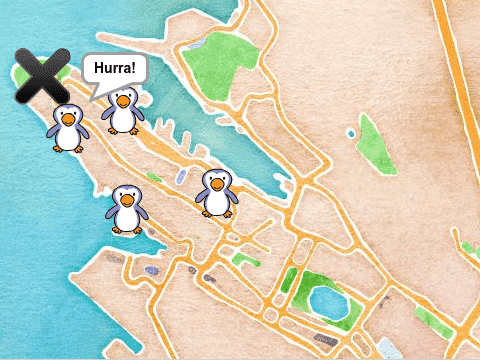

# Om oppgåva {.activity}

I denne oppgåva skal elevane lage eit enkelt spel der spelaren skal få pingvinar
som beveger seg tilfeldig rundt omkring til å gå tilbake til akvariet i Bergen.

## Oppgåva passar til: {.check}

__Fag__: Programmering.

__Anbefalte trinn__: 3.-10. trinn.

__Tema__: Spel, musikk.

__Tidsbruk__: Dobbelttime eller meir.

## Kompetansemål {.challenge}

- [ ] __Programmering, 10. trinn__: bruke grunnleggjande prinsipp i
  programmering, slik som løkker, testar, variablar, funksjonar og enkel
  brukarinteraksjon

## Forslag til læringsmål {.challenge}

- [ ] Elevane kan bruke kode for å få ein figur til å rotere.

- [ ] Elevane kan bruke løkker for å få noko til å skje fleire gonger.

## Forslag til vurderingskriterium {.challenge}

- [ ] Eleven syner middels måloppnåing ved å fullføre oppgåva.

- [ ] Eleven syner høg måloppnåing ved å vidareutvikle eigen kode basert på
  oppgåva, til dømes ved å gjere ein eller fleire av variasjonane under.

## Føresetnader og utstyr {.challenge}

- [ ] __Føresetnader__: Ingen, fin introduksjon til Scratch.

- [ ] __Utstyr__: Datamaskiner med Scratch installert. Eventuelt kan elevane
  bruke Scratch i nettlesaren viss dei har ein brukar (eller registrerer seg) på
  [scratch.mit.edu/](https://scratch.mit.edu/). Elevane kan gjerne jobbe to og
  to saman.

## Framgangsmåte

Her finn du tips, erfaringar og utfordringar til dei ulike stega i oppgåva.
[Klikk her for å sjå
oppgåveteksten.](../pingviner_pa_tur/pingviner_pa_tur_nn.html){target=_blank}

_Me har diverre ikkje nokre tips, erfaringar eller utfordringar knytta til denne
oppgåva endå._

## Variasjonar {.challenge}

- [ ] Elevane kan lage fleire pingvinar som er synlege samstundes.

- [ ] Elevane kan lage pingvinar som beveger seg med ulike hastigheiter.

- [ ] Elevane kan finne andre tema for spelet - til dømes løver i Afrika.

- [ ] Elevane kan lage ein variabel som tel poeng for kvar pingvin som kjem
  tilbake til akvariet.

## Eksterne ressursar {.challenge}

- [ ] Førebels ingen eksterne ressursar...
