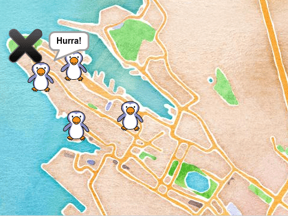
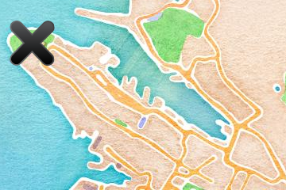

# Вступ {.intro}

Ласкаво просимо до Scratch. Разом ми створимо просту гру, де пінгвіни втекли з акваріума в Бергені, а ваше завдання допомогти їм повернутися додому.




# Ласкаво просимо до Scratch {.activity}

_Якщо ви вже знаєте Scratch і маєте користувача Scratch, ви можете перейти до
[steg 1](#steg-1-ein-pingvin-pa-tur)._

[Scratch](https://scratch.mit.edu/) це мова програмування, розроблена спеціально для швидкого початку роботи та швидкого створення власних ігор і анімацій. Scratch працює у браузері та є абсолютно безкоштовним у використанні. Перш ніж почати програмувати, доцільно створити користувача Scratch, оскільки це спрощує збереження ваших ігор і обмін ними з іншими.

## Створіть користувача Scratch {.check}

- [ ] Перейдіть на веб-сайт scratch.mit.edu  [scratch.mit.edu](https://scratch.mit.edu/) у веб-браузері.

- [ ] Якщо сторінка англійською мовою, ви можете змінити мову на українську, для цього перейдіть у самий низ сторінки та у спадному меню виберіть українську мову.

- [ ] Натисніть __«Приєднатись»__ угорі праворуч і заповніть форму, що з’явиться.

- [ ] Після того як ви стали користувачем Scratch, ви можете натиснути __«Створити»__ у верхньому лівому куті, щоб розпочати програмування.

    Крім того, ми даємо вам рецепт того, як ви можете створити просту гру, де ви повинні допомогти пінгвінам знайти дорогу назад до акваріума в Бергені.


# Крок 1: Пінгвін у русі {.activity}

_Ми починаємо з розгляду того, як ми можемо створити фігуру та змусити її рухатися._

## Контрольний список {.check}

- [ ] Коли ви починаєте новий проект Scratch, ви бачите фігурку кота. У цій грі ми не будемо цього використовувати. Тому ми починаємо з видалення фігури кота. Клацніть правою кнопкою миші на фігурі кота та натисніть `вилучити`.

- [ ] Тепер ми додамо фігуру пінгвіна. Натисніть на
   Прокрутіть екран вниз, доки не знайдете фігуру пінгвіна (є кілька на вибір). Натисніть на одну із них щоб обрати героя.

- [ ] Тепер ви додали пінгвіна до своєї гри. Давайте запрограмуємо це!

	Натисніть `Kode` вкладку вгорі ліворуч.

    Til venstre på skjermen ser du mange fargede klosser, for eksempel `gå (10)
    steg`{.b}. Disse er kommandoer vi kan gi til figurene våre. For å skrive et
    program pusler vi sammen flere klosser ved å dra dem over til høyre delen av
    skjermen.

- [ ] Додайте цей код для свого пінгвіна:

  ```blocks
  når @greenFlag klikkes
  gjenta for alltid
      gå (10) steg
      sprett tilbake ved kanten
  slutt
  ```

    Legg merke til at fargene på klossene samsvarer med kategoriene
    helt til venstre på siden. For eksempel finner du `når @greenFlag
    klikkes`{.b} i `Hendelser`{.blockevents}-kategorien.

## Тестування проекту {.flag}

__Натисніть зелений прапор у верхній частині екрана, щоб спробувати свою гру.__

- [ ] Тепер пінгвін повинен почати рухатися вперед і назад по екрану.

- [ ] Du merker kanskje at pingvinen snur seg på hodet når den går mot venstre?
  Det er fordi scratchfigurer i utgangspunktet roterer når de skifter retning.
  Vi kan forbedre dette ved å legge til klossen `begrens rotasjon [vend sideveis
  v]`{.b} rett under `når @greenFlag klikkes`{.b}-klossen i programmet vårt.

Du kan bruke den røde knappen ved siden av det grønne flagget om du ønsker at
pingvinen skal slutte å bevege seg. Etterhvert som du lager mer kode bør du
klikke på det grønne flagget for å se hva som skjer.

## Lagre prosjektet {.save}

Du har nå laget et lite program! Scratch lagrer alt du gjør automatisk med jevne
mellomrom. Det kan likevel være lurt å lagre selv også innimellom.

- [ ] Øverst på skjermen er det et tekstfelt hvor du kan gi navn til
  prosjektet ditt. Der står det kanskje noe sånt som `Untitled` nå.
  Kall det for eksempel `Pingviner på tur`.

- [ ] I menyen `Fil` kan du velge `Lagre nå` for å lagre prosjektet.


# Steg 2: På kryss og tvers {.activity}

_La oss se hvordan vi kan kontrollere hvordan pingvinen beveger seg._

## Sjekkliste {.check}

- [ ] Se nærmere på koden du har laget. Vi har fortalt pingvinen at den _for
  alltid_ skal _gå_ og _sprette tilbake ved kanten_. Ser du hvordan pingvinen
  gjør akkurat som den har blitt fortalt?

    Vi kan gjøre forandringer i koden vår. For eksempel sier tallet `10` i `gå
    (10) steg`{.b}-klossen noe om hvor fort pingvinen skal bevege seg. Prøv å
    forandre dette tallet!

- [ ] Vi kan også endre størrelsen på pingvinen. Endre koden din slik at den nå
  ser slik ut:

  ```blocks
  når @greenFlag klikkes
  sett størrelse til (40) %
  begrens rotasjon [vend sideveis v]
  gjenta for alltid
      gå (4) steg
      sprett tilbake ved kanten
  slutt
  ```

- [ ] Til slutt skal vi la pingvinen gå _tilfeldig_ på kryss og tvers på
  skjermen. Legg til flere klosser slik at koden nå ser slik ut:

  ```blocks
  når @greenFlag klikkes
  sett størrelse til (40) %
  begrens rotasjon [vend sideveis v]
  gå til [tilfeldig sted v]
  pek i retning (tilfeldig tall fra (1) til (360))
  gjenta for alltid
      gå (4) steg
      sprett tilbake ved kanten
  slutt
  ```

    For å lage `pek i retning (tilfeldig tall fra (1) til (360))`{.b} må du
    først legge til `pek i retning (90 v)`{.b}-klossen og deretter pusle
    `tilfeldig tall fra (1) til (10)`{.b}-klossen inn i denne og forandre `10`
    til `360`.

## Test prosjektet {.flag}

__Klikk på det grønne flagget.__

- [ ] Går pingvinen mer på kryss og tvers?

- [ ] Starter pingvinen forskjellige steder på skjermen om du klikker på det
  grønne flagget flere ganger?


# Steg 3: Bergen {.activity}

_Pingvinen har rømt fra akvariet i Bergen, så da burde den jo springe rundt i
Bergens gater._

## Sjekkliste {.check}

- [ ] Vi skal nå legge til en bakgrunn på spillet vårt som viser et kart over
  Bergen. Last ned filen [bergen.png](bergen.png) til datamaskinen din.

    Alternativt kan du [lage ditt eget kart](../kart/kart.html) ved å gå til
    [denne siden](../kart/kart.html).

- [ ] For å legge til en ny bakgrunn klikker du `Last opp bakgrunn`:

	

	Velg deretter filen du nettopp lastet ned.

- [ ] La oss nå markere Akvariet i Bergen på kartet. Hent en ny figur ved å
  klikke på .
  Velg figuren `Button5`, og plasser denne ytterst på Nordnes for å vise hvor
  Akvariet er.

    

- [ ] Vi vil nå endre navn på akvariefiguren slik at vi enklere husker
  hva den er. Trykk på figuren, og så på navnefeltet over
  figuren. Endre navnet fra `Button5` til `Akvariet`.


# Steg 4: Hjelp pingvinen hjem {.activity}

_Vi skal prøve å kontrollere pingvinen slik at vi kan hjelpe den tilbake til
Akvariet._

## Sjekkliste {.check}

I dette spillet skal vi kontrollere pingvinen ved å klikke på kartet. Pingvinen
skal da snu seg vekk fra der vi holder musepekeren før den går videre.

- [ ] Klikk på __Scene__ nede til venstre på skjermen. Dette gir oss muligheten
  til å skrive kode som gjelder for bakgrunnen og ikke for pingvinen.

- [ ] Lag den følgende nye koden på Scenen:

  ```blocks
  når scenen klikkes :: hat events
  send melding [snu retning v]
  trommeslag (1 v) som varer (0.25) takter
  ```

    Blokken `trommeslag` er i Scratch 3 flyttet til tilleggsfunksjoner. Du
    finner den ved å trykke på `Hent tilleggsfunksjon` nederst til venstre, og
    så legge til tilleggsfunksjonen `Musikk`.
    En slik _melding_ er en beskjed programmet ditt sender til alle figurene. Du
    vil ikke se disse meldingene, men figurene dine kan reagere på dem. Her vil
    vi fortelle pingvinen at den skal snu når vi klikker på kartet (scenen).

- [ ] Klikk på pingvinen. Vi skal nå skrive et nytt skript. Lag denne koden ved
  siden av koden du skrev tidligere:

  ```blocks
  når jeg mottar [snu retning v]
  pek mot [musepeker v]
  vend venstre (180) grader
  ```

## Test prosjektet {.flag}

__Klikk på det grønne flagget.__

- [ ] Snur pingvinen seg vekk fra musepekeren om du klikker på kartet?


# Steg 5: Pingvinen kommer hjem! {.activity}

_Vi skal til slutt se hvordan pingvinen kan oppdage at den har kommet hjem!_

## Sjekkliste {.check}

- [ ] Klossen `berører [ v]`{.b} kan brukes for å oppdage om to figurer berører
  hverandre. Legg til en `hvis`{.blockcontrol}-test i koden som flytter
  pingvinen:

  ```blocks
  når @greenFlag klikkes
  sett størrelse til (40) %
  begrens rotasjon [vend sideveis v]
  gå til [tilfeldig sted v]
  pek i retning (tilfeldig tall fra (1) til (360))
  gjenta for alltid
      gå (4) steg
      sprett tilbake ved kanten
      hvis <berører [Akvariet v] ?>
          si [Hurra!] i (7) sekunder
          gå til [tilfeldig sted v]
      slutt
  slutt
  ```

## Test prosjektet {.flag}

__Klikk på det grønne flagget.__

- [ ] Hva skjer når pingvinen kommer til Akvariet?

- [ ] Etter at pingvinen har vært hjemme i 7 sekunder tar den seg en ny tur.
  Dukker den opp på et nytt tilfeldig sted?

## Prøv selv {.challenge}

Vi har nå laget et lite spill sammen, men prøv gjerne å utvikle det videre. Her
er noen ideer:

- [ ] Legg til flere pingviner! Dette er ganske enkelt. Høyreklikk på
  pingvin-figuren og klikk deretter på `lag en kopi` for å lage en
  kopi av den.

- [ ] Kan du lage en test for om alle pingvinene har kommet hjem? Denne lager du
  enklest på akvariefiguren. Du bør bruke en `gjenta for alltid`{.blockcontrol}-løkke,
  en `hvis`{.blockcontrol}-test samt `< > og < >`{.b}- og `berører
  [ v]`{.b}-klosser.

- [ ] Kanskje vi kan telle poeng hver gang en pingvin finner veien til Akvariet?
  Til dette trenger du noe som heter variabler. Disse finner du under
  `Data`{.blockdata}. Prøv selv om du får til noe!
