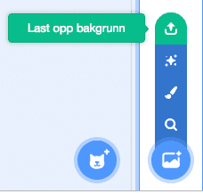

# Вступ {.intro}

Ласкаво просимо до Scratch. Разом ми створимо просту гру, де пінгвіни втекли з акваріума в Бергені, а ваше завдання допомогти їм повернутися додому.


# Ласкаво просимо до Scratch {.activity}

_Якщо ви вже знаєте Scratch і маєте користувача Scratch, ви можете перейти до [steg 1](#steg-1-ein-pingvin-pa-tur)._

[Scratch](https://scratch.mit.edu/) це мова програмування, розроблена спеціально для швидкого початку роботи та швидкого створення власних ігор і анімацій. Scratch працює у браузері та є абсолютно безкоштовним у використанні. Перш ніж почати програмувати, доцільно створити користувача Scratch, оскільки це спрощує збереження ваших ігор і обмін ними з іншими.

## Створіть користувача Scratch {.check}

- [ ] Перейдіть на веб-сайт scratch.mit.edu  [scratch.mit.edu](https://scratch.mit.edu/) у веб-браузері.

- [ ] Якщо сторінка англійською мовою, ви можете змінити мову на українську, для цього перейдіть у самий низ сторінки та у спадному меню виберіть українську мову.

- [ ] Натисніть __«Приєднатись»__ угорі праворуч і заповніть форму, що з’явиться.

- [ ] Після того як ви стали користувачем Scratch, ви можете натиснути __«Створити»__ у верхньому лівому куті, щоб розпочати програмування.

    Крім того, ми даємо вам рецепт того, як ви можете створити просту гру, де ви повинні допомогти пінгвінам знайти дорогу назад до акваріума в Бергені.


# Крок 1: Пінгвін у русі {.activity}

_Ми починаємо з розгляду того, як ми можемо створити фігуру та змусити її рухатися._

## Контрольний список {.check}

- [ ] Коли ви починаєте новий проект Scratch, ви бачите фігурку кота. У цій грі ми не будемо цього використовувати. Тому ми починаємо з видалення фігури кота. Клацніть правою кнопкою миші на фігурі кота та натисніть `вилучити`.

- [ ] Тепер ми додамо фігуру пінгвіна. Натисніть на
   Прокрутіть екран вниз, доки не знайдете фігуру пінгвіна (є кілька на вибір). Натисніть на одну із них щоб обрати героя.

- [ ] Тепер ви додали пінгвіна до своєї гри. Давайте запрограмуємо це!

	Натисніть `Код` вкладку вгорі ліворуч.

    Ліворуч на екрані ви побачите, наприклад, багато кольорових блоків. Це команди, які ми можемо давати нашим персонажам. Щоб написати програму, ми збираємо кілька блоків, перетягуючи їх у праву частину екрана. `Перемістити на (10) кроків`{.b}.

- [ ] Додайте цей код для свого пінгвіна:

  ```blocks
  коли @greenFlag натиснуто
  завжди
      перемістити на (10) кроків
      якщо на межі, відбити
  slutt
  ```

    Зверніть увагу, що кольори цеглинок відповідають категоріям у лівій частині сторінки. Наприклад, можна знайти в категорії `коли @greenFlag
    натиснуто`{.b} i `Події`{.blockevents}-категорія.

## Тестування проекту {.flag}

__Натисніть зелений прапор у верхній частині екрана, щоб спробувати свою гру.__

- [ ] Тепер пінгвін повинен почати рухатися вперед і назад по екрану.

- [ ] Можливо, ви помітили, що пінгвін повертає голову, коли йде вліво? Це тому, що скретч-фігурки в основному обертаються, коли змінюють напрямок. Ми можемо покращити це, додавши до нашої програми блок безпосередньо під -блоком. `стиль обертання [зліва-направо v]`{.b} Прямо під `коли @greenFlag натиснуто`{.b}-klossen у нашому додатку.

Ви можете скористатися червоною кнопкою поруч із зеленим прапорцем, якщо хочете, щоб пінгвін припинив рух. Коли ви створите додатковий код, вам слід натиснути на зелений прапорець, щоб побачити, що відбувається.

## Зберегти проект {.save}

Ви тепер створили невелику програму! Scratch автоматично зберігає все, що ви робите, через регулярні інтервали. Однак, час від часу все ж таки варто зберігати самостійно.

- [ ] У верхній частині екрана є текстове поле, де ви можете назвати свій проект. Може бути щось на зразок `Untitled`.
  Наприклад, назвіть це  `Пінгвіни на прогулянці`.

- [ ] У меню `Файл` ви можете вибрати `Зберегти негайно`, щоб зберегти проект.


# Крок 2: По всій дошці {.activity}

_Давайте подивимося, як ми можемо керувати тим, як рухається пінгвін._

## Контрольний список {.check}

- [ ] Подивіться уважніше на створений вами код. Ми сказали пінгвіну, що він _вічно буде ходити_ і _відскакувати на краю_. Бачите, як пінгвін робить саме те, що йому сказали?

    Ми можемо вносити зміни в наш код. Наприклад, число `10` у блоці `Перемістити на
    (10) кроків`{.b}- говорить про те, як швидко має рухатися пінгвін. Спробуйте змінити цей номер!

- [ ] Ми також можемо змінити розмір пінгвіна. Змініть свій код, щоб тепер він виглядав так:

  ```blocks
  коли @greenFlag натиснуто
  задати розмір (40) %
  стиль обертання [зліва-направо v]
  завжди
      перемістити на (4) кроків
      якщо на межі, відбити
  slutt
  ```

- [ ] Нарешті, ми дозволимо пінгвіну випадково ходити по екрану. Додайте більше блоків, щоб тепер код виглядав так:

  ```blocks
  коли @greenFlag натиснуто
  задати розмір (40) %
  стиль обертання [зліва-направо v]
  перейти до [випадкова позиція]
  повернути в напрямку (випадкове від (1) до (360))
  завжди
      перемістити на (4) кроків
      якщо на межі, відбити
  slutt
  ```

    Щоб створити, `ви повинні спочатку додати блок (випадкове від (1) до (360))`{.b} потім вставити попередній блок у це `повернути в напрямку (90)`{.b} та отримати 
`повернути в напрямку ((випадкове від (1) до (360))`{.b})`{.b}

## Тестування проекту {.flag}

__Натисніть зелений прапор у верхній частині екрана.__

- [ ] Пінгвін більше ходить навхрест?

- [ ] Пінгвін починається з різних місць на екрані, якщо кілька разів натиснути зелений прапорець?


# Крок 3: Берген {.activity}

_Пінгвін втік з океанаріуму в Бергені, тому він повинен бігати вулицями Бергена._

## Контрольний список {.check}

- [ ] Тепер ми додамо фон до нашої гри, який показує карту Бергена. Завантажте файл  [bergen.png](bergen.png) на свій комп’ютер.

    Крім того, ви можете [створити власну карту](../kart/kart.html), перейшовши на
    [цю сторінку](../kart/kart.html).

- [ ] Щоб додати новий фон, натисніть `Last opp bakgrunn`:

	

	Потім виберіть файл, який ви щойно завантажили.

- [ ] А тепер позначимо на карті Акваріум у Бергені. Отримайте нову фігуру, натиснувши на .
  Виберіть фігурку `Button5`і розмістіть її на дальньому кінці Nordnes, щоб показати, де знаходиться Акваріум.

    

- [ ] Тепер ми змінимо назву акваріумної фігурки, щоб нам було легше запам’ятати, що це таке. Натисніть на фігуру, а потім на поле імені над фігурою. Змініть назву з `Button5` на `Акваріум`.


# Крок 4: Допоможіть пінгвіну повернутися додому {.activity}

_Ми спробуємо контролювати пінгвіна, щоб допомогти йому повернутися в Акваріум._

## Контрольний список {.check}

У цій грі ми будемо керувати пінгвіном, натискаючи на карту. Після цього пінгвін повинен відвернутися від того місця, де ми тримаємо вказівник миші, перш ніж рухатися далі.

- [ ] Натисніть на __Сцена__ знизу ліворуч на екрані. Це дає змогу написати код, який застосовуватиметься до фону, а не до пінгвіна.
- [ ] Створіть такий новий код у сцені:

  ```blocks
  коли сцену натиснуто :: hat events
  оповістити [зміна напрямку v]
  пограти на барабані (1 Малий барабан v) (0.25) ударів
  ```

    Блок `барабанний ритм` у Scratch 3 перенесено до додаткових функцій. Ви можете знайти його, натиснувши `Отримати додаткову функцію` внизу ліворуч, а потім додавши додаткову функцію `Музика`.
    Це _повідомлення_ яке ваша програма надсилає всім фігурам. Ви не побачите цих повідомлень, але ваші персонажі можуть на них реагувати. Тут ми даємо команду пінгвінові повертатися, коли ми натискаємо на карту (сцену).

- [ ] Натисніть на пінгвіна. Зараз ми напишемо новий сценарій. Створіть цей код поруч із кодом, який ви написали раніше:

  ```blocks
  коли я отримую [зміна напрямку v]
  слідувати за [вказівник v]
  поворот наліво (180) градусів
  ```

## Тестування проекту {.flag}

__Натисніть зелений прапор.__

- [ ] Чи відвертається пінгвін від вказівника миші, якщо клацнути по карті?


# Steg 5: Пінгвін повертається додому! {.activity}

_Ми нарешті побачимо, як пінгвін може визначити, що він повернувся додому!_

## Контрольний список {.check}

- [ ] За допомогою блоку `торкається [ v]`{.b} можна визначити, чи торкаються дві фігури одна одної. Додайте блок `якщо`{.blockcontrol}-якщо до коду, який переміщує пінгвіна:

  ```blocks
  коли @greenFlag натиснуто
  задати розмір (40) %
  стиль обертання [зліва-направо v]
  перейти до [випадкова позиція]
  повернути в напрямку (випадкове від (1) до (360))
  завжди
      перемістити на (4) кроків
      якщо на межі, відбити
      якщо <торкається [Акваріум v] ?>
          говори [Ура!] протягом (7) секунд
          перейти до [випадкова позиція v]
      slutt
  slutt
  ```

## Тестування проекту {.flag}

__Натисніть зелений прапор.__

- [ ] Що відбувається, коли пінгвін приходить в акваріум?

- [ ] Після того, як пінгвін був удома протягом 7 секунд, він робить ще один хід. Чи з’являється він у новому випадковому місці?

## Спробуйте самі {.challenge}

Зараз ми створили невелику гру разом, але можете спробувати розвивати її далі. Ось кілька ідей:

- [ ] Додайте більше пінгвінів! Це досить просто. Клацніть правою кнопкою миші фігуру пінгвіна, а потім клацніть дублювати, щоб зробити її копію.

- [ ] Чи можете ви зробити тест, щоб перевірити, чи всі пінгвіни повернулися додому? Це найлегше зробити на акваріумній фігурці. Ви повинні використовувати блоки `завжди`{.blockcontrol}-циклічно та `якщо`{.blockcontrol}-тест водночас `< > і < >`{.b}- і `торкається  [ v]`{.b}-блок.

- [ ] ●	Може, ми можемо рахувати бали кожного разу, коли пінгвін знаходить дорогу до Акваріума? Для цього вам знадобиться те, що називається змінними. Ви можете знайти їх у розділі `Змінні`{.blockdata}. Перевірте себе, чи зможете ви чогось досягти!
