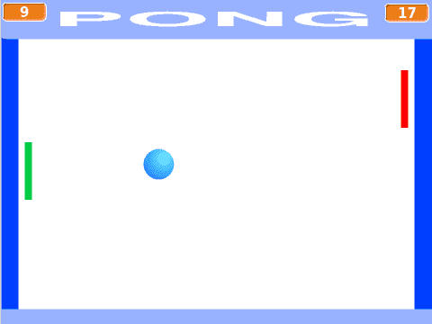
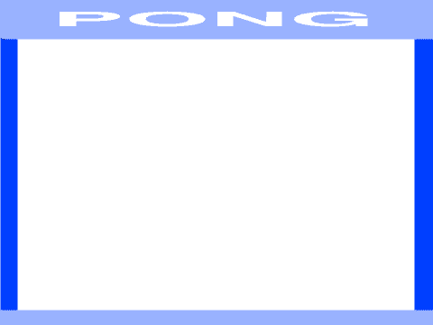

# Introduksjon {.intro}

Pong er et av de aller første dataspillene som ble laget, og det
første dataspillet som ble en kommersiell suksess. Selve spillet er en
forenklet variant av tennis hvor to spillere slår en ball frem og
tilbake. Hvis en av spillerne ikke klarer å returnere ballen får den
andre spilleren poeng.



# Oversikt over prosjektet {.activity}

*Mesteparten av kodingen av Pong skal du gjøre på egen hånd. Men vi
 vil gi litt tips underveis. Spesielt vil vi se litt på hvordan vi
 kontrollerer en ballfigur mens den spretter rundt på skjermen. I
 resten av leksjonen vil du finne følgende:*

## Plan {.check}

+ Hvordan lage en sprettende ball-figur

+ Litt mer kontroll på hvordan ballen spretter

+ Racketer som spillerne kan styre

+ Poeng, lyder og slikt

# Steg 1: En sprettende ball {.activity}

*Når man lager nye programmer og spill er det alltid lurt å begynne
med en enkel versjon som gjør litt av det det ferdige programmet skal
gjøre. Da kan du begynne og teste at programmet virker som det skal
nesten med en gang.*

I vår enkle versjon skal vi bare få en ball til å sprette over
skjermen. Ingen spillere, ingen poeng, ingenting annet enn en
sprettende ball!

## Sjekkliste {.check}

+ Start et nytt prosjekt. Slett kattefiguren.

+ Lag en ny ball-figur. Du kan enten finne en i biblioteket, eller
  tegne en selv.

+ Vi vil ha muligheten til senere enkelt å endre hastigheten til
  ballen. Lag derfor en ny variabel `hastighet`{.blockdata} som
  gjelder for ball-figuren.

+ Vår enkle kode for en sprettende ball består essensielt av to deler:
  Den første delen passer på at ballen starter riktig (riktig
  hastighet, riktig sted, riktig retning), mens den andre delen er
  løkken som gjør at ballen beveger seg og snur når den treffer kanten
  av skjermen.

  ```blocks
  når jeg mottar [Ny ball v]
  sett [hastighet v] til [7]
  gå til x: (0) y: (0)
  pek i retning (tilfeldig tall fra (1) til (360))
  for alltid
      gå (hastighet) steg
      sprett tilbake ved kanten
  slutt
  ```

  Les koden nøye mens du legger den til på ball-figuren. Pass på at
  du skjønner hva hver enkelt kloss gjør, fordi denne koden skal du
  endre selv etterhvert.

+ Klikk på kodeblokken din for at den skal kjøre, og for at ballen
  skal begynne å bevege seg. Ser det bra ut?

### En bedre måte å starte programmet på {.protip}

Vi har laget meldingen `Ny ball` siden vi tenker at i selve spillet
vil vi at ballen begynner fra midten av skjermen etter hver gang en
spiller har gjort poeng. I denne enkle versjonen kan vi sende
meldingen `Ny ball` hver gang det grønne flagget klikkes, for å
enklere starte spillet.

+ Legg denne enkle kodesnutten til på scenen:

  ```blocks
  når grønt flagg klikkes
  send melding [Ny ball v]
  ```

# Steg 2: Litt mer kontroll på ballen {.activity}

*Klossen `sprett tilbake ved kanten`{.blockmotion} er veldig enkel å
 bruke, men dessverre gir den oss ikke så mye kontroll. For eksempel
 kan vi ikke bruke den om vi vil at ballen skal sprette andre steder
 enn ved kanten (for eksempel i en racket). Den er også vanskelig å
 bruke om vi vil at andre ting skal skje når ballen spretter, kanskje
 vi vil spille en lyd, endring på hastigheten eller endre litt i
 retningen.*

Vi vil bruke `sansning`{.blocksensing}-klosser for å bedre
kontrollere hvordan ballen spretter. Da kan vi oppdage når ballen
berører andre figurer (som for eksempel racketene til spillerene),
eller når den berører spesielle farger.

## Sjekkliste {.check}

+ Legg til din egen bakgrunn hvor du bruker forskjellige farger der du
  vil at ballen skal sprette (vi har brukt lyseblått) og der du vil gi
  poeng (vi har brukt mørkeblått).

  

+ Om ballen treffer mål (mørkeblå) vil vi at den stopper, og
  etterhvert skal vi telle poeng. Dette kan vi gjøre ved å bytte ut

  ```blocks
  for alltid
  slutt
  ```

  med

  ```blocks
  gjenta til <berører fargen [#0000FF]>
  slutt
  send melding [Poeng v]
  ```

+ For at ballen skal sprette når den treffer veggen (lyseblå) vil vi
  endre retningen på ballen selv. Igjen undersøker vi om ballen
  berører en spesiell farge ved å bytte ut

  ```blocks
  sprett tilbake ved kanten
  ```

  med for eksempel

  ```blocks
  hvis <berører fargen [#9999FF]>
      pek i retning ((180) - (retning))
      trommeslag (15 v) som varer (0.01) takter
  slutt
  ```

  Skjønner du hva tallet `180` gjør? Prøv å tenk på hvordan en ball
  spretter i en vegg, og hvordan retningen på ballen endrer seg.

# Steg 3: Racketer til spillerene {.activity}

*Nå som ballen spretter fint kan vi lage racketene som spillerene skal
 styre. Disse vil være veldig like hverandre, slik at vi kan først
 lage den ene racketen og deretter kopiere denne.*

## Sjekkliste {.check}

+ Tegn en ny figur. Lag for eksempel et rektangel som kan fungere som racket.

+ Skriv kode som starter på meldingen `Ny ball`. På samme måte som for
  ballen skal denne bestå av to deler: Først må koden passe på at
  racketen starter på riktig sted. Deretter går koden inn i en løkke
  hvor racketen flyttes opp og ned (`endre y`{.blockmotion}) når for
  eksempel tastene `W` og `S` trykkes.

+ Test at du kan flytte racketen. Du vil kanskje også legge inn en
  begrensning slik at ikke racketen kan forsvinne ut av skjermen? Det
  kan du gjøre for eksempel med en test som ser omtrent slik ut:

  ```blocks
  hvis <<tast [w v] trykket> og <(y-posisjon) < [150]>>
  slutt
  ```

+ Når du er fornøyd med hvordan denne racketen styres kan du kopiere
  den.

+ Endre litt på den nye racket-figuren. Du kan for eksempel endre
  fargen på den om du vil? Du må også endre litt i koden, slik at den
  starter på andre siden av skjermen og slik at den reagerer på andre
  taster, for eksempel `pil opp` og `pil ned`.

+ Til slutt må vi legge til kode på ball-figuren slik at ballen
  spretter når den berører en racket. Dette kan gjøres veldig likt
  hvordan vi fikk ballen til å sprette på veggen. Du må bare bruke
  `berører farge`{.blocksensing} i stedet for
  `berører`{.blocksensing}.

+ Siden ballen nå treffer en vertikal racket i stedet for en
  horisontal vegg må vi også bytte ut tallet `180` i `pek i
  retning`{.blockmotion}-klossen. Hvilket tall kan du bruke? Prøv deg
  fram, eller tenk gjennom hvordan en ball spretter når den treffer en
  vegg.

+ Sjekk at spillet nå fungerer! Ballen spretter fram og tilbake mellom
  de to racketene. For å slippe å stadig starte spillet på nytt kan du
  lage litt enkel kode for ballen når den mottar meldingen `Poeng`. La
  denne koden spille en passende poeng-lyd til den er ferdig. Deretter
  kan den sende meldingen `Ny ball` igjen.

+ Du vil kanskje oppleve at racketene beveger seg raskere og raskere
  for hver ny ball? Dette skjer fordi hver gang meldingen `Ny ball`
  blir sendt startes en ny løkke som flytter racketene. For å fikse
  dette kan du `stoppe andre skript i figuren`{.blockcontrol} for de to
  racketene når meldingen `Poeng` mottas.

# Steg 4: Videreutvikling av spillet {.activity}

*Vi har nå laget en enkel versjon av et av de første dataspillene i
 historien. Men det er mange muligheter for videreutvikling av
 spillet.*

Du står helt fritt i hvordan du vil jobbe videre med spillet ditt, men
her er noen ideer som kan gjøre spillet enda morsommere å spille:

## Ideer til videreutvikling {.check}

+ Legg til en poeng-teller. Dette kan du gjøre for eksempel med to
  variabler, en for hver spiller. Når meldingen `Poeng` mottas kan du
  sjekke `x`-posisjonen av ball-figuren for å finne ut hvem som skal
  få poeng.

+ La hastigheten øke etterhvert som ballen går frem og tilbake. For
  eksempel kan du la hastigheten øke hver gang ballen berører en av de
  to racketene.

+ Det kan være et problem at ballen bare går opp og ned, og ikke
  sidelengs (eller veldig sakte sidelengs) siden vi har satt
  utgangsretningen til ballen helt tilfeldig. Kan du begrense hvilke
  retninger ballen starter i slik at den alltid beveger seg noe
  sidelengs?

+ I stedet for at ballen spretter perfekt på racketene kan du endre
  retning litt tilfeldig, for eksempel ved å legge til et lite
  tilfeldig tall (positivt eller negativt) etter at ballen har snudd i
  racketen.

+ En morsommere, og mer naturlig, sprett på racketen kan du få ved å
  ta hensyn til hvor på racketen ballen treffer. Dette kan du gjøre
  for eksempel ved å sammenligne `y`-posisjonen til ballen og
  racketen.

+ Hva om man kan flytte racketene sidelengs også? Ikke bare opp og
  ned? Det kan være lurt å begrense hvor langt racketene kan bevege
  seg sidelengs, for eksempel kun over halve skjermen. Da vil spillet
  ligne enda litt mer på tennis.

+ Kanskje du kan videreutvikle hele konseptet, slik at det er mulig å
  plukke opp power-ups etterhvert som man spiller. For eksempel noe
  som endrer hastigheten på racketen eller ballen, eller kanskje lager
  litt skru på ballen. På nettet, for eksempel på
  [http://www.ponggame.org/](http://www.ponggame.org/) finnes
  forskjellige Pong-varianter du kan hente inspirasjon fra.

+ Pong er morsomst når man er to spillere. Men av og til er man alene,
  og da hadde det vært morsomt om man kunne spilt mot
  datamaskinen. Klarer du å kode en av racketene slik at datamaskinen
  kan styre den? Det er ikke så veldig vanskelig, du kan for eksempel
  la datamaskinen flytte racketen sin opp eller ned ved å sammenligne
  `y`-posisjonen til ballen med `y`-posisjonen til racketen til
  datamaskinen.
