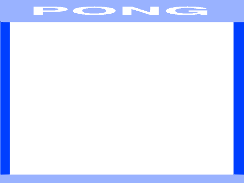

# Introduksjon {.intro}

Pong er eitt av dei aller fyrste dataspela som vart laga, og det fyrste
dataspelet som vart ein kommersiell suksess. Sjølve spelet er ein forenkla
variant av tennis der to spelarar slår ein ball fram og tilbake. Viss ein av
spelarane ikkje klarar å returnere ballen får den andre spelaren poeng.


# Oversikt over prosjektet {.activity}

*Mesteparten av kodinga av Pong skal du gjere på eiga hand. Me gir nokre tips
 undervegs. Spesielt skal me sjå på korleis me kontrollerer ein ballfigur medan
 den sprett rundt på skjermen. I reisten av oppgåva finn du følgjande:*

## Plan {.check}

- [ ] Korleis lage ein sprettande ball.

- [ ] Litt meir kontroll over korleis ballen sprett.

- [ ] Racketar som spelarane kan styre.

- [ ] Poeng, lydar og slikt.


# Steg 1: Ein sprettande ball {.activity}

*Når ein lagar nye program og spel er det alltid lurt å starte med ein enkel
 versjon som gjer litt av det det ferdige programmet skal gjere. Då kan du teste
 at programmet virkar som det skal nesten med ein gong.*

I den enkle versjonen vår skal me berre få ein ball til å sprette over skjermen.
Ingen spelarar, ingen poeng, ingenting anna enn ein sprettande ball!

## Sjekkliste {.check}

- [ ] Start eit nytt prosjekt. Slett kattefiguren.

- [ ] Lag ein ny ball-figur. Du kan anten finne ein i biblioteket eller teikne
  ein sjølv.

- [ ] Me vil ha moglegheita til å seinare enkelt kunne endre hastigheita til
  ballen. Lag ein ny variabel `hastigheit`{.blockdata} som gjeld for
  ball-figuren.

- [ ] Den enkle koden vår for ein sprettande ball består i hovudsak av to delar:
  Den fyrste passar på at ballen startar riktig (rett hastigheit, rett stad,
  rett retning), og den andre delen er løkka som gjer at ballen beveger seg og
  snur når den treff kanten av skjermen.

  ```blocks
  når eg får meldinga [Ny ball v]
  set [hastigheit v] til [7]
  gå til x: (0) y: (0)
  peik i retning (tilfeldig tal frå (1) til (360))
  gjenta for alltid
      gå (hastigheit) steg
      viss ved kant, sprett
  slutt
  ```

  Les koden nøye når du legg den til på ball-figuren. Pass på at du forstår kva
  kvar enkelt kloss gjer, for du skal endre denne koden sjølv seinare.

- [ ] Klikk på kodeblokka di for at den skal køyre, og for at ballen skal starte
  å bevege seg. Ser det bra ut?

### Ein betre måte å starte programmet på {.protip}

Me har laga meldinga `Ny ball` sidan me tenker at i sjølve spelet skal ballen
starte frå midten av skjermen etter kvar gong ein spelar har fått poeng. I denne
enkle versjonen kan me sende meldinga `Ny ball` kvar gong det grøne flagget blir
klikka på, for at det skal vere enklare å starte spelet.

- Legg til denne enkle kodesnutten på scena:

  ```blocks
  når @greenFlag vert trykt på
  send meldinga [Ny ball v]
  ```


# Steg 2: Litt meir kontroll over ballen {.activity}

*Klossen `viss ved kant, sprett`{.blockmotion} er veldig enkel å bruke, men
 diverre har me ikkje så mykje kontroll med den. Til dømes kan me ikkje bruke
 den viss ballen skal sprette andre stader enn ved kanten (til dømes i ein
 racket). Den er vanskeleg å bruke viss me vil at andre ting skal skje når
 ballen sprett, kanskje me vil spele ein lyd, endre hastigheita eller endre på
 retninga.*

Me vil bruke `sansing`{.blocksensing}-klossar for å kunne kontrollere korleis
ballen sprett. Då kan me oppdage når ballen er borti andre figurar (til dømes
racketane til spelarane) eller når den er borti spesielle farger.

## Sjekkliste {.check}

- [ ] Legg til din eigen bakgrunn der du brukar ulike fargar der du vil at
  ballen skal sprette (me har brukt lyseblått) og der du vil gi poeng (me har
  brukt mørkeblått).

  

- [ ] Viss ballen treff mål (mørkeblå) vil me at den skal stoppe, og etter kvart
  telje poeng. Det kan me gjere ved å bytte ut

  ```blocks
  gjenta for alltid
  slutt
  ```

  med

  ```blocks
  gjenta til <rører fargen [#0000FF]>
  slutt
  send meldinga [Poeng v]
  ```

- [ ] For at ballen skal sprette når den treff veggen (lyseblå) vil me endre
  retninga på ballen sjølv. Igjen undersøker me om ballen er borti ei spesiell
  farge ved å bytte ut

  ```blocks
  viss ved kant, sprett
  ```

  med til dømes

  ```blocks
  viss <rører fargen [#9999FF]>
      peik i retning ((180) - (retning))
      trommeslag (15 v) som varer (0.01) takter
  slutt
  ```

  forstår du kva talet `180` gjer? Prøv å tenke på korleis ein ordentleg ball
  sprett i ein ordentleg vegg og korleis retninga endrar seg.


# Steg 3: Racketar til spelarane {.activity}

*No som ballen sprett fint kan me lage racketane som spelarane skal styre. Desse
 vil vere veldig like kvarandre, slik at me fyrst kan lage den eine racketen og
 så kopiere den.*

## Sjekkliste {.check}

- [ ] Teikn ein ny figur. Lag til dømes eit rektangel som kan fungere som
  racket.

- [ ] Skriv kode som startar på meldinga `Ny ball`. På same måte som for ballen
  skal denne bestå av to delar: Fyrst må koden passe på at racketen startar på
  riktig stad. Så går koden inn i ei løkke for å flytte racketen opp og ned
  (`endra y`{.blockmotion}) når til dømes tastane `W` og `S` blir trykka.

- [ ] Test at du kan flytte racketen. Kanskje vil du leggje inn ei avgrensing
  slik at racketen ikkje kan forsvinne ut av skjermen? Det kan du gjere med ein
  test som ser omlag slik ut:

  ```blocks
  viss <<tasten [w v] er trykt?> og <(y-posisjon) < [150]>>
  slutt
  ```

- [ ] Når du er fornøgd med korleis denne racketen blir kontrollert kan du
  kopiere den.

- [ ] Endre litt på den nye racketfiguren. Du kan til dømes endre på farga viss
  du vil det. Så må du endre litt i koden, slik at den startar på andre sida av
  skjermen, og slik at den reagerer på andre tastar, til dømes `pil opp` og `pil
  ned`.

- [ ] Til slutt må me leggje til kode på ball-figuren slik at ballen sprett når
  den kjem borti ein racket. Det kan me gjere veldig likt slik me fekk ballen
  til å sprette på veggen. Du må berre bruke `rører farge`{.blocksensing} i
  staden for `rører`{.blocksensing}.

- [ ] Sidan ballen treff ein vertikal racket i staden for ein horisontal vegg må
  me bytte ut talet 180 i `peik i retning`{.blockmotion}-klossen. Kva tal kan du
  bruke? Prøv deg fram eller tenk gjennom korleis ein ball sprett når den treff
  ein vegg.

- [ ] Sjekk at spelet fungerer! Ballen sprett fram og tilbake mellom dei to
  racketane. For å sleppe å stadig starte spelet på nytt kan du lage litt enkel
  kode for ballen når den mottek meldinga `Poeng`. La denne koden spele ein
  passande poenglyd til den er ferdig. Så kan den sende meldinga `Ny ball` att.

- [ ] Kanskje merkar du at racketane beveger seg raskare og raskare for kvar ny
  ball? Dette skjer fordi kvar gong meldinga `Ny ball` blir sendt startar ei ny
  løkke som flyttar racketane. For å fikse det kan du `stoppe andre skript i
  figuren`{.blockcontrol} for dei to racketane når meldinga `Poeng` blir
  motteke.


# Steg 4: Vidareutvikling av spelet {.activity}

*No har me laga ein enkel versjon av eitt av dei fyrste dataspela i historia.
 Men det er mange moglegheiter for vidareutvikling av spelet.*

Du står heilt fritt til å bestemme korleis du vil jobbe vidare med spelet ditt.
Her er nokre idear som kan gjere spelet endå meir morosamt å spele:

## Idear til vidareutvikling {.check}

- [ ] Legg til ein poeng-teljar. Dette kan du til dømes gjere med to variablar,
  ein for kvar spelar. Når meldinga `Poeng` blir motteke kan du sjekke
  `x`-posisjonen til ball-figuren for å finne ut kven som skal få poeng.

- [ ] La hastigheita auke etter kvart som ballen går fram og tilbake. Til dømes
  kan du la hastigheita auke for kvar gong ballen er borti ein av dei to
  racketane.

- [ ] Det kan vere eit problem at ballen berre går opp og ned, og ikkje
  sidelengs (eller veldig sakte sidelengs) sidan me har sett utgangsretninga til
  ballen heilt tilfeldig. Kan du avgrense kva retningar ballen startar i slik at
  den alltid beveger seg sidelengs?

- [ ] I staden for at ballen sprett perfekt på racketane kan du endre retninga
  litt heilt tilfeldig, til dømes ved å leggje til eit lite tilfeldig tal
  (positivt eller negativt) etter at ballen har snudd i racketen.

- [ ] Ein meir morosam og naturleg sprett på racketen kan du få ved å ta omsyn
  til kor på racketen ballen treff. Dette kan du gjere ved å samanlikne
  `y`-posisjonen til ballen og racketen.

- [ ] Kva om du kan flytte racketane sidelengs òg? Ikkje berre opp og ned? Det
  kan vere lurt å avgrense kor langt racketane kan bevege seg sidelengs, til
  dømes berre over halve skjermen. Då vil spelet likne endå meir på tennis.

- [ ] Kanskje kan du vidareutvikle heile konseptet, slik at det er mogleg å
  plukke opp power-ups etter kvart som ein speler. Til dømes kan du fange noko
  som endrar hastiheita på racketen eller ballen, eller kanskje noko som legg
  litt skru på ballen. På Internett, til dømes på
  [http://www.ponggame.org/](http://www.ponggame.org/) fist det ulike
  Pong-variantar du kan hente inspirasjon frå.

- [ ] Pong er mest morosamt når det er to spelarar. Men av og til er ein åleine,
  og då ville det vore morosamt å spele mot datamaskina. Klarar du å kode ein av
  racketane slik at datamaskina kan styre den? Det er ikkje så vanskeleg, til
  dømes kan du la datamaskina flytte racketen sin opp eller ned ved å samanlikne
  `y`-posisjonen til ballen med `y`-posisjonen til datamaskina sin racket.
