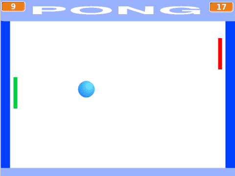

# Вступ {.intro}

Pong — одна з перших створених комп’ютерних ігор і перша комп’ютерна гра, яка мала комерційний успіх. Сама гра є спрощеною версією тенісу, де двоє гравців б’ють по м’ячу туди-сюди. Якщо одному з гравців не вдається повернути м'яч, інший гравець отримує очко.




# Огляд проекту {.activity}

*Більшу частину кодування Pong ви зробите самостійно. Але попутно ми дамо вам кілька порад. Зокрема, ми розглянемо, як керувати фігуркою м’яча, коли вона підстрибує по екрану. У решті уроку ви знайдете наступне:*

## План {.check}

- [ ] Як створити фігуру стрибаючого м'яча

- [ ] Трохи більше контролю над тим, як м'яч стрибає

- [ ] Ракетки, якими гравці можуть керувати

- [ ] Очки, звуки тощо


# Крок 1: Стрибаючий м'яч {.activity}

*Коли ви створюєте нові програми та ігри, завжди корисно починати з простої версії, яка виконує частину того, що має робити готова програма. Тоді ви можете почати тестувати, чи працює програма належним чином, майже відразу.*

У нашій простій версії ми хочемо лише змусити м'яч підстрибувати по екрану. Без гравців, без очок, нічого, крім підстрибуючого м'яча!

## Контрольний список {.check}

- [ ] Розпочніть новий проект. Видаліть фігуру кота.

- [ ] Створіть нову фігуру м'яча. Ви можете або знайти її в бібліотеці, або намалювати самостійно.

- [ ] Ми хочемо мати можливість пізніше легко змінювати швидкість м'яча. Тому створіть нову змінну `швидкість`{.blockdata}, 
  яка стосується фігури м'яча.

- [ ] Наш простий код для стрибаючого м'яча складається, по суті, з двох частин: перша частина забезпечує правильний старт 
  м'яча (правильна швидкість, правильне місце, правильний напрямок), тоді як друга частина - це цикл, який змушує м'яч 
  рухатися і повертатися, коли він досягає краю екрану.

  ```blocks
  коли я отримую [Новий м'яч v]
  надати [швидкість v] значення [7]
  перемістити в x: (0) y: (0)
  повернути в напрямку (випадкове від (1) до (360))
  завжди
      перемістити на (швидкість) кроків
      якщо на межі, відбити
  slutt
  ```

  Уважно читайте код, додаючи його до фігури м'яча. Переконайтесь, що ви розумієте, що робить кожен окремий блок, тому що цей код ви повинні будете змінити самостійно згодом.

- [ ] Натисніть на свій блок коду, щоб запустити його і щоб м'яч почав рухатися. Виглядає добре?

### Кращий спосіб запустити програму {.protip}

Ми створили повідомлення `Новий м'яч`, оскільки вважаємо, що в самій грі ми хочемо, щоб м'яч починав з середини екрану кожного разу, коли гравець забиває очки. У цій простій версії ми можемо надсилати повідомлення `Новий м'яч` щоразу, коли натискається зелений прапорець, щоб легше запустити гру.

+ Додайте цей простий фрагмент коду до сцени:

  ```blocks
  коли @greenFlag натиснуто
  оповістити [Новий м'яч v]
  ```


# Крок 2: Трохи більше контролю над м'ячем {.activity}

*Блок `якщо на межі, відбити`{.blockmotion} є дуже простим у використанні, але, на жаль, він не дає нам багато контролю. Наприклад, ми не можемо використовувати його, якщо хочемо, щоб м'яч відскакував в інших місцях, крім краю (наприклад, у ракетці). Його також важко використовувати, якщо ми хочемо, щоб інші речі відбувалися, коли м'яч відскакує, можливо, ми хочемо відтворити звук, змінити швидкість або трохи змінити напрямок.*

Ми будемо використовувати блоки `чуття`{.blocksensing}, щоб краще контролювати, як м'яч відскакує. Тоді ми зможемо виявляти, коли м'яч торкається інших фігур (наприклад, ракеток гравців), або коли він торкається певних кольорів.

## Контрольний список {.check}

- [ ] Додайте свій власний фон, де ви використовуєте різні кольори там, де ви хочете, щоб м'яч підстрибував (ми 
  використовували світло-блакитний), і там, де ви хочете давати очки (ми використовували темно-блакитний).

  

- [ ] Якщо м'яч потрапить у ворота (темно-сині), ми хочемо, щоб він зупинився, і згодом ми будемо рахувати очки. Це можна 
  зробити, замінивши

  ```blocks
  завжди
  slutt
  ```

  на

  ```blocks
  повторити до <торкається кольору [#0000FF] ? >
  slutt
  оповістити [Очко v]
  ```

- [ ] Щоб м'яч відскочив від стіни (світло-синій), ми змінимо напрямок руху м'яча. Знову ж таки, ми перевіряємо, чи м'яч 
  торкається певного кольору, замінюючи

  ```blocks
  якщо на межі, відбити
  ```

  на наприклад

  ```blocks
  якщо <торкається кольору [#9999FF] ? > то
      повернути в напрямку ((180) - (напрям))
      відтворити звук (Boing v)
  slutt
  ```

  Skjønner du hva tallet `180` gjør? Prøv å tenk på hvordan en ball
  spretter i en vegg, og hvordan retningen på ballen endrer seg.


# Steg 3: Racketer til spillerene {.activity}

*Nå som ballen spretter fint kan vi lage racketene som spillerene skal
 styre. Disse vil være veldig like hverandre, slik at vi kan først
 lage den ene racketen og deretter kopiere denne.*

## Sjekkliste {.check}

- [ ] Tegn en ny figur. Lag for eksempel et rektangel som kan fungere som racket.

- [ ] Skriv kode som starter på meldingen `Ny ball`. På samme måte som for
  ballen skal denne bestå av to deler: Først må koden passe på at
  racketen starter på riktig sted. Deretter går koden inn i en løkke
  hvor racketen flyttes opp og ned (`endre y`{.blockmotion}) når for
  eksempel tastene `W` og `S` trykkes.

- [ ] Test at du kan flytte racketen. Du vil kanskje også legge inn en
  begrensning slik at ikke racketen kan forsvinne ut av skjermen? Det
  kan du gjøre for eksempel med en test som ser omtrent slik ut:

  ```blocks
  hvis <<tast [w v] trykket> og <(y-posisjon) < [150]>>
  slutt
  ```

- [ ] Når du er fornøyd med hvordan denne racketen styres kan du kopiere
  den.

- [ ] Endre litt på den nye racket-figuren. Du kan for eksempel endre
  fargen på den om du vil? Du må også endre litt i koden, slik at den
  starter på andre siden av skjermen og slik at den reagerer på andre
  taster, for eksempel `pil opp` og `pil ned`.

- [ ] Til slutt må vi legge til kode på ball-figuren slik at ballen
  spretter når den berører en racket. Dette kan gjøres veldig likt
  hvordan vi fikk ballen til å sprette på veggen. Du må bare bruke
  `berører farge`{.blocksensing} i stedet for
  `berører`{.blocksensing}.

- [ ] Siden ballen nå treffer en vertikal racket i stedet for en
  horisontal vegg må vi også bytte ut tallet `180` i `pek i
  retning`{.blockmotion}-klossen. Hvilket tall kan du bruke? Prøv deg
  fram, eller tenk gjennom hvordan en ball spretter når den treffer en
  vegg.

- [ ] Sjekk at spillet nå fungerer! Ballen spretter fram og tilbake mellom
  de to racketene. For å slippe å stadig starte spillet på nytt kan du
  lage litt enkel kode for ballen når den mottar meldingen `Poeng`. La
  denne koden spille en passende poeng-lyd til den er ferdig. Deretter
  kan den sende meldingen `Ny ball` igjen.

- [ ] Du vil kanskje oppleve at racketene beveger seg raskere og raskere
  for hver ny ball? Dette skjer fordi hver gang meldingen `Ny ball`
  blir sendt startes en ny løkke som flytter racketene. For å fikse
  dette kan du `stoppe andre skript i figuren`{.blockcontrol} for de to
  racketene når meldingen `Poeng` mottas.


# Steg 4: Videreutvikling av spillet {.activity}

*Vi har nå laget en enkel versjon av et av de første dataspillene i
 historien. Men det er mange muligheter for videreutvikling av
 spillet.*

Du står helt fritt i hvordan du vil jobbe videre med spillet ditt, men
her er noen ideer som kan gjøre spillet enda morsommere å spille:

## Ideer til videreutvikling {.check}

- [ ] Legg til en poeng-teller. Dette kan du gjøre for eksempel med to
  variabler, en for hver spiller. Når meldingen `Poeng` mottas kan du
  sjekke `x`-posisjonen av ball-figuren for å finne ut hvem som skal
  få poeng.

- [ ] La hastigheten øke etterhvert som ballen går frem og tilbake. For
  eksempel kan du la hastigheten øke hver gang ballen berører en av de
  to racketene.

- [ ] Det kan være et problem at ballen bare går opp og ned, og ikke
  sidelengs (eller veldig sakte sidelengs) siden vi har satt
  utgangsretningen til ballen helt tilfeldig. Kan du begrense hvilke
  retninger ballen starter i slik at den alltid beveger seg noe
  sidelengs?

- [ ] I stedet for at ballen spretter perfekt på racketene kan du endre
  retning litt tilfeldig, for eksempel ved å legge til et lite
  tilfeldig tall (positivt eller negativt) etter at ballen har snudd i
  racketen.

- [ ] En morsommere, og mer naturlig, sprett på racketen kan du få ved å
  ta hensyn til hvor på racketen ballen treffer. Dette kan du gjøre
  for eksempel ved å sammenligne `y`-posisjonen til ballen og
  racketen.

- [ ] Hva om man kan flytte racketene sidelengs også? Ikke bare opp og
  ned? Det kan være lurt å begrense hvor langt racketene kan bevege
  seg sidelengs, for eksempel kun over halve skjermen. Da vil spillet
  ligne enda litt mer på tennis.

- [ ] Kanskje du kan videreutvikle hele konseptet, slik at det er mulig å
  plukke opp power-ups etterhvert som man spiller. For eksempel noe
  som endrer hastigheten på racketen eller ballen, eller kanskje lager
  litt skru på ballen. På nettet, for eksempel på
  [http://www.ponggame.org/](http://www.ponggame.org/) finnes
  forskjellige Pong-varianter du kan hente inspirasjon fra.

- [ ] Pong er morsomst når man er to spillere. Men av og til er man alene,
  og da hadde det vært morsomt om man kunne spilt mot
  datamaskinen. Klarer du å kode en av racketene slik at datamaskinen
  kan styre den? Det er ikke så veldig vanskelig, du kan for eksempel
  la datamaskinen flytte racketen sin opp eller ned ved å sammenligne
  `y`-posisjonen til ballen med `y`-posisjonen til racketen til
  datamaskinen.

