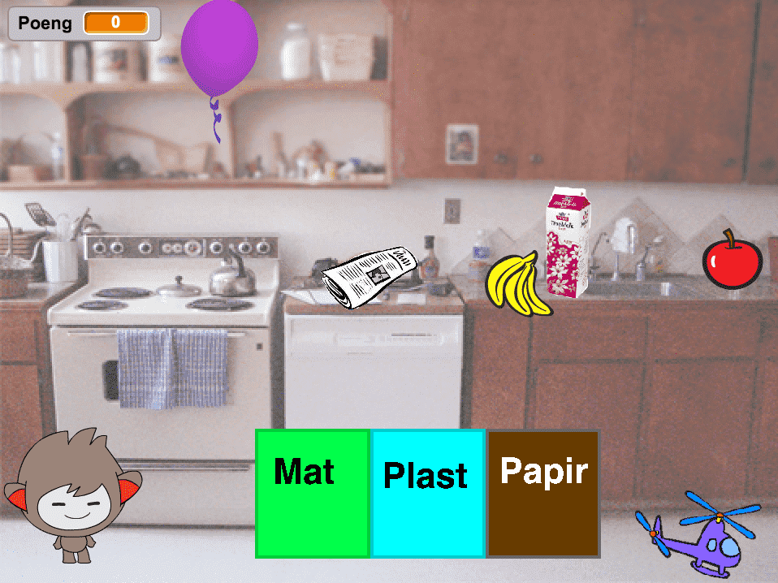

# Om oppgaven {.activity}

Kildesortering er viktig for å begrense hvor mye avfallet vårt påvirker miljøet.
I dette spillet skal vi kildesortere og samtidig lære en hel del om meldinger i
programmering.

## Oppgaven passer til: {.check}

__Fag__: Matematikk, naturfag, norsk, programmering, teknologi i praksis.

__Anbefalte trinn__: 3.-10. trinn.

__Tema__: Kildesortering, koordinatsystem, sammensatt tekst, brukerinteraksjon.

__Tidsbruk__: Dobbelttime eller mer.

## Kompetansemål {.challenge}

- [ ] __Matematikk, 4. trinn__: lese av, plassere og beskrive posisjoner i
      rutenett, på kart og i koordinatsystemer, både med og uten digitale
      verktøy

- [ ] __Naturfag, 4. trinn__: praktisere kildesortering og diskutere hvorfor
      kildesortering er viktig

- [ ] __Norsk, 4. trinn__: lage tekster som kombinerer ord, lyd og bilde, med og
      uten digitale verktøy

- [ ] __Programmering, 10. trinn__: bruke grunnleggende prinsipper i
      programmering, slik som løkker, tester, variabler, funksjoner og enkel
      brukerinteraksjon

- [ ] __Teknologi i praksis, 10. trinn__: bruke kunnskap om andre produkt i
      arbeidet med eige produkt

## Forslag til læringsmål {.challenge}

- [ ] Elevene kan plassere ulike elementer i bestemte posisjoner i et
      koordinatsystem.

- [ ] Elevene kan kildesortere ulike gjenstander fra dagliglivet.

- [ ] Elevene kan lage hjelpetekst til en bruker om kildesortering, som
      kombinerer tekst og bilde.

- [ ] Elevene kan bruke kode til å kontrollere at avstanden mellom to figurer er
      null, altså at de har kollidert.

- [ ] Elevene kan bruke kunnskap om ulike gjenstanders opprinnelse til å
      bestemme hvor de skal sorteres i spillet.

## Forslag til vurderingskriterier {.challenge}

- [ ] Eleven viser middels måloppnåelse ved å fullføre oppgaven.

- [ ] Eleven viser høy måloppnåelse ved å videreutvikle egen kode basert på
      oppgaven, for eksempel ved å gjøre en eller flere av variasjonene
      nedenfor.

## Forutsetninger og utstyr {.challenge}

- [ ] __Forutsetninger__: Elevene bør være komfortable med Scratch.

- [ ] __Utstyr__: Datamaskiner med Scratch installert. Eventuelt kan elevene
      bruke Scratch i nettleseren dersom de har en bruker (eller registrerer
      seg) på [scratch.mit.edu/](http://scratch.mit.edu/){target=_blank}.
      Elevene bør ha tilgang på kilder for bilder og informasjon om materialer i
      gjenstandene de ønsker å bruke i spillet.

## Fremgangsmåte

[Klikk her for å se
oppgaveteksten.](../reddverden/reddverden.html){target=_blank} _Vi har dessverre
ikke noen tips, erfaringer eller utfordringer tilknyttet denne oppgaven enda._

## Variasjoner {.challenge}

- [ ] Elevene kan lage lydklipp der de selv leser det Ronny sier.

- [ ] Elevene kan finne flere gjenstander, og få dem til å dukke opp etter hvert
      som andre blir sortert, og slik vise kunnskap om materialer i mange ulike
      gjenstander.

- [ ] Spillet kan avsluttes, eller gi spilleren minuspoeng, dersom feil bøtte brukes.

## Eksterne ressurser {.challenge}

- [ ] Se NRK Skole sin serie _Kodeknekkerne_, [episode 4 -
      løkker](https://www.nrk.no/skole/xl/kodeknekkerne-1.13033753#Episode 4).
