# Introduksjon {.intro}

Kildesortering er viktig for å begrense hvor mye avfallet vårt
påvirker miljøet. I dette spillet skal vi kildesortere og samtidig
lære en hel del om meldinger i programmering.

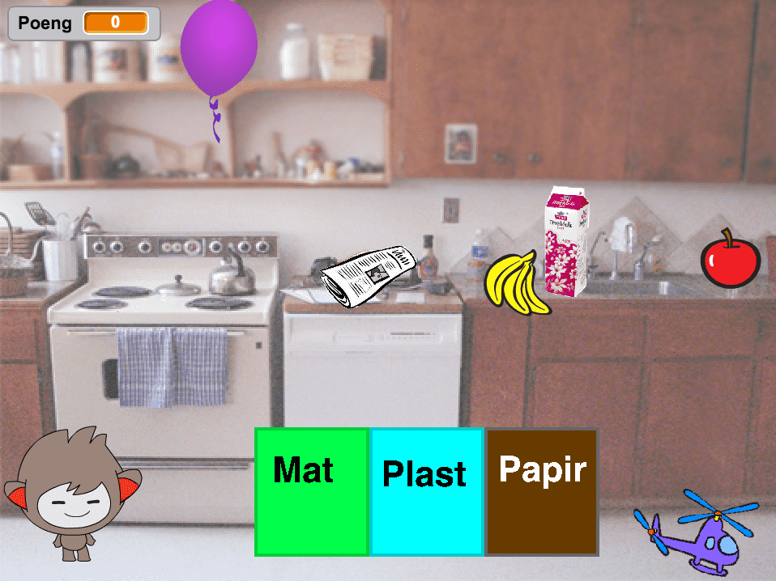

# Steg 1: Legg til Ronny og søppelet {.activity}

Vi starter spillet med å introdusere Ronny, som er vår hjelper underveis,
og søppelet som vi skal kaste.

## Sjekkliste {.check}

+ Start et nytt prosjekt. Legg til en ny figur, enten fra biblioteket,
  slik vi har gjort, eller tegn din helt egen hjelper! Vi valgte figuren
  `nano`, da han har flere drakter som vi tenker å bruke i utfordrings-delene.

  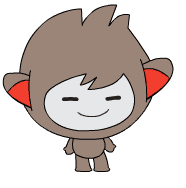

+ Målet med spillet er å få all søppelet i bøttene de hører til. Hver gang
  vi fjerner en søppel-figur så får vi et poeng. Målet vårt er å få så mange
  poeng som det er søppel-biter.

  I første omgang vet ikke Ronny om noe av søppelet, så vi lar Ronny sette
  både poeng og mål til null. For å legge til variabler trykker vi på
  `Data`{.blockdata}-kategorien og trykk på `Lag en Variabel`.

  ```blocks
  når grønt flagg klikkes
  sett [Mål v] til [0]
  sett [Poeng v] til [0]
  ```

+ Legg til seks figurer som representerer søppel. Her kan du igjen velge
  eksisterende figurer fra biblioteket, tegne dine egne, eller finne
  noen bilder på nettet du syns passer. Selv valgte vi noen bananer, et eple,
  en ballong, et hellikopter, en melkekartong, og en avis.

  <style>
  figure.inline > img {
    width: 100px;
    display: inline;
  }
  </style>
  <figure class="inline">
    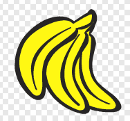
    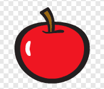
    
    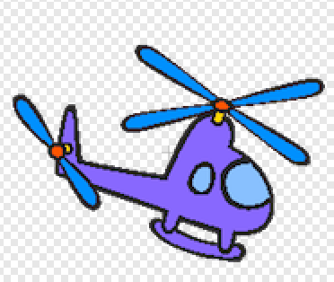
    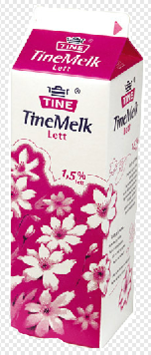
    
  </figure>

+ Velg så en bakgrunn som vi kan plassere figurene våre rundt i. Vi valgte
  kjøkken fra biblioteket, men tegn gjerne noe eget eller finn et annet bilde du
  heller har lyst til å bruke.

  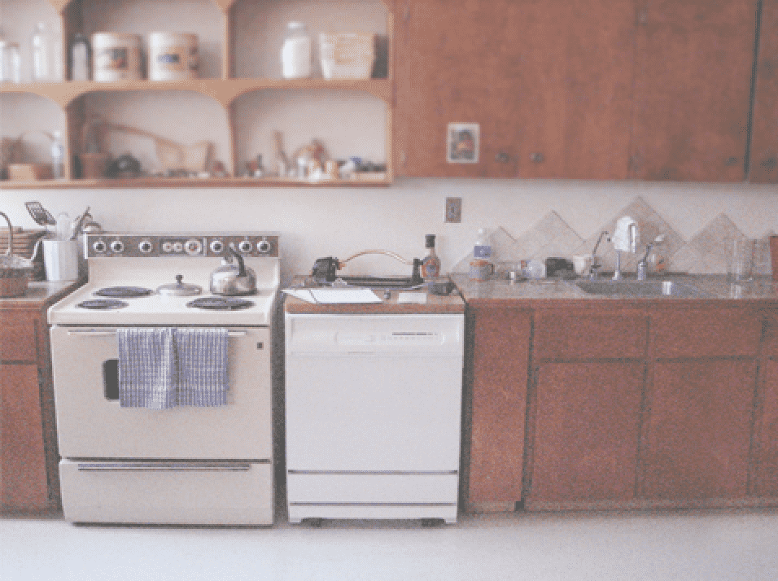

+ Vi kommer til å flytte rundt på søppel-figurene, så det er viktig at vi
  plasserer dem på nytt hver gang vi starter spillet.

  ```blocks
  når grønt flagg klikkes
  gå til x: (78) y: (5)
  ```

  Søppel-figurene må ha hver sin plass, så det er viktig at du finner noen x- og
  y-koordinater for hver av dem.

## Test prosjektet {.flag}

+ Om du flytter rundt på søppel-bitene, blir de satt tilbake når du trykker
  på det grønne flagget?

# Steg 2: Sett opp spillet {.activity}

Ronny trenger å vite hvor mange søppel-figurer som er på brettet. For å finne ut av
det, så ber vi om hjelp fra søppel-figurene selv.

## Sjekkliste {.check}

+ Ronny kan kommunisere med søppelet ved hjelp av meldinger. Start med å sende meldingen
  `Forbered spill`.

  ```blocks
  når grønt flagg klikkes
  sett [Mål v] til [0]
  sett [Poeng v] til [0]
  send melding [Forbered spill v]
  ```

+ Hver av søppel-bitene må nå svare på beskjeden ved å øke `Mål` med en.

  ```blocks
  når jeg mottar [Forbered spill v]
  endre [Mål v] med (1)
  ```

+ Før spillet kan starte må vi gi Ronny litt tid til å kommunisere
  og la søppelet telle opp målet vi skal nå. En ting vi kan gjøre er å la
  Ronny snakke litt. Når Ronny er ferdig med å prate, så kan vi starte
  spillet.

  ```blocks
  når grønt flagg klikkes
  sett [Mål v] til [0]
  sett [Poeng v] til [0]
  send melding [Forbered spill v]
  si [Hei, jeg heter Ronny, kan du hjelpe meg med å redde verden?] i (3) sekunder
  send melding [Start spill v]
  si [Vi må sortere avfallet til hver sin kilde, kan du hjelpe meg med det?] i (3) sekunder
  ```

## Test prosjektet {.flag}

__Klikk på det grønne flagget.__

+ Blir mål satt til riktig antall søppel-biter? I vårt tilfelle skal det bli seks.

+ Snakker Ronny?

## Utfordring {.challenge}

- Ronny har flere drakter som viser han blid og sur. Klarer du å bytte drakt på Ronny når han snakker,
  og tilbake når han er ferdig med å snakke?

  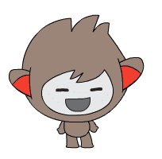 <!-- ikke figur -->

- Istedenfor snakkebobler, klarer du spille inn din egen stemme?
  **Hint:** Bruk blokken under.

  ```blocks
  spill lyden [opptak 1 v] til den er ferdig
  ```

# Steg 3: Start spillet {.activity}

Nå som vi vet antall poeng vi skal nå, kan vi sette opp bøttene våre.

## Sjekkliste {.check}

+ Tegn en ny figur for hver av bøttene `Mat`, `Plast` og `Papir`.

  <figure class="inline">
    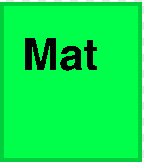
    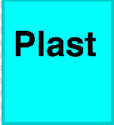
    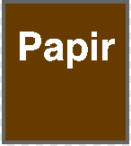
  </figure>

+ Vi ønsker ikke å vise bøttene før spillet er i gang. For å få til dette kan vi
  benytte oss av `Start spill`-meldingen.

  ```blocks
  når grønt flagg klikkes
  skjul
  ```

  ```blocks
  når jeg mottar [Start spill v]
  vis
  ```

+ Dette trikset kan vi også gjøre for søppelet, som også er greit å skjule før
  spillet er i gang.

  ```blocks
  når grønt flagg klikkes
  skjul
  gå til x: (78) y: (5)
  ```

  ```blocks
  når jeg mottar [Start spill v]
  vis
  ```

## Test prosjektet {.flag}

__Klikk på det grønne flagget.__

+ Skjules bøttene i starten? Blir de vist når Ronny er ferdig å snakke?

+ Skjer det samme med søppel-bitene?

# Steg 4: Sortering {.activity}

Nå må vi få til poeng-giving når vi flytter søppel-bitene opp i bøttene.

## Sjekkliste {.check}

+ Måten vi flytter på søppel-bitene er at vi lar dem bevege seg etter musepekeren
  til de er flyttet til sin passende bøtte.

  ```blocks
  når denne figuren klikkes
  gjenta til <berører [Mat v] ?>
    gå til [musepeker v]
  slutt
  ```

+ Når søppelet er lagt i sin passende bøtte, trenger vi å legge til ett poeng og skjule
  søppelet.

  ```blocks
  når denne figuren klikkes
  gjenta til <berører [Mat v] ?>
    gå til [musepeker v]
  slutt
  endre [Poeng v] med (1)
  skjul
  ```

## Test prosjektet {.flag}

__Klikk på det grønne flagget.__

+ Når du trykker på en søppel-bit, følger den etter musepekeren? Forsvinner søppelbiten
  når den går i den riktige bøtten? Husk at ikke alt skal i `Mat`, noe skal også
  i `Plast` eller `Papir`.

## Utfordring {.challenge}

- Klarer du å avslutte flyttinga hvis du flytter søppelet til feil bøtte? Kanskje til og
  med få Ronny sur hvis feil bøtte brukes?

  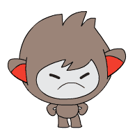 <!-- ikke figur -->

# Steg 5: Avslutt spillet {.activity}

Når vi har fått alt søppelet på plass, må vi avslutte spillet.

## Sjekkliste {.check}

+ `Ronny` trenger å vite når spillet er over. Det kan vi gjøre ved å legge til
  `vent til`-blokk i skriptet hans.

  ```blocks
  når grønt flagg klikkes
  sett [Mål v] til [0]
  sett [Poeng v] til [0]
  send melding [Forbered spill v]
  si [Hei, jeg heter Ronny, kan du hjelpe meg med å redde verden?] i (3) sekunder
  send melding [Start spill v]
  vent til <(Poeng) = (Mål)>
  send melding [Spill ferdig v]
  si [Takk for at du hjelper meg med å redde verden!]
  ```

+ I tillegg til at Ronny takker oss for at vi kildesorterte alt avfallet, så ber vi han også
  sende meldingen `Spill ferdig`. Dette gjør at vi kan fortelle de andre figurene at spillet
  er ferdig.

  Da kan vi for eksempel fortelle bøttene at de skal skjule seg selv når spillet er ferdig.

  ```blocks
  når jeg mottar [Spill ferdig v]
  skjul
  ```

+ Til slutt kan vi forandre bakgrunnen når spillet avsluttes, for å gjøre avslutningen enda
  litt finere. Trykk på `Scene` og legg til en bakgrunn.

  Vi valgte `water and rocks` fra biblioteket, men det er bare å velge noe du syns er finere,
  evt lage noe selv.

  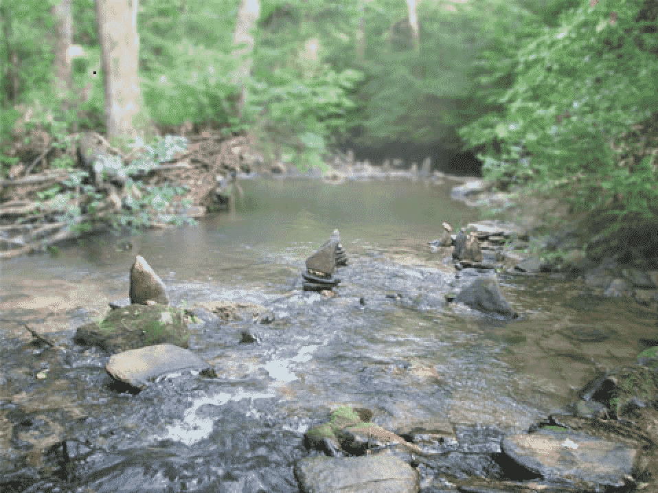

+ Til slutt trenger vi å fortelle når bakgrunnen skal skiftes. Du kan gjøre det ved å legge
  til følgende på skriptet til `Scene`.

  ```blocks
  når jeg mottar [Spill ferdig v]
  bytt bakgrunn til [water and rocks v]
  ```

## Test prosjektet {.flag}

__Klikk på det grønne flagget.__

+ Når alt søppelet er sortert, blir bakgrunnen byttet og Ronny takker for hjelpen?

## Utfordring {.challenge}

- Klarer du å sette en tredje bakgrunn når det grønne flagget klikkes? Husk at vi
  vil fortsatt ha kjøkkenbakgrunn når søppel-figurene skal flyttes.
- Klarer du å forandre draken til Ronny for å vise hvor glad han blir når
  du har reddet verden?

  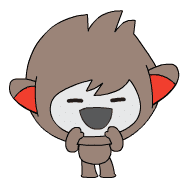 <!-- ikke figur -->

# Hva har vi lært? {.activity}

I dette spillet har vi lært hvordan vi kan bruke meldinger til å bryte opp spillet i
mange små biter. Mindre biter gjør programmet vårt mindre usikkert, og lettere å få
oversikt over hvis noe går galt.

I tillegg lærte vi å dele ansvaret på flere figurer. Ronny hadde ansvaret for å holde
oversikt på poengene, men fikk hjelp av søppel-figurene til å finne ut hvor mange
søppel-biter som fantes. Dette er også et viktig prinsipp i programmering, nemlig fordeling
av ansvar.
