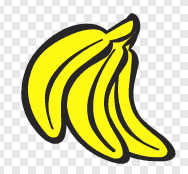
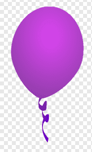
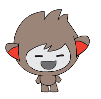
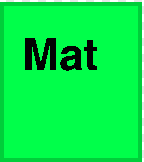
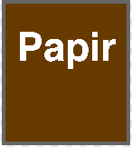

# Introduksjon {.intro}

Det er viktig med kjeldesortering for å avgrense kor mykje avfallet vårt
påverkar miljøet. I dette spelet skal me kjeldesortere og samstundes lære ein
heil del om meldingar i programmering.


# Steg 1: Legg til Ronny og søppelet {.activity}

Me startar spelet med å introdusere Ronny, hjelparen vår undervegs, og søppelet
som me skal kaste.

## Sjekkliste {.check}

- [ ] Start eit nytt prosjekt. Legg til ein ny figur, anten frå biblioteket,
  slik me har gjort, eller teikne din heilt eigen hjelpar. Me valte figuren
  `nano` fordi han har fleire drakter me kan bruke i utfordringane heilt til
  slutt.

  

- [ ] Målet med spelet er å få alt søppelet i bøttene dei høyrer til. Kvar gong
  me fjernar ein søppelfigur får me eit poeng. Målet er å få så mange poeng som
  det er søppelbitar.

  I fyrste omgang veit ikkje Ronny om noko av søppelet, så me let Ronny setje
  både poeng og mål til null. For å leggje til variablar trykkar me på
  `Data`{.blockdata}-kategorien og på `Lag ein variabel`.

  ```blocks
  når @greenFlag vert trykt på
  set [Mål v] til [0]
  set [Poeng v] til [0]
  ```

- [ ] Legg til seks figurar som representerer søppel. Her kan du velje
  eksisterande figurar frå biblioteket, teikne dine eigne eller finne nokon på
  Internett. Me valte å bruke nokre bananar, eit eple, ein ballong, eit
  helikopter, ein mjølkekartong og ei avis.

  <style>
  figure.inline > img {
    width: 100px;
    display: inline;
  }
  </style>
  <figure class="inline">
    
    
    
    
    
    
  </figure>

- [ ] Vel ein bakgrunn me kan plassere figurane våre rundt i. Me valte kjøkken
  frå biblioteket, men du kan gjerne teikne noko eige eller finne eit anna
  bilete du heller vil bruke.

  

- [ ] Me kjem til å flytte rundt på søppelfigurane, så det er viktig at me
  plasserer dei på nytt kvar gong me startar spelet.

  ```blocks
  når @greenFlag vert trykt på
  gå til x: (78) y: (5)
  ```

  Søppelfigurane må ha kvar sin plass, så du må finne `x`- og `y`-koordinatar
  for kvar av dei.

## Test prosjektet {.flag}

- [ ] Viss du flyttar rundt på søppelbitane, blir dei sett tilbake når du
  trykkar på det grøne flagget?


# Steg 2: Set opp spillet {.activity}

Ronny må vite kor mange søppelfigurar som er på brettet. For å finne ut av det
ber me om hjelp frå søppelfigurane sjølv.

## Sjekkliste {.check}

- [ ] Ronny kan kommunisere med søppelet ved hjelp av meldingar. Start med å
  sende meldinga `Førebu spel`.

  ```blocks
  når @greenFlag vert trykt på
  set [Mål v] til [0]
  set [Poeng v] til [0]
  send meldinga [Førebu spel v]
  ```

- [ ] Kvar av søppelbitane må svare på meldinga ved å auke `Mål` med `1`.

  ```blocks
  når eg får meldinga [Førebu spel v]
  endra [Mål v] med (1)
  ```

- [ ] Før spelet kan starte må me gi Ronny litt tid til å kommunisere og la
  søppelet telje opp målet me skal nå. Ein ting me kan gjere er å la Ronny prate
  litt. Når Ronny er ferdig med å prate kan me starte spelet.

  ```blocks
  når @greenFlag vert trykt på
  set [Mål v] til [0]
  set [Poeng v] til [0]
  send meldinga [Førebu spel v]
  sei [Hei, eg heiter Ronny. Kan du hjelpe meg å redde verda?] i (3) sekund
  send meldinga [Start spel v]
  sei [Me må sortere avfallet til rett kjelde. Kan du hjelpe meg?] i (3) sekund
  ```

## Test prosjektet {.flag}

__Klikk på det grøne flagget.__

- [ ] Blir `Mål`-variabelen sett til riktig antal søppelbitar? I vårt tilfelle
  skal det blir seks.

- [ ] Pratar Ronny?

## Utfordring {.challenge}

- Ronny har fleire drakter som viser han blid og sur. Klarar du å bytte drakt på
  Ronny når han pratar, og tilbake når han er ferdig med å prate?

  

- I staden for snakkeboblar, kan du spele inn di eiga stemme? **Hint:** Bruk
  blokka under.

  ```blocks
  spel lyden [opptak 1 v] til han er ferdig
  ```


# Steg 3: Start spelet {.activity}

No som me veit kor mange poeng me skal nå kan me setje opp bøttene våre.

## Sjekkliste {.check}

- [ ] Teikn ein ny figur for kvar av bøttene `Mat`, `Plast` og `Papir`.

  <figure class="inline">
    
    
    
  </figure>

- [ ] Me vil ikkje vise bøttene før spelet er i gang. For å få til det kan me
  bruke `Start spel`-meldinga.

  ```blocks
  når @greenFlag vert trykt på
  gøym
  ```

  ```blocks
  når eg får meldinga [Start spel v]
  vis
  ```

- [ ] Dette trikset kan vi også gjøre for søppelet, som også er greit å gøyme
  før spillet er i gang.

  ```blocks
  når @greenFlag vert trykt på
  gøym
  gå til x: (78) y: (5)
  ```

  ```blocks
  når eg får meldinga [Start spel v]
  vis
  ```

## Test prosjektet {.flag}

__Klikk på det grøne flagget.__

- [ ] Er bøttene usynlege i starten? Blir dei vist når Ronny er ferdig å prate?

- [ ] Skjer det same med søppelbitane?


# Steg 4: Sortering {.activity}

No må me telje poeng når me flyttar søppelbitane oppi bøttene.

## Sjekkliste {.check}

- [ ] Måten me flyttar på søppelbitane er at me let dei bevege seg etter
  musepeikaren til dei er flytta til den bøtta som passar til kvar av dei.

  ```blocks
  når denne figuren vert trykt på
  gjenta til <rører [Mat v] ?>
    gå til [musepeikar v]
  slutt
  ```

- [ ] Når søppelet er lagt i riktig bøtte må me leggje til eitt poeng og gøyme
  søppelet.

  ```blocks
  når denne figuren vert trykt på
  gjenta til <rører [Mat v] ?>
    gå til [musepeikar v]
  slutt
  endra [Poeng v] med (1)
  gøym
  ```

## Test prosjektet {.flag}

__Klikk på det grøne flagget.__

- [ ] Når du trykkar på ein søppelbit, følgjer den etter musepeikaren? Forsvinn
  søppelbiten når den går i riktig bøtte? Hugs at ikkje alt skal i `Mat`, noko
  skal i `Plast` eller `Papir`.

## Utfordring {.challenge}

- Klarer du å avslutte flyttinga hvis du flytter søppelet til feil bøtte?
  Kanskje til og med få Ronny sur hvis feil bøtte brukes?

  


# Steg 5: Avslutt spelet {.activity}

Når me har fått alt søppelet på plass må me avslutte spelet.

## Sjekkliste {.check}

- [ ] `Ronny` må vite når spelet er over. Det kan me gjere med å leggje til ei
  `vent til`-blokk i skriptet hans.

  ```blocks
  når @greenFlag vert trykt på
  set [Mål v] til [0]
  set [Poeng v] til [0]
  send meldinga [Førebu spel v]
  sei [Hei, eg heiter Ronny. Kan du hjelpe meg å redde verda?] i (3) sekund
  send meldinga [Start spel v]
  vent til <(Poeng) = (Mål)>
  send meldinga [Spel ferdig v]
  sei [Takk for at du hjelper meg å redde verda!]
  ```

- [ ] I tillegg til at Ronny takkar oss for å at me kjeldesorterte avfallet, så
  ber me han sende meldinga `Spel ferdig`. Dette gjer at me kan fortelje dei
  andre figurane at spelet er over.

  Me kan til dømes fortelje bøttene at dei skal gøyme seg sjølv når spelet er
  over.

  ```blocks
  når eg får meldinga [Spel ferdig v]
  gøym
  ```

- [ ] Til slutt kan me forandre bakgrunnen når spelet avsluttast, slik at
  avslutninga blir endå litt finare. Trykk på `Scene` og legg til ein bakgrunn.

  Me har valt `water and rocks` frå biblioteket, men det er berre å velje noko
  du synest er finare, eventuelt lage noko sjølv.

  

- [ ] Til slutt må me fortelje når bakgrunnen skal skiftast. Du kan gjere det
  ved å leggje til følgjande på skriptet til `Scene`.

  ```blocks
  når eg får meldinga [Spel ferdig v]
  byt bakgrunn til [water and rocks v]
  ```

## Test prosjektet {.flag}

__Klikk på det grøne flagget.__

- [ ] Blir bakgrunnen bytta og takkar Ronny for hjelpa når alt søppelet er
  sortert?

## Utfordring {.challenge}

- Klarar du å setje ein tredje bakgrunn når det grøne flagget blir klikka på?
  Hugs at me framleis vil ha kjøkkenbakgrunnen når søppelfigurane skal flyttast.

- Klarar du å forandre drakta til Ronny for å vise kor glad han blir når du har
  redda verda?

  


# Kva har me lært? {.activity}

I dette spelet har me lært korleis me kan bruke meldingar til å bryte opp spelet
i mange små bitar. Mindre bitar gjer programmet mindre usikkert, og det er
enklare å få oversikt viss noko går gale.

I tillegg har me lært å dele ansvaret på fleire figurar. Ronny hadde ansvaret
for å halde oversikt over poenga, men fekk hjelp av søppelfigurane til å finne
ut kor mange det var. Det er eit viktig prinsipp i programmering: fordeling av
ansvar.
