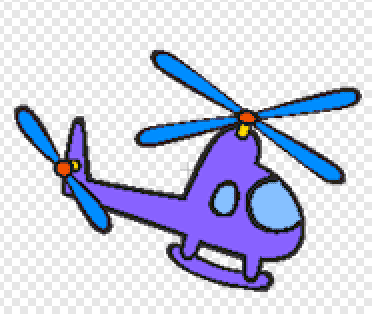
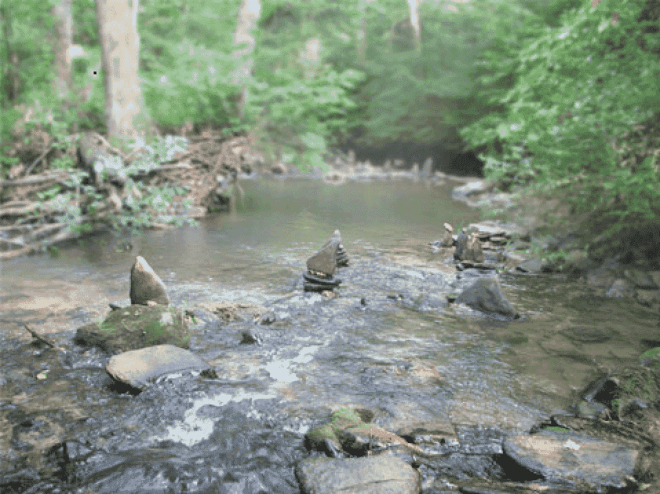

# Вступ {.intro}

Сортування відходів важливе для того, щоб зменшити вплив нашого сміття на навколишнє середовище. У цій грі ми будемо сортувати відходи та 
одночасно дізнаватися багато про сповіщення в програмуванні.


# Крок 1: Створіть Нано та сміття {.activity}

Ми почнемо гру зі створення Ронні, який буде нашим помічником, та сміття, яке ми будемо сортувати.

## Sjekkliste {.check}

- [ ] Почніть новий проєкт. Додайте новий персонаж, або з бібліотеки, як ми зробили, або намалюйте свого власного помічника! 
      Ми обрали персонажа `Нано`, оскільки у нього є кілька костюмів, які ми плануємо використовувати.
 
  

- [ ] Мета гри — помістити все сміття у відповідні відра. Кожного разу, коли ми прибираємо шматочок сміття, ми отримуємо один бал. 
      Наша мета — набрати стільки балів, скільки є шматочків сміття.

  Спочатку Ронні не знає нічого про сміття, тому ми дозволимо Ронні встановити як бали, так і ціль на 0. 
  Натисніть на категорію `Змінні`{.blockdata} та виберіть `створити змінну`.

  ```blocks
  коли @greenFlag натиснуто
  встановити [Ціль v] на [0]
  встановити [Очки v] на [0]
  ```

- [ ] Додайте шість персонажів, які представляють сміття. Ви можете знову вибрати існуючі персонажі з бібліотеки, 
      намалювати свої власні або знайти відповідні зображення в Інтернеті. 
      Ми обрали кілька бананів, яблуко, повітряну кульку, вертоліт, коробку з-під молока та газету.

  <style>
  figure.inline > img {
    width: 100px;
    display: inline;
  }
  </style>
  <figure class="inline">
    
    
    
    
    
    
  </figure>

- [ ] Виберіть фон, на якому ми можемо розмістити наших персонажів. 
     Ми обрали кухню з бібліотеки, але ви можете намалювати щось своє або знайти інше зображення, 
	 яке вам більше подобається.

  

- [ ] Ми будемо переміщати персонажі-сміття, тому важливо, щоб ми розміщували їх щоразу, коли починаємо гру.


  ```blocks
  коли @greenFlag натиснуто
  перемістити в x: (78) y: (5)
  ```

  Фігури сміття повинні мати свої місця, тому важливо знайти координати x та y для кожного з них.

## Перевірте проєкт {.flag}

- [ ]  Якщо ви переміщуєте шматочки сміття, чи повертаються вони на свої місця, коли ви натискаєте зелений прапорець?


# Крок 2: Налаштуйте гру {.activity}

Ронні потрібно знати, скільки фігур сміття знаходиться на дошці. 
Щоб дізнатися це, ми попросимо допомоги у самих персонажів-сміття.

## Контрольний лист {.check}

- [ ] Ронні може спілкуватися зі сміттям за допомогою повідомлень. Почніть з відправлення повідомлення `підготувати гру`

  ```blocks
  коли @greenFlag натиснуто
  встановити [Ціль v] на [0]
  встановити [Очки v] на [0]
  оповістити [підготувати гру v]
  ```

- [ ] Кожен шматок сміття збільшуе `Ціль` на один бал.

  ```blocks
  коли я отримую [Підготувати гру v]
  змінити [ціль v] на (1)
  ```

- [ ]  Перед тим як гра почнеться, ми повинні дати Ронні трохи часу для спілкування і дозволити сміттю підрахувати мету, яку нам потрібно досягти. 
       Один зі способів це зробити — дати Ронні трохи поговорити. Коли Ронні закінчить говорити, ми можемо розпочати гру.
  
   ```blocks
  коли @greenFlag натиснуто
  встановити [Ціль v] на [0]
  встановити [Очки v] на [0]
  оповістити [підготувати гру v]
  говорити [Привіт! Мене звуть Ронні! Можеш допомогти мені врятувати світ?] (3) сек
  оповістити [підготувати гру v]
  говорити [Ми повинні відсортувати сміття по категоріям. Чи ти можеш мені з цим допомогти] (3) сек
  ```

## Тестування проєкту {.flag}

__Натисніть на   зелений   прапорець.__

- [ ] Чи змінюеться “ціль” на правильну кількість сміття? У нашому випадку це має бути шість.

- [ ] Ронні розмовляе?

## Виклик {.challenge}

- Ронні має кілька костюмів, які показують його настрій: веселий та сердитий. 
  Чи можеш ти змінювати костюм Ронні, коли він говорить, і повертати його назад, 
  коли він закінчує говорити?

   <!-- ikke figur -->

- Замість розмовних блоків, чи можеш ти записати свій власний голос? **Підказка:** використайте блок, показаний нижче.
  
  ```blocks
  відтворити звук [запис розмови 1 v] ло кінця
  ```

# Крок 3: Розпочати гру {.activity}

Тепер, коли ми знаємо кількість балів, які нам потрібно набрати, ми можемо налаштувати наші відра.

## Контрольний список {.check}

- [ ]  Намалюйте новий спрайт для кожного з відер: `Їжа`, `Пластик` і `Папір`.


  <figure class="inline">
    
    
    
  </figure>

- [ ] Ми не хочемо показувати відра до початку гри. Щоб досягти цього, ми можемо скористатися повідомленням `Розпочати гру`.

  ```blocks
  коли @greenFlag натиснуто
  сховати
  ```

  ```blocks
  коли я отримую [Розпочати гру v]
  показати
  ```

- [ ] Цей трюк можна застосувати і для сміття, яке також варто сховати до початку гри.

  ```blocks
  коли @greenFlag натиснуто
  сховати
  перемістити в x: (78) y: (5)
  ```

  ```blocks
  коли я отримую [Розпочати гру v]
  показати
  ```

## Тестування проєкту {.flag}

__Натисніть на зелений прапорець.__

- [ ] Чи сховані відра на початку? Чи з’являються вони, коли Ронні закінчує говорити?

- [ ] Чи відбувається те ж саме зі сміттям?


# Крок 4: Сортування {.activity}

Тепер нам потрібно реалізувати нарахування балів, коли ми переміщуємо сміття в відра.

## Контрольний список {.check}

- [ ] Ми переміщаємо сміття так, щоб вони слідували за курсором миші, поки не будуть переміщені у відповідне відро.

  ```blocks
  коли спрайт натиснуто
  повторити до <торкається [Їжа v] ?>
    перейти до [вказівник v]
  slutt
  ```

- [ ] Коли сміття поміщене у відповідне відро, нам потрібно додати один бал і сховати сміття.

  ```blocks
   коли спрайт натиснуто
  повторити до <торкається [Їжа v] ?>
    перейти до [вказівник v]
  slutt
  змінити [Очко v] на (1)
  сховати
  ```

## Тестування проєкту {.flag}

__Натисніть на зелений прапорець.__

- [ ] Коли ви натискаєте на шматочок сміття, чи слідує він за курсором миші? Чи зникає шматочок сміття, коли він потрапляє у правильне відро? 
      Пам’ятайте, що не все має потрапляти в смітник `Їжа` — частина сміття повинна потрапляти в `Пластик` або `Папір`.

## Виклик {.challenge}

- Чи можеш ти завершити переміщення, якщо сміття потрапило не в те відро?  
  Можливо, навіть змусити Ронні засмутитися, якщо буде використане неправильне відро?

   <!-- ikke figur -->


# Крок 5: Завершення гри {.activity}

Коли ми розмістимо все сміття на своїх місцях, потрібно завершити гру.

## Контрольний список {.check}

- [ ] `Ронні` потрібно знати, коли гра закінчена. Ми можемо зробити це, додавши блок `чекати до` у його скрипт.

  ```blocks
 коли @greenFlag натиснуто
  встановити [Ціль v] на [0]
  встановити [Очки v] на [0]
  оповістити [підготувати гру v]
  говорити [Привіт! Мене звуть Ронні! Можеш допомогти мені врятувати світ?] (3) сек
  оповістити [Розпочати гру v]
  чекати поки <(Очки) = (Ціль)>
  оповістити [Гру завершено v]
  говорити [Дякую що допоміг мені з порятунком світу!] (3) сек
   ```

- [ ] На додачу того, що Ронні дякує нам за те, що ми відсортували все сміття, ми також надсилаємо повідомлення `Гра завершена`. 
      Це дозволить нам сповістити інші спрайти, що гра закінчена.

  Наприклад, ми можемо повідомити відра, щоб вони сховалися, коли гра закінчиться.

  ```blocks
  коли я отримую [Кінець гри v]
  сховати
  ```

- [ ] Нарешті, ми можемо змінити фон, коли гра закінчується, щоб зробити завершення ще більш приємним. Натисніть на `Сцена` і додайте новий фон.

  Ми вибрали фон `water and rocks` з бібліотеки, але ви можете вибрати щось, що вам більше подобається, або створити власний фон.

  

- [ ] На останок, нам потрібно вказати, коли фон має змінюватися. Ви можете зробити це, додавши наступне в скрипт для `сцени`.
 
  ```blocks
  коли я отримую [Кінець гри v]
  змінити тло на [water and rocks v]
  ```

## Тестування проєкту {.flag}

__Натисніть на зелений прапорець.__

- [ ] Коли все сміття відсортоване, чи змінюється фон і Ронні дякує за допомогу?

## Виклик {.challenge}

- Чи можеш ти встановити третій фон, коли натискається зелене прапорець? Пам’ятай, що ми все ще хочемо, 
  щоб фон кухні залишався, коли сміттєві спрайти переміщуються.

- Чи можеш ти змінити костюм Ронні, щоб показати, як він радіє, коли ти врятуєш світ?

   <!-- ikke figur -->


# Чого ми навчиися? {.activity}

У цій грі ми дізналися, як можна використовувати оповіщення для розбиття гри на багато маленьких частин. 
Менші частини роблять нашу програму менш схильною до помилок і полегшують її перевірку, якщо щось йде не так.

Крім того, ми навчилися розподіляти обов'язки між кількома персонажами. Ронні відповідав за контроль балів, 
але отримав допомогу від  фігур сміття, щоб дізнатися, скільки шматочків сміття є. 
Це також важливий принцип у програмуванні — розподіл  обов'язків.

