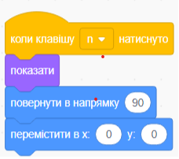
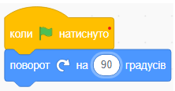
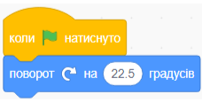
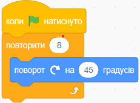
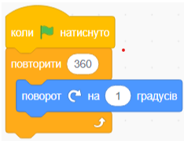

# Вступ {.intro}

У цьому завданні ми імпортуємо геометричну фігуру та потім будемо 
`обертати`{.blockmotion} її.

# Крок 1: Обертаємо рівнобедрений трикутник {.activity}

*Щоб було простіше почати, ми візьмемо готову фігуру з бібліотеки Scratch. Ця фігура схожа на рівнобедрений трикутник.*

## Контрольний список {.check}

- [ ] Почніть новий проєкт натиснувши на "Дізнатись як створити проєкт у Скретчі".

- [ ] Видаліть фігуру кота, клацнувши на неї правою кнопкою миші та обравши `видалити`.

- [ ] Додайте нову фігуру. Натисніть на кнопку і виберіть чарівний капелюх.
Ми використали фігуру "Троллівський капелюх" з категорії `Фантазії/Капелюх чарівника (Wizard Hat)`.

- [ ] Назвіть нову фігуру `Чарівний капелюх`.

- [ ] Перш ніж розпочати основне завдання, ми додамо маленьку допоміжну функцію на випадок,
 якщо станеться щось несподіване:

 

- [ ] Якщо станеться щось несподіване, потрібно натиснути клавішу "N" на клавіатурі, 
і Чарівний капелюх повернеться на вихідну позицію, щоб ви могли спробувати знову.

Тепер ми дамо Scratch команду `обертати`{.blockmotion} капелюх на 90 градусів.

- [ ] Додайте наступний скрипт до фігури 
 `Чарівний капелюх`.

 

## Tестування проєкту {.flag}

__Натисніть на зелений прапорець.__

- [ ] Що станеться, коли ви натиснете на зелений прапорець?

- [ ] Чи обертається капелюх, як очікувалося?

- [ ] Як ви думаєте, що станеться, якщо натиснути на зелений прапорець ще раз? У який бік буде вказувати верхівка капелюха?

- [ ] Скільки разів потрібно попросити капелюх обернутися, перш ніж він повернеться у вихідне положення?

## Контрольний список {.check}

Обертання це весело! Але коли речі обертаються на 90 градусів за раз, це трохи нудно і трохи неприродно.

- [ ] Зменшіть кількість градусів, на які капелюх обертається за раз:
 

## Тестування проєкту {.flag}

__Натисніть на зелений прапорець.__

- [ ] Скільки разів потрібно натиснути на капелюх, щоб він обернувся повністю?

- [ ]Продовжуйте зменшувати кількість градусів, на які капелюх обертається. 
Спробуйте знайти звязок між кількістю градусів, на які він обертається, 
і кількістю натискань на зелений прапорець, щоб капелюх обернувся повністю.
Du oppdager kanskje at det begynner å bli veldig mange klikk etterhvert?

Ви, можливо, помітите, що з часом потрібно дуже багато натискань…

# Крок 2: Додамо трохи більше руху! {.activity}

На щастя, за допомогою невеликої програмної магії ми можемо змусити компютер виконати роботу за нас!

## Контрольний список {.check}

- [ ] Додайте блок `керування`, який змусить капелюх обернутися певну кількість разів:

- [ ] Порада: Кожного разу, коли ви зменшуєте кількістю градусів удвічі, 
вам потрібно подвоїти кількість повторень, щоб капелюх обернувся на таку саму відстань.

# Крок 3: Останній відлік {.activity}

- [ ] Ви, мабуть, знаєте, що ми зазвичай описуємо коло як 360 градусів. 
Якщо ви продовжите зменшувати кількість градусів до значення менше 1, 
вам потрібно буде повторювати обертання 512 разів. Хоча це, звичайно, 
можливо і необхідно в деяких випадках, для нас це зараз не обовязково.
Тому ми зробимо невелику хитрість і встановимо, що 'Чарівний капелюх' обертається на 1 градус 360 разів.

## Тестування проєкту {.flag}

__Натисніть на зелений прапорець.__

- [ ] Чи обертається капелюх повністю, коли ви натискаєте на зелений прапорець?

- [ ] Встановивши кількість градусів, на які ви повністю обертаєте `Чарівний капелюх` за 1 раз, 
скільки разів потрібно обернути Хаттульфа, щоб він зробив два повні оберти?
А три з половиною оберти? Чи знайомі ці числа?

## Закінчення

- [ ] Дайте проєкту назву, наприклад "Геометрія 1" та натисніть на 'Зберегти зараз', щоб зберегти проєкт. 
